# Botzilla | WRO 2026 Future Engineers

> [!IMPORTANT]
> **Looking for the full engineering record, photographs, tests, and iterations?** Start with the [Engineering Journal index](docs/00-engineering-journal.md).

## Contents

- [Project abstract](#project-abstract)
- [Team](#team)
- [Challenge overview](#challenge-overview)
- [Requirements and constraints](#requirements-and-constraints)
- [Robot at a glance](#robot-at-a-glance)
- [Overall system architecture](#overall-system-architecture)
- [1. Mobility & Mechanical Design](#1-mobility--mechanical-design)
  - [Final architecture](#final-architecture)
  - [A. Chassis Design Choices](#a-chassis-design-choices)
  - [B. Steering and Drive Mechanism](#b-steering-and-drive-mechanism)
  - [C. Torque and Speed Reasoning](#drive-motor-torque-and-speed)
  - [D. Mechanical Stability and Rigidity](#d-mechanical-stability-and-rigidity)
  - [E. Design Trade-offs, Component Selection, and Iteration](#e-design-trade-offs-component-selection-and-iteration)
- [2. Power & Sensor Architecture](#2-power--sensor-architecture)
  - [A. Power Budget, One-Battery Architecture, and Evidence](#a-power-budget-one-battery-architecture-and-evidence)
  - [B. Sensor and Communication Trade-offs](#b-sensor-and-communication-trade-offs)
  - [C. Placement Proven Against Field Geometry](#c-placement-proven-against-field-geometry)
  - [D. Calibration and a Common Vehicle Coordinate Frame](#d-calibration-and-a-common-vehicle-coordinate-frame)
  - [E. Failure Points and Reliability Iterations](#e-failure-points-and-reliability-iterations)
- [3. Software Architecture & Obstacle Strategy](#software-architecture-obstacle-strategy)
  - [Software modules and runtime chain](#software-modules-runtime)
  - [Two challenge branches of the shared planner](#shared-planner-challenge-branches)
  - [Safety and edge cases](#software-safety-edge-cases)
  - [Parking scope statement](docs/09-parking-strategy.md)
- [4. Systems Thinking & Engineering Decisions](#systems-thinking-engineering-decisions)
  - [Decision record](#decision-record)
  - [Active risks and mitigations](#active-risks-mitigations)
- [5. Reproducibility & GitHub Quality](#reproducibility-github-quality)
  - [Reproduction path](#reproduction-path)
  - [Detailed linked documents](#detailed-document-index)
  - [Software quick start](#software-quick-start)
  - [Demonstration videos](#demonstration-videos)
  - [Current status](#current-status)
  - [License](#license)

---

## Project abstract

This repository documents Botzilla's vehicle for the 2026 World Robot Olympiad (WRO) Future Engineers competition.

---

## Team

**Institution:** Autopilot  
**Competition entry:** WRO Future Engineers, 16–19 years  
**Coach:** Lili Wang

| Team member | Age | Hobbies | Portrait |
|---|---:|---|---|
| Lucas Zheng | 15 | Programming and photography |  |
| Yueteng Ma | 16 | Badminton and mathematics |  |
| Aayu Mattas | 14 | General sports and introductory robotics learning |  |

The coach supported learning and organization. The students designed, constructed, programmed, tested, and documented the vehicle.

> [!IMPORTANT]
> **Detailed engineering document:** [Team and Project](docs/01-team-and-project.md) — team identity, members, responsibilities, development method, and project scope.

---

## Challenge overview

### Open Challenge

The robot must complete three laps on the track after being placed randomly inside the walls of the track. One button turns on the robot and one button starts the program. After this, no further interactions with the robot are allowed. See the [Open Challenge Strategy](docs/07-open-challenge-strategy.md).

### Obstacle Challenge

The robot must complete three laps on the track with randomly arranged green and red traffic signs. It must pass on the right side of a red pillar and the left side of a green pillar. See the [Obstacle Challenge Strategy](docs/08-obstacle-challenge-strategy.md).

Learn about the challenges and rules [here](https://wro-association.org/wp-content/uploads/WRO-2024-Future-Engineers-Self-Driving-Cars-General-Rules.pdf).

---

## Requirements and constraints

Competition rules directly shape the vehicle's perception, mechanical, power, and start design: red and green obstacles require camera-based colour recognition; the three-minute run sets the speed, acceleration, and torque budget; one main-power switch and one program-start button define the two permitted operations; and size, mass, drive-layout, and collision constraints shape the vehicle layout and control strategy.

> [!IMPORTANT]
> **Detailed engineering document:** [Requirements and Constraints](docs/02-requirements-and-constraints.md) — how each competition rule becomes an engineering requirement or design constraint.

---

## Robot at a glance

| Attribute | Final value | Evidence |
|---|---:|---|
| Length | 220 mm | [Dimensioned drawing](hardware/mechanical/dimensioned-drawings/README.md) |
| Width | 155 mm | [Dimensioned drawing](hardware/mechanical/dimensioned-drawings/README.md) |
| Height | 158 mm | [Dimensioned drawing](hardware/mechanical/dimensioned-drawings/README.md) |
| Weight | 1,450 g (including competition battery) | [Weight budget](hardware/mechanical/calculations/weight-budget.csv) |
| Drive arrangement | One 12 V GA25-370 Hall-encoder gearmotor (9.6:1 gearbox; 625 rpm maximum no-load gearbox-output speed) drives the shared rear axle through a 20T:40T timing-belt reduction. | [Rules 11.5 and 11.13: rear-drive transmission](docs/04-mobility-and-mechanical-design.md#3-rules-115-and-1113-determine-the-rear-drive-transmission) |
| Steering | Front-mounted SC-1258TG+ servo (`9.6 kgf·cm / 0.10 s/60°` at `4.8 V`), mechanical linkage, and positive Ackermann front steering. | [Servo selection and mechanical design](docs/04-mobility-and-mechanical-design.md#11-steering-servo-torque-and-response-speed-selection) |
| Single-board microcontroller (SBM) | ESP32-S3 and carrier board | [Controller selection and power architecture](docs/05-power-and-sensor-architecture.md#why-esp32-s3-was-selected-as-the-sbm) |
| Single-board computer (SBC) | Jetson Orin Nano Super Developer Kit | [Controller selection and power architecture](docs/05-power-and-sensor-architecture.md#why-jetson-orin-nano-super-developer-kit-was-selected-as-the-sbc) |
| Sensors | Two LDROBOT STL-27L 2D LiDARs, an Intel RealSense D435f depth camera, a Syd Dynamic Transducern TM171 IMU, and the GA25-370 integrated Hall encoder | [Sensor, Cable, and Interface Record](docs/05-power-and-sensor-architecture.md#sensor-cable-and-interface-record) |
| Battery | 12 V 4500 mAh battery | [Power architecture and battery comparison](docs/05-power-and-sensor-architecture.md#battery-capacity-comparison) |
| Software | ESP32 actuator firmware plus Jetson-developed ROS 2 packages for perception, localization, and decision-making, using vendor ROS 2 driver packages | [Software architecture](docs/06-software-and-control-architecture.md) |

---

## Overall system architecture

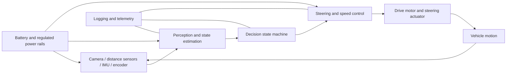
```mermaid
flowchart LR
    S[Camera / distance sensors / IMU / encoder] --> P[Perception and state estimation]
    P --> D[Decision state machine]
    D --> C[Steering and speed control]
    C --> A[Drive motor and steering actuator]
    A --> V[Vehicle motion]
    V --> S
    B[Battery and regulated power rails] --> S
    B --> P
    B --> C
    L[Logging and telemetry] --- P
    L --- D
    L --- C
```

> [!IMPORTANT]
> **Detailed engineering document:** [System Architecture](docs/03-system-architecture.md) — physical connections, ROS 2 topics and data flows, update rates, voltage domains, communication protocols, coordinate conventions, and failure behaviour.

---

# 1. Mobility & Mechanical Design

## Final architecture

### Current physical vehicle layout

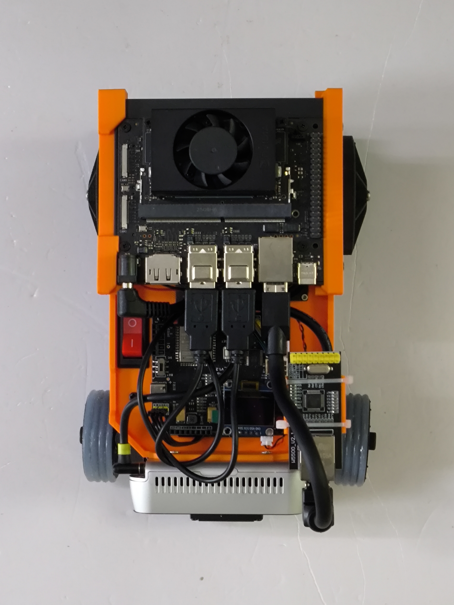

| Side A | Front sensor layout | Side B |
|---|---|---|
| 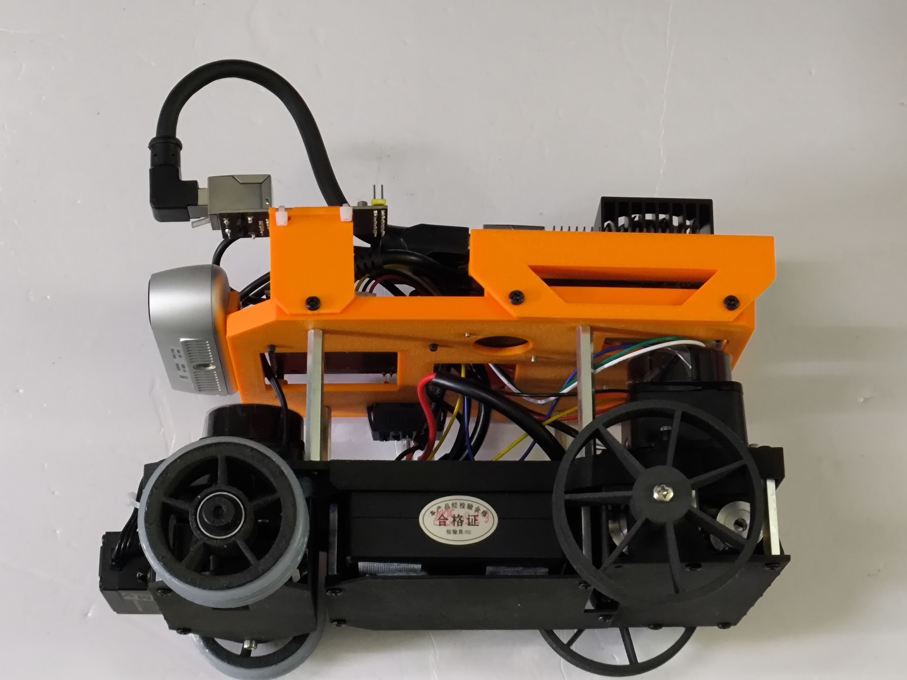 | 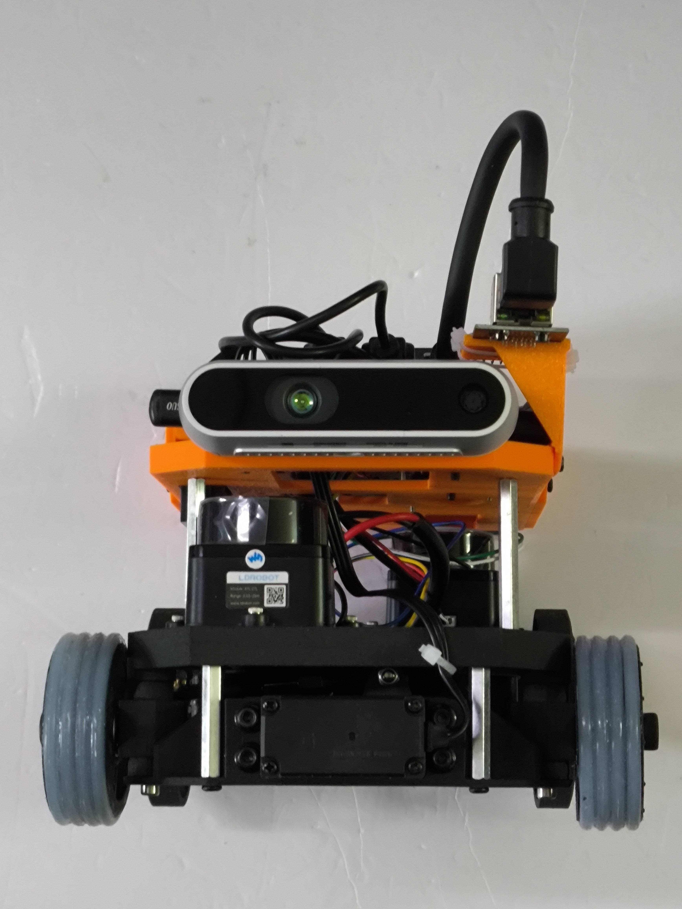 | 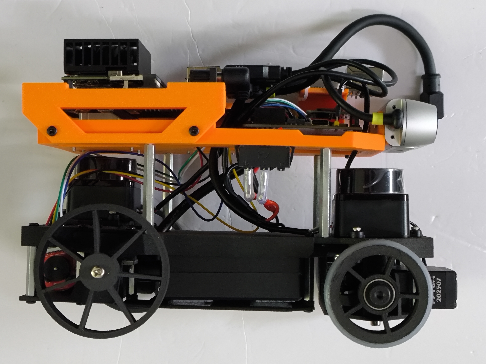 |

| Rear drive layout | Bottom chassis layout |
|---|---|
| 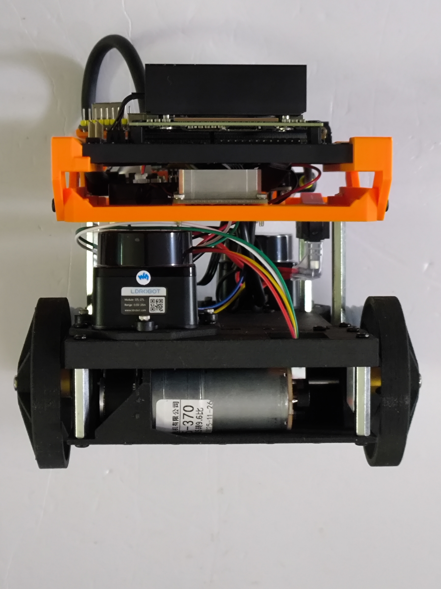 | 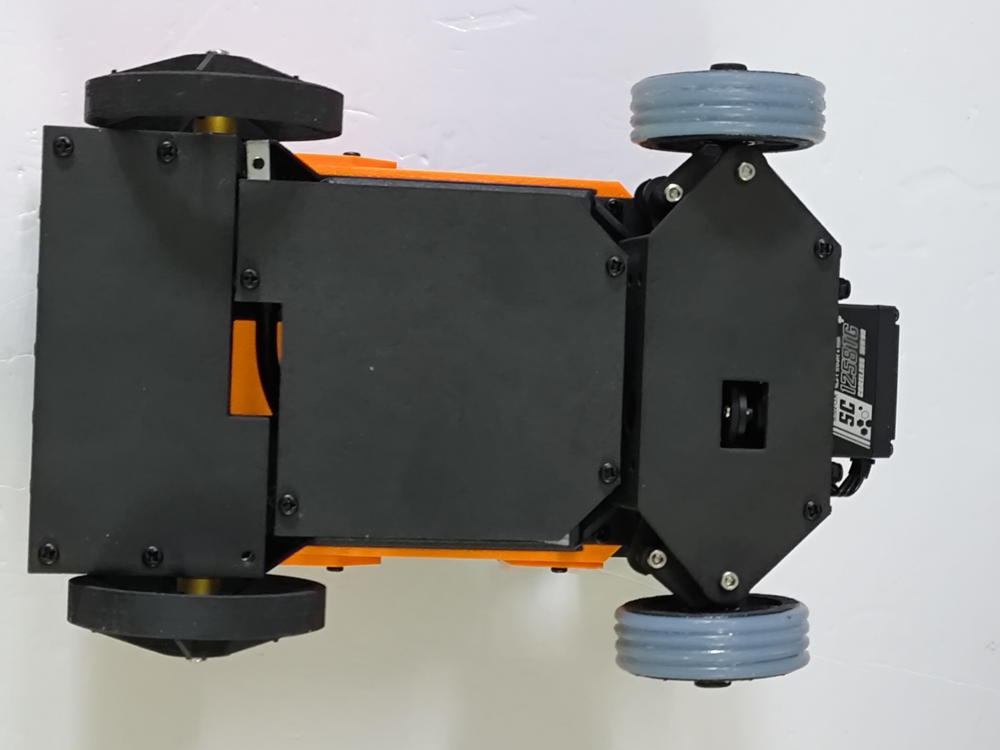 |

### Architecture summary

**Final layout:** a custom three-level 3D-printed chassis that separates the mechanical, sensing/battery, and computing/wiring functions.

- **Lowest layer:** front steering, rear drive, and the battery structure remain low in the vehicle.
- **Middle layer:** the battery bay and both LDROBOT STL-27L 2D LiDAR scan planes have defined mounting positions.
- **Upper layer:** the ESP32-S3 single-board microcontroller (SBM), Jetson Orin Nano Super Developer Kit single-board computer (SBC), perception hardware, and all cross-layer wiring remain above the vehicle perimeter.

#### Lowest layer — protected steering, drive, and battery structure

- **Ground clearance: 7 mm.** The original target was 20 mm. The final course surface is smooth and fixed, so lowering the chassis reduces the centre of gravity and preserves vertical space for electronics. The trade-off is that the bottom must remain clear of floor contact.

- **Protected lower structure.** Custom 3D-printed upper and lower plates protect the front and rear mechanical modules; intentional openings remain only for fasteners, steering links, wheel pivots, and motor/axle interfaces. The central space is reserved for the battery, and pre-designed holes provide the mounting and cable-routing interfaces for the layers above.

- **Front axle — physical steering chain.**
  - The servo is bolted into a printed front-axle cradle below the upper plate; it does not turn the wheels directly.
  - **Motion path:** servo output spline → supplied teardrop-shaped servo disc → printed teardrop capture/adapter → printed steering horn → ball-joint drag link → adjustable three-part tie rod → left/right steering arms → steering knuckles → wheel stub axles and hubs.
  - The threaded centre section of the three-part tie rod adjusts its effective length while the rod-end joints remain free to articulate.
  - Each printed steering cup pivots around a vertical kingpin between the chassis plates; its horizontal stub axle carries a freely rolling front wheel and hub.
  - The steering-arm pickup points angle inward toward the rear axle. Servo push-pull motion therefore turns the inner cup farther than the outer cup, creating the selected positive-Ackermann geometry mechanically rather than through software differential.

| Servo mount below the upper plate | Servo and steering-linkage path |
|---|---|
| 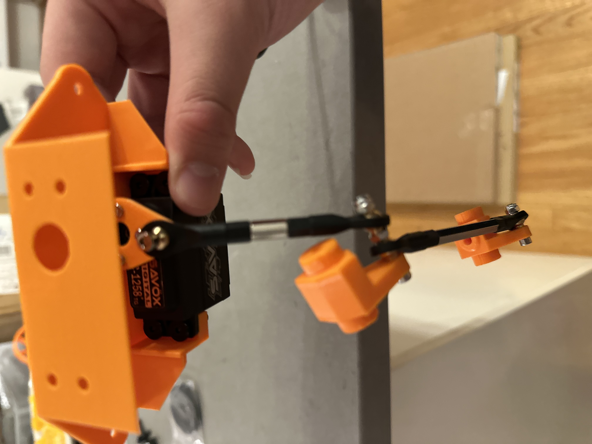 |  |

| Linkage assembly before enclosure | Protected lower front-axle module |
|---|---|
| 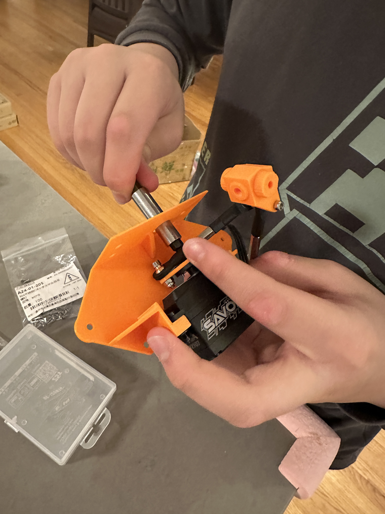 | 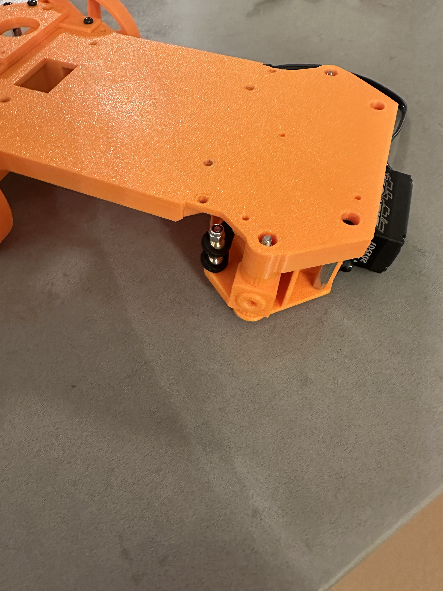 |

- **Rear axle — physical drive chain.**
  - The external transmission is a timing-belt reduction, not a train of meshed spur gears.
  - The GA25-370 Hall-encoder gearmotor sits in a printed cradle with two slotted mounting holes. A 20-tooth timing pulley is fixed to the output shaft of its internal 9.6:1 gearbox.
  - **Motion path:** DC motor rotor → internal 9.6:1 gearbox → 20-tooth timing pulley → timing belt → 40-tooth timing pulley → transverse rear axle → left/right wheel hubs.
  - The large pulley is fixed to the transverse rear shaft. That shaft passes through two printed supports and connects to brass hex wheel couplers secured with set screws; one common shaft therefore gives both rear wheels the same angular speed.
  - The external 40 ÷ 20 = **2:1** reduction halves axle speed and approximately doubles available axle torque, subject to belt efficiency. The nominal motor-rotor-to-rear-axle reduction is **9.6 × 2 = 19.2:1**.

- **Belt-tension procedure.**
  1. Leave the two motor-mount screws loose so the motor can slide in its elongated slots.
  2. Align the small pulley with the large pulley, fit the belt, and use the tension screws to set the motor position.
  3. Rotate the output shaft by hand and compare belt deflection with the established rear-axle setup.
  4. Tighten the motor-mount screws, then perform the powered drive check.

| 1. Motor slides in the tensioning slots | 2. Small pulley aligned and locked to the motor D shaft |
|---|---|
| 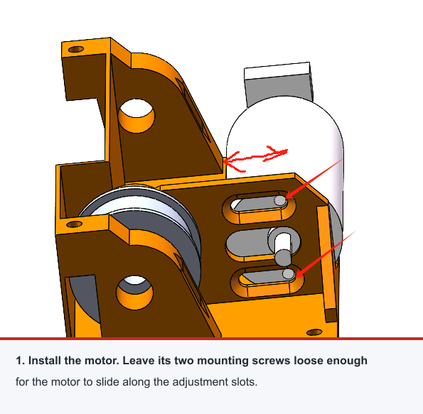 | 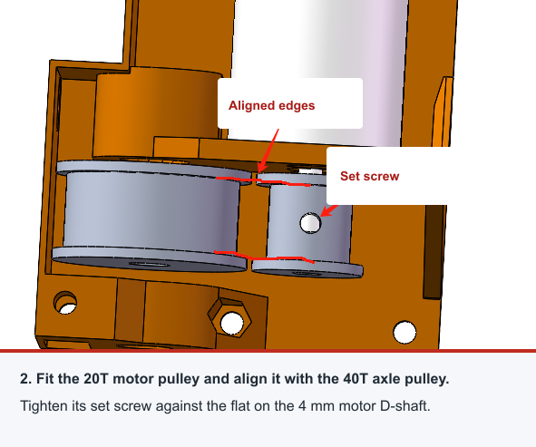 |

| 3. Toothed belt installed around the two pulleys | 4. Belt tension adjusted before the motor mount is locked |
|---|---|
| 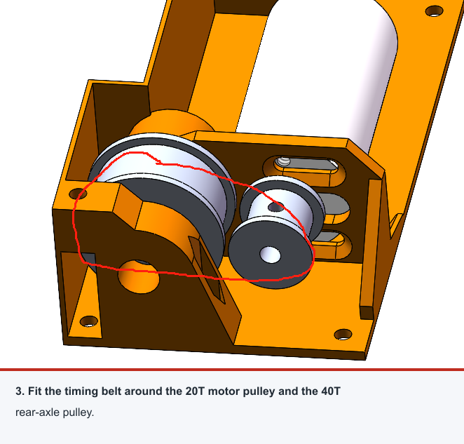 | 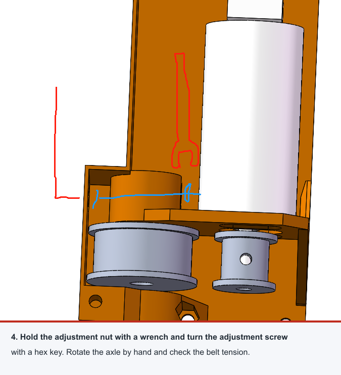 |

| 5. Motor screws tightened after a manual and powered check | |
|---|---|
| 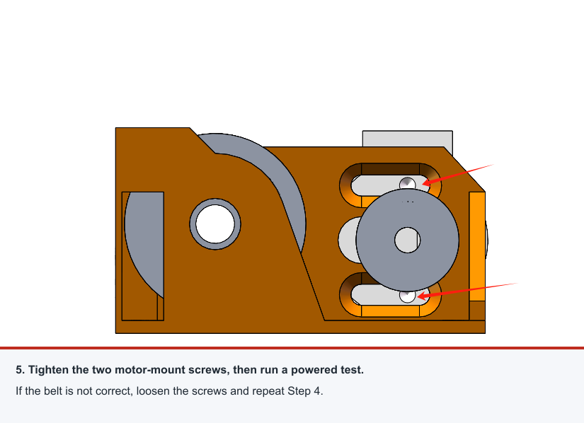 | |

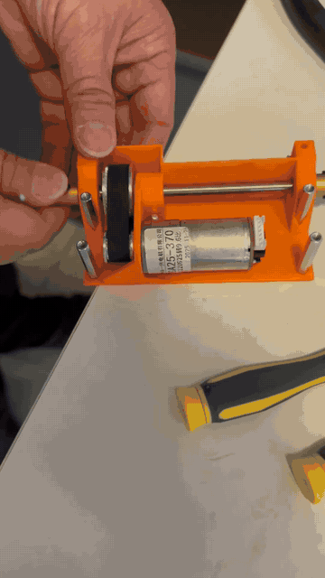

**Rear-drive assembly check:** As shown in the animation, manually turn the transmission after assembly. Confirm that the 20T driving pulley, timing belt, 40T driven pulley, rear axle, and both rear wheels move smoothly together; check that the belt does not bind or visibly track sideways and that both wheels turn with the shared axle.

#### Middle layer — battery bay and LiDAR scan plane

- **Battery and service access.** The centre remains available for the battery and wiring rising from the lower module. Brass double-ended threaded standoffs join the printed layers while retaining access for service.

- **2D LiDAR scan geometry.**
  - Two lightweight 2D LiDARs were selected instead of a heavier 3D LiDAR within the vehicle mass budget.
  - Both scan planes are below **95 mm**, allowing them to intersect approximately 100 mm-high course walls and obstacles.
  - The front LiDAR is upright; the rear LiDAR is inverted and offset longitudinally. Software fuses the two scans into one obstacle representation.
  - Wiring between the LiDARs, battery bay, and upper electronics remains inside the chassis footprint.

#### Upper layer — computing, perception, and protected wiring

- **Open, serviceable structure.** The upper structure is intentionally open rather than enclosed, so all cross-layer connections terminate above the vehicle perimeter rather than hanging from its sides.

- **Computing and sensing layout.**
  - The layer carries the ESP32-S3, its carrier board, and the speaker.
  - Raised rear mounts carry the IMU and Jetson Orin Nano Super Developer Kit; viewed from the rear, the high white button on the left is the GPIO-connected program-start button.
  - The depth camera sits on the forward centreline.
  - A raised platform on the vehicle's right carries the W5500 wired-Ethernet interface connecting Jetson and ESP32. This avoids Wi-Fi during competition and the instability previously observed with USB serial.

#### Actuator selection and verification plan

- **Steering servo.** The high-torque candidate was **SC-1256TG** (`16.0 kgf·cm / 0.18 s/60°` at `4.8 V`); the final candidate was **SC-1258TG+** (`9.6 kgf·cm / 0.10 s/60°` at `4.8 V`). We selected SC-1258TG+ because its torque still covers the steering calculation while its faster response better supports timely low-speed steering corrections. [Candidate comparison and torque calculation](docs/04-mobility-and-mechanical-design.md#11-steering-servo-torque-and-response-speed-selection).

- **Drive motor.** The GA25-370 uses a **9.6:1** gearbox. The calculation below converts the 6,000 rpm motor specification, internal gearbox, external 20T-to-40T belt reduction, and confirmed **65 mm** physical rear-tyre diameter into a no-load speed boundary for the transmission. It only checks that the motor speed and gearing do not limit the planned average speed or measured steady speed; the torque requirement is calculated separately in [C. Torque and Speed Reasoning](#drive-motor-torque-and-speed).

**No-load speed boundary for the transmission (not the vehicle's real top speed)**

$$
n_{\text{gearbox}} = \frac{6000}{9.6} = 625\ \text{rpm}
$$

$$
n_{\text{rear axle}} = \frac{625}{2} = 312.5\ \text{rpm}
$$

$$
v_{\text{no-load upper bound}}
= \frac{\pi \times 0.065 \times 312.5}{60}
\approx 1.06\ \text{m/s}
$$

**Why this check matters:** **1.06 m/s** is a kinematic upper bound for an unloaded, ideal transmission; it is not a claimed on-course speed. The planned average speed is **0.14 m/s** and the mean steady speed in the straight-line vehicle test is **0.319 m/s**, both below this boundary. The selected motor speed and **20T:40T** reduction therefore leave speed margin for low-speed course driving. Actual speed must still be confirmed in loaded vehicle tests.

---

## A. Chassis Design Choices

#### Design starting point: lessons from the 2025 vehicle

##### 2025 vehicle: problem baseline

| Original course setting | Three-quarter vehicle view |
|---|---|
| 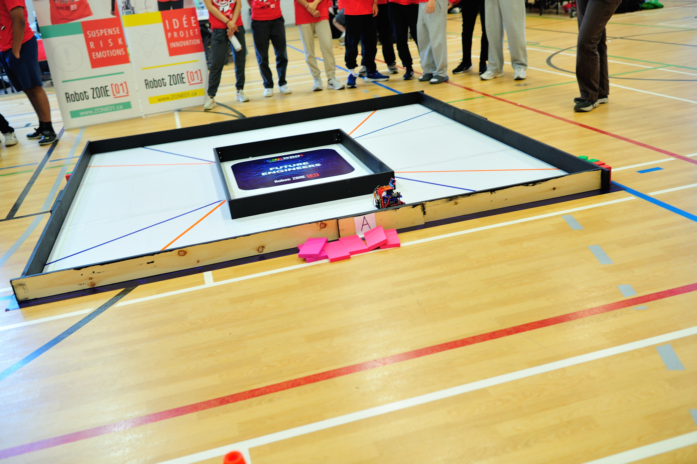 | 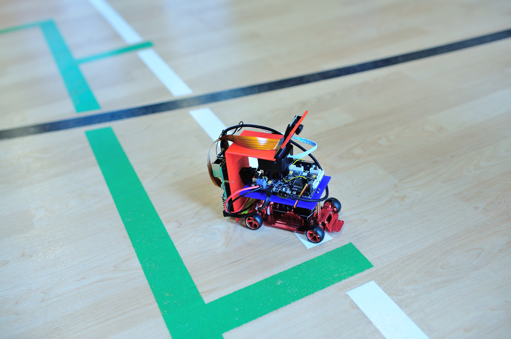 |

- **Starting point:** the 2025 vehicle was built by adapting RC-car parts.
- **Observed result:** it completed important development work, but its mechanical layout limited parking, sensing, and obstacle runs.
- **2026 decision:** convert those observed failures into chassis requirements rather than relying on software alone to compensate for them.

#### Requirements derived from the 2025 vehicle

| 2025 observation | Effect on competition performance | 2026 chassis requirement |
|---|---|---|
| The parallel-steering layout needed several manoeuvres to leave the parking area; it could not make the desired large, continuous turn. Other teams' Ackermann-steered vehicles showed that a single-turn exit could be possible. | Parking exit was slow and inconsistent. | The front axle must support a large, repeatable mechanically steered turn. Ackermann geometry is evaluated in [Steering and Drive Mechanism](#b-steering-and-drive-mechanism). |
| Exposed cables had no defined routing or strain relief. | A cable could be dragged into an obstacle and end a run. | Provide protected cable routes, attachment points, and connector strain relief in the chassis design. |
| A fisheye camera was mounted at an angle on a red roof. It did not provide depth, its distorted image required software correction, and strong sunlight could overexpose the image. | Perception could become unreliable in bright conditions. | Give the depth camera a repeatable mounting position, viewing angle, cable route, and provision for controlling direct light. |
| No LiDAR mounting position or scan volume was designed into the chassis. The sensor was later installed inverted in the middle of the vehicle, where its returns were unreliable. | LiDAR data could not be used reliably in the 2025 solution. | Reserve a defined LiDAR mounting surface, orientation, cable route, and unobstructed scan area from the first chassis design. |
| The plastic transmission gear between the motor and bearing repeatedly wore and failed five times; replacement parts subsequently could not be purchased. | A critical rear-drive component could make the vehicle unrepairable, reducing debugging and competition availability. | Use metal timing pulleys and a timing belt at the critical motor-to-rear-axle transmission, rather than a plastic gear that cannot be reliably replaced. |

- **Retained construction choice:** brass double-ended threaded standoffs reliably connected multiple structural levels in 2025.
- **2026 use:** retain the standoffs between redesigned 3D-printed layers, while changing the shape and purpose of each layer.

#### Reference platform evaluated in 2026

##### 2026 reference platform

| Overview | Right-side view |
|---|---|
| 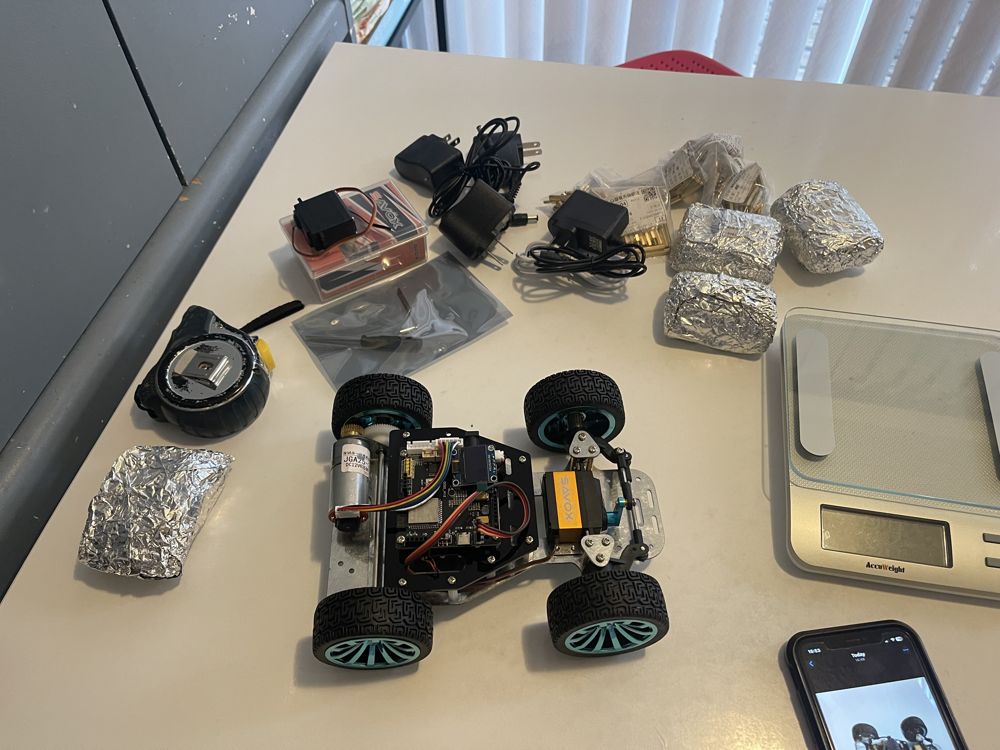 | 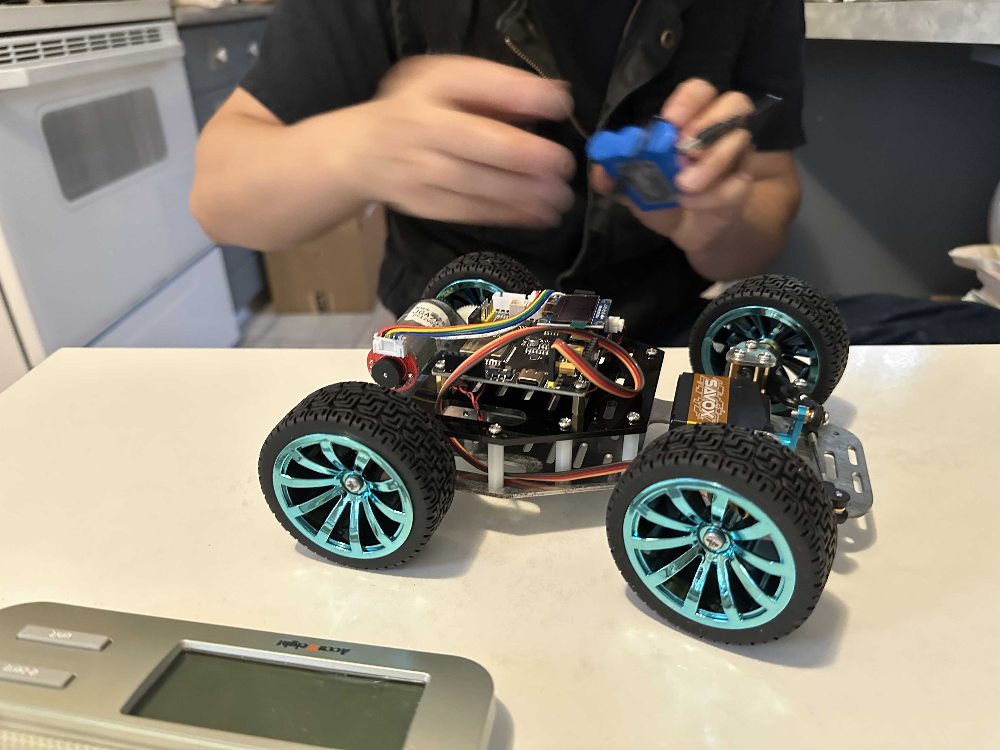 |

| Front servo and battery display | Steering assembly |
|---|---|
| 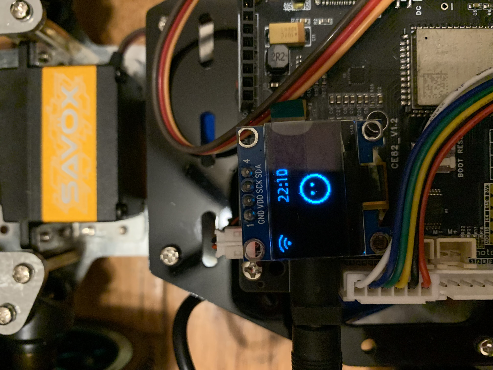 | 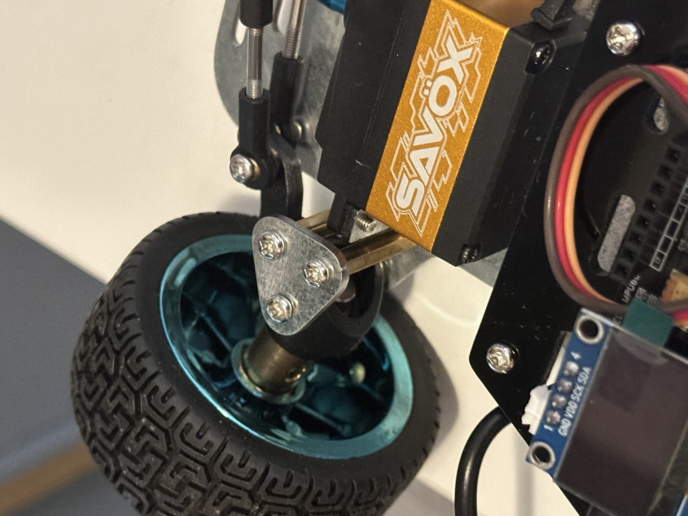 |

| Front-axle servo and steering detail | Rear wheel and bearing | Drive motor |
|---|---|---|
| 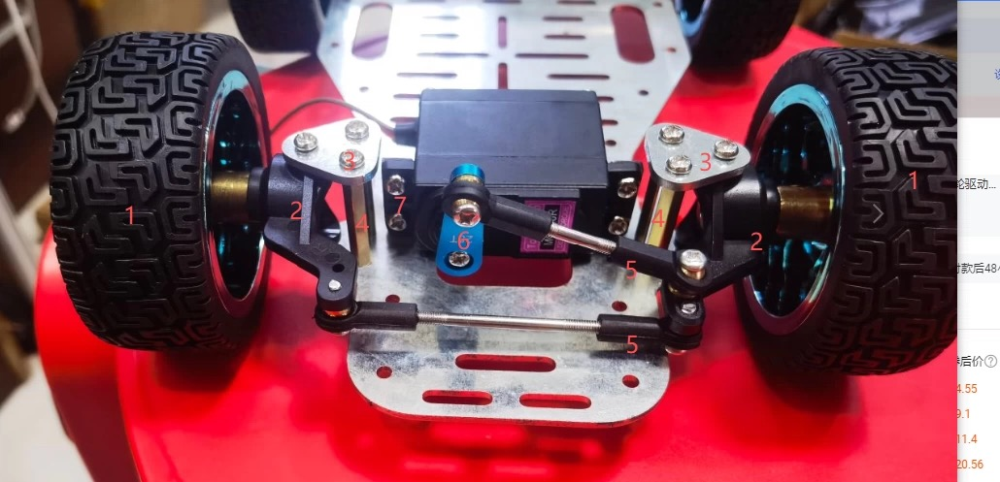 | 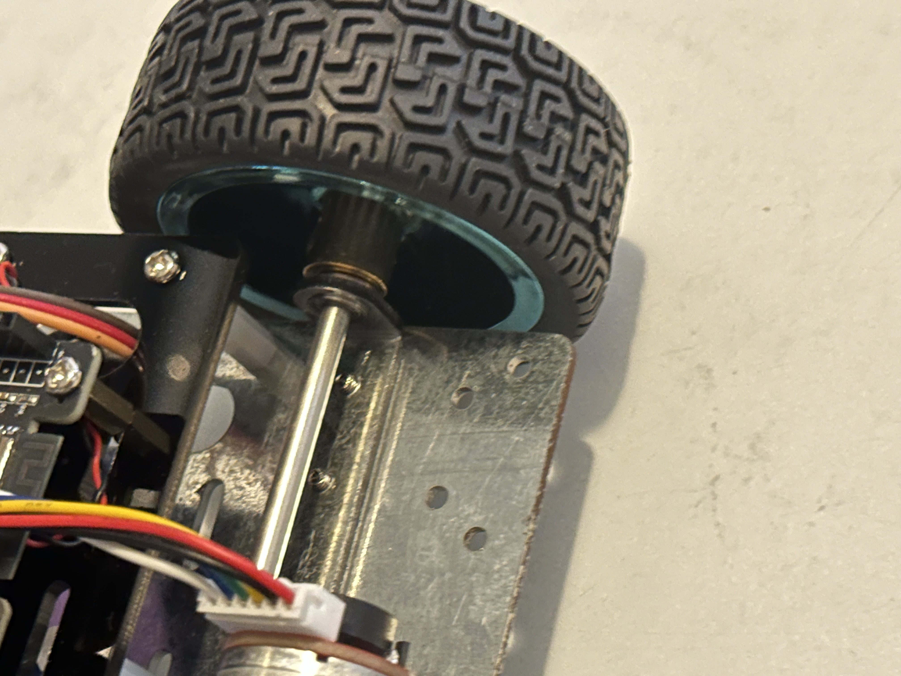 | 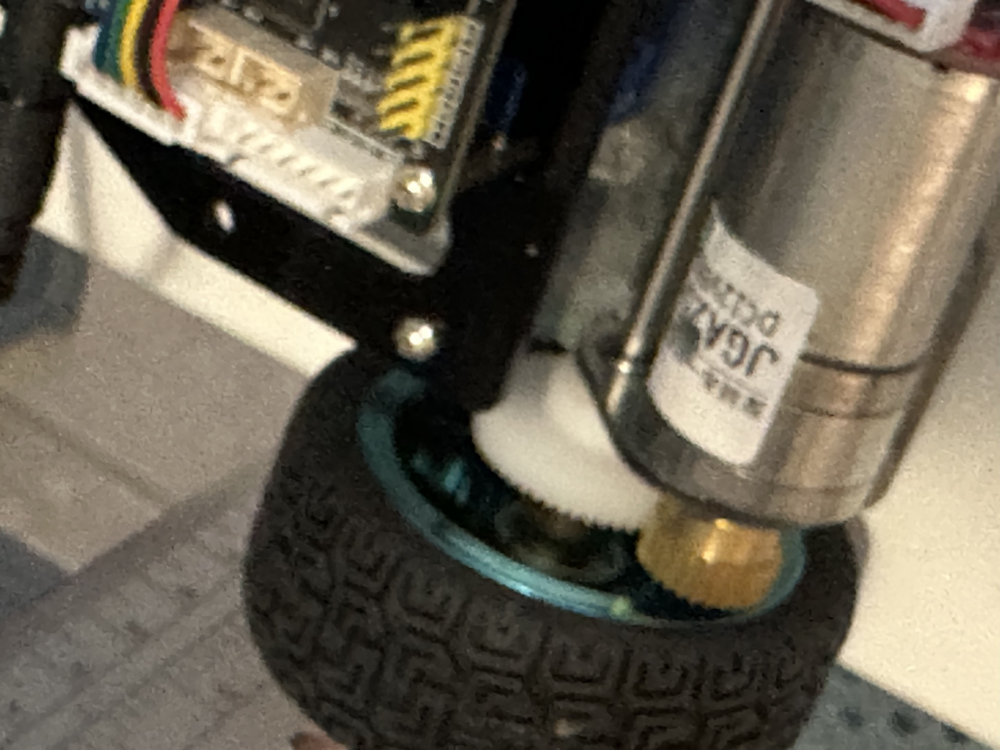 |

*This 2026 reference platform is a mechanical-layout reference, not the final competition vehicle; the photographs record its overall layout, right side, front-axle servo and steering assembly, rear wheel/bearing, and drive motor.*

- **Role:** an off-the-shelf mechanical reference only, not the final competition vehicle.
- **What it demonstrated:** one motor driving a supported rear axle; a servo steering the front axle through a servo link and a tie rod synchronising the left and right wheels.
- **What it confirmed:** a mechanically driven rear axle and mechanically linked front steering can be packaged in a small vehicle without steering by independently varying left and right drive motors.
- **Why it was not adopted:** it did not provide enough deck area or a practical multi-layer layout for our camera, LiDARs, battery, controllers, and protected wiring.
- **How it informed the final design:** the steering-geometry evaluation and the different geometry selected for the final vehicle are explained in [Steering and Drive Mechanism](#b-steering-and-drive-mechanism).

#### Final chassis concept and iterations

- **Custom chassis objective:** defined sensor locations, protected cable management, and mounting interfaces for the steering and drive modules.
- **Packaging constraint:** fit the complete vehicle through the internal 375 mm narrow-corridor target with safety clearance.
- **Design balance:** minimise the complete swept envelope while retaining enough area for required components and a rigid, serviceable structure; the goal was not simply the smallest theoretical turning radius.

**Development sequence.** In October 2025, V1 first set a `280 mm` theoretical radius, a `145 mm` wheelbase, and large-angle front-wheel steering around the question “can the vehicle leave the parking area in one turn?” The team then found that total vehicle length, front overhang, and tyre sweep constrained the `375 mm` course more than radius alone. It therefore shortened the body, wheelbase, and front overhang, while re-arranging the LiDARs, battery, harnesses, and rear wheels. The chassis was not a board on which components were simply placed: after every geometry change, the team re-checked mounting space and driving effects.

##### Final vehicle dimensions

- **Final vehicle dimensions:** **220 mm long × 155 mm wide × 158 mm high**.

##### Final rear-drive hardware

| Rear-drive assembly | GA25-370 motor and pulley | Timing belt and driven pulley |
|---|---|---|
|  |  | 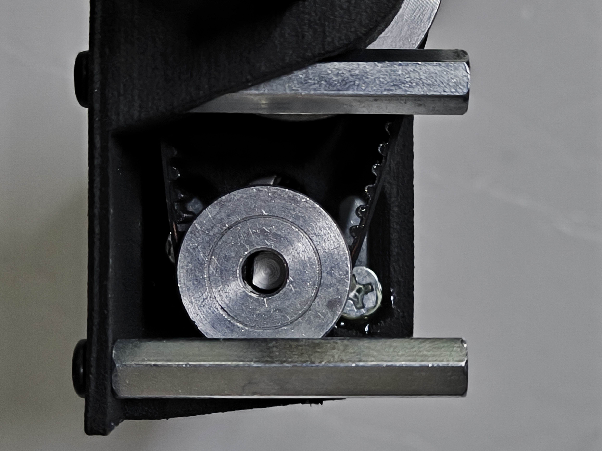 |

*The GA25-370 drives the shared rear axle through metal timing pulleys and a timing belt; the three photographs show the complete assembly, motor side, and belt/pulley side.*

- **Visible evidence:** the large rear-axle pulley and small motor pulley are connected by the timing belt; the motor mount and fasteners allow the belt tension to be adjusted.
- **Vehicle correspondence:** this rear-drive assembly is the one used by the rear-drive parts, transmission calculation, and physical-running discussion below.
- **Course constraint:** 375 mm is measured from the team's own course layout, shown below.
- **Stress case:** the tightest intended continuous turn; actual competition driving can still include a sequence of arcs and corrections.
- **Decision metric:** complete swept envelope — body dimensions, front/rear overhang, wheel track, and outer-wheel sweep — rather than theoretical rear-axle radius alone. See [Steering and Drive Mechanism](#b-steering-and-drive-mechanism).

##### Course geometry reference and 375 mm design constraint

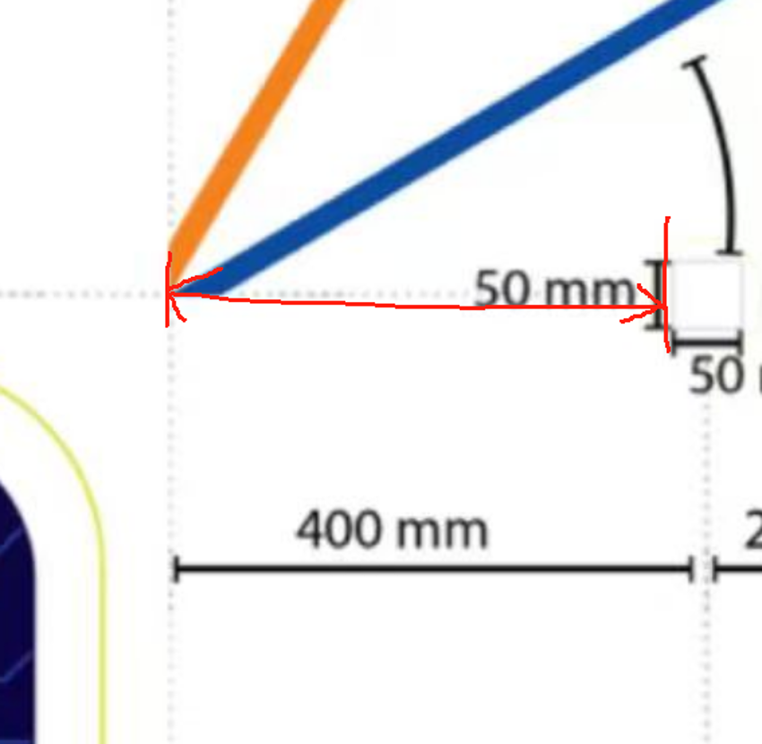

- **Drawing input:** this local course drawing supplies the `400 mm` and `50 mm` geometric dimensions used as rule-drawing input when judging the turning space.
- **Design constraint:** the team abstracts the tightest continuous-turn situation as an internal **375 mm** narrow-corridor constraint, to check the full swept envelope of vehicle, tyres, and safety margin.
- **Scope:** `375 mm` is the team's design and physical-validation constraint, not a single dimension printed on this drawing; passability still depends on the CAD geometry and physical driving results below.

##### Steering geometry and swept-envelope analysis across iterations

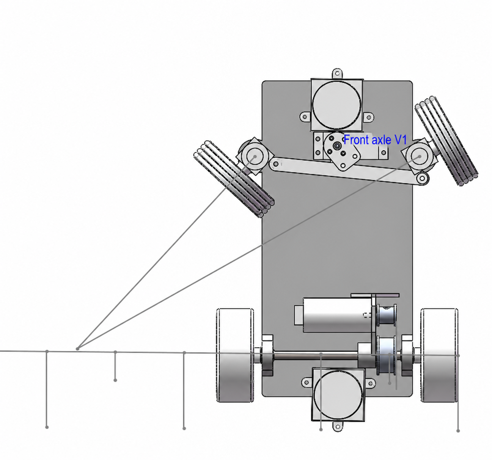

- **What the drawing records:** V1 axle positions, track, front/rear overhang, large front-wheel angle, and steering axes; their intersection marks the geometric turn centre for this posture.
- **Iteration scope:** V1 is only the starting point. The table compares V1, shortened V2, and the current configuration using the same swept-envelope reasoning.
- **Design check:** the team did not compare theoretical rear-axle radius alone. Passability was assessed from the swept envelope formed by the full vehicle body, outer wheel, and front/rear overhang.
- **Required calculation:** the original required-course-width calculation identifies course dimensions, vehicle-geometry inputs, turn path, and safety clearance; it does not infer a course dimension from this CAD image.

| Version | Geometry and design decision | Evidence and outcome | Decision |
|---|---|---|---|
| V1 | Width 183 mm; length 268 mm; wheelbase 145 mm; front-wheel design angles 58 degrees inside and 30 degrees outside; front overhang 64 mm. The CAD estimate placed the outer wheel approximately 280 mm from the turning centre. | The original design calculation gave a required course width of 561 mm with 30 mm clearance, or 581 mm with 40 mm clearance—both exceeding the team's 375 mm course constraint. This was a geometric analysis, not a physical test. | Rejected as too long for the target turn. The next iteration reduced overall length, wheelbase, and front overhang, and reconsidered rear-tyre friction. [V1 CAD render](https://github.com/clover1983/robot-wro-2026-prepare/blob/main/hardware-info/hardware-design-image/design-001/001.png) |
| V2 | Width 176 mm; length 220 mm; wheelbase 138 mm; front-wheel design angles 53.7 degrees inside and 33.7 degrees outside. | This CAD-stage iteration reduced the swept envelope. CAD renders 017, 018, and 019 record the revised geometry, but V2 was not yet the complete final vehicle assembly. | Intermediate compact-geometry iteration; its selected dimensions were carried into the final V3 package. |
| V3 / current configuration | Final complete vehicle geometry: body length 220 mm; body width 120 mm; overall width including wheels 155 mm; wheelbase 138 mm; rear wheel diameter `65 mm`; front wheel diameter approximately `50 mm`. | V3 made the physical package substantially narrower than V2 and completed the wheels, rear drive, sensor locations, and multi-layer chassis. During running, high-friction commercial rear wheels caused tyre scrub at large steering angles. Arc running became more stable after replacing them with self-made, smoother `65 mm` rear wheels, with the earlier slip no longer observed. | Final V3 configuration: retain the low multi-layer front-steering/rear-drive layout and smoother 65 mm rear wheels. |

- **Final layout principle:** 3D-printed component carriers and multiple standoff-connected levels give every component an intentional mounting position.

Mechanical version history, CAD geometry, swept-envelope analysis, and physical-test records are consolidated in [Chapter 4: Mobility and Mechanical Design](docs/04-mobility-and-mechanical-design.md); this README retains only the final design decisions.

---

## B. Steering and Drive Mechanism

#### Steering geometry selection

- **2025 limitation:** parallel steering did not give sufficiently repeatable tight turns.
- **Reference observation:** the 2026 reference linkage appeared to use reverse Ackermann, where the outer wheel can turn by as much as or more than the inner wheel; this can suit high-speed vehicles with tyre slip-angle and load-transfer effects.
- **Final decision:** positive Ackermann, where the inner wheel turns more sharply than the outer wheel.
- **Reason:** this low-speed vehicle performs tight, repeatable manoeuvres. Positive Ackermann brings the wheel directions closer to their circular paths, reducing tyre scrub and making turns smoother and more repeatable.

##### Steering-geometry comparison

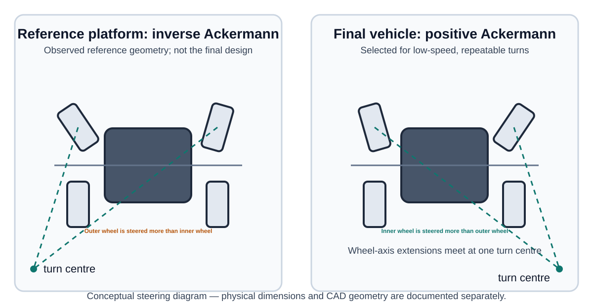

- **Left:** the Reverse-Ackermann relationship observed on the reference platform, in which the outer-wheel angle is at least the inner-wheel angle.
- **Right:** the final vehicle's positive-Ackermann relationship, in which the inner wheel turns farther and the extended front-wheel axes point toward the same turn centre.
- **Scope:** the diagram explains the geometric relationship; its illustrative wheel angles are not presented as unmeasured physical-car data.

#### Front steering and rear drive layout

- **Front axle:** the steering actuator and linkage implement the Ackermann geometry.
- **Rear axle:** one motor, belt transmission, and a supported axle drive both rear wheels.
- **Why not front drive:** driven wheels, motor transmission, and steering joints would have to coexist in the same limited front-axle space.
- **Why this split:** it reduces packaging and linkage complexity, keeps the front steering accessible for adjustment, and leaves the central layers for sensors, controllers, battery, and protected cable routing.
- **Why not four-wheel drive:** a second driven axle was not needed for this vehicle or layout.

#### Low-speed turning with a shared rear axle and no differential

- A shared rear axle keeps both rear wheels at the same angular speed. During a low-speed turn, however, the inside and outside rear wheels follow different paths, so some tyre scrub is unavoidable.
- The earlier `68 mm` commercial rear wheels had coarse tread and high friction. At large steering angles, the team observed occasional slip.
- The team compared adding front ballast, limiting the maximum steering angle, and changing the rear wheels. Front ballast would consume mass budget, while reducing steering angle alone would reduce clearance in tight spaces.
- The final solution was a team-printed **smoother `65 mm` rear wheel**. In arc-driving tests, the vehicle was more stable than with the high-friction wheels and the earlier slip was no longer observed, so no additional front ballast was installed.

| Early commercial treaded rear wheel | Final team-printed smoother rear wheel |
|---|---|
| 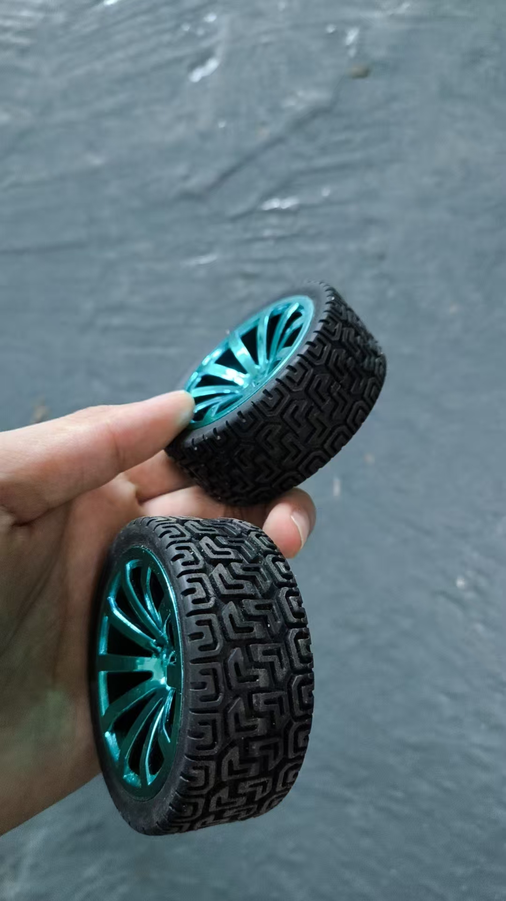 | 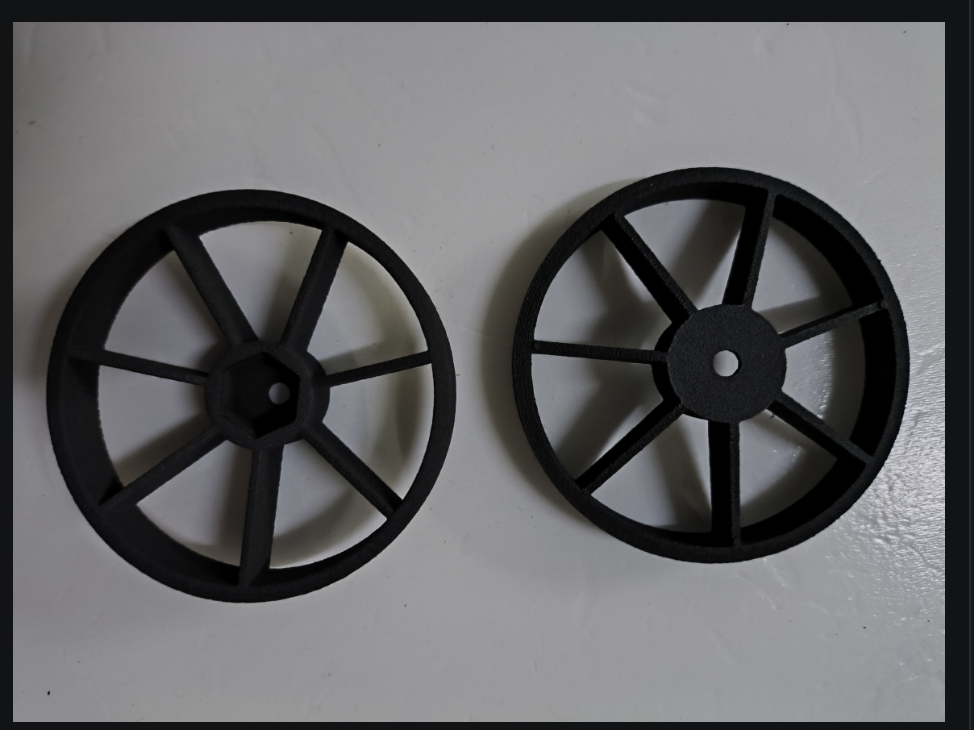 |

- **What the comparison shows:** the left image is the early coarse-tread, high-friction commercial wheel; the right image is the team's final `65 mm` rear-wheel hub. The physical arc-driving result is recorded in the [Chapter 4 testing and iteration record](docs/04-mobility-and-mechanical-design.md).

#### Turning-radius reasoning

For a given maximum steering angle, wheelbase, and ideal kinematic turn, the rear-axle-centre radius is approximately:

$$
R \approx \frac{L}{\tan(\delta)}
$$

- **Kinematic implication:** reducing wheelbase or increasing usable steering angle reduces the theoretical rear-axle-centre radius.
- **Practical check:** evaluate the full swept envelope, not the radius alone.
- **Evidence method:** CAD geometry and the repeated physical-run records in [Chapter 4](docs/04-mobility-and-mechanical-design.md).

##### Final steering mechanism

| Steering assembly before installation | Three-part linkage rod-end detail |
|---|---|
| 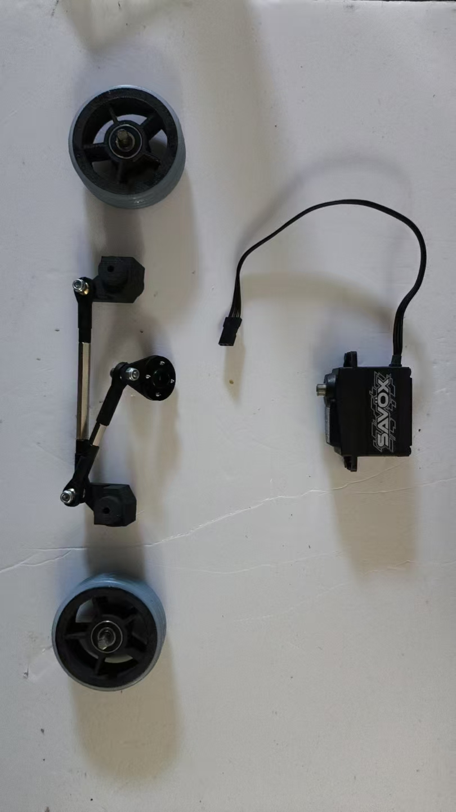 | 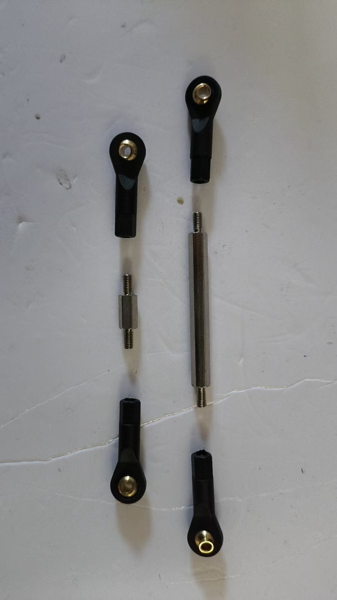 |

- **What the images show:** servo output travels through the servo horn and linkage to the tie rod, which synchronises the two steering arms. Ball joints and adjustable rod ends allow the linkage lengths and centre position to be corrected after assembly.
- **Geometric boundary:** these assembly photographs demonstrate the parts and their connections; the actual inner/outer wheel angles, mechanical stops, and CAD geometry are recorded separately with full-steering photographs and final dimensions.

##### Final rear-drive mechanism

| Rear-drive parts before assembly | Rear-drive CAD relationship |
|---|---|
|  |  |

- **What the images show:** the gearbox-output shaft carries the `20T` pulley, and the timing belt drives the `40T` pulley on the supported rear axle, forming an additional `2:1` reduction that drives both rear wheels through the shared axle.
- **Connection to the calculations:** this transmission ratio is used in the speed and torque calculations in Section C below.

##### Front-axle linkage installation

| Installation view A | Installation view B |
|---|---|
|  | 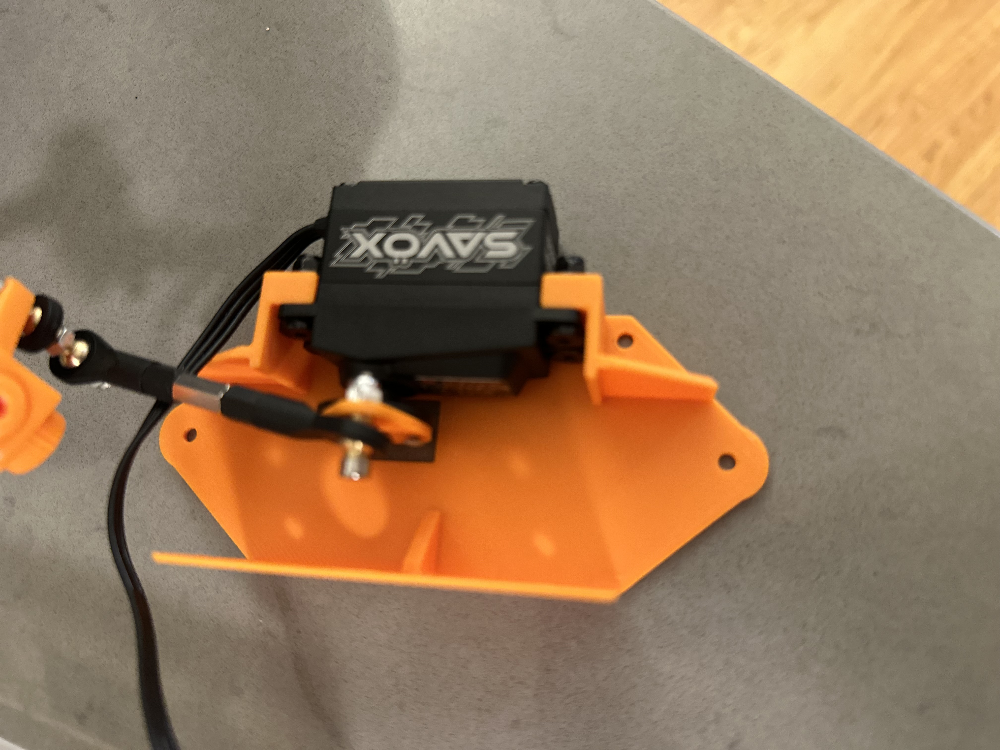 |

- **What the images show:** the two installation views record the connection between servo output, the three-part linkage rod, the tie rod, and the left/right steering arms.
- **Geometry note:** steering angles and mechanical stops are established by the final CAD dimensions and physical protractor records; they cannot be inferred from these two assembly photographs alone.

---

<a id="drive-motor-torque-and-speed"></a>

## C. Torque and Speed Reasoning

**Drive train evaluated:** 12 V GA25-370 gearmotor → 20T-to-40T timing-belt reduction → shared rear axle → 65 mm rear tyres. The reasoning below starts with the rear-wheel traction requirement, then checks motor torque, launch acceleration, race-speed target, and physical-car results.

> [!IMPORTANT]
> **Steering-servo torque and response speed:** [Chapter 4, Section 11: SC-1258TG+ selection](docs/04-mobility-and-mechanical-design.md#11-steering-servo-torque-and-response-speed-selection) — explains how the selected servo provides sufficient steering torque while its faster response supports compact low-speed turns.
>
> **Rear-drive motor torque and selection:** [Chapter 4, Section 12: GA25-370 selection](docs/04-mobility-and-mechanical-design.md#rear-drive-motor-selection) — provides the full traction-force, rear-wheel torque, belt-reduction, tyre-grip, and five-run test calculations.
>
> **Race-time budget and target speed:** [Chapter 4, Section 13: time budget and speed](docs/04-mobility-and-mechanical-design.md#13-run-time-budget-and-rear-drive-target-speed) — provides the full 14 m distance, 100 s driving-time, and rpm conversion calculation.

### 1. Start motor selection from the rear-wheel torque requirement

Rear-drive motor selection starts with the tangential traction force required at the rear wheels, rather than the motor's advertised force rating. With a `32.5 mm` rear-wheel radius, the required axle torque is:

$$
\tau_{\text{rear axle}}=F_{\text{traction}}\times r_{\text{rear wheel}}
$$

Using a `1.45 kg` vehicle, `C_{rr}=0.05`, and a design launch acceleration of `0.5 m/s²`, the rear axle requires approximately `0.0466 N·m`, or `0.48 kgf·cm`. The `0.5 m/s²` value is a design condition for launch capability; the planned `0.14 m/s` average speed is a race-time requirement, so they are different quantities.

### 2. Compare the requirement with the selected GA25-370

At `12 V`, the selected GA25-370 has a rated gearbox-output torque of `0.3 kgf·cm`. After the external `20T:40T` timing-belt reduction and an assumed `90%` transmission efficiency, the rated rear-axle torque is approximately `0.0529 N·m`, or `0.54 kgf·cm`, above the `0.48 kgf·cm` design requirement. The motor and belt drive therefore cover the normal low-speed launch requirement.

### 3. How torque affects acceleration, and the tyre-grip boundary

Motor torque becomes driving force through the rear-wheel radius; after rolling and turning resistance are subtracted, the remaining force produces acceleration. The tyre-static-friction limit also caps the traction that can reach the ground: if the force implied by axle torque is greater than the available static friction, the rear wheels spin instead of producing more acceleration. From the rated rear-axle torque and straight-line rolling resistance, the theoretical straight-line acceleration boundary is about `0.83 m/s²`; the `0.5 m/s²` launch design point retains margin. Lower acceleration is needed in turns, around obstacles, and on lower-grip surfaces.

### 4. Derive the target average speed from the three-minute race

The team reserved `100 s` for obstacle driving, `40 s` for parking, and the remaining `40 s` of the three-minute round for unexpected events. The four sides of the `3 m × 3 m` course total `12 m`; a further `2 m` was included for turning and obstacle-avoidance curves, giving a planned `14 m` route length:

$$
v_{\text{target average}}=\frac{14\ \text{m}}{100\ \text{s}}=0.14\ \text{m/s}
$$

At `0.14 m/s`, a `65 mm` rear wheel turns at approximately `41.1 rpm`; through the `20T:40T` belt drive, this is approximately `82.3 rpm` at the gearbox output, below the motor's `500 rpm` rated gearbox-output speed.

### 5. Straight-line physical-car test and calculation result

The team performed five `0 → 150` straight-line tests on a flat WRO mat using the competition `4500 mAh` battery. `150` is the control command used for this test, not an rpm, m/s, acceleration, or torque unit. The five tests produced a mean steady speed of `0.319176 m/s` and a mean 10%–90% acceleration of `0.545253 m/s²`. That steady speed corresponds to approximately `93.8 rpm` at the rear axle and `187.6 rpm` at the gearbox output, still below the `500 rpm` rated speed. Using the test value `C_{rr}=0.03`, the back-calculated rear-axle requirement is approximately `0.0396 N·m`; the gearbox-output requirement is approximately `0.0220 N·m`, giving a torque margin of about `1.34` against the rated output.

<details>
<summary>Full calculations and five straight-line test records</summary>

### Cruise speed and control-input boundary

- **Time budget:** 100 s for obstacle driving, 40 s for parking, and the remaining part of the three-minute round for recovery from unexpected events.
- **Measured result:** five `0 → 150` straight-line runs on a flat WRO mat with the competition battery produced a mean steady speed of **0.319 m/s**.
- **Firmware range:** motor command 0–400 maps linearly to 13-bit PWM 0–8191.
- **Command 150:** `150 / 400 = 0.375`, or approximately `3071 / 8191` PWM duty.
- **Meaning of the command:** a control input, **not** an rpm, m/s, acceleration, or torque value. The firmware uses direct PWM without a speed controller or acceleration ramp; battery voltage, current limit, load, and tyre grip determine the resulting vehicle motion. See [motor control source](../newcode/202603/esp32-code/motor-api.ino).

**Measured speed calculation at motor command 150**

$$
C = \pi D = \pi \times 0.065 = 0.2042\ \text{m}
$$

$$
n_{\text{rear axle}}
= \frac{v \times 60}{C}
= \frac{0.319176 \times 60}{0.2042}
= 93.78\ \text{rpm}
$$

$$
n_{\text{gearbox output}}
= 93.78 \times \frac{40}{20}
= 187.56\ \text{rpm}
$$

- **Result:** at 0.319 m/s, the 65 mm tyres require approximately **93.78 rpm** at the rear axle and **187.56 rpm** at the GA25-370 gearbox output.
- **Speed comparison:** the selected 9.6:1 motor is specified at **625 rpm maximum no-load gearbox-output speed**, so 187.56 rpm is below that limit.

### Torque requirement and component-selection comparison

- **Vehicle mass:** measured **1.45 kg** with the competition battery.
- **Measured acceleration:** five-run mean 10–90% acceleration of **0.545 m/s²** (sample SD 0.063 m/s²). For each run, the analysis uses the 10% and 90% points of its steady speed from `/wheel/odometry`.
- **Rolling resistance:** `Crr = 0.03`, where `Crr = F_roll / (m × g)`.
- **Selected motor:** 12 V, 9.6:1 version; **625 rpm** maximum no-load gearbox-output speed; **500 rpm** rated speed; and **0.3 kgf·cm** rated gearbox-output torque = **0.0294 N·m**.
- **Torque boundary:** 0.0294 N·m already includes the internal 9.6:1 gearbox, so the calculation does not multiply it by 9.6 again. The 1.2 kgf·cm limit-load torque is not used as a normal operating value.

**Measured acceleration and torque calculation**

$$
F_{\text{acc}}
= m a
= 1.45 \times 0.545253
= 0.791\ \text{N}
$$

$$
F_{\text{roll}}
= C_{rr}mg
= 0.03 \times 1.45 \times 9.81
= 0.427\ \text{N}
$$

$$
F_{\text{required}}
= F_{\text{acc}} + F_{\text{roll}}
= 1.217\ \text{N}
$$

$$
T_{\text{rear axle}}
= F_{\text{required}}r
= 1.217 \times 0.0325
= 0.0396\ \text{N\,m}
$$

$$
T_{\text{gearbox, required}}
= \frac{T_{\text{rear axle}}}{2 \times 0.90}
= 0.0220\ \text{N\,m}
$$

$$
T_{\text{gearbox, rated}}
= 0.3\ \text{kgf\,cm} \times 0.09807
= 0.0294\ \text{N\,m}
$$

$$
\text{Rated torque margin}
= \frac{0.0294}{0.0220}
= 1.34
$$

$$
T_{\text{rear axle, rated}}
= 0.0294 \times 2 \times 0.90
= 0.0529\ \text{N\,m}
$$

- **Required gearbox-output torque:** **0.0220 N·m**.
- **Manufacturer-rated gearbox-output torque:** **0.0294 N·m**.
- **Rated-torque margin:** **1.34**.
- **Rear-axle comparison:** with the 2:1 belt reduction and `η = 0.90`, the requirement is 0.0396 N·m and theoretical rated torque is 0.0529 N·m.

### Straight-line acceleration evidence

- **Test date and surface:** 2026-08-21; flat WRO mat; competition battery.
- **Initial condition:** vehicle at rest, steering command 0, and a direct motor-command step from 0 to 150.
- **Measurement source:** `/wheel/odometry` provided timestamp, speed (`twist.twist.linear.x`), and path distance.
- **Stop condition:** stop command sent after measured path reached at least 1 m.

| Run | Motion-onset delay (s) | 10–90% acceleration (m/s²) | Steady speed (m/s) | Command to 1 m (s) |
|---:|---:|---:|---:|---:|
| 1 | 0.098 | 0.507 | 0.319 | 3.395 |
| 2 | 0.094 | 0.533 | 0.319 | 3.390 |
| 3 | 0.087 | 0.643 | 0.319 | 3.392 |
| 4 | 0.081 | 0.479 | 0.319 | 3.404 |
| 5 | 1.362 | 0.565 | 0.319 | 4.697 |

- **10–90% acceleration result:** mean **0.545 m/s²**.
- **Secondary analysis:** linear fit over the same rise interval gives **0.460 m/s²** (sample SD 0.089 m/s²); the torque calculation uses the higher 10–90% value.
- **Distance result:** from motion onset, the vehicle reached 1 m in **3.311 s** on average (sample SD 0.017 s).
- **Run 5:** longer motion-onset delay, while acceleration and steady speed remained comparable to the other runs.
- **Evidence files:** [wro_acceleration_runs.zip](../wro_acceleration_runs.zip) contains raw bags, CSV files, JSON analysis, and the test report; [torque-speed-calculations.csv](hardware/mechanical/calculations/torque-speed-calculations.csv) is the editable calculation record.

</details>

---

## D. Mechanical Stability and Rigidity

**Design objective:** preserve the relative positions of the steering, rear-drive, LiDAR, and electronics modules during repeated driving and turning.

- **From PLA prototype to carbon-fibre-filled nylon.** The first structural layers were PLA because it was quick to print and suitable for validating component packaging, layer relationships, and assembly order. PLA was not sufficiently rigid or durable as the long-term material for repeated servo-steering loads, rear-drive transmission loads, and fastener-hole loads. The team therefore moved to carbon-fibre-filled nylon rather than treating the early PLA prototype as the final load-bearing structure.

  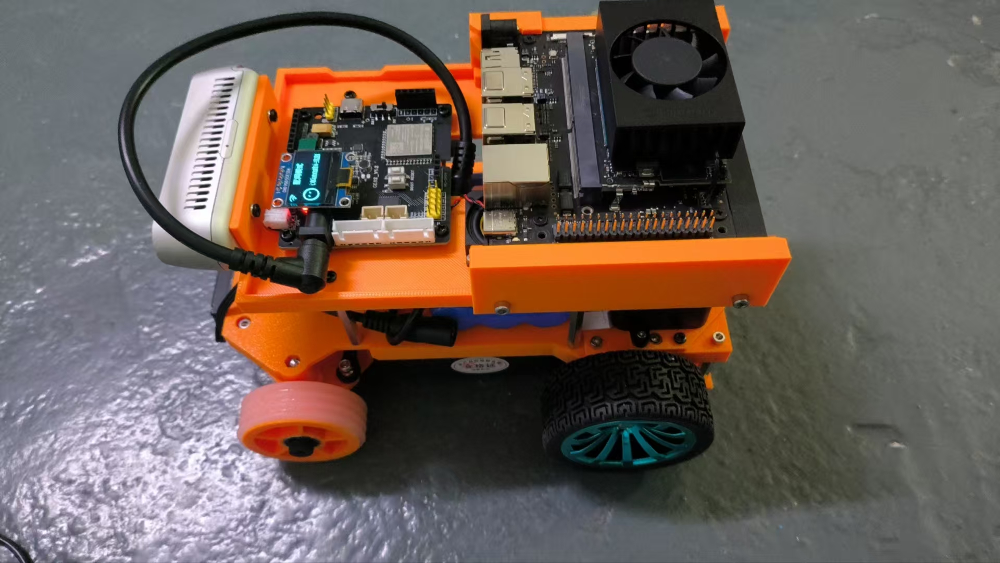

- **PA12-CF versus PA6-CF.** PA12-CF has lower moisture sensitivity and better dimensional stability. PA6-CF better fits the higher-rigidity demand of this vehicle's lower layers: the front-axle servo steering, rear timing-belt drive, and repeatedly assembled mounting holes all depend on stable geometry. Within the `1.5 kg` mass limit, added metal reinforcement was not a suitable alternative, so the lowest and second layers use **PA6-CF**.

- **The insulated electronics layer remains PLA.** The team tested the resistance of the carbon-fibre-filled print material; the probe reading shown below demonstrates that it cannot be treated as an insulator. The upper layer carries the ESP32-S3, Jetson, and other electronics, so it was changed to PLA. This deliberately prioritises electrical insulation over maximum structural rigidity.

  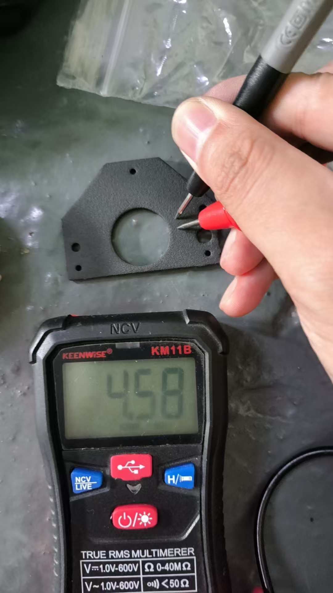

- **Multi-layer frame and interlocking second layer.** Brass double-ended hex standoffs connect the printed levels and limit relative movement between them. The second level is not one unsupported flat plate: it uses nested, recessed printed sections with defined openings for the battery bay, cable routes, and sensor mounts. The interlocking joints keep the assembled surface flush while reinforcing the edges around those openings.

  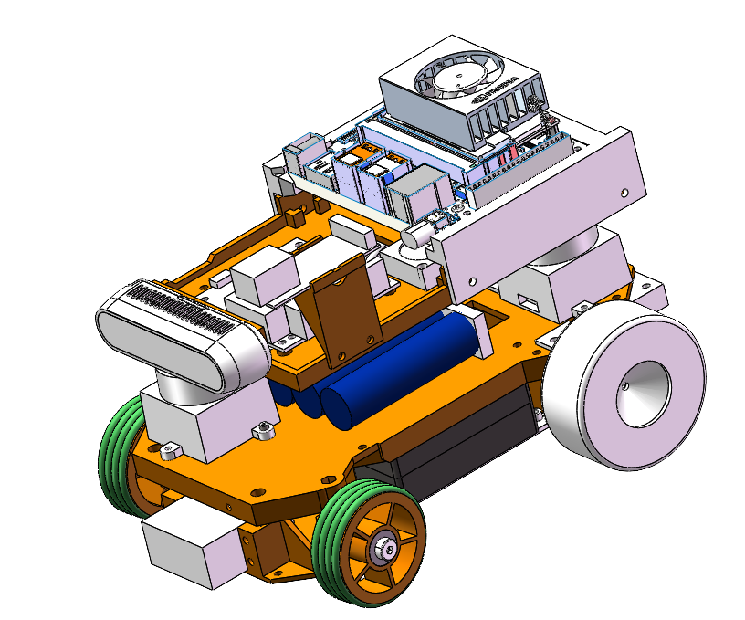

- **Fixed mechanical interfaces and protected harnesses.** Printed mounting features locate the servo, motor, rear-axle supports, battery, LiDARs, and cable routes. Stable locations reduce the risk of gear misalignment, steering backlash, sensor movement, and cable forces acting on the steering or drive assemblies. The harness is routed inside the vehicle perimeter rather than used as an exposed load-bearing element.

  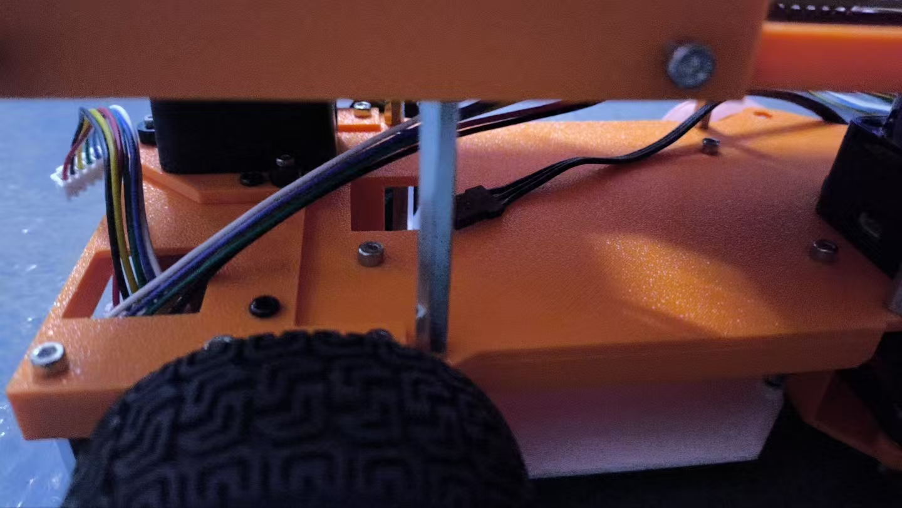

- **LiDAR mounting stability.** Both 2D LiDARs are mechanically mounted below 95 mm so their scan planes intersect the approximately 100 mm-high walls and obstacles. The rear LiDAR is mounted 5 mm higher and is longitudinally offset from the front LiDAR, so the sensors do not share exactly the same scan plane or direct line of exposure. Rigid printed mounts preserve this geometry during driving.

  

---

## E. Design Trade-offs, Component Selection, and Iteration

This table does not repeat the complete technical explanation in Sections A–D. It is a development index: each row links the progression of a structure, sensor, or power decision described above.

| Period | Constraint or problem found | Team adjustment | Result and final decision |
|---|---|---|---|
| 2025-10: V1 chassis | The `268 mm` long V1 with a `145 mm` wheelbase had too large a full swept envelope for the `375 mm` narrow-space constraint. | Shortened the body and wheelbase, then reorganised the front axle, rear axle, LiDAR, and battery space. | Established the `220 mm`-long, `138 mm`-wheelbase V2 geometric basis. See [A. Chassis Design Choices](#a-chassis-design-choices). |
| 2025-10: LiDAR scan plane | Inverted LiDAR mounting was considered to simplify wiring; the centrally inverted LiDAR in the previous vehicle produced unreliable returns. | Reserved sensor positions and cable paths from the chassis-design stage; kept the scan height below the approximately `100 mm` course walls and obstacles. | Retained low mounting for two 2D LiDARs; their longitudinal positions are offset and the rear mount is `5 mm` higher. |
| 2025-10 to 11: battery | A two-battery layout adds mass and cable complexity and does not fit the competition's single main-switch startup rule. | Moved to one 12 V main battery and one main power switch; rejected the magnetic battery-mount concept. | Retained a low, screw-secured single-battery bay. See [power budget and one-battery architecture](#a-power-budget-one-battery-architecture-and-evidence). |
| 2025-11 to 12: rear wheels | A shared rear axle with high-friction `68 mm` commercial wheels produced tyre scrub and occasional slip at large steering angles. | Tested team-printed smoother `65 mm` rear wheels. | Arc driving became more stable and the earlier slip was not observed; retained the smoother `65 mm` wheels without adding front ballast. |
| 2025-11 to 12: structural material | PLA prototypes were useful for rapid validation but unsuitable for long-term structural loads near the front axle, rear axle, and timing-belt drive. | Compared PA12-CF, PA6-CF, and metal reinforcement; selected PA6-CF for the lower layers. | Retained PA6-CF for the load-bearing lower levels. |
| 2025-12: electronics-layer material | Carbon-fibre-filled material is conductive and should not contact controller circuit boards. | Changed the top layer that carries the ESP32-S3, Jetson, and electronic interfaces to PLA. | Retained the PLA top layer, accepting lower structural rigidity in exchange for electrical insulation. |
| 2025-11 to 12: Jetson–ESP32 communication | USB serial was unstable and Wi-Fi was unsuitable as the competition's primary connection. | Selected the ESP32-compatible W5500 wired interface and designed a dedicated mounting location for the Ethernet module, port orientation, and right-angle Ethernet lead. | Retained the W5500 wired link and protected Ethernet routing. |
| 2025-11 to 12: power and harness | Two controllers, sensors, and actuators share limited space; wrong connector specifications or leads that are too short create installation and power failures. | Standardised connectors to the DC5521 that was physically verified to conduct; checked polarity and power before soldering; adjusted the lengths of motor, Ethernet, and sensor leads. | All harnesses remain inside the vehicle perimeter, with room for maintenance and reconnection. |

> [!IMPORTANT]
> **Detailed engineering document:** [Mobility and Mechanical Design](docs/04-mobility-and-mechanical-design.md) — chassis, steering, rear drive, wheels, materials, cable management, and mechanical iteration.

---

# 2. Power & Sensor Architecture

This is a map of the final electrical and sensing decisions. It gives the design conclusion and the evidence route; component-level specifications, photographs, circuit references, and the complete reasoning are collected in [Power and Sensor Architecture](docs/05-power-and-sensor-architecture.md).

## A. Power budget, one-battery architecture, and evidence

- **One protected power source:** a `12 V / 4.5 Ah` WHEELTEC battery feeds both controllers through one competition main-power switch: a DC5525 branch supplies the Jetson and a DC5521 branch supplies the ESP32 driver board. The component total is `27.12 W / 2.26 A` during operation; the short-duration wire-sizing value, including margin, is `7.6 A`.
- **A deliberate voltage decision:** the team considered a `12 V → 19 V` Jetson boost converter, but retained direct 12 V input after reference review and vehicle testing because the converter would add mass.
- **Harness and operating protection:** the installed main lead is `14 AWG` and both controller branches are `18 AWG`; the battery bay is screw-secured, the power wiring is enclosed within the vehicle, and the OLED battery monitor flashes blue below `9%`. The main switch disconnects the vehicle; the program-start button remains a separate software-start control.
- **Evidence:** [component power and current table](hardware/electronics/power-budget.csv) · [power topology, cable construction, battery comparison, and safety measures](docs/05-power-and-sensor-architecture.md#component-power-and-current-assessment)

## B. Sensor and communication trade-offs

| Device or link | Final role | Reason for the selection or connection |
|---|---|---|
| Two STL-27L 2D LiDARs | Front-and-rear horizontal obstacle and wall ranging | A pair of lightweight planar scanners provides the distance layer used for avoidance; their scans are merged to improve front/rear coverage. |
| RealSense D435f | Forward red/green obstacle recognition with depth information | It replaces the earlier fisheye approach with a repeatable forward mount and depth data; its recognition result is combined with LiDAR distance rather than used alone. |
| TM171 IMU and Hall encoder | Vehicle attitude/yaw input and wheel-pulse odometry | The IMU supports vehicle-state interpretation, while the encoder is the wheel-feedback source used by the vehicle odometry. |
| W5500 wired Ethernet | Jetson–ESP32 micro-ROS transport | It replaces the less reliable USB serial path and avoids relying on Wi-Fi as the competition communication link. |

The complete interface paths, power rails, cable choices, photographs, and datasheets are in [Chapter 05: sensor, cable, and interface record](docs/05-power-and-sensor-architecture.md#sensor-cable-and-interface-record).

## C. Placement proved against the field geometry

The `100 mm` walls, traffic signs, and parking limits set the installation reference. Because the vehicle depends primarily on LiDAR for avoidance, both scan planes are installed at approximately `85 mm`, so they intersect these field objects instead of passing above them. The front LiDAR is oriented at `0°`; the rear LiDAR is inverted by `180°` to simplify scan fusion. This priority has a visible trade-off: the D435f is mounted above `100 mm`, which can remove a very close obstacle from its non-fisheye view. [The geometry assessment and installation rationale are recorded in Chapter 05](docs/05-power-and-sensor-architecture.md#assessment-of-field-geometry-and-sensor-installation-positions).

## D. Calibration and common vehicle frame

The team first completed each ROS 2 sensor's intrinsic-calibration and configuration procedure using the vendor packages. For the shared vehicle frame, it measured installed component offsets with callipers, encoded positions and orientations in URDF/Xacro, and checked the resulting model in Gazebo against the CAD-exported STL layout. This establishes the transforms for both LiDARs, the D435f, and the IMU without presenting an unsupported automatic camera–2D-LiDAR calibration result. [Calibration trials, rejected tools, and the final frame method](docs/05-power-and-sensor-architecture.md#sensor-calibration-and-extrinsic-frame-construction).

## E. Failure points and reliability iterations

- **LiDAR wiring:** an initial `30 cm` ZH1.5-4P-to-USB-A lead did not make the LiDAR respond. The final front and rear paths use `20 cm` ZHR-4-to-2.54 mm Dupont leads; the rear path additionally uses a `5.5 cm` CP2102 TTL-to-USB adapter because the available GPIO UART interfaces were insufficient.
- **Coverage and camera risk:** brass standoffs can leave local gaps after dual-LiDAR merging. The team also made `15°` and `20°` camera-mount variants to improve close-range lower view, but did not install them because they would require new camera extrinsics.
- **Thermal and installation revisions:** the Jetson-support clearance was increased from `30 mm` to `40 mm` to improve IMU ventilation, and the later support revision added the program-start button. The IMU was rotated by `180°` to keep its cable inside the vehicle; the tested steering behaviour remained correct.
- **Protected assembly:** cable routing, connector selection, battery retention, and the hand-soldered split harness were treated as reliability work rather than incidental assembly.

Each issue includes the physical evidence and final decision in [Chapter 05: failure points and iterations](docs/05-power-and-sensor-architecture.md#failure-point-measured-coverage-risks-and-an-unused-camera-mount-iteration).

> [!IMPORTANT]
> **Detailed engineering document:** [Power and Sensor Architecture](docs/05-power-and-sensor-architecture.md) — power budget, source evidence, device interfaces, geometry, calibration, failure points, and iterations.

---

<a id="software-architecture-obstacle-strategy"></a>

# 3. Software Architecture & Obstacle Strategy

<a id="software-modules-runtime"></a>

## Software modules and runtime chain

The Jetson ROS 2 planner is the decision centre of the final system; the ESP32-S3 controls the motor, servo, OLED, audio, and encoder interfaces. The Jetson exchanges control and status topics with the ESP32 through W5500 wired Ethernet and the micro-ROS Agent. Two LiDARs, the D435f, the IMU, and the encoder form the closed-loop inputs. There is no separate final controller written only for Open Challenge: the same `Driver` and `GridPlanner` select fewer or more task branches according to whether an active obstacle is present.

| Module | Actual responsibility | Main inputs | Outputs and protection |
| --- | --- | --- | --- |
| Sensor and wall-line processing | Separate dual-LiDAR scans into wall lines, obstacle candidates, and local occupancy. | Merged LiDAR scan and sensor timestamps. | `LocalGrid` plus wall/obstacle evidence. |
| Pose and direction determination | Maintain continuous pose from encoder odometry and IMU; use LiDAR walls only for limited correction and course-direction confirmation. | Odometry, IMU, and wall lines. | Vehicle pose and direction-lock state. |
| Mapping and path planning | Fuse local observations into `GlobalGrid`; perform weighted path search from route goals, walls, vehicle footprint, and clearance. | LocalGrid, pose, known obstacles, and corner goals. | A feasible look-ahead path and behavioural plan. |
| Recognition and arbitration | Associate D435f red/green observations with LiDAR obstacle distance; select priority behaviour among obstacles, corners, and normal route following. | Camera colour observations, LiDAR tracks, and planner state. | Passing side, wait, reverse, or normal-route plan. |
| Driver and safety layer | Map geometric look-ahead to the servo and route speed to the motor, while checking data freshness and short-horizon collision prediction. | Path, LiDAR, IMU, and odometry. | Motor/servo commands; zero commands when scan, IMU, or odometry is invalid. |

<a id="shared-planner-challenge-branches"></a>

## Two challenge branches of the shared planner

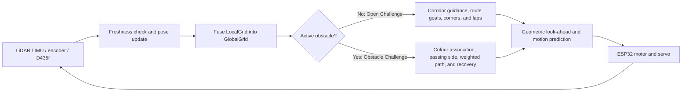
```mermaid
flowchart LR
  A[LiDAR / IMU / encoder / D435f] --> B[Freshness check and pose update]
  B --> C[Fuse LocalGrid into GlobalGrid]
  C --> D{Active obstacle?}
  D -->|No: Open Challenge| E[Corridor guidance, route goals, corners, and laps]
  D -->|Yes: Obstacle Challenge| F[Colour association, passing side, weighted path, and recovery]
  E --> G[Geometric look-ahead and motion prediction]
  F --> G
  G --> H[ESP32 motor and servo]
  H --> A
```

**Open Challenge** produces no obstacle plan in a course without red/green pillars. It still identifies direction from LiDAR openings and wall lines, maintains a corridor route, passes four corners, and stops only after a confirmed third lap. The early “wall line + approximately `0.40 m` centring target + odometry distance + IMU `+90°`” baseline validated the obstacle-free course; the final version has been absorbed into the shared grid planner. [Complete Open Challenge strategy](docs/07-open-challenge-strategy.md)

**Obstacle Challenge** adds red/green recognition, LiDAR–camera association, obstacle-priority arbitration, weighted clearance paths, and a safe reverse for an uncoloured nearby obstacle to that same chain. It is not a prerecorded route: wall lines, local/global grids, and new obstacle observations continually affect the next action. [Complete Obstacle Challenge strategy, algorithm rationale, and metrics](docs/08-obstacle-challenge-strategy.md)

Parking is a competition task, but the parking-area detector, parking state machine, and physical-vehicle validation were not completed this season. The current planner stops at three-lap completion rather than inserting an unvalidated parking action into final autonomous running. [Parking scope statement](docs/09-parking-strategy.md)

<a id="software-safety-edge-cases"></a>

## Safety and edge cases

| Situation | Current handling | Design reason |
| --- | --- | --- |
| LiDAR, IMU, or odometry is stale or absent | The Driver zeros motor and servo commands. | Do not keep moving without data used for localisation or collision avoidance. |
| Direction evidence is insufficient | Retain unknown direction and use corridor guidance; direction lock requires consecutive frames and a score difference. | Avoid generating an entire lap in the wrong direction from one ambiguous wall scan. |
| LiDAR sees a nearby obstacle but the camera has no reliable colour | Wait briefly for colour; if it remains unknown, select a safe reversing distance and sense/plan again. | Do not treat an unclassified nearby obstacle as free space. |
| Weighted search cannot supply a safe path | Stop or wait for a new observation instead of driving on unconditionally. | Walls, obstacles, and vehicle clearance jointly limit routes. |
| Corner-entry or exit deviation | Use corner states, IMU heading, odometry, wall margin, and `corner-backup` when needed. | A corner is a recoverable process, not one large servo command. |
| Motion continues after three laps | `course_complete` zeros the actuator outputs. | Avoid repeated start-line counting and driving beyond the finish. |

> [!IMPORTANT]
> **Detailed engineering documents:** [Software Architecture and decisions](docs/06-software-and-control-architecture.md) · [Open Challenge](docs/07-open-challenge-strategy.md) · [Obstacle Challenge](docs/08-obstacle-challenge-strategy.md) · [Parking scope statement](docs/09-parking-strategy.md)

---

<a id="systems-thinking-engineering-decisions"></a>

# 4. Systems Thinking & Engineering Decisions

The vehicle is treated as one coupled system: a mechanical change alters sensing geometry, a power choice changes mass and wiring, and a software architecture has to fit the physical course and the available sensors. The following record turns the main decisions in Chapters 01–05 into traceable constraint–option–evidence–consequence chains.

<a id="decision-record"></a>

## Decision record

| ID | Constraint and alternatives | Decision and evidence | System consequence and verification |
|---|---|---|---|
| D-01 — steering and vehicle envelope | The vehicle must turn in the `375 mm` course space without a differential drive. Parallel steering previously required repeated corrections; reverse Ackermann favours high-speed cornering rather than this vehicle's low-speed turns. | **Positive Ackermann and the V3 geometry** were selected over parallel/reverse Ackermann. V1 required `561–581 mm` of turn width in the recorded calculation; V3 uses a `220 mm` body and `138 mm` wheelbase, with a theoretical rear-axle-centre radius of about `154.1 mm`. | The inner front wheel turns more than the outer wheel, reducing low-speed scrub. The planner version completes most ordinary corners in one continuous pass; full swept-envelope validation remains a separate physical check. [Mechanical decision and test record](docs/04-mobility-and-mechanical-design.md#tests-and-results) |
| D-02 — shared rear axle and wheel material | The rules prohibit differential-wheeled drive, but a shared rear axle creates tyre drag at large steering angles. High-friction `68 mm` commercial wheels produced drag and occasional slip. | **Smoother `65 mm` 3D-printed rear wheels** were selected instead of the high-friction commercial wheels. Arc-driving comparison showed more stable motion and less observed drag/slip. | This does not eliminate the physical limitation of a non-differential axle; positive Ackermann and the wheel choice reduce it. [Rear-wheel trade-off](docs/04-mobility-and-mechanical-design.md#4-tyre-drag-trade-off-for-the-shared-rear-axle-without-a-differential) |
| D-03 — range sensing, mass, and field geometry | Walls, signs, and parking limits are `100 mm` high. A 3D LiDAR would simplify camera–LiDAR calibration but the lightest candidate was about `210 g`; two 2D LiDARs weigh about `90 g` together. | **Two 2D LiDARs** were selected instead of one 3D LiDAR. Their scan planes are approximately `85 mm`, below `95 mm`, so they intersect the `100 mm` course objects; the front unit is `0°` and the rear unit `180°` for scan merging. | The combined `/scan` improves front/rear coverage within the mass limit. It remains planar data: brass standoffs can occlude parts of the scan, and the high D435f can lose very-close obstacles from view. [Geometry, calibration, and known coverage limits](docs/05-power-and-sensor-architecture.md#assessment-of-field-geometry-and-sensor-installation-positions) |
| D-04 — controller and communication architecture | Perception and planning need SBC resources, actuator timing needs an SBM, Wi-Fi is not permitted, and the ESP32 has no suitable driver for the USB-Ethernet candidate. `micro_ros_espidf_component` also conflicted with the board's ESP-IDF 5.4 environment. | **Jetson + ESP32-S3 over W5500 wired Ethernet**, with `micro_ros_arduino`, was selected instead of one controller, Wi-Fi, USB Ethernet, or the conflicting ESP-IDF deployment. | Jetson runs ROS 2 perception/decision work; ESP32 runs actuator and encoder functions. W5500 and the protected cable route provide the physical bridge; the micro-ROS deployment was completed on the selected board. [Architecture decision record](docs/03-system-architecture.md#jetson-esp32-and-wired-communication) · [SBM selection](docs/05-power-and-sensor-architecture.md#why-esp32-s3-was-selected-as-the-sbm) |
| D-05 — power source, voltage, and harness | Competition allows one power-on operation, while two batteries, a boost module, and extra wiring add mass and failure points. | **One `12 V / 4.5 Ah` battery with direct Jetson DC5525 input** was selected instead of the early dual-battery arrangement and the `12 V → 19 V` boost module. The component assessment gives `27.12 W / 2.26 A` operating load and a `7.6 A` short-duration wire-sizing value; the vehicle program ran stably in most cases on direct 12 V. | The final harness uses a `14 AWG` main lead and two `18 AWG` branches, with a separately switched Jetson and ESP32 supply path. Battery enclosure, screw retention, internal routing, main switch, and low-battery indication reduce handling and wiring risk. [Power evidence and safety measures](docs/05-power-and-sensor-architecture.md#component-power-and-current-assessment) |
| D-06 — localization and planning approach | Generic SLAM and navigation packages must operate in a `375 mm` corridor with small obstacles and noisy onboard state inputs. | **A team-built map, localization, and planner chain** was selected instead of `slam_toolbox`, RTAB-Map, Nav2, and the `robot_localization` EKF output. The SLAM maps jumped, RTAB-Map was less stable, Nav2 inflation did not fit the course, and the EKF output was too noisy. | The final chain uses merged LiDAR scan, depth camera, IMU, and encoder information; wheel odometry is calculated from encoder pulses. This makes the current limitations explicit rather than hiding them behind an unstable generic stack. [Software trade-off](docs/03-system-architecture.md#software-architecture-trade-off) · [IMU/odometry decision](docs/05-power-and-sensor-architecture.md#sensor-calibration-and-extrinsic-frame-construction) |

<a id="active-risks-mitigations"></a>

## Active risks and mitigations

| Risk or failure mode | Mitigation now used | Remaining check or limitation |
|---|---|---|
| Local LiDAR blank returns and near-field camera loss | Merge two LiDAR scans, retain previous observations in state management, and use LiDAR distance alongside camera recognition. | Brass standoffs still create physical occlusion; the `15°` and `20°` downward-camera-mount variants were not adopted because they require new camera extrinsics. |
| Cable, connector, or wheel contact | Route every power, sensor, Ethernet, motor, and servo lead through internal printed-layer openings; use verified connectors and inspect the harness before use. | The inverted-LiDAR cable and camera USB connection are startup inspection items; no cable may hang outside the vehicle outline. |
| Heat, material deformation, or transmission failure | Raised the Jetson/IMU support from `30 mm` to `40 mm`; use PA6-CF in lower structural layers, PLA at the electronics layer, and metal timing pulleys at the critical drive position. | The upper PLA electronics layer has a slight bend without affecting operation; post-run inspection remains necessary. |
| Program-start and micro-ROS communication interruptions | The program-start service ignores repeated presses after the planner has started; timeout and watchdog handling reduce Agent restarts. | Button-release handling and occasional Agent restart remain open software limitations. |

The complete evidence path is [team process and scope](docs/01-team-and-project.md), [requirements and rules](docs/02-requirements-and-constraints.md), [system architecture and software trade-offs](docs/03-system-architecture.md), [mechanical calculations and tests](docs/04-mobility-and-mechanical-design.md), and [power, interfaces, calibration, and sensor risks](docs/05-power-and-sensor-architecture.md).

> [!IMPORTANT]
> **Detailed engineering documents:** [Requirements and Constraints](docs/02-requirements-and-constraints.md) · [Testing and Iteration](docs/10-testing-and-iteration.md) · [Risks and Failure Modes](docs/11-risks-and-failure-modes.md)

---

<a id="reproducibility-github-quality"></a>

# 5. Reproducibility & GitHub Quality

<a id="reproduction-path"></a>

## Reproduction path

Use the following linked route to reproduce the documented vehicle. The links deliberately lead to the physical records, drawings, photographs, interface assignments, and setup notes rather than to a generic checklist.

| Step | Action and evidence to use |
|---|---|
| 1 | **Identify and obtain the parts.** Start with the [sensor, cable, interface, and datasheet record](docs/05-power-and-sensor-architecture.md#sensor-cable-and-interface-record), the [fastener and structural-hardware inventory](docs/12-build-and-operation-guide.md#fasteners-and-structural-hardware), and the [component power assessment](docs/05-power-and-sensor-architecture.md#component-power-and-current-assessment). These records identify the installed devices, interface paths, cable lengths, power rails, supplier/datasheet evidence, and recorded fasteners. |
| 2 | **Make or obtain the mechanical parts.** Use the dimensioned [mechanical drawing (PDF)](media/cad/botzill-autonomous-ackerman-car-drawing.pdf), the editable [mechanical assembly model (STEP)](media/cad/Botzill%20Autonomous%20Car%20-%20Hiway%20Mechanical%20Assembly.step.zip), and the CAD/STL links in [Chapter 4 evidence](docs/04-mobility-and-mechanical-design.md#evidence-links). |
| 3 | **Rebuild the chassis in physical order.** Follow [Mechanical Reconstruction](docs/12-build-and-operation-guide.md#mechanical-reconstruction), using the [108-photo assembly manifest](media/assembly-steps/complete-sequence/assembly-step-manifest.csv) and the [complete photo archive](media/assembly-steps/complete-sequence/). The steps cover the lower chassis, battery bay, LiDAR layer, cable passages, upper electronics layer, and final inspection. |
| 4 | **Install and check steering and rear drive.** Use the front-Ackermann and rear-belt assembly operations in [Mechanical Reconstruction](docs/12-build-and-operation-guide.md#mechanical-reconstruction), supported by the [front-axle/servo and rear-drive assembly photos](media/assembly-guide/README.md). Confirm free steering travel, pulley alignment, belt tension, wheel fit, and that no cable enters a moving mechanism. |
| 5 | **Wire controllers, sensors, and actuators.** Follow the carrier-board interface assignments in [Chapter 05](docs/05-power-and-sensor-architecture.md#jetson-orin-nano-super-developer-kit-carrier-board-power-and-interfaces-used-on-this-vehicle), the [LiDAR connection guide](media/assembly-guide/lidar-connection/lidar-how-to-connect.md), and the [W5500-to-ESP32 guide](media/assembly-guide/w5500-esp32-connection/w5500-how-to-connect-esp32.md). These cover the final LiDAR harnesses, rear CP2102 converter, USB devices, 40-pin-header pins, W5500 leads, and the two DC power branches. |
| 6 | **Perform electrical safety checks before controller connection.** Check polarity, continuity, flag-terminal/switch joints, protected cable routing, and the 12 V/5 V/3.3 V domains against the [power tree](docs/05-power-and-sensor-architecture.md#final-power-tree-and-voltage-domains) and [electrical and wiring safety measures](docs/05-power-and-sensor-architecture.md#electrical-and-wiring-safety-measures). |
| 7 | **Install the Jetson, ROS 2, serial, Ethernet, and sensor dependencies.** Use [System Installation and Initialisation](docs/12-build-and-operation-guide.md#system-installation-and-initialisation) for the current route, then the [detailed installation-record index](docs/12-installation-record/README.md) for screenshot-level Jetson, ROS 2, LiDAR, camera, IMU, Ethernet, and dependency procedures. |
| 8 | **Flash the ESP32 firmware and start the micro-ROS Agent.** Follow the detailed [Arduino/ESP32 procedure](docs/12-installation-record/005-Arduino-01.md) and [micro-ROS Agent procedure](docs/12-installation-record/006-microROSAgent-Jetson.md); confirm the controller topics and start-button behaviour in the pre-run checks of [Chapter 12](docs/12-build-and-operation-guide.md#6-initialisation-and-pre-run-checks). |
| 9 | **Set deployment-specific parameters.** Detect serial devices and configure the W5500 Ethernet interface as described in [serial and Ethernet access](docs/12-build-and-operation-guide.md#3-enable-serial-and-ethernet-access). Then use the documented ROS 2 topics, frames, and data flows in [Chapter 3](docs/03-system-architecture.md#physical-connections-ros-2-topics-and-data-flows). Keep usernames, hostnames, passwords, and private network credentials out of committed files. |
| 10 | **Establish sensor and vehicle calibration.** Reproduce the measured URDF/Xacro coordinate-frame method in [Sensor Calibration and Extrinsic-Frame Construction](docs/05-power-and-sensor-architecture.md#sensor-calibration-and-extrinsic-frame-construction), then verify steering travel and rear-drive operation through the mechanical checks in [Chapter 4](docs/04-mobility-and-mechanical-design.md#tests-and-results). |
| 11 | **Run layered verification.** Start with [sensor tests](tests/sensor-tests/README.md), [mechanical tests](tests/mechanical-tests/README.md), and [software tests](tests/software-tests/README.md); then run the complete [Open Challenge](tests/open-challenge/README.md), [Obstacle Challenge](tests/obstacle-challenge/README.md), and [regression checks](tests/regression-tests/README.md). |

<a id="detailed-document-index"></a>

### Detailed linked documents

- **Mechanical parts and dimensions**
  - [Fasteners and structural hardware](docs/12-build-and-operation-guide.md#fasteners-and-structural-hardware)
  - [Dimensioned mechanical drawing (PDF)](media/cad/botzill-autonomous-ackerman-car-drawing.pdf)
  - [Mechanical assembly model (STEP)](media/cad/Botzill%20Autonomous%20Car%20-%20Hiway%20Mechanical%20Assembly.step.zip)
  - [CAD, drawing, and STL evidence index](docs/04-mobility-and-mechanical-design.md#evidence-links)

- **Physical assembly**
  - [Current lower-to-upper reconstruction sequence](docs/12-build-and-operation-guide.md#mechanical-reconstruction)
  - [English assembly-photo manifest](media/assembly-steps/complete-sequence/assembly-step-manifest.csv)
  - [Complete sequential assembly-photo archive](media/assembly-steps/complete-sequence/)
  - [Curated front axle, rear drive, LiDAR, cable, W5500, and start-button photographs](media/assembly-guide/README.md)

- **Power, electronics, and wiring**
  - [ESP32 driver-board rails and interfaces used](docs/05-power-and-sensor-architecture.md#esp32-driver-board-power-and-interfaces-used-on-this-vehicle)
  - [Jetson carrier-board power and interfaces used](docs/05-power-and-sensor-architecture.md#jetson-orin-nano-super-developer-kit-carrier-board-power-and-interfaces-used-on-this-vehicle)
  - [Final power tree and voltage domains](docs/05-power-and-sensor-architecture.md#final-power-tree-and-voltage-domains)
  - [LiDAR harness and CP2102 connection guide](media/assembly-guide/lidar-connection/lidar-how-to-connect.md)
  - [W5500-to-ESP32 connection guide](media/assembly-guide/w5500-esp32-connection/w5500-how-to-connect-esp32.md)

- **Jetson, ROS 2, and ESP32 deployment**
  - [Jetson initial setup](docs/12-installation-record/001-jetson.md)
  - [ROS 2 installation](docs/12-installation-record/002-ros2.md)
  - [Ethernet, kernel modules, and user groups](docs/12-installation-record/008-add-module-config-eth-user-group.md)
  - [LiDAR installation and validation](docs/12-installation-record/009-LiDAR.md)
  - [Camera SDK installation](docs/12-installation-record/011-Camera-SDKs.md)
  - [TM171 IMU installation](docs/12-installation-record/014-imu.md)
  - [Arduino IDE and ESP32 firmware upload](docs/12-installation-record/005-Arduino-01.md)
  - [micro-ROS Agent on Jetson](docs/12-installation-record/006-microROSAgent-Jetson.md)

- **Calibration and verification**
  - [Intrinsic calibration, manual URDF/Xacro extrinsics, and coordinate frames](docs/05-power-and-sensor-architecture.md#sensor-calibration-and-extrinsic-frame-construction)
  - [Sensor tests](tests/sensor-tests/README.md) · [mechanical tests](tests/mechanical-tests/README.md) · [software tests](tests/software-tests/README.md)
  - [Open Challenge test record](tests/open-challenge/README.md) · [Obstacle Challenge test record](tests/obstacle-challenge/README.md) · [regression checks](tests/regression-tests/README.md)

> [!IMPORTANT]
> **Detailed engineering document:** [Build and Operation Guide](docs/12-build-and-operation-guide.md)

---

## Repository navigation

| Folder | Contents |
|---|---|
| `docs/` | Engineering-journal chapters and rubric evidence map |
| `hardware/` | BOM, mechanical calculations, CAD, wiring, pinouts, and power budget |
| `software/` | Code organized by module, configuration, setup, and tests |
| `tests/` | Test plans, raw results, analysis, and regression evidence |
| `media/` | Required team and robot photos, development evidence, diagrams, and video links |
| `releases/` | Competition baselines and release notes |

---

## Quick links

- [Engineering Journal index](docs/00-engineering-journal.md)
- [Rubric Evidence Map](docs/13-rubric-evidence-map.md)
- [AI Use and Authorship](docs/14-ai-use-and-authorship.md)
- [Build and Operation Guide](docs/12-build-and-operation-guide.md)
- [Official rules reference](rules/README.md)

---

<a id="software-quick-start"></a>

## Software quick start

```bash
colcon build
source install/setup.bash
ros2 launch robot planner.launch.py
```

`planner.launch.py` starts its prerequisite processes and then `wro_planner`; launch arguments control whether simulation, micro-ROS, autonomous driving, and the debug view are connected. [Planner launch file](https://github.com/AGitUser0001/WRO-FE-2026/blob/main/src/robot/launch/planner.launch.py) [Runtime parameter definitions](https://github.com/AGitUser0001/WRO-FE-2026/blob/main/src/robot/planner/config.py)

---

## Evidence and traceability

The [Rubric Evidence Map](docs/13-rubric-evidence-map.md) points judges to the primary and supporting evidence for each criterion. Test records preserve raw measurements and do not replace failed results with only successful trials.

---

<a id="demonstration-videos"></a>

## Demonstration videos

- [Open Challenge video](https://youtu.be/FDlq30FkXkA?si=35xpGzAMFtRC2q4T)
- [Obstacle Challenge video](https://youtu.be/ZCeJy3AIbls?si=Dyjuz9C3nUB4ehGs)
- [Technical explanation video](media/videos/video-links.md)

---

<a id="current-status"></a>

## Current status

- Hardware version: `V3`
- Software version: `v1.0`

---

<a id="license"></a>

## License

This repository is licensed under the [Apache License 2.0](LICENSE).
