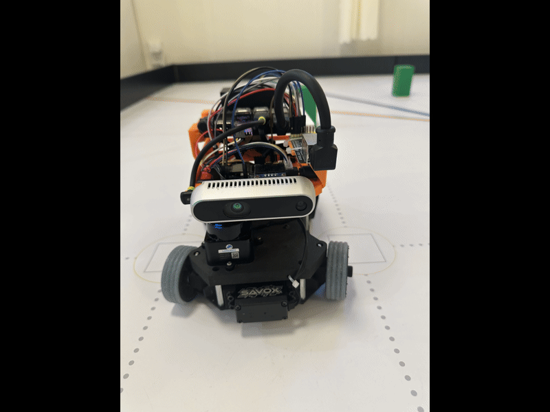
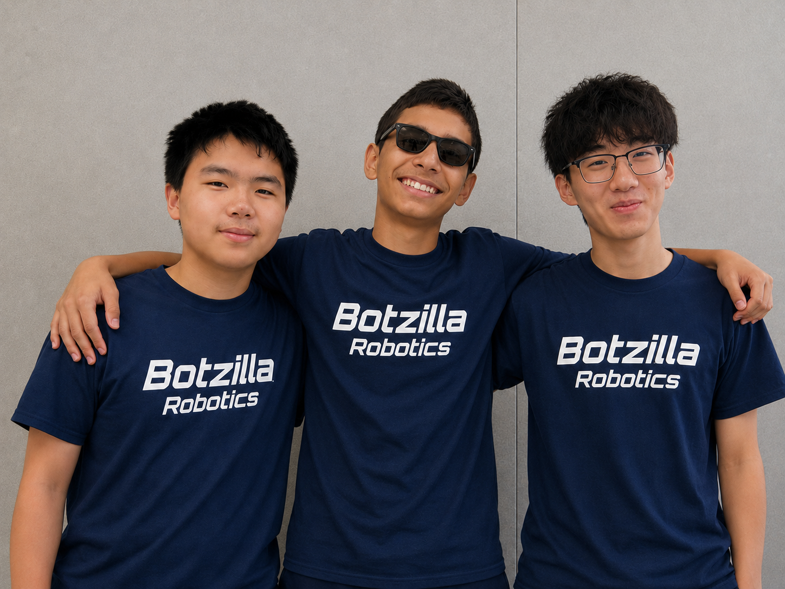
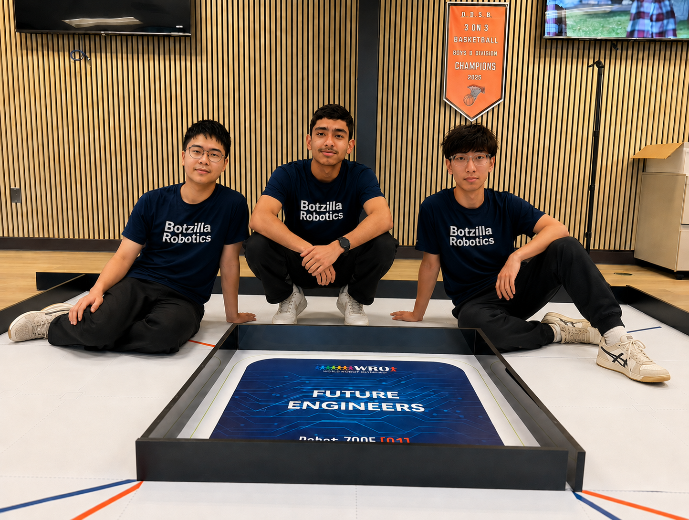

# Team and Project

## Purpose

Introduce the team, robot, objectives, responsibilities, development approach, and scope, with photographs of the final robot and team.

## Summary

Botzilla is a student robotics team entering WRO Future Engineers. The team's robot is named **hiway**, a homophone of *highway* that can also be read as “Hi, way!”—a greeting to the road. It is an autonomous-driving robot. The project began with learning basic robotics hardware, software, and Python, and developed step by step into the design, build, programming, and testing of a competition vehicle.

## Team and robot

- **Team name:** Botzilla. The name comes from *Godzilla*, replacing its opening with *bot* to represent a robotics team.
- **Robot name:** hiway. The name is a homophone of *highway* and means “Hi, way!”, matching the robot's autonomous-driving course task.
- **Project goal:** On the known-map WRO course, enable the vehicle to turn reliably, identify red and green obstacles, and complete obstacle avoidance and parking tasks.

*Figure 1: Multi-angle view of Botzilla's final hiway robot: front, left side, rear, right side, and top.*

## Team members

| Team member | Age | Interests |
|---|---:|---|
| Lucas Zheng | 15 | Coding and photography |
| Yueteng Ma | 16 | Badminton and mathematics |
| Aayu Mattas | 14 | A wide range of sports and introductory robotics learning |

## Responsibilities

| Team member | Primary responsibility |
|---|---|
| Lucas Zheng | Development |
| Aayu Mattas | Testing |
| Yueteng Ma | Communication and documentation |

## Development approach

The team uses an agile development approach, tracking work in a Kanban board and using sprints to plan, implement, test, and review each iteration. Mechanical, electronic, and software work is divided into small executable tasks; test results and discoveries feed into the next design iteration.

## Project scope

The project starts with learning basic robotics hardware, software, and Python. Its scope covers the three-layer 3D-printed chassis, sensor and controller integration, autonomous-driving software, simulation environment, course testing, and project documentation, culminating in the hiway vehicle for WRO Future Engineers.

## Team photographs

| Informal team photograph | Formal team photograph |
|---|---|
|  |  |

*Figure 2: Botzilla team photographs. The left image is an informal team photograph; the right image is a formal group photograph.*
