# Mobility and Mechanical Design

## Purpose

Record how the team progressively made and iterated decisions about the chassis, steering, drive, wheels, body materials, and mechanical performance so that the vehicle suits the known WRO game map, makes stable non-high-speed turns, and avoids obstacles.

## Summary

The final vehicle uses a three-layer, fully 3D-printed chassis. The lower layer contains the front axle (a front SC-1258TG+ servo drives a positive-Ackermann front axle through a servo-linkage assembly), battery bay, and rear axle (one GA25-370 Hall-encoder gearmotor drives a shared rear axle through a `20T:40T` timing-belt reduction). The body is `220 mm` long, `120 mm` wide, and `158 mm` high; the overall width including wheels is approximately `155 mm`, the vehicle mass is `1.45 kg`, and the wheelbase is `138 mm`. Front-wheel diameter is approximately `50 mm`, rear-wheel diameter is `65 mm`, and chassis ground clearance is `7 mm`. The lowest and second layers use PA6-CF to withstand loads from the servo, rear-drive transmission, and repeated assembly; the upper electronics layer uses PLA so boards do not directly contact conductive carbon-fibre-filled material.

## Design inputs, constraints, and decisions

The table gives an overview of each mechanical design problem. The following subsections retain the decision process, calculations, and specific structural consequences.

| Design problem | Final mechanical decision |
|---|---|
| One continuous `90°` turn | Reject parallel steering and reverse-Ackermann reference layouts; use a positive-Ackermann front axle. |
| Passing the narrowest approximately `375 mm` area | Evaluate body length, width, wheelbase, overhangs, and the outer front-corner swept envelope together, rather than theoretical turning radius alone. |
| Mechanical division between front Ackermann steering and rear drive | The front axle steers only and the rear axle drives only, avoiding the need to route drive torque through a steering front axle and keeping the servo-linkage and rear timing-belt transmissions simple. |
| Rules 11.5 and 11.13: electronic differential prohibition and drive-motor-to-axle connection | Use one GA25-370 drive motor and a shared rear axle without a differential; the `20T:40T` timing belt indirectly connects the motor to and drives both rear wheels. |
| The vehicle has no suspension or rear-axle differential; its front wheels are slightly light, and large steering angles occasionally cause slip | Use smoother, `65 mm` 3D-printed rear wheels without an external silicone covering instead of high-friction commercial rear wheels. |
| Exposed cables on the previous-year vehicle could be dragged into and contact obstacles | Treat cable management as a chassis-design input: determine cable length, connector direction, cross-layer openings, and fixed routes from each component's installed position; keep all cables within the body outline and away from the front axle, rear wheels, timing belt, and other moving parts. |
| Competition rule: one switch may start the complete vehicle; after power-on it must wait for one start button, located on the SBC/SBM or installed separately | Abandon two-battery power and use one `12 V` battery for both SBC and SBM. A `12 V → 19 V` boost module for a higher Jetson input voltage was considered, but rejected because it added mass and tests showed the existing program did not need it. The battery sits in the low bay between the axles, giving a stable centre of gravity and providing mounting and routing for the upper SBC, SBM, and other modules. |
| `100 mm` walls, traffic signs, and parking limits | To keep both 2D LiDAR scan planes below `95 mm` and intersect these objects, the LiDAR-carrying chassis had to be lower; chassis ground clearance was therefore reduced from `20 mm` to `7 mm`. |
| Rule 11.2: complete vehicle mass must not exceed `1.5 kg`; one 3D LiDAR is approximately `210 g`, with no remaining mass budget to accommodate it | To obtain more complete `360°` horizontal-scan coverage around the vehicle, use two 2D LiDARs totalling approximately `90 g` and a ROS 2 merge node instead of the 3D LiDAR approach; offset the front and rear units and raise the rear unit by `5 mm`. |
| Rules 11.2, 11.4, 11.18, and 11.19: `1.5 kg` maximum mass, no caster wheels, and unrestricted materials and manufacturing methods | The listed electronics, actuators, and two battery entries total `871.49 g`. This is not a sensors-and-computing-only figure and excludes the chassis, wheels, transmission, wiring, and fasteners, so the chassis still needs to be fully 3D printed for low mass. The lower two load-bearing layers use PA6-CF and the upper layer touching SBC/SBM hardware uses PLA. |
| The previous year's plastic transmission gear between the motor and bearing failed five times and replacement parts eventually became unavailable | Replace this critical motor-to-rear-axle transmission position with metal gear/pulley components instead of relying on a failure-prone plastic gear. |
| Select between steering-servo torque and response speed | SC-1258TG+ has lower rated torque than the early SC-1256TG candidate, but the two units have the same dimensions and mass. The vehicle uses `4.8 V` supply, so it selects SC-1258TG+ at `9.6 kgf·cm / 0.10 s/60°` to provide the Ackermann front axle with sufficient steering force while shortening steering response time. |
| Evaluate required torque for rear-drive motor selection | Using the `1.45 kg` vehicle mass, `65 mm` driven rear wheels, and low-speed acceleration requirement as inputs, calculate rear-axle torque from the `32.5 mm` rear-wheel radius and convert it to gearbox output through the `20T:40T` timing belt; this supports selecting the GA25-370, whose rated torque covers normal low-speed acceleration. |
| Time budget within the three-minute run: approximately `12 m` of basic course length plus `2 m` reserved for turns, avoidance, and curved travel; plan to cover approximately `14 m` in `100 s` | The target mean speed of `0.14 m/s` corresponds to approximately `41.1 rpm` at the rear axle and `82.3 rpm` at the gearbox output; the measured steady speed of `0.319176 m/s` corresponds to approximately `93.8 rpm` at the rear axle and `187.6 rpm` at the gearbox output. Both are below the GA25-370 rated gearbox-output speed of `500 rpm`. |

### 1. Selecting the steering mode for one continuous `90°` turn

The team first ruled out parallel steering. Although the previous-year vehicle was small, it still needed multiple forward-and-reverse adjustments to turn in the parking area. Its front wheels were small, its available steering angle was limited, and it could easily contact the parking limits or walls in the narrow space. This showed that a small body alone does not guarantee a one-pass turn: front-wheel angle and steering geometry are also decisive.

This vehicle therefore needs a larger inner-wheel angle to make a continuous `90°` turn. The team considered Anti-Ackermann / Reverse-Ackermann geometry, but that arrangement addresses tyre slip angle and load transfer in high-speed vehicles. This WRO vehicle instead follows a known map at non-high speed and prioritises stable turns. The final solution is positive Ackermann: the inner front wheel turns farther than the outer front wheel, bringing the two wheels closer to their respective circular paths.

| Previous-year vehicle with parallel steering: front | Previous-year vehicle with parallel steering: side |
|---|---|
| 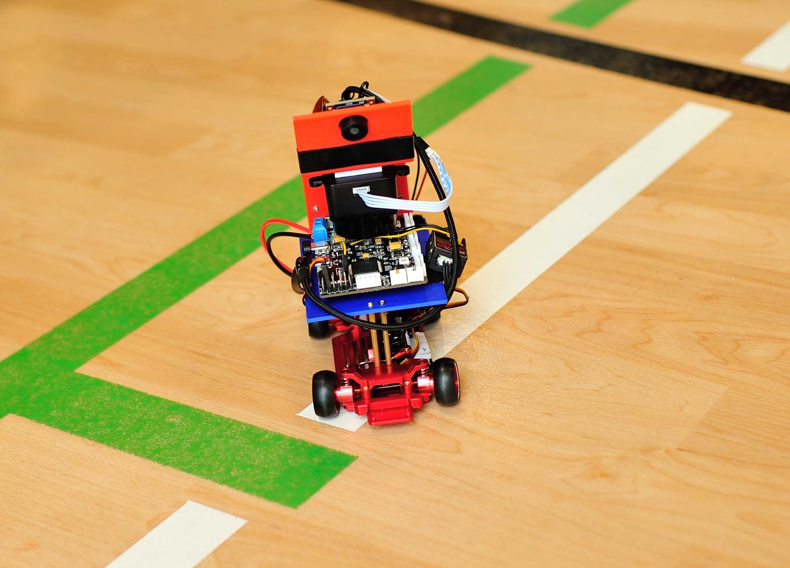 | 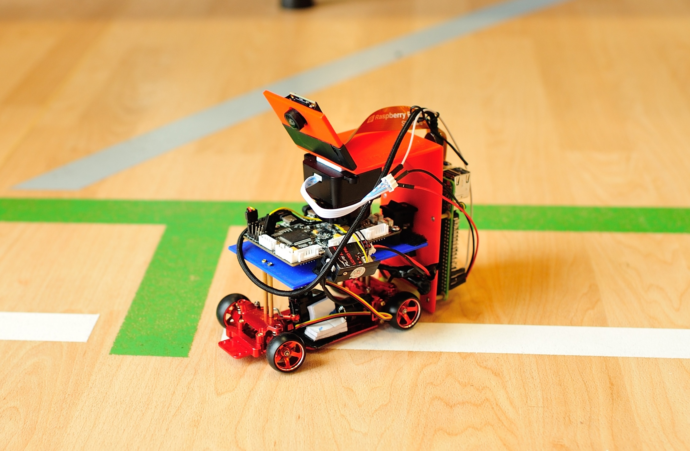 |

*Figure 1: Previous-year vehicle using parallel steering. Although its body was small, its limited front-wheel angle required repeated manoeuvres in the parking area and made boundary contact more likely.*

| Reference vehicle: overview | Reference vehicle: right side | Reference vehicle: front |
|---|---|---|
|  |  | 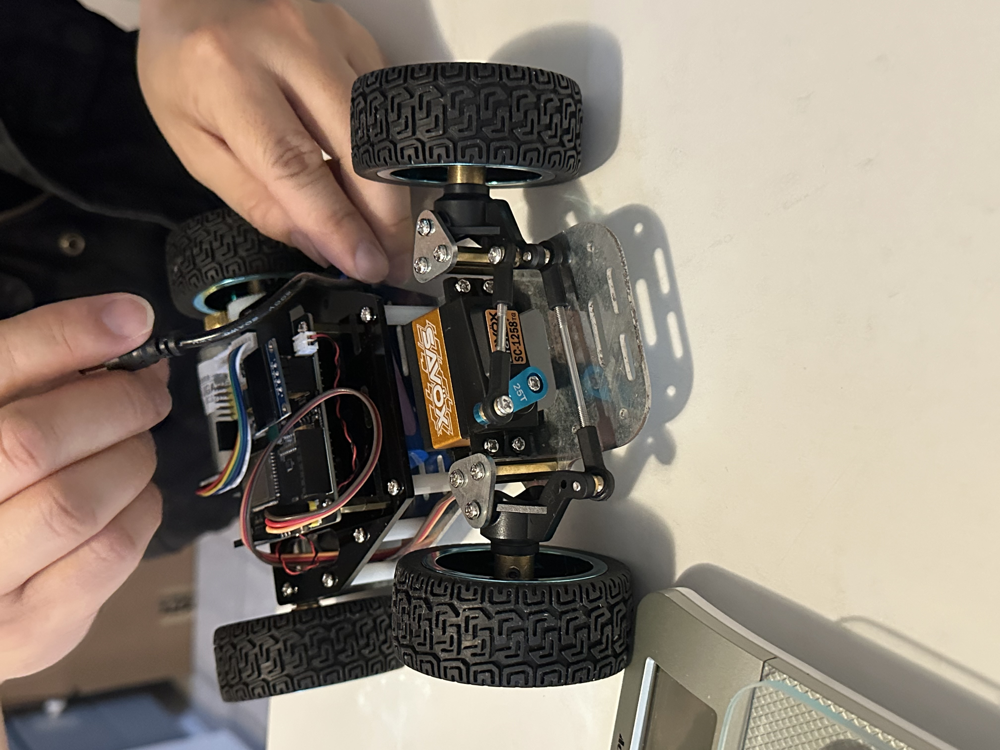 |

| Reference vehicle: steering assembly | Reference vehicle: front servo and battery display | Reference vehicle: motor |
|---|---|---|
|  |  |  |

*Figure 2: Reverse-Ackermann reference vehicle considered by the team. The photographs record its overall, steering, drive, front, and rear arrangement; after comparison, this vehicle uses positive Ackermann rather than directly reusing its steering geometry.*

Positive Ackermann, parallel steering, and Reverse Ackermann differ in the relationship between inner- and outer-front-wheel angles. In positive Ackermann, the inner front wheel turns farther than the outer wheel, so the extended wheel axes more closely meet at the same instantaneous turn centre on the rear-axle line; this suits the vehicle's low-speed, small-radius continuous turns. In parallel steering, both wheels use the same angle. Reverse Ackermann gives the outer front wheel a greater angle than the inner wheel. The latter can be used in vehicles that account for high-speed tyre slip angles and load transfer, but those are not this vehicle's design goals. It would not solve the previous vehicle's limited steering angle and repeated manoeuvres, nor match the team's priority of reducing low-speed tyre scrub and passing a `90°` turn stably.

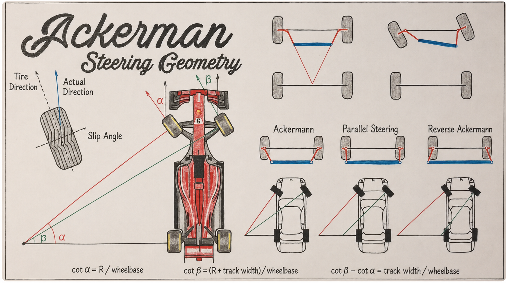

*Figure 3: Steering geometry and instantaneous turn-centre explanation. The extended front-wheel axes in positive Ackermann more closely point to the same turn centre; parallel steering and Reverse Ackermann use different angle relationships.*

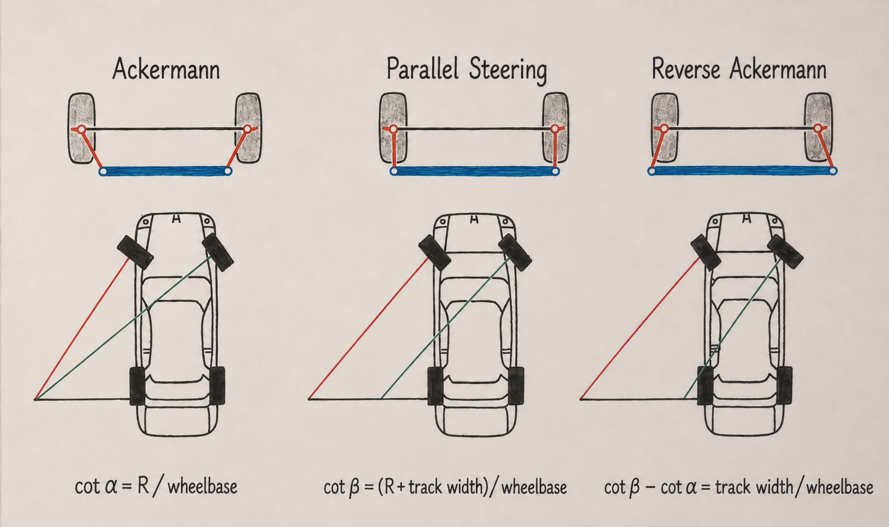

*Figure 4: Comparison of the three steering modes. The team selected positive Ackermann for low-speed, stable, compact `90°` turns.*

| Final V3: front | Final V3: left side |
|---|---|
| 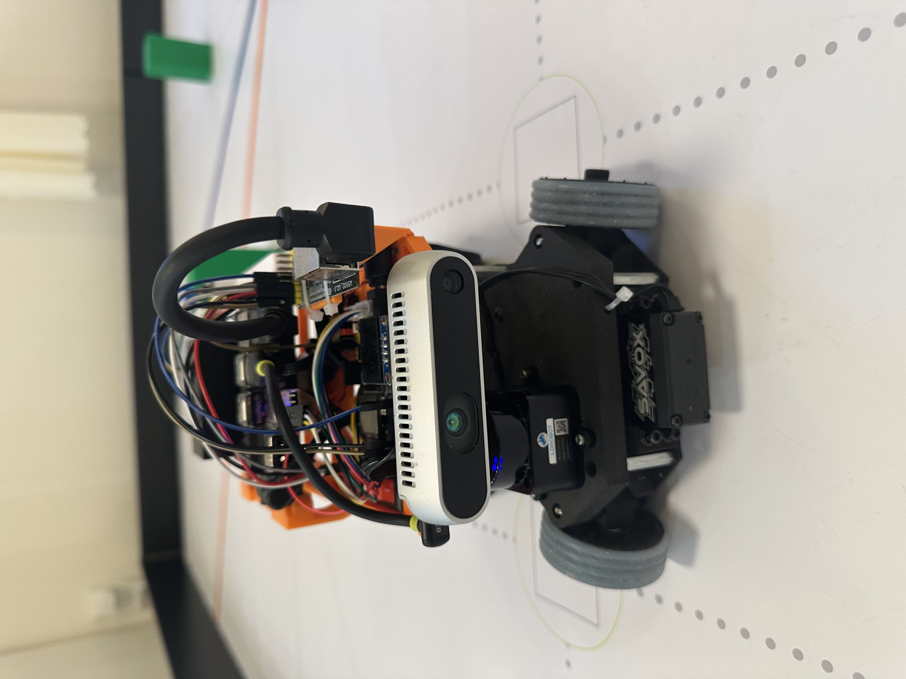 | 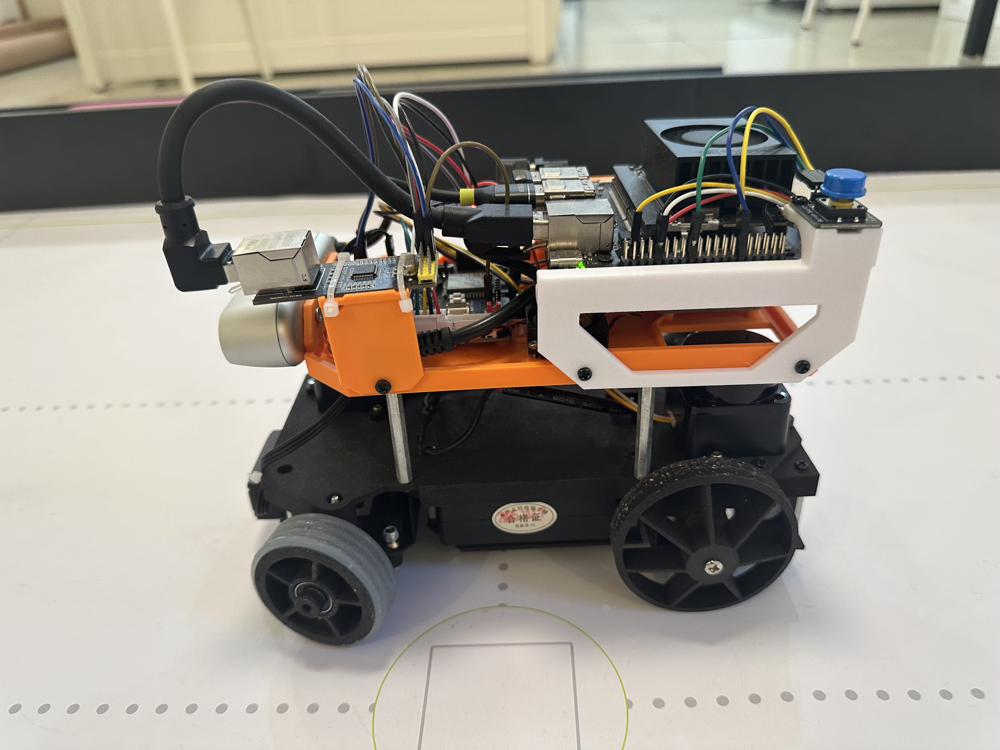 |

| Final V3: right side | Final V3: rear |
|---|---|
| 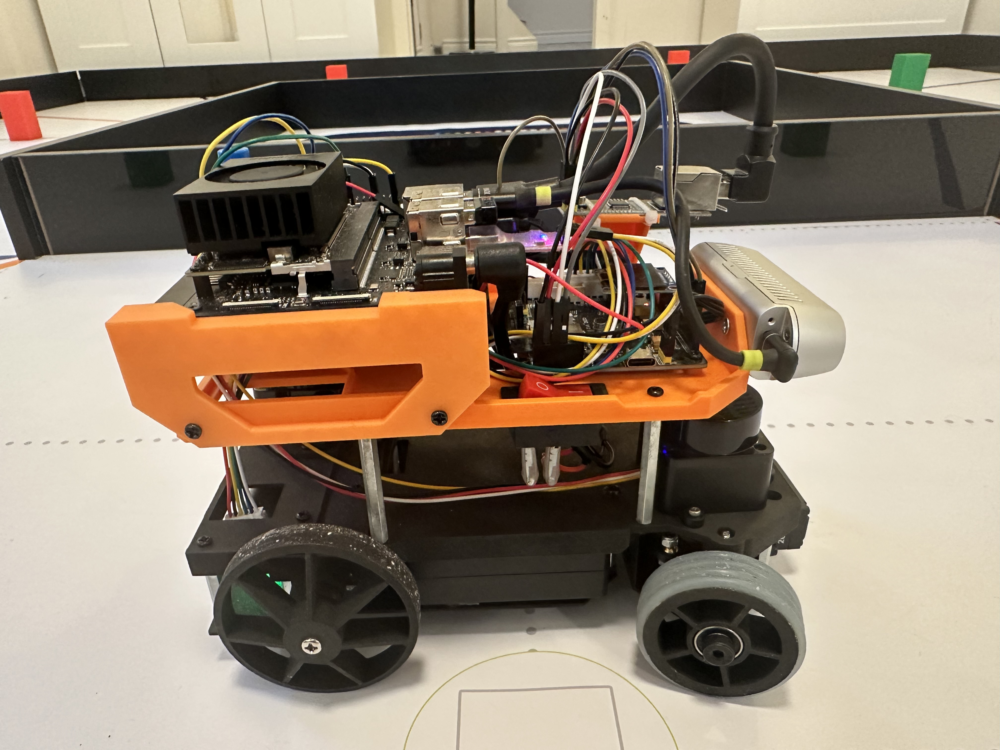 | 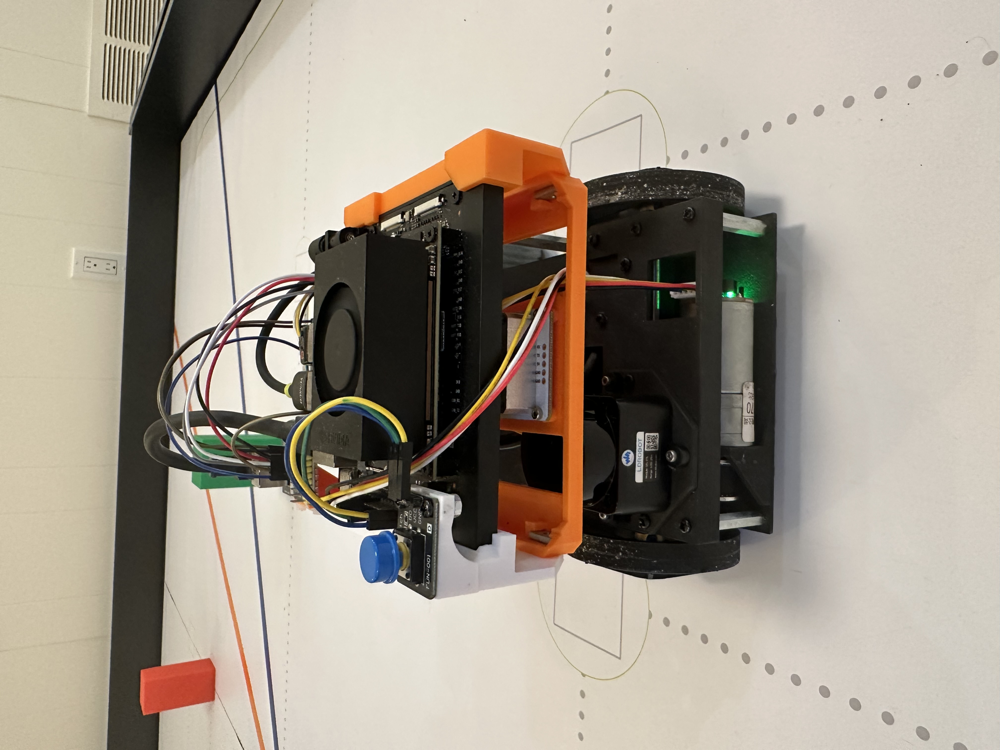 |

*Figure 5: This year's final V3 vehicle, in order: front, left side, right side, and rear.*

### 2. Using the complete swept envelope, not one radius, for the `375 mm` turn space

The team used the approximately `375 mm` narrowest turning area in the `3 m × 3 m` WRO game area as a chassis-geometry constraint. V1 was initially designed at `268 mm` long and `183 mm` wide so that it could turn out of the parking area more comfortably, while remaining within the competition's `300 mm × 200 mm` outer limit. During design, however, the team found that the space occupied in a `90°` turn is determined by the vehicle's complete swept path. V2 then changed the body to `220 mm × 176 mm × 150 mm`; V3 retained the `220 mm` length and narrowed the body further, producing the current `220 mm × 120 mm × 158 mm` body basis.

#### Theoretical rear-axle-centre turning radius

Using the rear-axle centre in the bicycle model:

$$
R = \frac{L}{\tan \delta}
$$

Here, $R$ is rear-axle-centre turning radius, $L$ is wheelbase, and $\delta$ is the equivalent front-wheel steering angle. The expression shows that theoretical radius is directly reduced by a shorter wheelbase or a larger steering angle. For example, at the same maximum angle of $45°$, $\tan 45° = 1$, so $R=L$; changing the wheelbase from `145 mm` to `138 mm` changes the theoretical radius only from `145 mm` to `138 mm`, a reduction of approximately `4.8%`.

The change from `268 mm` to `220 mm` body length should therefore not be simplified as “a much smaller turning radius.” The shorter body enabled a shorter wheelbase and overhangs, while the narrower body directly reduced lateral sweep during a turn.

#### Body-size comparison

| Comparison | V1 | V2 | V3 / current body basis |
|---|---:|---:|---:|
| Body outline | `268 mm × 183 mm` | `220 mm × 176 mm` | `220 mm × 120 mm` |
| Body height | — | `150 mm` | `158 mm` |
| Body diagonal | `324.5 mm` | `281.7 mm` | `250.6 mm` |
| Straight-line width remaining within `375 mm` | `192 mm` | `199 mm` | `255 mm` |

From V1 to V2, body length decreased by `48 mm` and width by `7 mm`. From V2 to V3, the `220 mm` length was retained while width decreased by a further `56 mm`. Therefore, relative to V1, final V3 is `63 mm` narrower and has an approximately `22.8%` smaller geometric body-outline diagonal; when centred, its straight-line each-side margin increases from `96 mm` to `127.5 mm`.

Reducing width from `183 mm` to `120 mm` moves each outer body edge `31.5 mm` closer to the centreline, directly reducing the outer front-corner sweep. Reducing length from `268 mm` to `220 mm` also shortens the overhangs: in a turn, the outer front-corner path reaches farther than the wheel path, so front overhang cannot be ignored.

For rear-axle-centre radius $R$, body width $W$, distance $A$ from rear axle to the foremost body point, and rear overhang $B$, the following expressions record an approximate full-vehicle sweep:

$$
R_{outer} = \sqrt{\left(R+\frac{W}{2}\right)^2+A^2}
$$

$$
R_{inner} = \sqrt{\left(R-\frac{W}{2}\right)^2+B^2}
$$

$$
\text{Swept width}=R_{outer}-R_{inner}
$$

Here $A=L+\text{front overhang}$, not wheelbase alone. The diagonal and straight-line margins compare the two body outlines intuitively; the final `90°` continuous-turn judgment uses a swept path that includes tyres, overhangs, and steering angle.

#### Conclusion: final V3 advantages in the `375 mm` turn space

V2 was the intermediate version moving from V1 toward a compact body; V3 is the final competition version. V3's advantage is not simply a smaller theoretical rear-axle turning radius. Its smaller full-vehicle swept envelope results from both the V1 → V2 reduction in body length and the V2 → V3 substantial reduction in width:

- From V1 to V2, body length decreased from `268 mm` to `220 mm` and wheelbase from `145 mm` to `138 mm`, enabling shorter front and rear overhangs. This reduces the maximum outer front-corner sweep radius and leaves more room for the inner rear wheel to cut in.
- V2 was `176 mm` wide; V3 reduced this further to `120 mm`. Each V3 outer edge therefore moves `28 mm` inward relative to V2 and `31.5 mm` inward relative to V1, directly reducing the outer front-corner sweep toward walls or obstacles.
- Body-outline diagonal decreases from `324.5 mm` to `250.6 mm`, while the straight-line margin relative to `375 mm` width increases from `50.5 mm` to `124.4 mm`. This is not a strict `90°` turn criterion, but it clearly shows that the final body has substantially more space for attitude adjustment.
- The positive-Ackermann front axle gives the inner front wheel a larger angle than the outer wheel. Together with the compact body, it reduces tyre scrub and unnecessary sweep in low-speed continuous turns.

The final V3 design advantage is therefore more geometric margin for the outer front corner, inner rear wheel, and steering error in an approximately `375 mm` narrow turn, making a continuous `90°` turn easier while retaining installation space for the front axle, rear drive, battery, and LiDARs.

### 3. Rules 11.5 and 11.13 determine the rear-drive transmission

Rule 11.5 does not permit an electronic differential with one motor on each side, such as a differential-wheeled robot. Rule 11.13 permits at most two drive motors for forward and reverse motion; every drive motor must connect directly to the axle turning the drive wheels, or indirectly through a gear system, and the two motors need not connect to the drive wheels independently. This vehicle therefore uses no differential: one motor drives a shared rear axle.

The vehicle therefore uses one GA25-370 gearmotor with Hall encoders, a shared rear axle without a differential, and front-wheel steering. The motor's integrated `9.6:1` gearbox drives a `20T` timing pulley; the timing belt drives a `40T` pulley fixed to the shared rear axle, which drives both rear wheels forward or backward. ESP32 counts the Hall-encoder pulses and sends them to Jetson; Jetson calculates `/wheel/odometry` from cumulative pulses, steering position, and timestamps. Communication and odometry computation are documented in Chapter 3.

| Rear-drive installation: top front | Rear-drive installation: top right | Rear-drive installation: rear right |
|---|---|---|
| 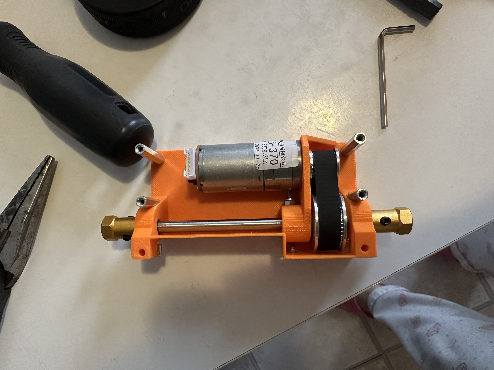 | 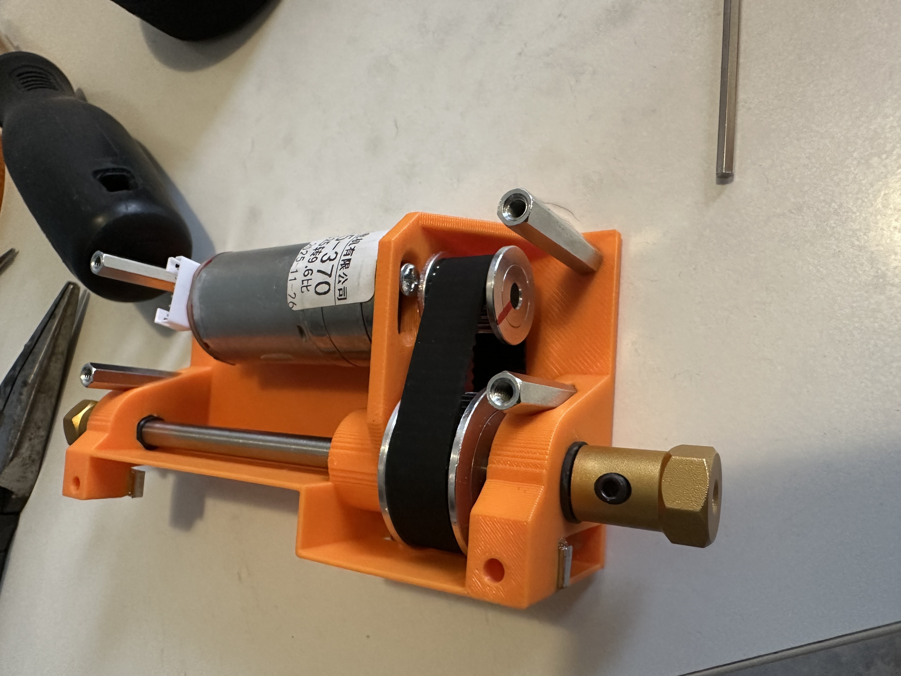 | 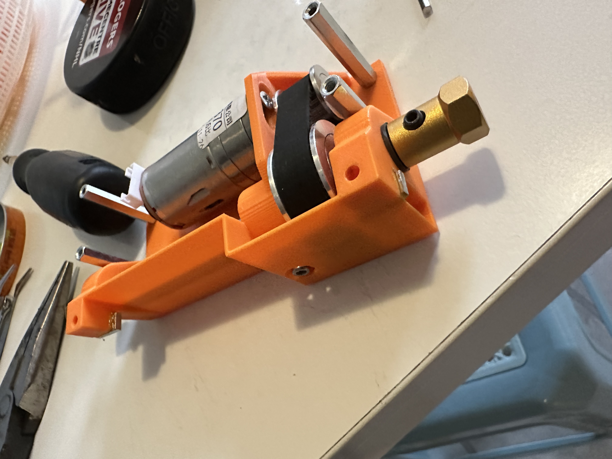 |

*Figure 6: Installed rear-drive motor, timing-belt transmission, and shared rear axle, in order: top front, top right, and rear right views.*

#### Rear-Drive Motor and Hall-Encoder Harness

| Item | Interface route | Cable and physical-test trade-off |
|---|---|---|
| GA25-370 rear-drive motor with built-in Hall encoder | ESP32 12 V motor/encoder interface → motor and Hall-encoder harness → GA25-370. | The included `20 cm` harness was too short for the internal routing path, so the final vehicle uses a `30 cm` harness. Hall-encoder pulses were read correctly in vehicle testing. The supplier warned that excessive harness length could prevent pulse readings, so the originally considered `50 cm` harness was not used. |

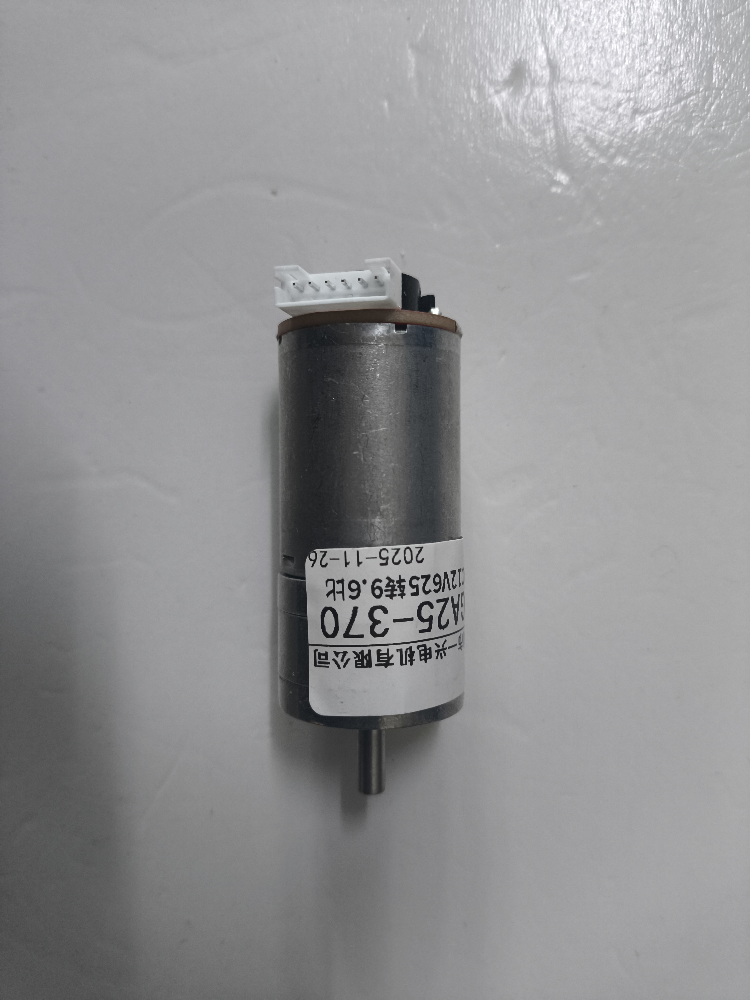

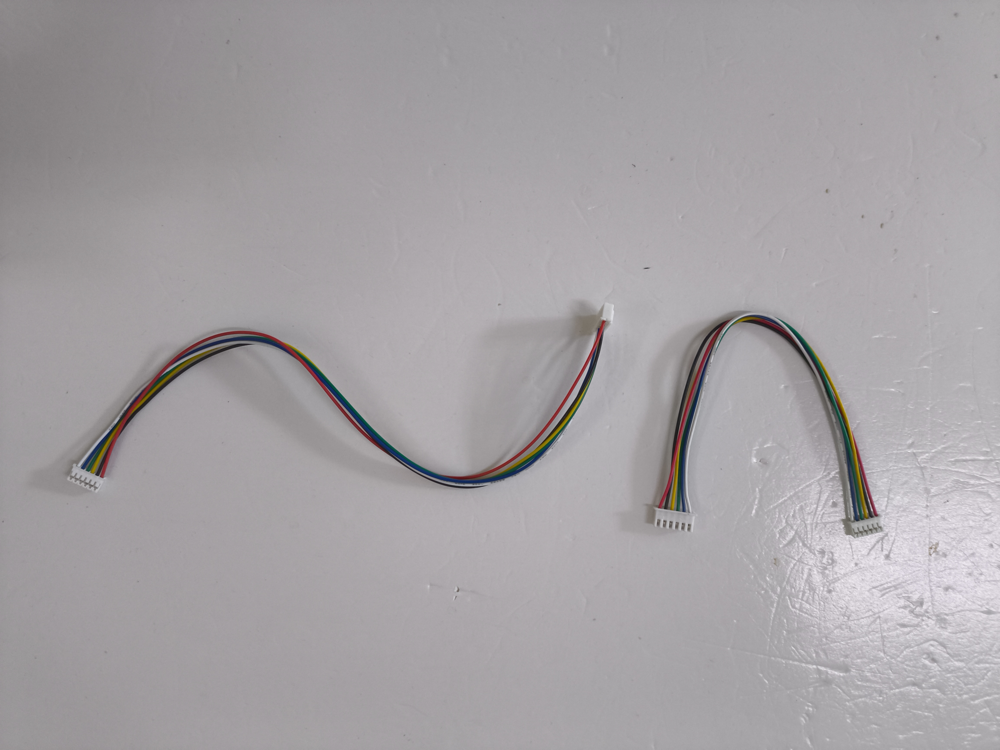

### 4. Tyre-drag trade-off for the shared rear axle without a differential

The vehicle has neither suspension nor a rear-axle differential, and its front end is slightly lighter. At large steering angles, the rear wheels must travel different distances while retaining equal angular speed; the early high-friction rear wheels produced drag and occasional slip. The team compared adding front-wheel ballast with using narrower, smoother rear wheels.

The final choice was the latter: smoother, `65 mm` 3D-printed rear wheels without an external silicone covering. Compared with the silicone-covered, higher-friction front wheels, the rear wheels permit the necessary low-speed slip and reduce shared-axle drag in turns. Tests reduced the effect of slip to a minimum, although a shared rear axle without a differential cannot eliminate it completely.

| Early high-friction treaded wheel | Final `65 mm` 3D-printed smooth rear wheel |
|---|---|
|  | 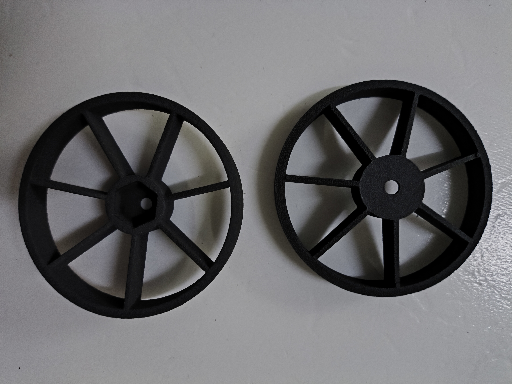 |

*Figure 7: Rear-wheel trade-off. Left: the early high-friction treaded wheel. Right: the final `65 mm` 3D-printed smoother rear wheel without an external silicone covering.*

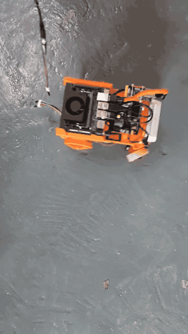

*Figure 8: Circular-driving test after adopting the smooth rear wheels, used to observe whether the shared rear axle without a differential still slips during low-speed turns.*

### 5. Competition start rules determine the single battery and low battery bay

Competition rules permit one switch to start the complete vehicle. After power-on, the vehicle must wait for one start button. The button may be on the main SBC/SBM or installed separately, but only one start button is permitted. There are therefore two opportunities to touch the vehicle in a run: first to power the whole vehicle, then to press the program-start button.

The vehicle uses both an ESP32 (SBM) and a Jetson Orin Nano Super Developer Kit (SBC). The early design used two batteries; to meet the one-switch whole-vehicle start rule, the team abandoned that arrangement and uses one `12 V` battery for both controllers.

| Early V3 dual-battery layout | Final single-battery, flag-terminal, and main-switch layout |
|---|---|
| 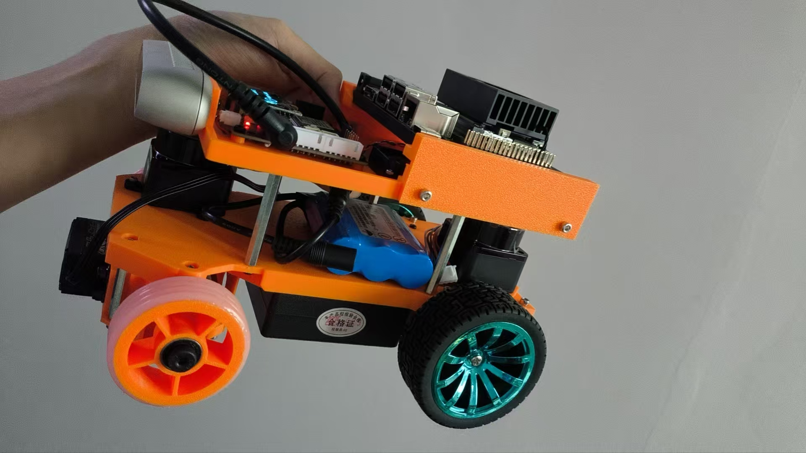 |  |

*Figure 9: Power-architecture iteration. Left: early dual-battery layout. Right: final arrangement in which one `12 V` battery, flag terminals, and one main switch power both controllers.*

Jetson input can be up to `19 V`, so the team considered a `12 V → 19 V` boost module. The module added vehicle mass, and testing showed that the existing program could run without the boost, so it was not adopted.

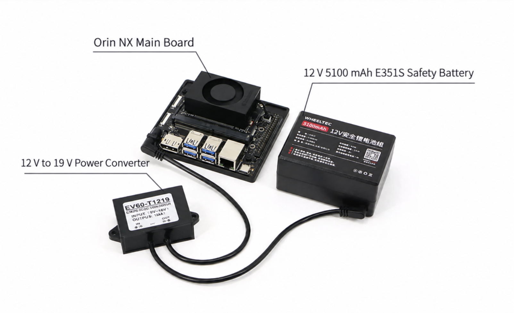

*Figure 10: Evaluated `12 V → 19 V` Jetson boost-module and `12 V` battery arrangement. It was not adopted because it added mass and the existing program ran without the boost.*

The battery bay sits in the lowest layer between the front and rear axles, keeping the battery low and providing a stable centre of gravity. Lower-layer mounting holes also connect the upper SBC, SBM, and other modules. Power distribution, the main switch, and the start button are detailed in Chapter 5.

### 6. `100 mm` course objects determine LiDAR scan height and ground clearance

Inner and outer course walls are `100 mm` high; red and green traffic signs are `50 mm × 50 mm × 100 mm`; parking limits are `200 mm × 20 mm × 100 mm`. The vehicle uses two LDROBOT STL-27L 2D LiDARs. The model and parameters are available from the [purchase page](https://detail.tmall.com/item.htm?id=722272898658) and the [LDROBOT STL-27L specification](https://www.ldrobot.com/technology).

| STL-27L product parameter | Significance for this vehicle |
|---|---|
| `DTOF` (Direct Time of Flight) | The LiDAR emits pulsed laser light and measures the reflected light's round-trip time $\Delta t$, calculating distance in that direction as $r=c\Delta t/2$; ranging does not rely on the coloured texture of course objects. |
| `360°` horizontal scan and `10 Hz` scan rate | Each LiDAR continuously changes its emission direction in one horizontal plane at a fixed height; one full rotation forms one two-dimensional radial distance scan. |
| `21,600 Hz` ranging frequency and typical `0.167°` angular resolution at `10 Hz` | Dense angle–distance samples are acquired in each rotation for the planar outlines of walls, corridor boundaries, and obstacles. |
| Rated `0.03–25 m` ranging range; `±15 mm` mean error at `0.03–2 m` | Covers the short-range walls and signs in the WRO course; actual processing range is set by task needs and software thresholds. |
| Native `UART @ 921600`, typical `5 V` supply, and approximately `45 g` mass | The two LiDARs total approximately `90 g`; this vehicle connects them to Jetson through USB-to-serial links. Physical interfaces are documented in Chapter 3. |
| `60 klux` ambient-light immunity | Helps retain laser-ranging availability in bright indoor conditions. |

DTOF explains **how distance is measured**, while “2D” describes **the spatial plane in which the distance is measured**: the ranging core rotates in a horizontal plane at the fixed vehicle height $h$. At each horizontal angle $\theta$, it emits a laser pulse, measures distance $r$ in that direction, and turns to the next angle; after a full rotation it has a set of $\{\theta,r\}$. This is a two-dimensional distance scan at a fixed height, which downstream nodes can use as a planar representation of walls, corridors, and obstacles. It is not a 3D point cloud that covers the object height.

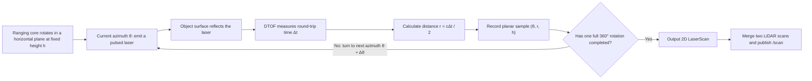
```mermaid
flowchart LR
    A["Ranging core rotates in a horizontal plane at fixed height h"] --> B["Current azimuth θ: emit a pulsed laser"]
    B --> C["Object surface reflects the laser"]
    C --> D["DTOF measures round-trip time Δt"]
    D --> E["Calculate distance r = cΔt / 2"]
    E --> F["Record planar sample (θ, r, h)"]
    F --> G{"Has one full 360° rotation completed?"}
    G -- "No: turn to next azimuth θ + Δθ" --> B
    G -- "Yes" --> H["Output 2D LaserScan"]
    H --> I["Merge two LiDAR scans and publish /scan"]
```

Whether the scan plane intersects an object determines whether that object produces a range return in the 2D scan. Both LiDARs are installed below `95 mm`; their scan planes are approximately `85 mm` high. The plane therefore crosses the `0–100 mm` physical height of the walls, traffic signs, and parking limits and can return their two-dimensional distance outlines. If the scan plane is above `100 mm`, the laser passes over the object and the 2D LiDAR receives no range data from it.

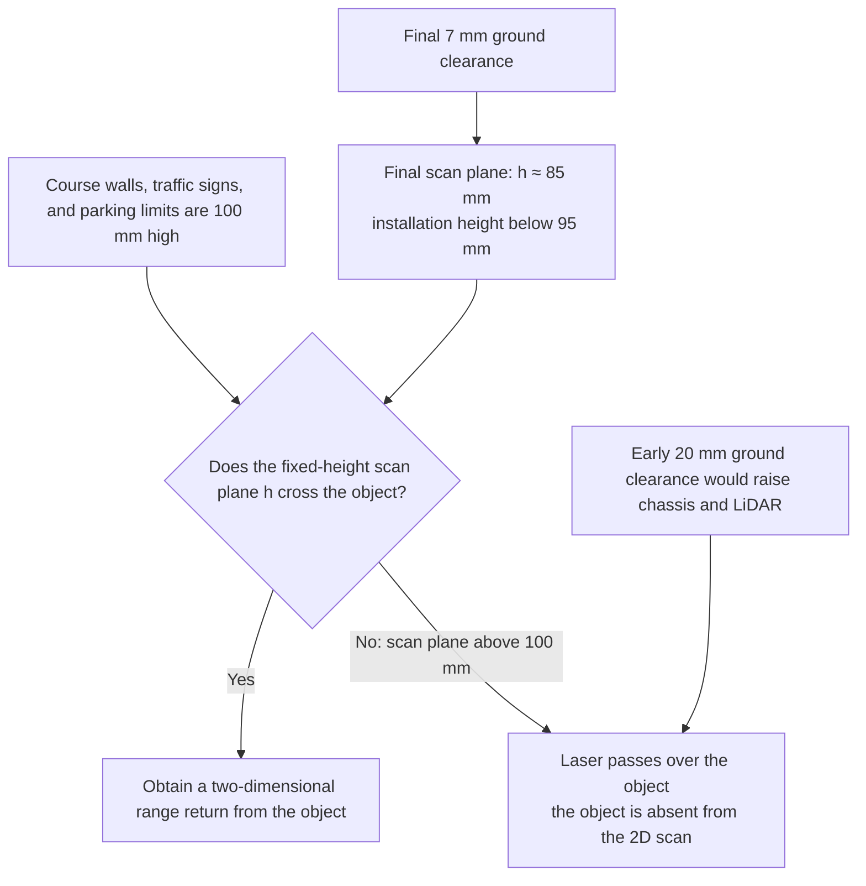
```mermaid
flowchart TB
    A["Course walls, traffic signs, and parking limits are 100 mm high"] --> B{"Does the fixed-height scan plane h cross the object?"}
    C["Final scan plane: h ≈ 85 mm\ninstallation height below 95 mm"] --> B
    B -- "Yes" --> D["Obtain a two-dimensional range return from the object"]
    B -- "No: scan plane above 100 mm" --> E["Laser passes over the object\nthe object is absent from the 2D scan"]
    F["Early 20 mm ground clearance would raise chassis and LiDAR"] --> E
    G["Final 7 mm ground clearance"] --> C
```

Retaining the early `20 mm` chassis clearance would have raised the complete LiDAR-carrying chassis and therefore raised the scan planes too high. To preserve the below-`95 mm`, approximately `85 mm` scan height, chassis ground clearance was reduced from `20 mm` to `7 mm`; this makes chassis contact more likely on uneven ground.

### 7. Mass limit, 3D-point-cloud need, and rear coverage determine the dual-2D-LiDAR layout

Rule 11.2 limits complete vehicle mass to `1.5 kg`. The team originally preferred one 3D LiDAR primarily because it acquires spatial points at multiple vertical angles and therefore produces a 3D point cloud with height information; `360°` horizontal coverage is an additional advantage. Compared with a 2D LiDAR fixed to one horizontal scan plane, a 3D point cloud more conveniently associates the same calibration board or environmental feature with both camera-image coordinates and LiDAR spatial coordinates, enabling camera–LiDAR extrinsic calibration.

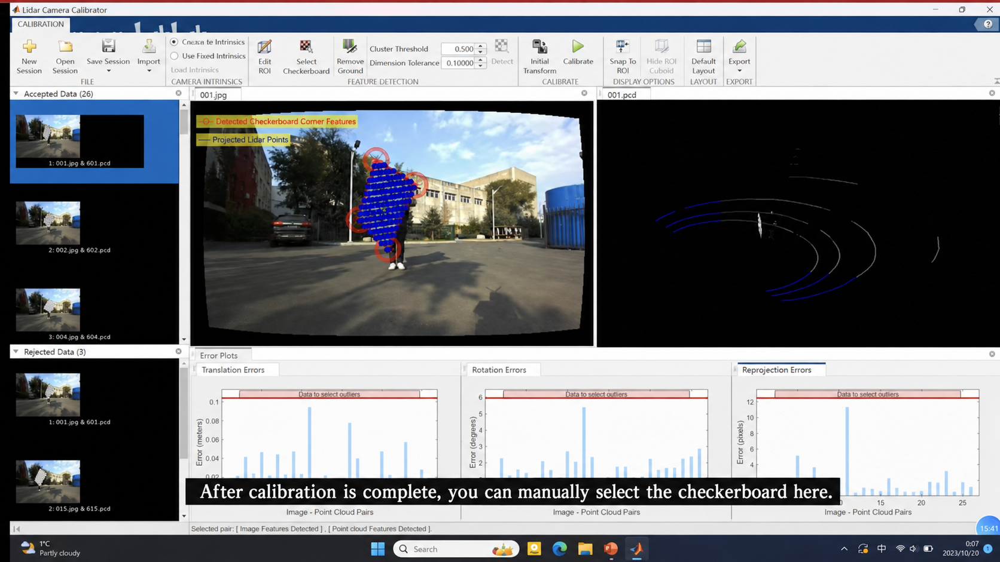

Figure 11: Reference view from a camera–LiDAR calibration tool. Checkerboard corners in the camera image can be associated with 3D LiDAR points; this figure explains the calibration convenience of a 3D point cloud and is not a runtime record of this vehicle completing that calibration.

However, the lightest candidate 3D LiDAR was approximately `210 g`; the complete vehicle with competition battery already weighs `1.45 kg`, leaving no mass budget for that sensor. Two 2D LiDARs total approximately `90 g`, so the final design abandons the 3D-point-cloud approach, uses dual 2D LiDARs, and merges their scans in ROS 2.

The second LiDAR also fills the rear-area perception gap from the previous year's vehicle. To reduce complete overlap between the two scan planes, front and rear LiDARs are offset along the vehicle length rather than placed on the same longitudinal line; the rear LiDAR is raised on a `5 mm` 3D-printed spacer. This arrangement still produces two independent 2D horizontal scans; the merge node combines them into `/scan` for wall, corridor, and obstacle handling. Software interfaces and runtime visualisation are documented in Chapter 3.

### 8. Material, mass, and wheel-type rules determine the lightweight layered chassis

Rules 11.18 and 11.19 permit 3D printing, CNC machining, acrylic, wood, metal, and any other material; they do not restrict a particular construction system. Rule 11.2 limits the complete vehicle to `1.5 kg`, and Rule 11.4 prohibits every type of caster, ball caster, or spherical wheel. The inventory below totals `871.49 g` for its listed electronics, actuators, and batteries. It includes the motor, servo, and two batteries, so it must not be described as “more than `900 g` of sensors and computing hardware”; it also excludes the chassis, wheels, transmission, wiring, and fasteners. The chassis therefore still had to be lightweight while retaining a four-wheel, front-steering and rear-drive layout.

| Listed component | Quantity × unit mass | Subtotal |
|---|---:|---:|
| SC-1258TG+ steering servo | `1 × 64 g` | `64 g` |
| GA25-370 DC motor | `1 × 110 g` | `110 g` |
| D435f depth camera | `1 × 80 g` | `80 g` |
| TM171 IMU | `1 × 19 g` | `19 g` |
| STL-27L 2D LiDAR | `2 × 46.1 g` | `92.2 g` |
| Jetson Orin Nano Super Developer Kit | `1 × 176 g` | `176 g` |
| Jetson-side 12 V battery (inventory entry) | `1 × 184 g` | `184 g` |
| ESP32 development board | `1 × 35 g` | `35 g` |
| `0.96 in` OLED | `1 × 1.29 g` | `1.29 g` |
| ESP32-side 12 V battery (inventory entry) | `1 × 110 g` | `110 g` |
| **Listed-component total** | `64 + 110 + 80 + 19 + (2 × 46.1) + 176 + 184 + 35 + 1.29 + 110` | **`871.49 g`** |

The [component mass budget](../hardware/mechanical/calculations/weight-budget.csv) contains the calculation. The speaker is treated as negligible as specified by the team. W5500, CP2102, chassis, wheels, timing belt, wiring, fasteners, and printed parts are not yet included, so this is not the final measured vehicle mass.

The team considered a metal chassis for its stiffness, but rejected it to control total mass and adopted a fully 3D-printed chassis. PLA structural parts used for a long time in the previous year softened and bent, so the lowest and second layers use nylon PA6-CF. It provides higher stiffness for the front axle, rear axle, and battery bay, but carbon-fibre-filled material is conductive. The upper layer that directly contacts the SBC, SBM, and other electronics remains PLA to retain electrical insulation.

### 9. Previous plastic transmission-gear failures determine metal components at the critical drive position

In the previous year, the plastic transmission gear between motor and bearing failed five times, and replacement parts eventually could no longer be purchased. This failure history showed that the position could not continue to rely on a plastic gear. The critical motor-to-rear-axle transmission position therefore uses metal gear/pulley components this year to improve durability under repeated running.

### 10. Mechanical division between front Ackermann steering and rear drive

“Front Ackermann” here means the **steering geometry** of the front wheels; it does not mean front-wheel drive. The team selected front positive-Ackermann steering and rear drive rather than requiring the front wheels to steer and drive simultaneously.

With front-wheel drive, motor torque would have to pass through the front axle while the front wheels still turn left and right. In addition to the servo, 3D-printed teardrop-shaped servo horn, drag link, tie rod, steering arms, and steering knuckles, the front axle would need added structures that continue transmitting torque during steering, such as drive half-shafts with universal or constant-velocity joints, steerable driven hubs, or an equivalent drivetrain. That would consume limited front-axle space, add mass, alignment requirements, and mechanical failure points, and complicate clearance between the steering linkage and driveline.

The final layout separates these tasks: the front axle converts servo output into the unequal positive-Ackermann angles of the inner and outer front wheels; the rear axle receives GA25-370 drive torque through the `20T:40T` timing belt and drives both rear wheels through the shared rear axle. The front axle therefore carries no drive transmission and the rear drivetrain does not pass through steering joints, making the structure more suitable for this vehicle's low-speed, compact, stable-turning target.

### 11. Steering-servo torque and response-speed selection

The front-axle servo does not drive the vehicle forward. It uses the 3D-printed teardrop-shaped servo horn, ball-joint drag link, tie rod, and left/right steering arms to overcome front-wheel steering resistance. Servo selection therefore compares both output torque and steering response time.

#### Steering-Servo Interface and Harness

| Item | Interface route | Cable and final connection |
|---|---|---|
| SC-1258TG+ steering servo | ESP32 5 V servo header → three-wire servo harness → SC-1258TG+. | `20 cm`; final configuration. Yellow is control, red is 5 V, and brown is GND. |

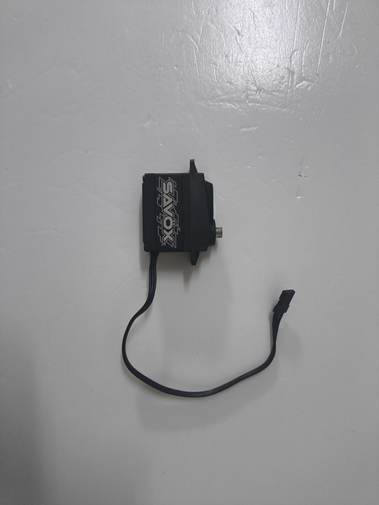

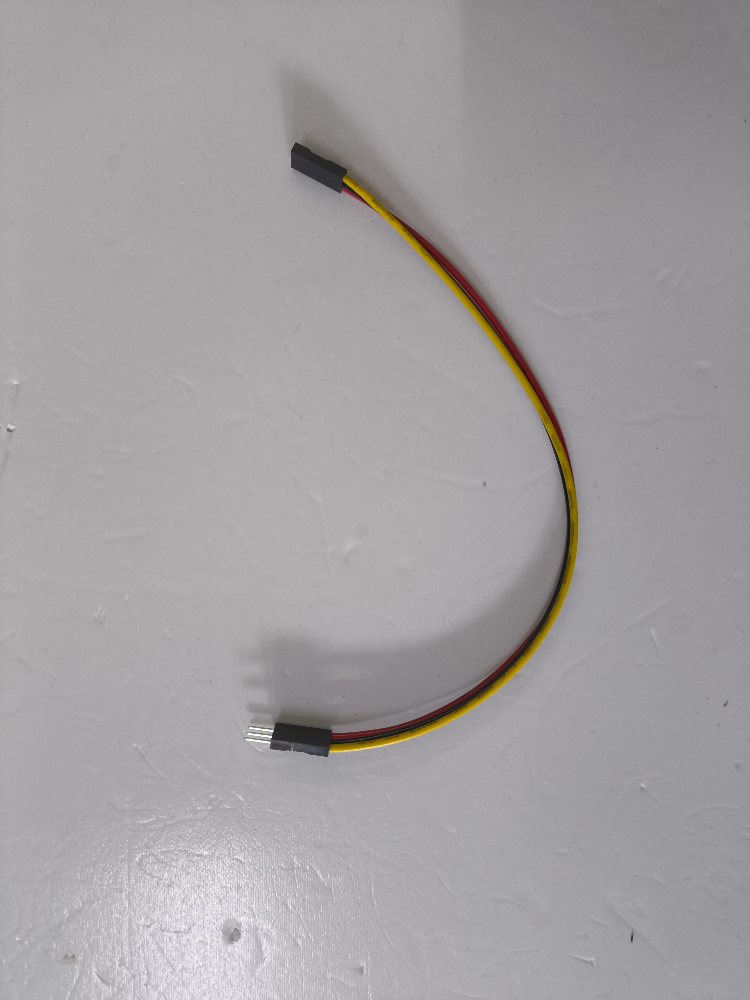

In the product specifications, both candidates have dimensions of `40.3 mm × 20.2 mm × 37.2 mm`, mass `52.4 g`, titanium-alloy/aluminium gears, two bearings, and an aluminium case. Their principal difference is torque versus response speed:

| Servo | `4.8 V` torque / speed | `6.0 V` torque / speed | Selection meaning |
|---|---|---|---|
| SC-1256TG | `16.0 kgf·cm` / `0.18 s/60°` | `20.0 kgf·cm` / `0.15 s/60°` | Early AI-recommended high-torque candidate. |
| SC-1258TG+ | `9.6 kgf·cm` / `0.10 s/60°` | `12.0 kgf·cm` / `0.08 s/60°` | Final choice. The vehicle uses `4.8 V`; it takes `0.08 s` less per `60°` than SC-1256TG, a nominal response-time reduction of approximately `44.4%`. |

At the `4.8 V` specification used by this vehicle, SC-1258TG+ has `40%` less torque than SC-1256TG, but its `60°` travel time decreases from `0.18 s` to `0.10 s`. This vehicle follows a known map at low speed and needs to establish front-wheel angle promptly while turning and avoiding obstacles. At the measured straight-line steady speed of `0.319176 m/s`, the nominal `0.08 s` response-time difference corresponds to approximately `25.5 mm` less forward travel; at the planned mean speed of `0.14 m/s`, it corresponds to approximately `11.2 mm`. This is the direct advantage of the faster servo. Actual front-wheel steering time also depends on horn and linkage geometry, load, and supply voltage, so it cannot be equated directly with the servo's `60°` specification time.

#### From servo torque to steering-link force

Servo output torque first acts at the ball-joint connection of the 3D-printed teardrop-shaped servo horn. If the effective distance from that connection to the servo output axis is $r_h$, the drag-link push/pull force is:

$$
F_{\text{drag link}}=\frac{\tau_{\text{servo}}}{r_h}
$$

The SC-1258TG+ specified torques convert to:

$$
\tau_{\text{1258,4.8 V}}=9.6\ \text{kgf·cm}=0.941\ \text{N\,m}
$$

$$
\tau_{\text{1258,6 V}}=12.0\ \text{kgf·cm}=1.177\ \text{N\,m}
$$

The table converts those torques to push/pull force at several horn radii. It shows the relationship between lever arm and available force; it does not assume that any listed radius is the final CAD dimension.

| Effective servo-horn radius $r_h$ | `4.8 V` specified push/pull force | `6 V` specified push/pull force |
|---:|---:|---:|
| `10 mm` | `94.1 N` (approximately `9.6 kgf`) | `117.7 N` (approximately `12.0 kgf`) |
| `15 mm` | `62.7 N` (approximately `6.4 kgf`) | `78.5 N` (approximately `8.0 kgf`) |
| `20 mm` | `47.1 N` (approximately `4.8 kgf`) | `58.9 N` (approximately `6.0 kgf`) |

The drag link then acts through the steering arm on the steering knuckle. Let $r_s$ be the effective steering-arm lever, $\cos\phi$ the effective force-transmission factor for the drag-link/steering-arm angle, and $\eta_{link}$ the linkage efficiency. The steering moment available at one knuckle is:

$$
\tau_{\text{knuckle,available}}
=\tau_{\text{servo}}
\times\frac{r_s}{r_h}
\times\cos\phi
\times\eta_{link}
$$

The front wheel's steering-resistance moment depends on that wheel's normal load $N_{front}$, tyre-to-mat static-friction coefficient $\mu_s$, and scrub radius $r_{scrub}$:

$$
\tau_{\text{knuckle,required}}
=\mu_sN_{front}r_{scrub}
$$

To create a conservative upper bound independent of unmeasured front-axle load distribution, the calculation can treat the entire vehicle weight as acting on the front wheel and use the `25 mm` front-wheel radius as an upper bound for scrub radius. With $\mu_s=1$:

$$
\tau_{\text{knuckle,required}}
\le1\times(1.45\times9.81)\times0.025
\approx0.356\ \text{N\,m}
=3.63\ \text{kgf·cm}
$$

Even using the lower `4.8 V` specification, the SC-1258TG+ output of `9.6 kgf·cm` exceeds this conservative single-front-wheel steering-resistance bound. When it is transmitted to the steering knuckle, the mechanism remains above that bound provided its effective transmission ratio $\frac{r_s}{r_h}\cos\phi\eta_{link}$ is at least $3.63/9.6\approx0.378$; at the `6 V` specification the threshold is $3.63/12.0\approx0.303$. The final CAD horn-hole position, steering-arm hole position, and drag-link angle are used to check this transmission ratio.

SC-1258TG+ was therefore not selected merely because it is faster than SC-1256TG: its specified torque, transferred through the horn and steering arm, covers the conservative front-wheel steering-resistance boundary, while its shorter nominal response time better suits the vehicle's low-speed, compact continuous turns.

### 12. Required rear-drive torque and GA25-370 selection

Rear-drive selection starts from the tangential traction force required at the tyre, not directly from a motor's advertised “jin of force”. Wheel-axle torque is:

$$
\tau_{\text{wheel}}=F_{\text{traction}}\times r_{\text{wheel}}
$$

GA25-370 drives the rear wheels, so motor-torque calculation uses only the rear-wheel radius:

$$
D_r=65\ \text{mm},\quad r_r=32.5\ \text{mm}=0.0325\ \text{m}
$$

Traction force includes at least rolling resistance, acceleration force, and turning losses:

$$
F_{\text{traction}}=F_{\text{rolling}}+F_{\text{acceleration}}+F_{\text{turning losses}}
$$

Motor torque cannot necessarily be converted entirely into forward traction. The maximum tangential force that the rear drive wheels can transmit without slip is bounded by static friction:

$$
F_{\text{static,max}}=\mu_s N_{\text{rear}}
$$

Here $\mu_s$ is the static-friction coefficient between the rear tyres and the course, and $N_{\text{rear}}$ is the normal force carried by the two driven rear wheels; it is not simply the complete vehicle weight $mg$. The corresponding maximum rear-axle torque without slip is:

$$
\tau_{\text{rear axle, static,max}}
=\mu_s N_{\text{rear}}r_{\text{rear}}
$$

Usable forward traction is therefore:

$$
F_{\text{usable}}=\min\left(\frac{\tau_{\text{rear axle}}}{r_{\text{rear}}},\ \mu_s N_{\text{rear}}\right)
$$

If the wheel force commanded through the drivetrain, $\tau_{\text{rear axle}}/r_{\text{rear}}$, exceeds $\mu_sN_{\text{rear}}$, the rear tyres exceed static friction and slide relative to the mat, appearing as wheel spin or acceleration slip; additional motor torque no longer increases vehicle acceleration proportionally. The smoother rear wheels on this vehicle reduce shared-axle drag in turns without a differential, so straight-line acceleration must still be kept within the static-friction limit through the motor command and rear-axle load. The current record contains no separate measurement of rear-tyre-to-WRO-mat static friction or dynamic rear-axle load; the torque values below are therefore motor-and-drivetrain-capability calculations, not a measured tyre-traction limit.

Turns also introduce Ackermann-geometry error, non-differential rear-wheel scrub, tyre/course friction, bearing and timing-belt resistance, battery-voltage drop, and motor-efficiency loss. A first conservative magnitude estimate therefore uses a smooth course, `m=1.45 kg`, and rolling-resistance coefficient `C_{rr}=0.05`:

$$
F_{\text{rolling}}=C_{rr}mg=0.05\times1.45\times9.81\approx0.71\ \text{N}
$$

For low-speed straight rolling alone, required rear-axle torque is:

$$
\tau_{\text{rolling}}=0.71\times0.0325\approx0.023\ \text{N\,m}
\approx0.24\ \text{kgf\,cm}
$$

The `0.14 m/s` in Section 13 is the planned **mean run speed** derived from `14 m / 100 s`; it is not a starting acceleration. To estimate transient traction force when starting from rest, this calculation uses the team's original acceleration case of `a=0.5 m/s²`. If acceleration stops after reaching `0.14 m/s`, the time to reach that speed is:

$$
t=\frac{v}{a}=\frac{0.14}{0.5}=0.28\ \text{s}
$$

Starting torque at `a=0.5 m/s²` is:

$$
F_{\text{acceleration}}=ma=1.45\times0.5=0.725\ \text{N}
$$

$$
\tau_{\text{normal acceleration}}=(0.71+0.725)\times0.0325
\approx0.0466\ \text{N\,m}
\approx0.48\ \text{kgf\,cm}
$$

For comparison, the `a=1.0 m/s²` case represents a brief faster-start condition:

$$
\tau_{\text{faster acceleration}}=(0.71+1.45)\times0.0325
\approx0.070\ \text{N\,m}
\approx0.71\ \text{kgf\,cm}
$$

These values show that constant-speed rolling needs little torque, but a motor must not be selected from the constant-speed value alone: acceleration, turning, and transmission losses require margin.

#### Selected motor and timing-belt torque capability

The selected `12 V` GA25-370 uses an internal `9.6:1` gearbox. Its parameters are below; rated values are for normal continuous use, while maximum-load values are not a continuous operating target.

| Parameter | Value |
|---|---:|
| No-load current | `0.05 A` |
| Rated gearbox-output speed | `500 rpm` |
| Maximum no-load gearbox-output speed | `625 rpm` |
| Rated gearbox-output torque | `0.3 kgf·cm` = `0.0294 N·m` |
| Rated current / rated output power | `0.35 A` / `3 W` |
| Maximum-load gearbox-output torque | `1.2 kgf·cm` = `0.1177 N·m` |
| Maximum-load current / power | `1.5 A` / `6 W` |

The `20T:40T` timing belt halves rear-axle speed. With timing-belt efficiency $\eta=0.90$, rear-axle torque is:

$$
\tau_{\text{rear axle}}=\tau_{\text{gearbox output}}\times\frac{40}{20}\times\eta
$$

Rated rear-axle torque is therefore:

$$
0.3\times2\times0.90=0.54\ \text{kgf\,cm}
=0.0529\ \text{N\,m}
$$

Maximum-load rear-axle torque is:

$$
1.2\times2\times0.90=2.16\ \text{kgf\,cm}
=0.2118\ \text{N\,m}
$$

Compared with the design cases above, start acceleration at `a=0.5 m/s²` requires approximately `0.48 kgf·cm`, below the `0.54 kgf·cm` rated rear-axle torque. After reaching `0.14 m/s`, the vehicle enters the mean-speed, turning, obstacle-avoidance, and parking phases described in Section 13. Acceleration at `a=1.0 m/s²` requires approximately `0.71 kgf·cm`, above the rated value but below the maximum-load value, so it is not treated as a continuous operating target.

#### `0 → 150` straight-line test and torque calculation

To relate the torque estimate to vehicle motion, the team performed five straight-line tests on a flat WRO mat using the `4500 mAh` competition battery. The team also uses a smaller `2500 mAh` battery as a replacement in day-to-day work, but the five results here use the `4500 mAh` competition battery. Each test began with the vehicle at rest and steering command `0`; the motor-control command changed directly from `0` to `150`. `/wheel/odometry` recorded timestamps, linear speed, and path distance. Acceleration is the `10%–90%` rise of each run's steady speed, and the vehicle was stopped after its measured path reached at least `1 m`. Here, `150` is an ESP32 motor-control command, not an rpm, speed, or torque unit.

| Run | Delay before vehicle motion (s) | `10%–90%` acceleration (m/s²) | Steady speed (m/s) | Command-to-`1 m` time (s) |
|---:|---:|---:|---:|---:|
| 1 | `0.098` | `0.507` | `0.319` | `3.395` |
| 2 | `0.094` | `0.533` | `0.319` | `3.390` |
| 3 | `0.087` | `0.643` | `0.319` | `3.392` |
| 4 | `0.081` | `0.479` | `0.319` | `3.404` |
| 5 | `1.362` | `0.565` | `0.319` | `4.697` |

The five-run mean `10%–90%` acceleration is `0.545253 m/s²`, with sample standard deviation `0.063005 m/s²`; mean steady speed is `0.319176 m/s`. Run 5 had a longer delay before motion, but its acceleration and steady speed remained close to the other runs. The complete calculation parameters are in [torque-speed-calculations.csv](../hardware/mechanical/calculations/torque-speed-calculations.csv).

This test calculation uses $C_{rr}=0.03$ and rear-wheel radius `0.0325 m`:

$$
F_{\text{acc}}=ma=1.45\times0.545253=0.7906\ \text{N}
$$

$$
F_{\text{roll}}=C_{rr}mg=0.03\times1.45\times9.81=0.427\ \text{N}
$$

$$
T_{\text{rear axle, required}}=(F_{\text{acc}}+F_{\text{roll}})r
=1.2174\times0.0325=0.0396\ \text{N\,m}
$$

Converted to gearbox output:

$$
T_{\text{gearbox, required}}
=\frac{0.0396}{2\times0.90}=0.0220\ \text{N\,m}
$$

This is below the rated gearbox-output torque of `0.0294 N·m`, giving rated torque margin:

$$
\frac{0.0294}{0.0220}=1.34
$$

Therefore, these five tests correspond to rear-axle requirement `0.0396 N·m` (approximately `0.404 kgf·cm`), while theoretical rated rear-axle torque is `0.0529 N·m`. This is a straight-line vehicle-test dataset in addition to the Section 12 design cases; it does not substitute for loads during turns, obstacle avoidance, or parking.

#### How torque sets the selectable launch acceleration

At launch, the motor and transmission first convert rear-axle torque into rear-wheel traction force. Only the traction remaining after rolling resistance becomes vehicle acceleration:

$$
F_{\text{drive}}=\frac{\tau_{\text{rear axle}}}{r_{\text{rear}}}
$$

$$
a=\frac{F_{\text{usable}}-F_{\text{roll}}-F_{\text{turn}}}{m}
$$

Here $F_{\text{usable}}$ cannot exceed the tyre static-friction limit $\mu_sN_{\text{rear}}$; during straight launch $F_{\text{turn}}=0$. More torque therefore does not necessarily produce more acceleration: once $F_{\text{drive}}$ exceeds the static-friction limit, the rear wheels slip; during a turn, the shared rear axle also has additional drag.

Using rated gearbox-output torque `0.0294 N·m`, the `2:1` external reduction, and transmission efficiency `0.90`, the rated rear-axle torque is `0.0529 N·m`. Its theoretical wheel traction is:

$$
F_{\text{drive,rated}}=\frac{0.0529}{0.0325}\approx1.63\ \text{N}
$$

For a flat straight run with rolling resistance `0.427 N` from $C_{rr}=0.03$, and provided the tyres have enough static friction to transmit this force, the rated-torque theoretical launch-acceleration limit is:

$$
a_{\text{rated,straight}}=\frac{1.63-0.427}{1.45}\approx0.83\ \text{m/s}^2
$$

Therefore, `0.83 m/s²` is only the theoretical rated-torque boundary for a flat straight run; the usable acceleration changes during turns, obstacle avoidance, or changes in tyre traction. The design case uses `0.5 m/s²`, and the five straight-line tests average `0.545253 m/s²`, both below this flat-straight rated-torque boundary.

### 13. Run-time budget and rear-drive target speed

The three-minute run provides `180 s` in total. The team allocated `40 s` to parking and reserved a further `40 s` for unexpected events along the route, leaving `100 s` for obstacle driving. The four sides of the `3 m × 3 m` course total `12 m`; an additional `2 m` was added to cover turns, obstacle avoidance, and extra path length, giving a planned distance of approximately `14 m`. The required mean driving speed is therefore:

$$
v_{target}=\frac{14\ \text{m}}{100\ \text{s}}
=0.14\ \text{m/s}
=140\ \text{mm/s}
$$

This is not `14 mm/s`. It is first converted into the required wheel and transmission speed, not directly into a PWM command. For a `65 mm` rear wheel:

$$
C=\pi D=\pi\times0.065=0.2042\ \text{m}
$$

$$
n_{\text{rear axle}}=\frac{v_{target}\times60}{C}
=\frac{0.14\times60}{0.2042}
\approx41.1\ \text{rpm}
$$

The `20T:40T` timing belt makes rear-axle speed one half of gearbox-output speed, so:

$$
n_{\text{gearbox output}}=41.1\times\frac{40}{20}
\approx82.3\ \text{rpm}
$$

GA25-370 has an internal `9.6:1` reduction. This operating point corresponds to motor-rotor speed of approximately `82.3×9.6=790 rpm`, while the maximum no-load gearbox-output speed is `625 rpm`; the target requires `82.3 rpm`, approximately `13.2%` of that output limit. The `9.6:1` internal gearbox and `20T:40T` external reduction therefore have sufficient speed margin.

The same conversion applies to the measured steady speed. The five straight-line tests gave a mean steady speed of $v_{test}=0.319176\ \text{m/s}$:

$$
n_{\text{rear axle,test}}=\frac{0.319176\times60}{0.2042}
\approx93.8\ \text{rpm}
$$

$$
n_{\text{gearbox output,test}}=93.8\times\frac{40}{20}
\approx187.6\ \text{rpm}
$$

`187.6 rpm` is approximately `37.5%` of the motor's `500 rpm` rated gearbox-output speed and remains below the `625 rpm` maximum no-load output speed. The measured straight-line steady speed and the planned mean speed are therefore both within the selected motor's output-speed range.

Acceleration does not correspond to one fixed rpm; it corresponds to the rate at which rpm changes. At any instant, $n_{\text{rear axle}}=v\times60/C$, therefore:

$$
\frac{dn_{\text{rear axle}}}{dt}=\frac{a\times60}{C}
$$

Using the five-test mean acceleration $a=0.545253\ \text{m/s}^2$ and $C=0.2042\ \text{m}$ gives a rear-axle speed-rise rate of approximately `160.2 rpm/s`; after the `20T:40T` timing belt, the gearbox-output speed-rise rate is approximately `320.4 rpm/s`. For example, accelerating approximately from rest to `0.319176 m/s` takes $0.319176/0.545253\approx0.59\ \text{s}$. Thus, the acceleration calculation describes how rotational speed is established during launch, while the steady-speed calculation checks the rpm needed for sustained travel.

The firmware's `0–400` motor command only maps linearly to a `13-bit` PWM duty range of `0–8191`; it is not an rpm or speed unit. In flat WRO-mat tests, command `150` produced mean stable speed of `0.319176 m/s`, above the planned `0.14 m/s` mean; turns, obstacle handling, stops, and parking use the remaining time.

### 14. Cable management and protected routing

The previous-year vehicle had exposed cables that could be dragged into and contact obstacles. Cable routing was therefore designed together with chassis, sensor, and connector mounting positions rather than being fitted into leftover space after all hardware was installed. Each cable route is determined from the actual component location and connector direction: it must be long enough for plugging, maintenance, and necessary steering travel, but excess length must not form a loop outside the body outline. Routes must also avoid the steering front axle, rear wheels, timing belt, and ground.

| Component or link | Cable-length and routing decision | Chassis treatment |
|---|---|---|
| Front and rear LiDAR | Early layouts showed that wheels could block the LiDAR cable route. The front and rear LiDAR mounts were therefore separated along the vehicle length and routes upward were reserved for their cables. | Openings in the middle layer guide harnesses to the upper layer; cables remain inside the chassis and do not cross the wheels or the scan mounts. |
| D435f depth camera and TM171 IMU | Camera and IMU connector direction and installed position were decided before cable length. The IMU was reoriented from its original rear-to-front USB route so that its cable could be connected more easily. | The camera is on the centreline at the front of the upper layer and the IMU is on the adjacent raised layer. Their USB leads route along the upper layer and through the chassis to Jetson, without hanging from the front or side. |
| SC-1258TG+ servo | The supplied three-wire servo lead was long enough, so no custom extension was added; it routes from the front side to the MCU rather than crossing the front axle from the centre. | The wire rises outside the front-axle travel envelope, preserving clearance for the servo-linkage assembly. |
| Program-start button | The program-start button uses an approximately `10 cm` Dupont lead to Jetson GPIO. Its lead is determined separately from the button mounting position; it neither shares the servo harness nor crosses the front axle. | The button lead follows an internal chassis route to Jetson, while preserving space to operate and service the button. |
| W5500, ESP32, and Jetson | W5500-to-ESP32 uses short Dupont wires; W5500-to-Jetson uses a downward right-angle-to-straight Ethernet cable. Customisation places the W5500 header pins and Ethernet port on opposite faces, preventing the installed connector and cable from becoming a fragile protrusion. | W5500 is fixed on a dedicated raised platform. Both Dupont and Ethernet cables follow protected internal paths while preserving space to plug and unplug the Ethernet connector. |
| Main battery to SBC/SBM | The main supply lead must carry whole-vehicle current, while branches are selected for each board's connector and installed location. | The main lead is `14 AWG` and the two branches are `18 AWG`. Flag terminals connect the plastic switch that cannot be soldered directly; the harness stays in the lower layer and cross-layer openings. Electrical distribution details are in Chapter 5. |

| Internal routing through the middle layer | Internal routing around the upper layer |
|---|---|
| 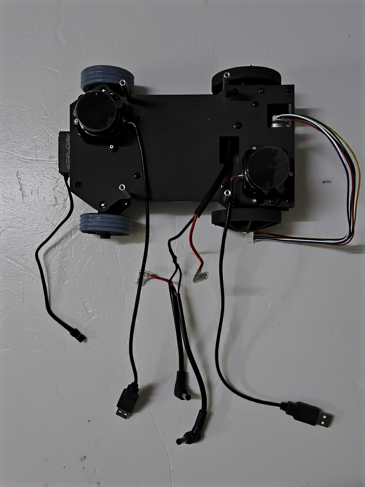 |  |

*Figure 12: Protected cable routes through the middle and upper chassis layers. Harnesses connect components through openings in the printed layers and internal chassis space, avoiding exposed drag points near the rear wheels.*

## Final mechanical configuration

### Chassis and layering

- The lowest layer contains the front steering module, rear drive, and low battery structure.
- The middle layer provides mounting positions for both LiDARs and cross-layer cable openings.
- The upper layer carries Jetson, ESP32, perception hardware, and protected wiring.
- Brass threaded standoffs join the printed layers; fixed holes and mounts locate the servo, motor, axle, LiDARs, and battery.

### Front axle and positive Ackermann steering

The steering chain is: SC-1258TG+ output spline → 3D-printed teardrop-shaped servo horn → ball-joint drag link → adjustable three-part tie rod → left/right steering arms → steering knuckles → front-wheel hubs.

Parallel steering could not complete the required large continuous turn reliably. The team considered reverse Ackermann geometry used by high-speed vehicles, but selected positive Ackermann for low-speed repeatable turns: the steering-arm pickup points angle inward toward the rear axle, so the inner wheel turns more sharply than the outer wheel.

### Rear drive, timing belt, and shared axle

- The GA25-370 has an integrated `9.6:1` gearbox. A `20T` driving pulley is fixed to the gearbox output shaft; when the shaft rotates, it drives the timing belt.
- Motion path: DC motor rotor → gearbox → `20T` driving pulley → timing belt → `40T` driven pulley → transverse rear axle → both rear wheels.
- The external belt reduction is `2:1`; the nominal motor-rotor-to-rear-axle reduction is `19.2:1`.
- The axle is supported by two printed mounts and brass hex hub couplers; both rear wheels have the same angular speed.
- Motor slots allow belt-tension adjustment: align pulleys, install and tension the belt, rotate by hand, lock the motor screws, then perform a powered check.

## Geometry, tyres, and mechanical-stability trade-offs

| Item | V1 | V2 | V3 / current geometric basis | Decision |
|---|---|---|---|---|
| Body length | `268 mm` | `220 mm` | `220 mm` | V2 shortened the body to reduce the swept envelope; V3 retained that length. |
| Body width | `183 mm` | `176 mm` | `120 mm` | V3 further narrowed the body to reduce lateral sweep during a turn. |
| Body height | — | `150 mm` | `158 mm` | V3 established the final height after the layered layout and equipment installation. |
| Wheelbase | `145 mm` | `138 mm` | `138 mm` | V2 shortened the wheelbase for compact turns; V3 retained it. |
| Front-wheel design angles | Inner `58°`, outer `30°` | Inner `53.7°`, outer `33.7°` | Retains the V2 positive-Ackermann front-axle layout | Maintains positive Ackermann, with a larger inner-wheel angle. |
| Wheel diameter and surface | High-friction `68 mm` commercial rear wheels | Approx. `50 mm` front / `65 mm` rear wheels | Approx. `50 mm` front / smoother `65 mm` rear wheels | V3 uses smoother rear wheels to reduce drag and occasional slip on the non-differential axle at large steering angles. |

The current body is `220 mm` long, `120 mm` wide, approximately `155 mm` wide including wheels, and has a `138 mm` wheelbase. The design target is a single continuous turn in a `375 mm` course width.

## Materials and mechanical reliability

- PLA was used for early prototypes to validate packaging, assembly order, and layer relationships.
- PA12-CF and PA6-CF were compared. The lowest and second layers use PA6-CF to carry steering, belt-drive, and repeated fastening loads.
- The upper electronics layer uses PLA so electronic boards do not directly contact conductive carbon-fibre-filled material.
- Early high-friction rear wheels caused drag. The team compared front ballast, reduced steering travel, and tyre change; the final smoother `65 mm` rear wheels were retained without front ballast.

## Iteration record

The following table connects the key mechanical iterations in their actual design order.

### Jetson/IMU Support: Height, Cooling Space, and Program-Start-Button Iteration

The early board support was `30 mm` high. The IMU, installed next to the Jetson, became very hot during operation. The team raised the support to `40 mm`, providing more air circulation around the IMU and Jetson. The early `30 mm` support STL files are [support 1](../media/stl/3d-printed-board-bracket-1.stl) and [support 2](../media/stl/3d-printed-board-bracket-2.stl); the raised `40 mm` support STL files are [Jetson support 1](../media/stl/jetson-support-1-part-1-40mm.stl) and [Jetson support 2](../media/stl/jetson-support-2-part-1-40mm.stl).

Building on the raised version, the team integrated the program-start button on the outside of the support. This allows the one permitted program-start button to be pressed from outside the vehicle after vehicle power-on, without changing the basic controller or wiring positions. The IMU's inverted installation to prevent its cable from hanging out of the rear, and its observed correct automatic-steering behaviour, are documented in [Chapter 5](05-power-and-sensor-architecture.md).

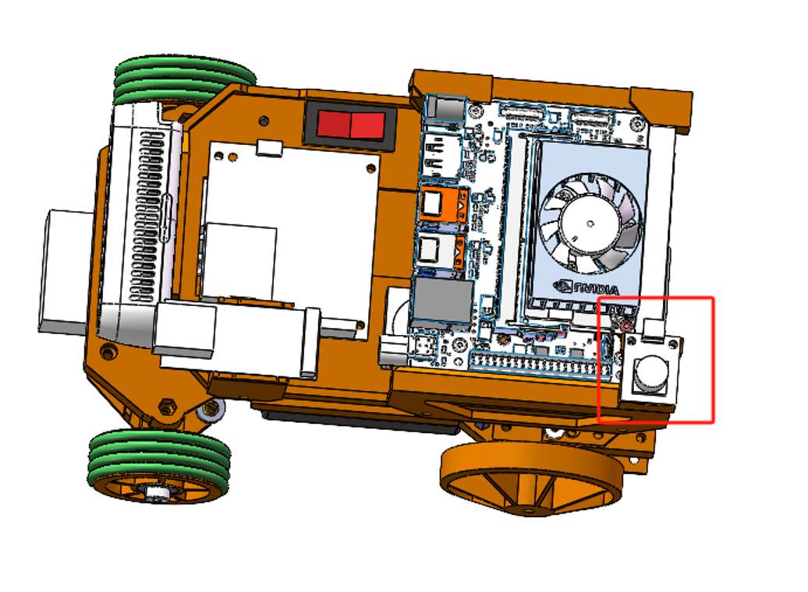

| Design theme | Iteration path and reason | Final mechanical decision |
|---|---|---|
| Steering scheme | Last year's small vehicle used parallel steering. It still required multiple forward-and-reverse adjustments to turn in the parking area; wheel angle was small and it easily contacted the boundary. The team then compared reverse and positive Ackermann: reverse Ackermann addresses high-speed cornering, while this vehicle needs stable, low-speed tight turns on a known map. | A positive-Ackermann front axle replaced parallel steering. The SC-1258TG+ drives the front wheels through a 3D-printed teardrop-shaped servo horn and servo-linkage assembly; the inner front wheel turns more than the outer wheel. |
| Chassis design: V1 → V2 → V3 | V1 measured `268 mm × 183 mm` with a `145 mm` wheelbase. To reduce the swept envelope in the `375 mm` turn space, the team first produced V2: `220 mm × 176 mm × 150 mm`, with a `138 mm` wheelbase. Retaining the V2 wheelbase and positive-Ackermann axle, the team then narrowed the body and completed the layered equipment layout. | V3 is the current version: `220 mm × 120 mm × 158 mm`, `138 mm` wheelbase, and approximately `155 mm` overall width including wheels. The bottom layer holds the front axle, battery bay, and rear axle; the middle layer mounts both LiDARs; the upper layer carries computing and sensing hardware. |
| Rear drive and rear wheels | The rules prohibit a differential-wheeled robot. With one motor driving a shared rear axle, the rear wheels create drag at large steering angles. Early high-friction `68 mm` commercial rear wheels made this more pronounced. | A GA25-370 drives the non-differential shared rear axle through a `20T:40T` timing-belt reduction. Rear wheels were changed to no-silicone, smoother `65 mm` 3D-printed wheels. Arc testing reduced drag and occasional slip to the minimum observed level, although it cannot be eliminated completely. |
| Single battery and lower battery bay | The early ESP32 and Jetson design used two batteries. Competition rules require one switch to start the whole vehicle and then a wait for the single program-start button; two batteries were unsuitable for that start arrangement. | One `12 V` battery powers both the SBC and SBM. It sits in the lower bay between the front and rear axles to keep the centre of mass low, and provides mounting and routing space for the SBC, SBM, and other upper modules. |
| LiDAR layout and chassis height | Course walls, traffic signs, and parking limits are all `100 mm` high. Both 2D LiDAR scan planes must be below `95 mm` and are actually about `85 mm`; a `20 mm` ground clearance would raise the scan plane too high. | Ground clearance was reduced to `7 mm`. Two 2D LiDARs weighing about `90 g` together are offset along the vehicle length, with the rear unit raised by a `5 mm` spacer; their ROS 2 scans are merged. |
| Jetson/IMU support and program-start button | [Early `30 mm`-high support 1](../media/stl/3d-printed-board-bracket-1.stl) and [support 2](../media/stl/3d-printed-board-bracket-2.stl) left the IMU very hot during operation. Competition also requires the one program-start button to remain operable after vehicle power-on. | The support height was raised to [new `40 mm`-high support 1](../media/stl/jetson-support-1-part-1-40mm.stl) and [support 2](../media/stl/jetson-support-2-part-1-40mm.stl), improving cooling space around the IMU and Jetson. The final support adds an external program-start-button mount. |
| Cable management | Exposed cables on the previous-year vehicle could be dragged into obstacles, while sensor, actuator, W5500, and power leads must pass through a multi-layer chassis. | Cable length is controlled from actual component locations; middle-layer openings and internal routes carry cables between layers. Cables do not extend outside the body outline and avoid the front axle, rear wheels, and timing belt. |
| Structural materials and drive durability | PLA deforms under sustained front-axle, rear-axle, and belt-area loads; the prior year's plastic gear at the motor-to-bearing connection failed repeatedly. A metal chassis would be robust but would consume too much of the `1.5 kg` mass budget. | The lowest and second layers are PA6-CF. The upper electronics layer is PLA so boards do not directly contact conductive carbon-fibre-filled material. Critical motor-to-rear-axle transmission uses metal timing pulleys. |
| Servo centre | The default servo centre did not match the installed horn centre, and the external servo resetter had insufficient power to reset it. | Python sends the default centre pulse to establish the installed servo centre. |

## Tests and results

| Test or analysis | Recorded result | Conclusion |
|---|---|---|
| Current positive-Ackermann turning behaviour | The smaller previous-year, parallel-steering car still needed multiple forward-and-reverse adjustments in the parking turn. Its front-wheel angle was small and it easily contacted boundaries. With positive Ackermann, the planner version with map memory drives through most ordinary corners continuously in one pass; the real-time LiDAR, map-free version without map memory does not yet achieve the same behaviour. | The current vehicle uses a positive-Ackermann front axle. Most continuous turns in the planner version demonstrate that the mechanical steering concept works; the map-free turning behaviour belongs to a separate control implementation. |
| V1 → V2 → V3 swept envelope and theoretical turning radius | With `30 mm` or `40 mm` clearance, V1 required `561 mm` or `581 mm` of width. The design evolved from V1 at `268 mm × 183 mm` with a `145 mm` wheelbase to V2 at `220 mm × 176 mm × 150 mm` with a `138 mm` wheelbase, then to V3 at `220 mm × 120 mm × 158 mm`. Using V3's `138 mm` wheelbase and the inner `53.7°` / outer `33.7°` front-wheel design angles gives a theoretical rear-axle-centre turning radius of approximately `154.1 mm`. | V3 both shortens the wheelbase and substantially narrows the body. The theoretical radius establishes steering geometry; whether the full vehicle passes within `375 mm` is still determined from a swept envelope including the wheels, overhangs, and outer front corner. |
| Servo-candidate specification and steering-torque calculation | At the vehicle's `4.8 V` supply, SC-1258TG+ is specified as `9.6 kgf·cm / 0.10 s/60°`; SC-1256TG is `16.0 kgf·cm / 0.18 s/60°`. The SC-1258TG+ uses `0.08 s` less per `60°`, a nominal response-time reduction of approximately `44.4%`. | SC-1258TG+ torque covers this vehicle's steering calculation, while its faster response better suits continuous corrections during low-speed turns and obstacle avoidance. |
| Rear-wheel arc driving comparison | The early high-friction commercial rear wheel produced substantial drag and occasional slip during large-angle arcs. After changing to a no-silicone, smoother `65 mm` 3D-printed rear wheel, arc driving became more stable and the effects of drag and occasional slip were reduced. | The selected rear wheel is the self-printed, smoother `65 mm` wheel. Testing reduced the effect to a minimum, though it cannot completely remove the inherent drag of a shared rear axle without a differential. |
| Rear-drive torque, speed calculation, and five straight-line vehicle tests | Design calculation for the `1.45 kg` vehicle, `65 mm` rear wheels, and `0.5 m/s²` starting acceleration gives required rear-axle torque of approximately `0.0466 N·m` (`0.48 kgf·cm`); planned average speed of `0.14 m/s` requires approximately `41.1 rpm` at the rear axle and `82.3 rpm` at gearbox output. In five `0 → 150` straight-line tests on the flat WRO mat with the competition `4500 mAh` battery, mean `10%–90%` acceleration was `0.545253 m/s²`, sample standard deviation was `0.063005 m/s²`, and mean stable speed was `0.319176 m/s`; this speed corresponds to approximately `93.8 rpm` at the rear axle and `187.6 rpm` at gearbox output. | GA25-370 with the `20T:40T` belt reduction covers low-speed starting torque and planned driving speed. Measured stable speed exceeds the planned `0.14 m/s` average, while working speed remains below the rated `500 rpm` gearbox-output speed. |
| Dual-LiDAR scan height, merged scan, and occlusion observation | Both 2D LiDAR scan planes are approximately `85 mm`, below `95 mm`, so they intersect the `100 mm` walls, traffic signs, and parking limits. After merging front and rear scans into `/scan`, the vehicle obtains the intended front-and-rear environment coverage. Current standoffs and cable looms obstruct some beams, so a few angles may have no return and can be treated as containing no wall or obstacle. | To retain scan height, ground clearance was reduced from the early `20 mm` to `7 mm`; front and rear LiDARs are offset, the rear unit is raised by a `5 mm` spacer, and scans are merged into `/scan`. Standoff and cable occlusion is a current limitation of the dual-LiDAR layout. |
| Single battery, `12 V` operation, and boost-module evaluation | The early two-battery plan was unsuitable for starting the whole vehicle through one switch. The team evaluated a `12 V → 19 V` Jetson boost module, but it added mass. The final single competition `12 V` battery has powered long vehicle runs without a power fault, and the current program runs without boost conversion. | One `12 V` battery powers both SBC and SBM, with no boost module; it sits in the lower bay between the axles. |
| Structural-material and drive-durability record | The previous year's plastic transmission gear between motor and bearing failed five times, while PLA structural parts can soften and bend with long-term use. The current upper PLA electronics layer has a slight bend without affecting operation; the lowest PA6-CF layer remains rigid. | Critical motor-to-rear-axle transmission uses metal timing pulleys; the lowest and second layers use PA6-CF and the upper electronics layer uses PLA. |

## Risks, limitations, and mitigations

| Risk or limitation | Mitigation |
|---|---|
| No differential on shared rear axle | Positive Ackermann and smoother `65 mm` rear wheels reduce turn drag. |
| Low `7 mm` clearance | Occasional ground contact can occur on the smooth fixed course; increased rear-drive output still lets the vehicle continue over it. |
| Belt tension or alignment changes | Adjust using motor slots, rotate by hand before lock-up, and check before powering. |
| Carbon-fibre-filled material can conduct | Use PA6-CF in load-bearing lower layers and PLA on the upper electronics layer. |
| Cables can be pulled by vibration, wheels, or external obstacles | Route cables through fixed mounting positions, cross-layer openings, and internal paths; keep every cable inside the body outline and clear of the front axle, rear wheels, and timing belt. |

## Evidence links

### CAD

- [Hiway complete mechanical STEP assembly (CAD model)](../media/cad/Botzill%20Autonomous%20Car%20-%20Hiway%20Mechanical%20Assembly.step.zip)

### Drawing

- [Hiway mechanical drawing PDF](../media/cad/botzill-autonomous-ackerman-car-drawing.pdf)

### STL

- [Complete vehicle STL model](../media/stl/hiway-v3-complete-vehicle.stl)
- [3D-printed lower chassis plate](../media/stl/3d-printed-lower-chassis-plate.stl)
- [3D-printed second-layer plate](../media/stl/3d-printed-second-layer-plate.stl)
- [3D-printed small second-layer plate](../media/stl/3d-printed-small-second-layer-plate.stl)
- [3D-printed third-layer plate](../media/stl/3d-printed-third-layer-plate.stl)
- [3D-printed battery plate](../media/stl/3d-printed-battery-plate.stl)
- [3D-printed Ethernet-port bracket](../media/stl/3d-printed-ethernet-port-bracket.stl)
- [3D-printed LiDAR mounting plate](../media/stl/3d-printed-lidar-mounting-plate.stl)
- [Early Jetson support 1 (30 mm high)](../media/stl/3d-printed-board-bracket-1.stl)
- [Early Jetson support 2 (30 mm high)](../media/stl/3d-printed-board-bracket-2.stl)
- [Raised Jetson support 1 (40 mm high)](../media/stl/jetson-support-1-part-1-40mm.stl)
- [Raised Jetson support 2 (40 mm high)](../media/stl/jetson-support-2-part-1-40mm.stl)
- [3D-printed teardrop servo horn](../media/stl/3d-printed-teardrop-servo-horn.stl)
- [3D-printed steering cup](../media/stl/3d-printed-steering-cup.stl)
- [3D-printed rear wheel 1](../media/stl/3d-printed-rear-wheel-1.stl)
- [3D-printed rear wheel 2](../media/stl/3d-printed-rear-wheel-2.stl)
- [Front-wheel silicone tyre shell](../media/stl/front-wheel-silicone-tire-shell.stl)

## Open items

None.
