# Power and Sensor Architecture

## Purpose

Document the vehicle electrical architecture, current budget, wiring diagram, and safety measures. This chapter also records sensor selection, sensor placement and its relationship to the competition field geometry, intrinsic and extrinsic calibration, failure-point considerations, and the design iterations that led to the final system.

## Summary

The vehicle uses a two-controller electrical architecture: a Jetson SBC and an ESP32-S3 SBM. The Jetson Orin Nano Super Developer Kit is the high-level computing unit. It runs the ROS 2 perception, local localization, map/state management, and planning programs. The ESP32-S3 is the actuator-side controller. It runs micro-ROS firmware and performs low-level operation of the rear-drive motor, steering servo, Hall encoder, display, speaker, and status prompts. A micro-ROS Agent running on the Jetson connects the ROS 2 network to the ESP32 micro-ROS node over the W5500 wired Ethernet link.

One 12 V main battery, through the main power switch, powers both controller carrier boards: the Jetson uses a DC5525 input and the ESP32 driver board uses a DC5521 input. On the ESP32 carrier board, separate rails provide the 12 V motor drive, 5 V servo power, 3.3 V power for the ESP32-S3 main chip, and 5 V / 3.3 V expansion interfaces for external modules. Two LDROBOT STL-27L 2D LiDARs, an Intel RealSense D435f depth camera, and a TM171 IMU connect to the Jetson for environmental and vehicle-state sensing. The GA25-370 rear-drive motor with its built-in Hall encoder and the SC-1258TG+ steering servo connect to the ESP32 for vehicle actuation and feedback.

Controller procurement prioritized ROS 2 ecosystem compatibility, reproducible micro-ROS flashing methods, sufficient Flash and RAM, carrier-board integration, debugging methods, and the vehicle's weight and power constraints. The final selection is an ESP32-S3-WROOM-1 MON8R8 driver board together with the Jetson Orin Nano Super Developer Kit. The following sections record the selection process, actual voltage domains, interface allocation, and the sensor-placement rationale based on the field geometry.

## Requirements, Rules, and Controller Roles

Rules 11.8 and 11.9 permit SBCs, SBMs, and more than one controller on the vehicle. The team therefore separates computation-heavy perception and planning from the low-level hardware tasks that need timely and stable execution.

| Role | Controller | Main responsibilities | Relationship to the other controller |
|---|---|---|---|
| High-level computing unit | Jetson Orin Nano Super Developer Kit (SBC) | ROS 2 perception, local localization, map/state management, planning, and generation of motor and steering requests. | Communicates with the ESP32 micro-ROS node through the micro-ROS Agent on the Jetson. |
| Actuator-side controller | ESP32-S3-WROOM-1 MON8R8 driver board (SBM) | Drives the motor and servo, reads Hall encoder pulses, and controls display, sound, and status prompts. | Receives ROS 2 control requests from the Jetson and returns actuator-side status. |

This division does not mean that the ESP32 connects to every sensor. The two LiDARs, depth camera, and IMU have higher data and processing requirements, so they all connect to the Jetson. The ESP32 concentrates on the motor, servo, encoder, and human-machine prompt hardware.

## Controller and Carrier-Board Selection

### Why Use an SBC and an SBM

The team first considered having one Arduino-class microcontroller perform every task. Although simple, that arrangement is not suitable for processing two LiDARs, a depth camera, an IMU, image-color recognition, and ROS 2 planning at the same time. The final architecture assigns perception and planning to the SBC, and actuator control and hardware state to the SBM.

### Why ESP32-S3 Was Selected as the SBM

STM32 and ESP32 were both common controller candidates. The comparison used two criteria: first, whether reproducible micro-ROS flashing documentation, example code, and community practice were available; second, whether a commercial controller-and-driver-board combination provided motor, servo, and debugging interfaces directly, instead of requiring a breadboard implementation of voltage regulation, motor driving, energy-storage capacitors, and noise filtering.

The team decided from the start to use the ROS 2 ecosystem. The SBM therefore needed to run micro-ROS and communicate with the Jetson micro-ROS Agent using Micro XRCE-DDS. ESP32 has extensive public micro-ROS material: micro-ROS provides an [ESP-IDF component](https://github.com/micro-ROS/micro_ros_espidf_component), and [micro_ros_arduino](https://github.com/micro-ROS/micro_ros_arduino/tree/humble) lists the ESP32 Dev Module as an officially supported board. The team found fewer STM32 micro-ROS resources, and STM32 board variants and debugging methods differ more widely; some candidates also require a separate ST-Link debugger. ESP32 supports direct USB-C firmware upload/download and serial debugging, giving it a clearer compatibility and reproduction path.

The team first tried `micro_ros_espidf_component`, but its required ESP-IDF environment conflicted with the ESP-IDF 5.4 firmware environment used by this driver board, preventing a stable deployment. The team then switched to `micro_ros_arduino` and successfully ran micro-ROS on the ESP32. This deployment iteration reinforced the board-selection decision; the firmware, Agent, topics, and control code are documented in the software-control chapter.

The selected Shenzhen Yiyan Electronics ESP32 driver board uses an ESP32-S3-WROOM-1 MON8R8 with 8 MB Flash and 8 MB RAM. Flash stores firmware and nonvolatile data, while RAM provides runtime workspace. The board integrates dual 12 V motor headers, a 5 V servo header, a USB-C debugging interface, display and audio interfaces, and expansion pins. The completed vehicle uses its motor, servo, encoder, display, speaker, ADC battery monitoring, and W5500 connections; the LiDARs, depth camera, and TM171 IMU were not moved to the ESP32.

### Why Jetson Orin Nano Super Developer Kit Was Selected as the SBC

The team used a Raspberry Pi in the previous year and found that its compute capacity was insufficient for larger processing tasks. This year's vehicle needed to handle the depth camera, two LiDARs, IMU, ROS 2 nodes, and planning logic concurrently, so Raspberry Pi and Jetson were reassessed. Jetson Orin NX 16 GB offers higher performance, but its power demand was less suitable for this vehicle's weight limit and single 12 V battery. The Jetson Orin Nano Super Developer Kit offered a more appropriate balance between compute capacity, feasible 12 V operation, and total vehicle weight.

## Final Power Tree and Voltage Domains

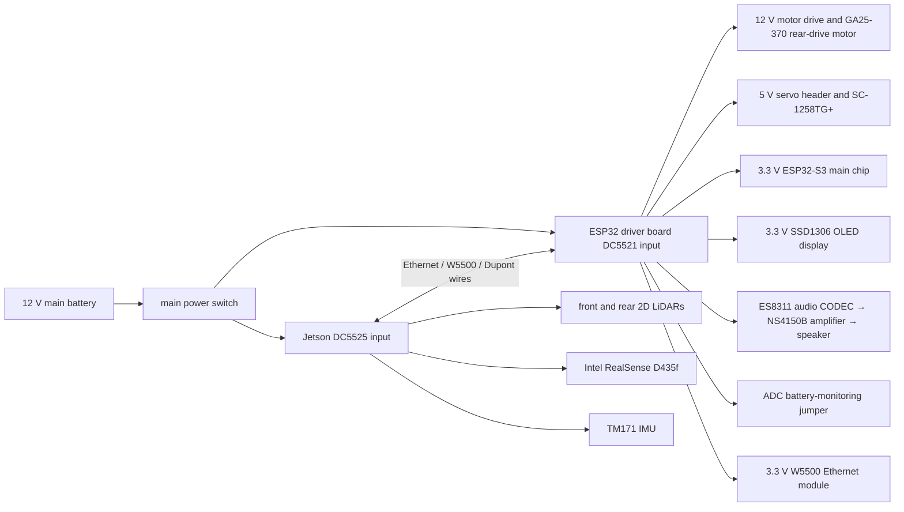
```mermaid
flowchart LR
    B[12 V main battery] --> S[main power switch]
    S --> J[Jetson DC5525 input]
    S --> E[ESP32 driver board DC5521 input]
    E --> M[12 V motor drive and GA25-370 rear-drive motor]
    E --> SV[5 V servo header and SC-1258TG+]
    E --> L33[3.3 V ESP32-S3 main chip]
    E --> O[3.3 V SSD1306 OLED display]
    E --> A[ES8311 audio CODEC → NS4150B amplifier → speaker]
    E --> AD[ADC battery-monitoring jumper]
    E --> W[3.3 V W5500 Ethernet module]
    J --> L[front and rear 2D LiDARs]
    J --> C[Intel RealSense D435f]
    J --> I[TM171 IMU]
    J <-->|Ethernet / W5500 / Dupont wires| E
```

### ESP32 Driver Board and Interface Locations

The image identifies the main interfaces on the ESP32-S3 driver board used in this vehicle, including the motor, servo, battery, USB-debug, display, and speaker connections.

**User manual:** [ESP32 Driver Board User Manual](../media/electronics-interfaces/ESP32_Driver_Board_User_Manual_EN.pdf)

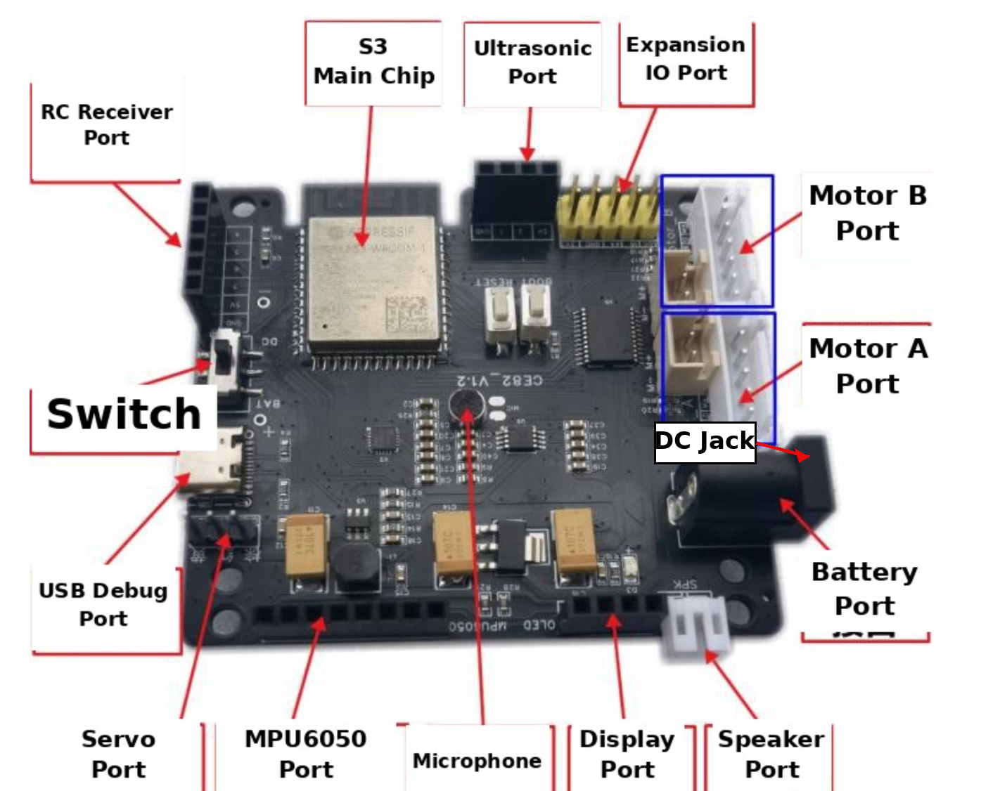

### ESP32 Driver-Board Circuit Schematic

**Open the full circuit schematic:** [ESP32 driver-board circuit schematic](../media/electronics-interfaces/esp32-mainboard-schematic-en.pdf)

[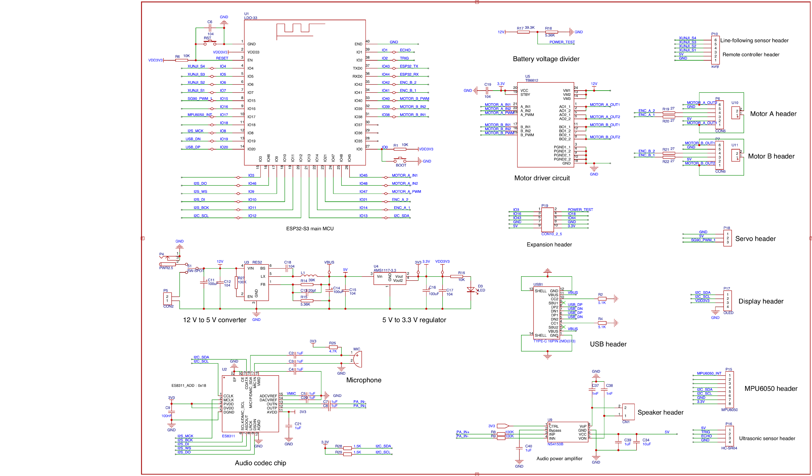](../media/electronics-interfaces/esp32-mainboard-schematic-en.pdf)

### Two-Stage Regulation and Power Allocation on the ESP32 Driver Board

After the main battery enters through DC5521, the board divides the 12 V supply into two paths: 12 V remains directly available for the GA25-370 rear-drive motor; the other path produces 5 V and then 3.3 V through two regulation stages. During main-battery operation, U3 (TMI3255S) steps 12 V down to 5 V, and U4 (AMS1117-3.3) steps 5 V down to 3.3 V. The USB-C debugging interface can also provide 5 V VBUS, but it cannot substitute for the 12 V main battery that supplies the rear-drive motor.

#### 12 V → 5 V: Servo and 5 V Peripherals

The 5 V output from U3 supplies the SC-1258TG+ servo port, the [NS4150B audio power amplifier](../media/datasheets/NS4150B-Audio-Power-Amplifier.pdf), and onboard or expansion interfaces with a 5 V pin. [TMI3255S 12 V-to-5 V buck-regulator datasheet](../media/datasheets/tmi3255s-12v-to-5v-buck-regulator-datasheet.pdf)

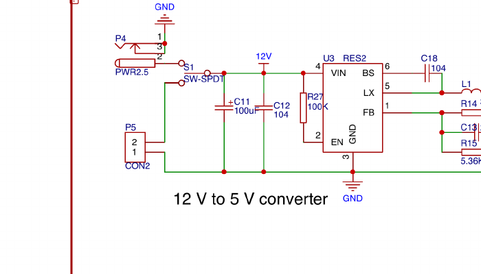

#### 5 V → 3.3 V: ESP32-S3 and 3.3 V Peripherals

U4 converts 5 V to 3.3 V for the ESP32-S3 main chip, the [ES8311 audio CODEC](../media/datasheets/es8311-low-power-mono-audio-codec-datasheet.pdf), SSD1306 OLED, W5500, and other 3.3 V interfaces. [AMS1117-3.3 5 V-to-3.3 V linear-regulator datasheet](../media/datasheets/ams1117-3.3-5v-to-3.3v-linear-regulator-datasheet.pdf)

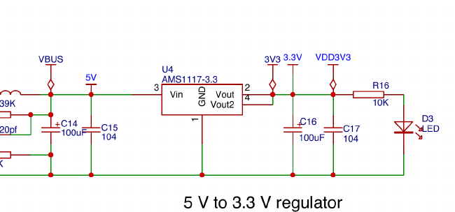

### ESP32 Driver Board: Power and Interfaces Used on This Vehicle

| Driver-board voltage domain or interface | Current connected component | Role |
|---|---|---|
| DC5521 12 V power input | 12 V main battery | The ESP32 driver board receives 12 V from the main battery through its DC5521 jack; the same battery simultaneously supplies the Jetson through a separate branch to its DC5525 jack. |
| 12 V motor-drive interface | GA25-370 rear-drive motor and built-in Hall encoder | U5 in the circuit schematic is the [TB6612FNG brushed DC motor-driver IC](../media/datasheets/toshiba-tb6612fng-brushed-dc-motor-driver-datasheet.pdf). The motor interface carries the motor output and encoder signals. |
| 5 V servo header | SC-1258TG+ | Yellow is the control signal, red is 5 V, and brown is ground. This servo supports 4.8 V and 6 V operation. |
| 3.3 V main-chip supply | ESP32-S3 and board low-voltage digital circuits | The board's AMS1117-3.3 regulator converts 5 V to 3.3 V to supply the ESP32-S3 main chip. The expansion interfaces provide both 5 V and 3.3 V; this row describes the main-chip supply only. |
| 3.3 V OLED interface | SSD1306 0.96-inch, 128 × 64 OLED display | Displays battery percentage, state, and low-battery prompts. The display uses a four-wire SPI connection and 3.3 V supply. |
| Audio chain | [ES8311 audio CODEC](../media/datasheets/es8311-low-power-mono-audio-codec-datasheet.pdf) → [NS4150B audio power amplifier](../media/datasheets/NS4150B-Audio-Power-Amplifier.pdf) → speaker | The ES8311 is powered by 3.3 V, and the ESP32 sends audio to it over I2S. The NS4150B is powered by 5 V, amplifies the audio signal, and drives the speaker through the speaker header. The speaker itself has no separate external supply branch. |
| USB-C debugging interface | Firmware upload/download, serial log, and debugging | USB VBUS is 5 V. Debug power can operate low-voltage functions such as the ESP32, servo, OLED, and audio, but it cannot replace the 12 V main battery for rear-drive motor power. |
| ADC battery-monitoring jumper | Battery-voltage divider and ESP32 ADC | The white jumper shorts the two pins marked `ADC` and `3`, connecting the divided battery-voltage signal to the ADC. Firmware reads battery terminal voltage and converts it to a remaining-charge percentage from the discharge curve. The jumper does not provide power. |
| 3.3 V expansion header | W5500 wired Ethernet module | The W5500 receives `3V3` and `GND` from the ESP32 expansion header and connects to the ESP32 with Dupont wires; its network link reaches the Jetson over Ethernet. |

### Jetson Orin Nano Super Developer Kit Carrier Board and Interface Locations

**Official hardware layout:** [NVIDIA Jetson Orin Nano Super Developer Kit Hardware Layout](https://docs.nvidia.com/jetson/orin-nano-devkit/user-guide/latest/hardware_layout.html)

[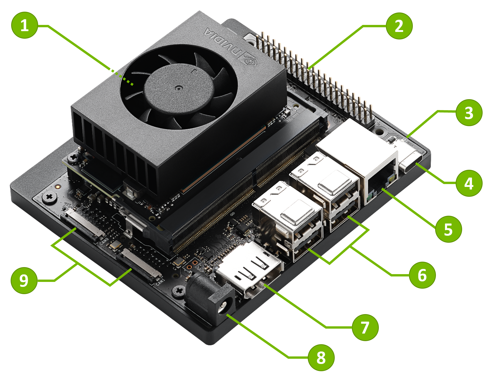](https://docs.nvidia.com/jetson/orin-nano-devkit/user-guide/latest/hardware_layout.html)

Labels `1–9` in the annotated view are NVIDIA's official interface labels:

- `1`: microSD card slot; main storage on the Jetson Orin Nano module.
- `2`: 40-pin expansion header.
- `3`: power-indicator LED.
- `4`: USB-C port, for data only.
- `5`: Gigabit Ethernet port.
- `6`: four USB 3.2 Type-A ports, up to 10 Gbps.
- `7`: DisplayPort output connector.
- `8`: DC power jack, `5.5 mm × 2.5 mm`.
- `9`: two MIPI CSI camera connectors, 22-pin with 0.5 mm pitch.

### Jetson Orin Nano Super Developer Kit Carrier-Board Circuit Schematic

The Jetson Orin Nano Super Developer Kit uses the P3768 carrier board. The preview below is the `Power Topology` page. Its DCIN input is labelled `9–19 V @ 3 A`; starting at the DC5525 input, it summarizes the 5 V, 3.3 V, and 1.8 V rails and their connections to USB, the fan, the 40-pin header, Ethernet, and other onboard modules. The complete file includes detailed circuit schematics for each branch. USB Type-A VBUS is supplied from the 5 V branch; Gigabit Ethernet RJ45/LED/PoE, the 40-pin header, and M.2 NVMe are shown on the 3.3 V branch. The USB 3.1 Hub's internal logic is on the 3.3 V branch, which does not change the 5 V VBUS provided externally by USB Type-A.

**Open the full circuit schematic:** [Jetson Orin Nano Super Developer Kit carrier-board circuit schematic](../media/electronics-interfaces/jetson-p3768-carrier-board-circuit-schematics.pdf)

[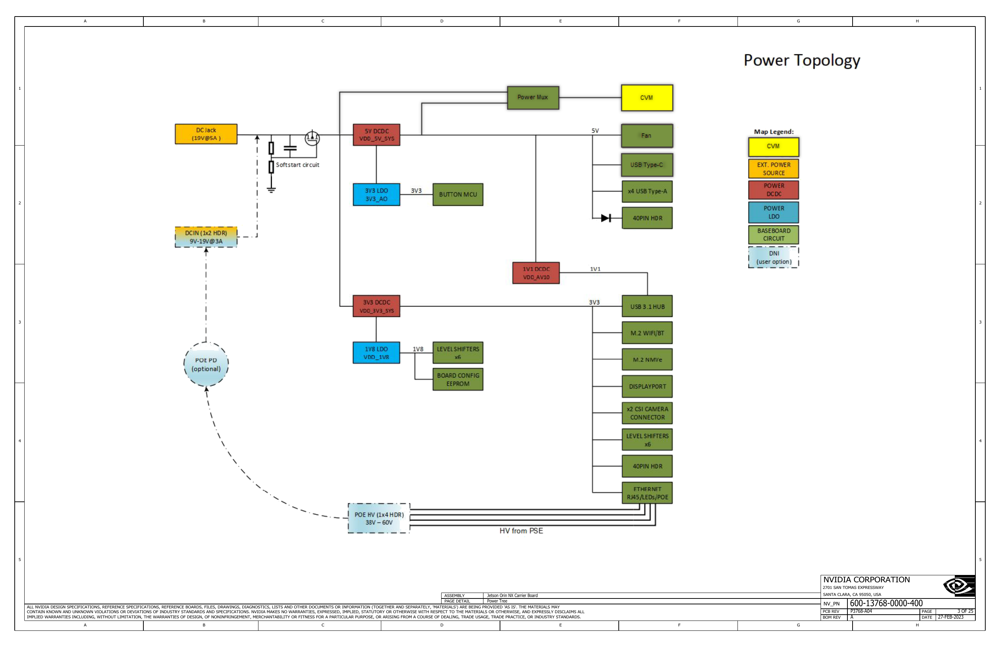](../media/electronics-interfaces/jetson-p3768-carrier-board-circuit-schematics.pdf)

### Jetson Orin Nano Super Developer Kit Carrier Board: Power and Interfaces Used on This Vehicle

| Board label or component | Vehicle use | Power and description |
|---|---|---|
| `8`: DC power jack (DC5525) | Used | Accepts its own 12 V main-battery supply branch; the `Power Topology` identifies this input as DCIN. |
| `7`: DisplayPort output | Used during initial setup | Used to connect a display while initially configuring the vehicle. It is no longer the runtime display interface after switching to VNC remote desktop. |
| `6`: USB 3.2 Type-A ×4 | Used | All four VBUS supplies come from the 5 V rail in the `Power Topology`: (1) Intel RealSense D435f depth camera; (2) TM171 IMU; (3) CP2102 TTL-to-USB link for the rear LDROBOT STL-27L LiDAR; and (4) a reserved port for a mouse, keyboard, or other field-debug peripheral. |
| `5`: Gigabit Ethernet RJ45 | Used | The carrier-board RJ45/LED/PoE interface is on the 3.3 V branch. This port transfers data by Ethernet cable to W5500 and does not power the W5500 module. W5500 itself receives 3.3 V and GND from the ESP32 expansion header. |
| `4`: USB-C | Used as needed | Used for data transfer and debugging. Its VBUS is on the 5 V branch, but it is not the vehicle's Jetson power input. |
| `2`: 40-pin expansion header | Used | Connects the front LiDAR and program-start button. Its 3.3 V logic/power branch comes from 3.3 V; the front LiDAR actually uses the 5.0 V supply on Pin 4 (see the pin table below). |
| `1`: microSD card | Used | Default system/boot storage on the Jetson Orin Nano module. The P3768 `Power Topology` does not show microSD as a separate carrier-board rail; it operates with the Jetson module and has no separate external power cable. |
| Rear M.2 Key-M NVMe SSD | Installed | Extension storage; the `Power Topology` places M.2 NVMe on the 3.3 V branch. Docker data is stored on this SSD, although the vehicle currently uses Docker infrequently. |

Both the carrier-board Gigabit Ethernet interface and the ESP32-side W5500 module use 3.3 V, but they are powered from the Jetson carrier-board and ESP32 driver-board 3.3 V branches respectively; the Ethernet cable carries only network data between them.

The team considered a `12 V → 19 V` boost converter so that the Jetson Orin Nano could operate from a higher input voltage and potentially provide more compute performance. The candidate `EV60-T1219` is the `12 V` input, `19 V / 3 A` output variant. Its manufacturer-stated specification is `DC 9–16 V` input, `DC 19 V ± 0.15 V` output, `57 W` maximum output power, `99 g` mass, `58 × 39.5 × 21.8 mm` dimensions, `≥93%` conversion efficiency, and `IP68` ingress protection. These are manufacturer-stated specifications, not vehicle-measured performance data.

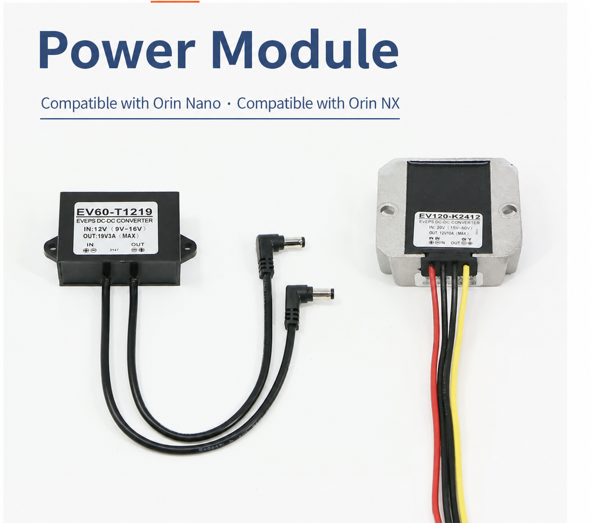

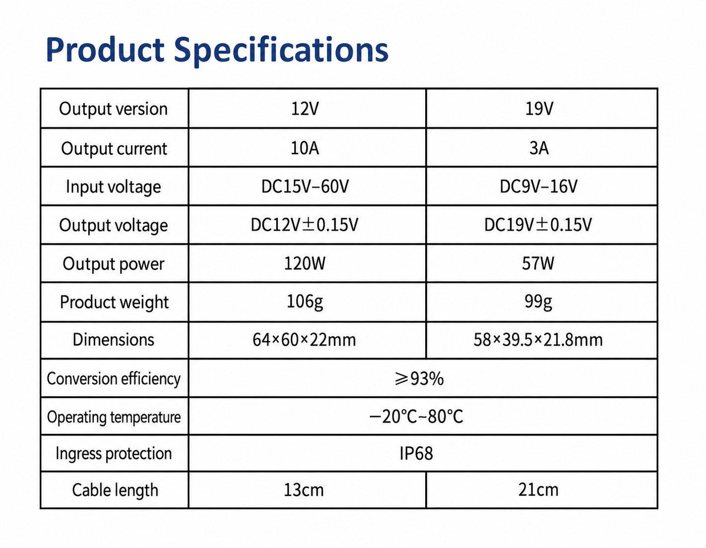

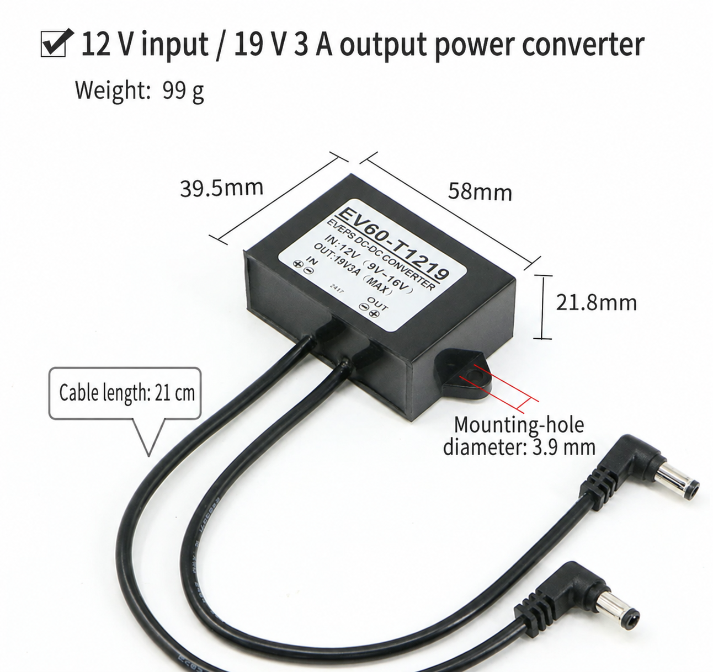

Before finalizing the choice, the team consulted [an NVIDIA Developer Forum discussion of 12 V power](https://forums.developer.nvidia.com/t/power-supply-for-jetson-orin-nano-development-kit/264241) and [a community 4S-battery example](https://www.reddit.com/r/diydrones/comments/1h1o08s/powering_a_nvidia_jetson_orin_nano_from_a_4s_lipo/) as external reference points for direct battery supply, then tested the vehicle's own 12 V main battery. The current program ran stably in most cases. Because the 19 V boost converter would add vehicle mass, the final vehicle does not use it; the 12 V main battery supplies the Jetson DC5525 input directly.

### Jetson 40-Pin Expansion Header: Pins Used on This Vehicle

**Official pin definitions:** [Jetson Orin Nano Super Developer Kit Carrier Board Specification (page 21, Figure 3-1)](../media/datasheets/Jetson-Orin-Nano-DevKit-Carrier-Board-Specification_SP-11324-001_v1.3.pdf)

[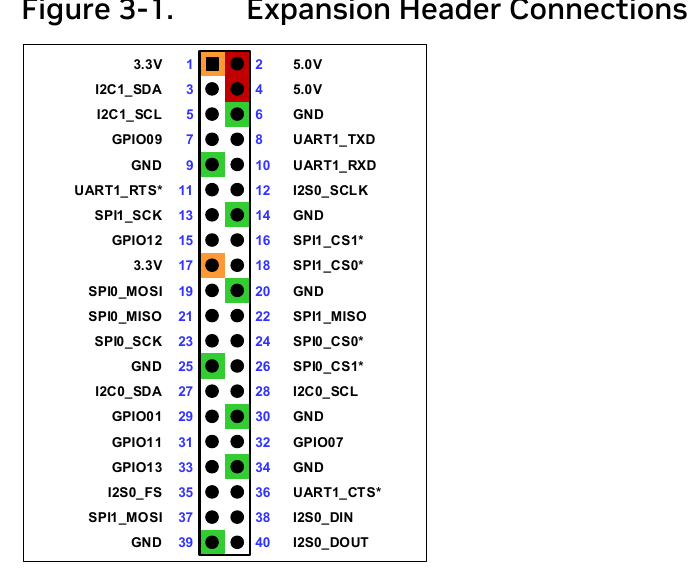](../media/datasheets/Jetson-Orin-Nano-DevKit-Carrier-Board-Specification_SP-11324-001_v1.3.pdf)

| Connection | Jetson 40-pin header pin | Specification function | Actual connection |
|---|---|---|---|
| Front LiDAR | Pin 4 | 5.0 V | Yellow wire (P5V) |
| Front LiDAR | Pin 9 | GND | White wire (GND) |
| Front LiDAR | Pin 10 | UART1_RXD | Black wire (LiDAR TX) |
| Front LiDAR | — | — | Red wire (PWM), not connected |
| Blue program-start button | Pin 17 | 3.3 V | Green Dupont wire to the button's 3.3 V terminal. |
| Blue program-start button | Pin 29 | GPIO01 | Blue Dupont wire to the button's GPIO signal terminal. |
| Blue program-start button | Pin 30 | GND | Yellow Dupont wire to the button's GND terminal. |

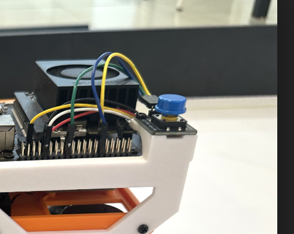

### From the Early Dual-Battery Arrangement to One 12 V Main Battery

The early V3 arrangement used two separate `12 V` batteries: a blue `1800 mAh` battery for the ESP32 and actuator side, and a WHEELTEC E345S `4500 mAh` safe-lithium battery for the Jetson Orin Nano. The image below shows the installed dual-battery arrangement at that time.

The blue battery has a simple blue plastic wrap around four `18650` cells, each labelled `800 mAh`; its pack label states `1800 mAh` total capacity. Its lower capacity and simple external protection did not support extended development sessions, so it was not retained as the final main battery.

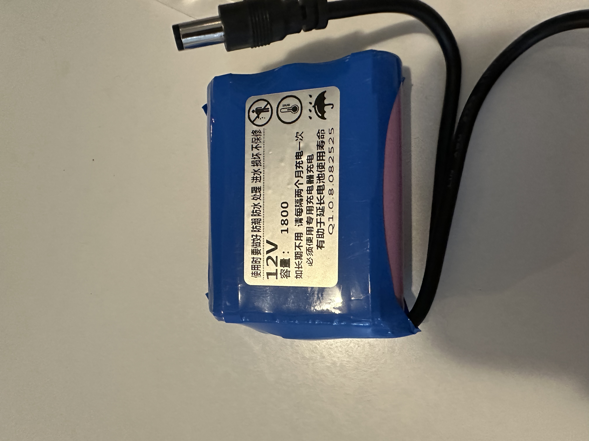

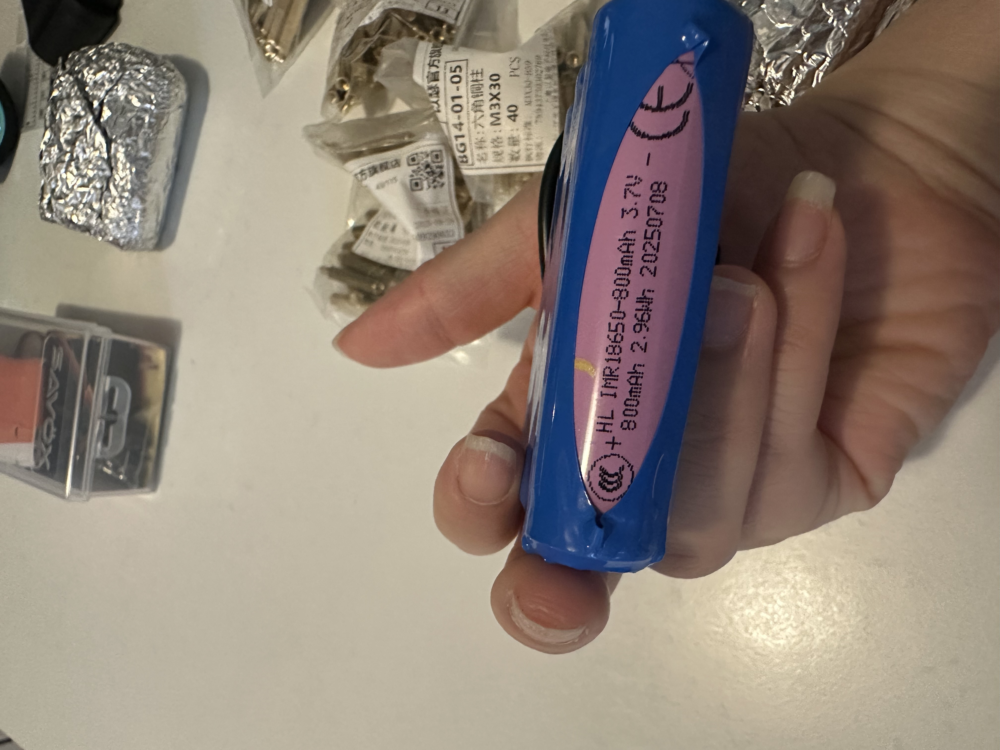

The team then purchased a WHEELTEC E345S `12 V / 4500 mAh` safe-lithium battery as the Jetson candidate; the procurement record is [WHEELTEC E345S 12 V 4500 mAh safe-lithium battery](https://item.taobao.com/item.htm?id=657164512973&mi_id=0000JoQWyuiQgTyMrxnNZ9xngXJN-aGAH-8lM7v4-zzM1uQ&skuId=5851945799121&spm=tbpc.boughtlist.suborder_itemtitle.1.3be32e8dDSRKB8). The team's procurement and use records state that it has a protective enclosure, high- and low-temperature charge/discharge protection, and a measured-capacity report; one charge supports approximately three hours of operation. Its capacity and protection features make it more suitable for extended development and competition.

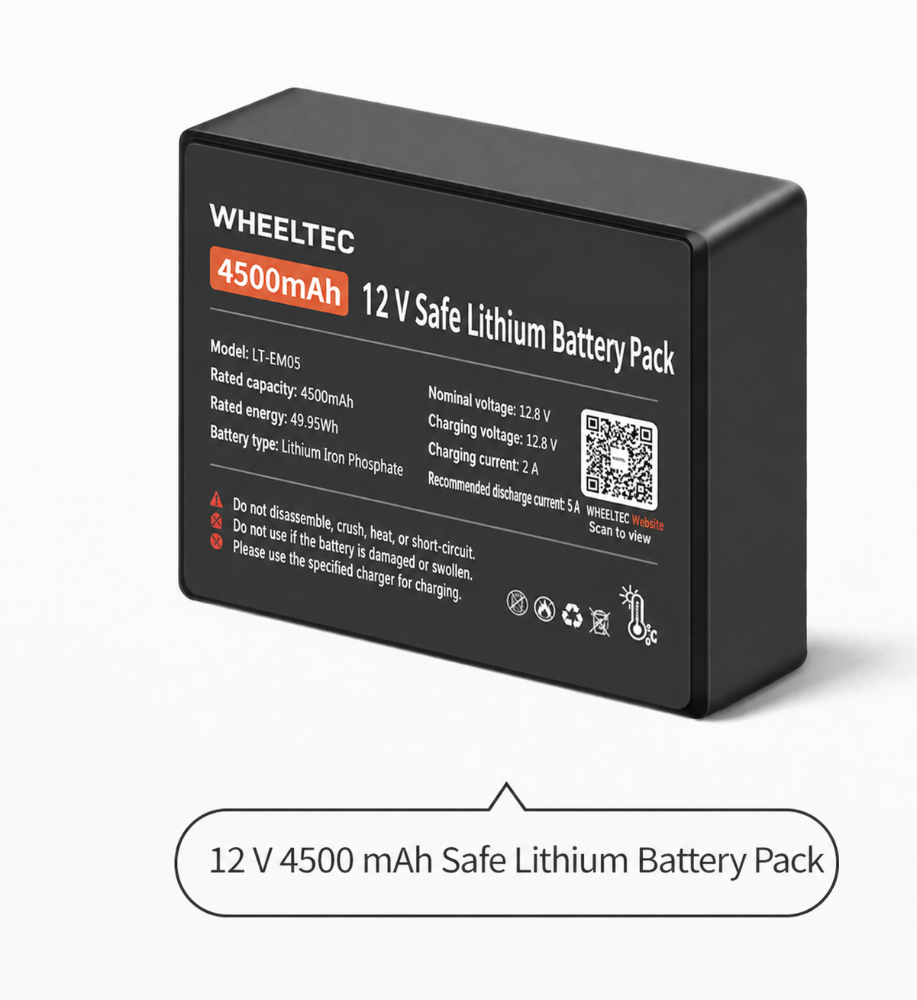

Considering the one-main-switch rule documented in the mobility and system architecture chapters, the team assessed component power and selected conductors accordingly. The assessment indicated that one `12 V` battery could supply both controllers, so the final design replaced the dual-battery arrangement with the higher-capacity, more fully protected `4500 mAh` battery.

### Component Power and Current Assessment

This table records component power and current. `12 V`-equivalent current is calculated as power divided by the main-battery voltage. The **operating** column records simultaneous vehicle operation; the **short peak** column records the brief peak load used for wire sizing.

| Branch | Component | Quantity | Rail | Operating value | Short-peak value | Calculation |
|---|---|---:|---|---:|---:|---|
| Jetson DC5525 | Jetson Orin Nano Super Developer Kit | 1 | 12 V input | `15.0 W` | `25.0 W` | `15 W` operating value; `25 W` upper power-mode bound. |
| Jetson DC5525 | Intel RealSense D435f | 1 | 5 V | `2.2 W` (`0.44 A`) | `3.5 W` (`0.70 A`) | Expected operating value and datasheet maximum, respectively. |
| Jetson DC5525 | TM171 IMU | 1 | 5 V | `0.4 W` (`0.08 A`) | `0.4 W` | Same value used in both cases. |
| Jetson DC5525 | LDROBOT STL-27L LiDAR, front | 1 | 5 V | `1.45 W` (`0.29 A`) | `2.70 W` (`0.54 A` startup) | Front 40-pin-header sensor. |
| Jetson DC5525 | LDROBOT STL-27L LiDAR, rear | 1 | 5 V | `1.45 W` (`0.29 A`) | `2.70 W` (`0.54 A` startup) | Rear USB/CP2102 sensor path. |
| Jetson DC5525 | CP2102 TTL-to-USB adapter | 1 | Jetson USB 5 V | — | — | Rear-LiDAR USB adapter. |
| Jetson DC5525 | **Jetson-side subtotal** |  |  | **`20.5 W`, `1.71 A @ 12 V`** | **`34.3 W`, `2.86 A @ 12 V`** | Operating: `15 + 2.2 + 0.4 + 1.45 + 1.45`; peak uses the `25 W` Jetson upper bound, `3.5 W` D435f, and two `2.70 W` LiDAR startups. |
| ESP32 DC5521 | ESP32-S3 and driver-board base load | 1 | 3.3 V / 5 V from board | `0.60 W` | `0.60 W` | Controller base power. OLED and ES8311 control electronics are included here rather than added twice. |
| ESP32 DC5521 | W5500 Ethernet controller | 1 | 3.3 V | `0.42 W` (`128 mA`) | `0.44 W` (`132 mA`) | Ethernet controller and ESP32 communication link. |
| ESP32 DC5521 | SC-1258TG+ steering servo | 1 | 5 V | `0.60 W` (`120 mA`) | `30.0 W` (`5 A` at the servo's upper 6 V rating) | Short-duration peak value. |
| ESP32 DC5521 | GA25-370 rear drive motor and Hall encoder | 1 | 12 V | `5.0 W` | `5.0 W` | Drive load. |
| ESP32 DC5521 | `0.96 in` OLED | 1 | 3.3 V | — | — | Included in the ESP32 driver-board base allowance. |
| ESP32 DC5521 | ES8311 audio codec | 1 | board low-voltage rail | — | — | Included in the ESP32 driver-board base allowance. |
| ESP32 DC5521 | NS4150B amplifier and speaker | 1 | 5 V | — | — | Startup audio is negligible. |
| ESP32 DC5521 | **ESP32-side subtotal** |  |  | **`6.62 W`, `0.55 A @ 12 V`** | **`36.04 W`, `3.00 A @ 12 V`** | Operating: `0.60 + 0.42 + 0.60 + 5.0`; peak: `0.60 + 0.44 + 30.0 + 5.0`. |
| Main battery | **Whole-vehicle budget** |  | 12 V | **`27.12 W`, `2.26 A`** | **`70.34 W`, `5.86 A`** | Applying `30%` to the short peak gives `5.86 × 1.30 = 7.62 A`, recorded as **`7.6 A`**. |

### Battery Capacity Comparison

The final WHEELTEC battery is rated at `12 V / 4.5 Ah`, giving a nominal stored energy of `12 V × 4.5 Ah = 54 Wh`. Compared with the component values above, its nominal energy is sufficient for the operating load and exceeds the energy needed for a one-hour run.

| Comparison item | Calculation | Result | Assessment |
|---|---|---:|---|
| Battery nominal capacity | `12 V × 4.5 Ah` | `54 Wh` | Available nominal energy. |
| Operating load | Component total | `27.12 W`, `2.26 A @ 12 V` | Baseline used for runtime comparison. |
| Energy and charge needed for one hour | `27.12 W × 1 h`; `2.26 A × 1 h` | `27.12 Wh`; `2.26 Ah` | Below the battery's `54 Wh` and `4.5 Ah` nominal capacity. |
| Theoretical operating duration | `54 Wh ÷ 27.12 W` | approximately `1.99 h` | Nominal estimate before battery aging, temperature, and conversion losses. |
| Short-peak load | `7.62 A × 12 V` | `91.44 W` | Short-peak power and current. |

Therefore, the capacity comparison supports the choice of one `12 V / 4.5 Ah` battery and the selected harness specification.

The calculation is also available as [the power-budget CSV](../hardware/electronics/power-budget.csv). The component assessment judged a `16 AWG`, approximately `15 cm` main lead (including the main switch and right-angle DC5525 plug) sufficient, with two approximately `15 cm` `18 AWG` controller branches (right-angle DC5525 for Jetson and right-angle DC5521 for ESP32). For additional margin, the final installed main lead uses `14 AWG`; the two installed branches use `18 AWG`. Wiring is routed inside the vehicle and through openings in the printed layers to prevent hanging cables outside the vehicle from contacting obstacles or the rear wheels.

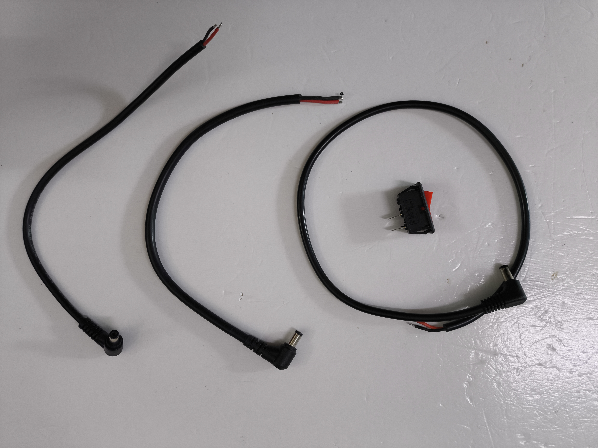

To connect one battery to both controllers, the team soldered the power wires, competition main-power switch, and split harness, and purchased matching wire and connectors. After the main switch, the harness splits into the Jetson DC5525 branch and the ESP32 driver-board DC5521 branch. Because the main switch is plastic and cannot be soldered directly, flag spade terminals complete the transition between the switch and harness.

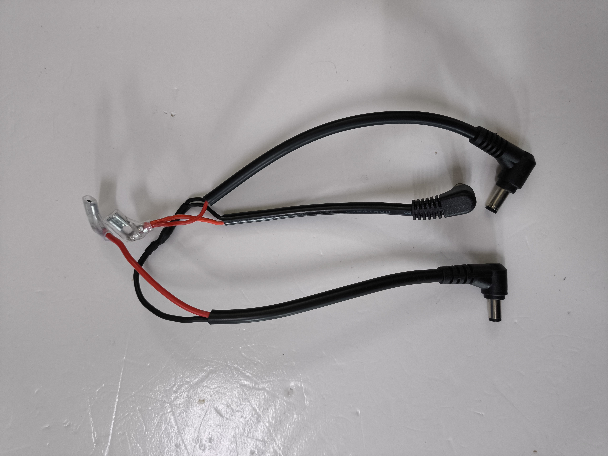

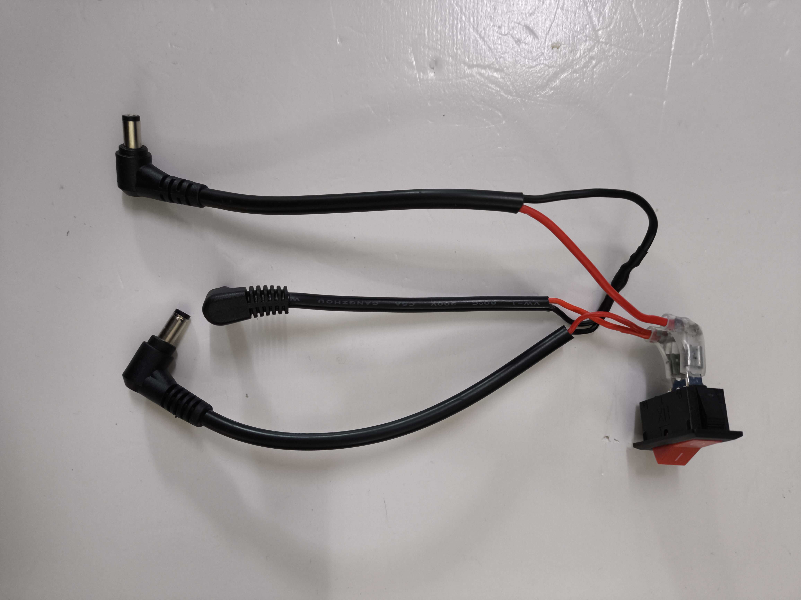

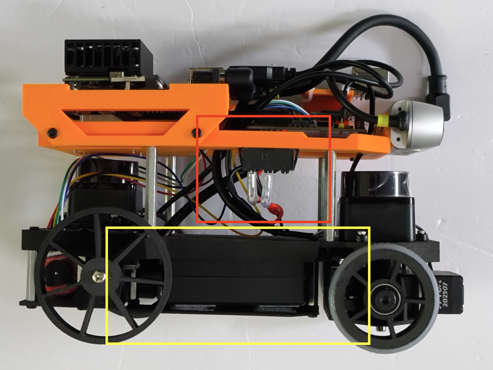

### Electrical and Wiring Safety Measures

1. **Protected battery pack.** The selected battery has a protective enclosure and charge/discharge protection. This reduces the risk of damage to the battery, wiring, and electronics from unsuitable charging or discharge conditions.
2. **Separate power-off and program-start controls.** The main-power switch is the first competition operation and disconnects power from the entire vehicle, including the motor supply, in one action. The separate Jetson program-start button is the second competition operation; it starts software only after vehicle power has been applied.
3. **Protected battery location.** The team rejected the magnetic-mount concept and instead uses a screw-secured battery-bay cover. This mechanically protects the battery and prevents it from moving during driving.
4. **Battery-state display and low-voltage warning.** The ESP32 board uses its ADC jumper and firmware to estimate remaining battery percentage. The OLED flashes blue below `9%`, providing an on-vehicle low-battery warning. The team verified that the battery can run with the percentage-display logic used by the vehicle.
5. **Internal cable routing.** All vehicle cables route inside the body and through dedicated holes in each printed chassis layer. No cable is left hanging outside the vehicle, reducing the risk of snagging obstacles, wheels, or external objects and stopping the vehicle.

## Actual Sensor Interfaces and Field Geometry

| Device | Actual connection | Selection and placement rationale |
|---|---|---|
| Front LDROBOT STL-27L 2D LiDAR | ZHR-4 1.5 mm interface to a Jetson GPIO/serial link | Front horizontal scanning measures walls, corridors, and obstacle distances. |
| Rear LDROBOT STL-27L 2D LiDAR | ZHR-4 1.5 mm interface → CP2102 TTL-to-USB module → Jetson USB-A | Completes rear scanning; offset from the front LiDAR and merged in software as `/scan`. |
| Intel RealSense D435f | Camera USB-C → Jetson USB-A | Installed on the front centerline. Provides color images and aligned depth for red/green obstacle recognition and forward distance information. |
| TM171 IMU | IMU USB-C → Jetson USB-A | Located on the raised layer next to the Jetson, providing attitude- and heading-related data. |

### Sensor, Cable, and Interface Record

The table consolidates physical-photo evidence, interface route, and cable length; the datasheets for all three sensor types open from the final column. Where no length is stated, the adapter has no separately measured length record; dimensions are not estimated from photographs.

| Photo and item | Interface route | Cable, length, and final status | Datasheet |
|---|---|---|---|
| Front and rear LDROBOT STL-27L 2D LiDARs (Photos A) | Front LiDAR: ZHR-4 (1.5 mm, 4-pin) → 20 cm harness → Jetson 40-pin header; rear LiDAR: ZHR-4 → 20 cm harness → CP2102 TTL-to-USB adapter → Jetson USB-A. | Both LiDARs use the final `20 cm` ZHR-4-to-2.54 mm Dupont-female harness in Photo C. The rear LiDAR then uses the `5.5 cm` CP2102 TTL-to-USB adapter in Photo D. | [STL-27L datasheet](../media/datasheets/LiDAR-LDROBOT-STL-27L-datasheet.pdf) |
| Intel RealSense D435f (Photos E–F) | D435f USB-C → right-angle USB-C to straight USB-A-male cable → Jetson USB-A. | `10 cm`; final configuration. | [RealSense D400-series datasheet](../media/datasheets/RealSense-D400-Series-Datasheet-Mar-2026.pdf) |
| TM171 IMU (Photos G–H) | TM171 USB-C → USB-C-to-USB-A-male cable → Jetson USB-A. | `10 cm`; final configuration. | [TM171 datasheet](../media/datasheets/IMU-SYD-Dynamics-TransducerM-TM171-Datasheet.pdf) |

#### LiDARs and Cables

#### LiDAR Cable Iteration: Superseded Cable and Final 40-Pin-Header Harness

The team first purchased the `30 cm` ZHR-4-to-USB-A-male cable in Photo B, intending to connect the LiDAR directly by USB. The LiDAR did not respond in the vehicle, so this cable was not used in the final vehicle. Photo C shows the subsequently purchased and final `20 cm` ZHR-4-to-four-2.54 mm-Dupont-female harness. It allows the front LiDAR's ZHR-4 power and serial signals to connect separately to the Jetson 40-pin header. The rear LiDAR uses neither direct-USB option; it reaches Jetson USB-A through the CP2102 TTL-to-USB adapter in Photo D.

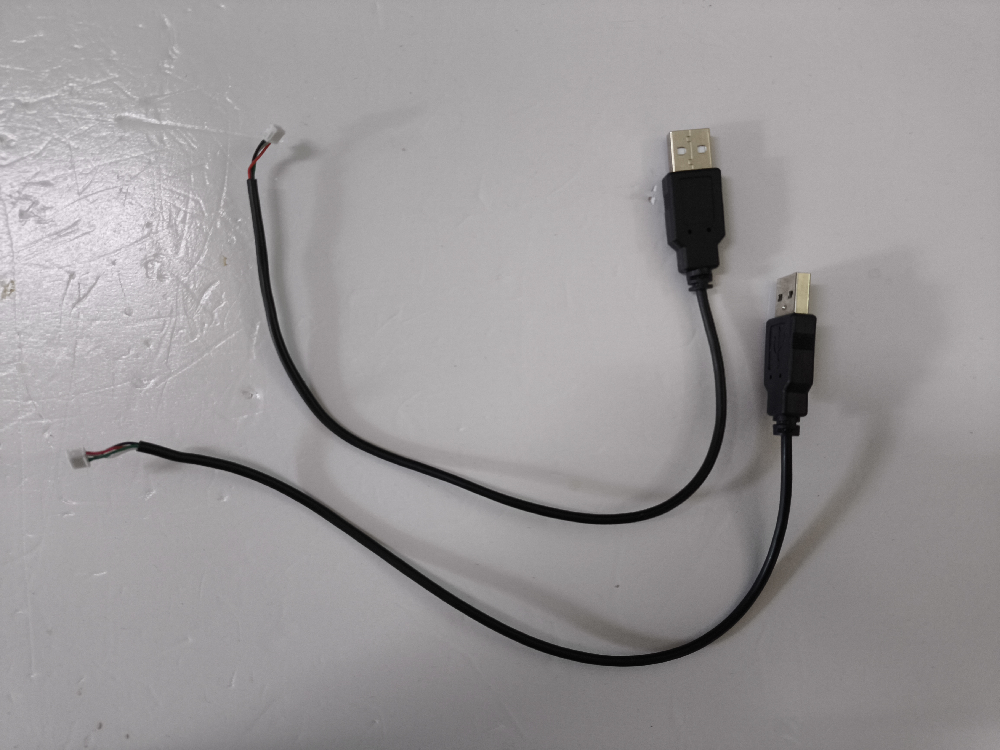

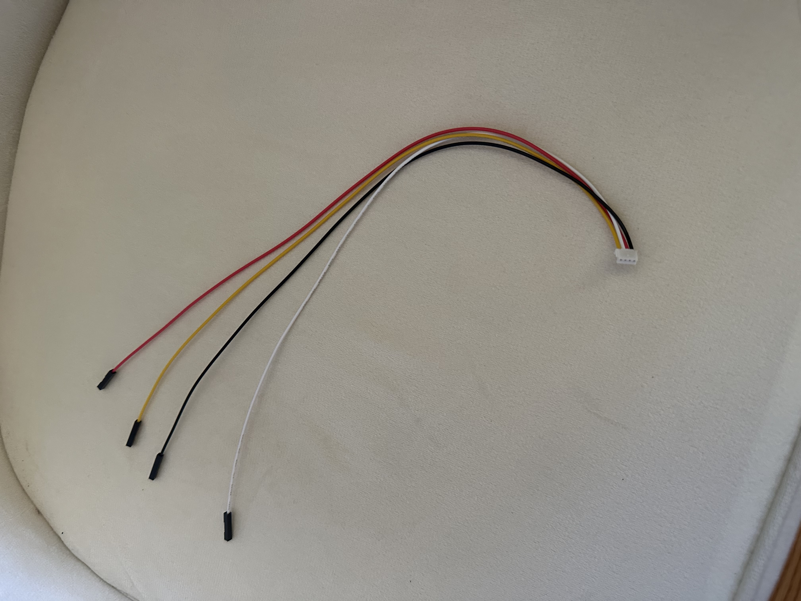

#### Depth Camera

#### IMU

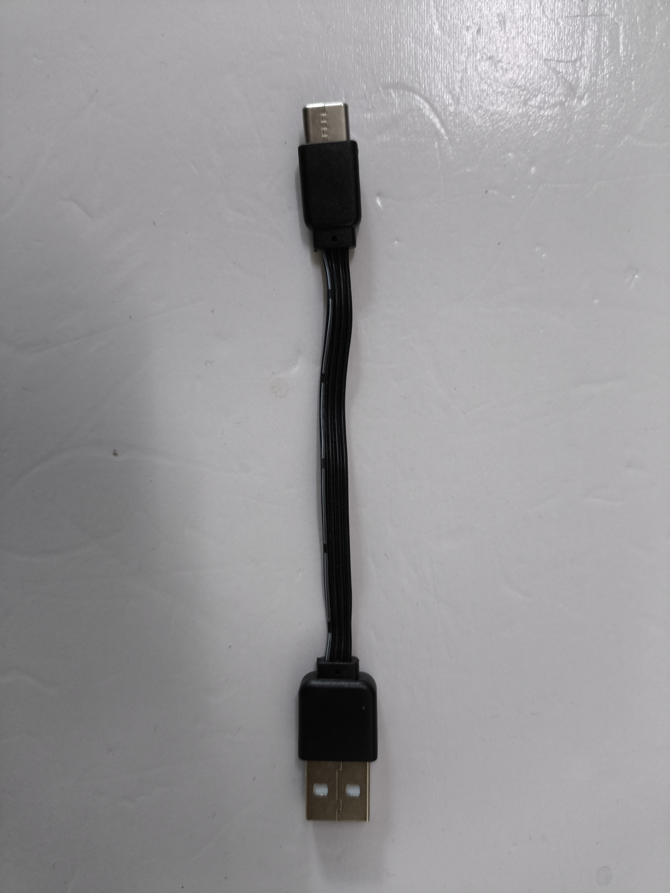

#### IMU Orientation and Cable-Routing Iteration

The TM171 IMU was originally planned with its connector facing the vehicle rear, which risked leaving its USB cable hanging out of the rear of the vehicle. The team installed the IMU inverted by `180°` so that the cable could remain inside the protected routing path. The team initially expected that this orientation might require additional reversal of IMU data. In observed automatic-steering runs, no orientation error was seen and the vehicle steered correctly, so this installation was retained. The bracket iteration that improved cooling clearance around the IMU and Jetson and ultimately integrated the program-start button is documented in [Chapter 4](04-mobility-and-mechanical-design.md).

### Sensor Calibration and Extrinsic-Frame Construction

The team began by distinguishing **intrinsic calibration** from **extrinsic calibration**. Intrinsic calibration establishes the measurement model within a sensor; extrinsic calibration establishes each sensor's position and orientation relative to the vehicle coordinate frame. The D435f camera, STL-27L LiDARs, and TM171 IMU each support the ROS 2 ecosystem and were first brought up with their vendor-provided ROS 2 packages to complete their intrinsic-calibration and configuration procedures.

The first extrinsic-calibration attempt focused on the camera and LiDAR. The team recorded ROS 2 bags while driving the vehicle and evaluated several calibration projects that calculate transforms from the recorded data: [ros2_camera_lidar_fusion](https://github.com/CDonosoK/ros2_camera_lidar_fusion?tab=readme-ov-file), its [ROS 2 release announcement](https://discourse.openrobotics.org/t/ros-2-camera-lidar-fusion-package-released/41550), and [camera_2d_lidar_calibration](https://github.com/ehong-tl/camera_2d_lidar_calibration/blob/master/how%20to%20use.pdf). The first two candidates target a 3D LiDAR with a depth camera, while the last candidate supports ROS rather than ROS 2 and would have required extensive dependency changes.

The final method was therefore manual extrinsic-frame construction. The team measured the relative distances between installed components with calipers, encoded the positions and orientations in the vehicle URDF/Xacro model, and checked the result in Gazebo against the component locations exported from the CAD model. The calibration was accepted when the URDF model agreed with the CAD/STL layout. The implementation is recorded in the [vehicle URDF/Xacro model](https://github.com/AGitUser0001/WRO-FE-2026/blob/main/src/robot/urdf/robot.urdf.xacro). These transforms provide the common vehicle frame for the front and rear LiDARs, D435f, and IMU.

The team also investigated whether the IMU needed a separate pairwise calibration with the camera or LiDAR. It did not: the IMU is placed in the vehicle frame through the URDF transform, while its role is to be fused with wheel odometry. The team tried the `robot_localization` EKF to fuse IMU data with wheel odometry, but the resulting state estimate contained too much noise. The final vehicle therefore uses its own encoder-pulse wheel-odometry calculation rather than the EKF localization output; see [Chapter 3, “5. Rear-Drive Motor, Encoder Pulses, and Odometry”](03-system-architecture.md#5-rear-drive-motor-encoder-pulses-and-odometry).

### Assessment of Field Geometry and Sensor Installation Positions

The course walls, red/green traffic signs, and parking-area limits are all `100 mm` high. The vehicle relies primarily on LiDAR for obstacle avoidance, while the D435f camera identifies red and green obstacles; final decisions still fuse camera recognition with LiDAR distance information. The team therefore treated LiDAR scan height as the first installation constraint. A 2D LiDAR changes its emission direction and measures distance only in one fixed horizontal scan plane; it does not create a three-dimensional point cloud covering the object's height. The two LiDAR scan planes are positioned at approximately `85 mm`, below `95 mm`, so that they intersect the `100 mm`-high course objects. The merged front and rear scans complete the horizontal environmental information around the vehicle. See [Chapter 3, “1. Dual-LiDAR Scan-Data Merging”](03-system-architecture.md#1-dual-lidar-scan-data-merging) for runtime visualizations and the merge chain.

The trade-off for prioritizing the LiDAR scan-plane height is that the D435f is mounted above `100 mm`. To simplify LiDAR data fusion, the front LiDAR is installed forward at `0°`, and the rear LiDAR is installed inverted by `180°`.

#### Failure Point: Measured Coverage Risks and an Unused Camera-Mount Iteration

- **Local blank returns remain after dual-LiDAR merge:** On the physical vehicle, the merged front and rear LiDAR scan still has blank returns in some regions. Brass standoffs used to secure the layered chassis block part of the horizontal scan planes. The two LiDARs improve front/rear coverage but do not remove every physical occlusion.
- **Near-field camera field-of-view risk:** Because the D435f is above `100 mm`, when the vehicle is approximately `20 mm` from an object, the non-fisheye camera may no longer contain that object in its field of view. The team made a [15° upward camera-shield STL](https://github.com/clover1983/robot-wro-2026-prepare/blob/f27414065c60d031a51d10507961fe26a8088ab5/robot_top_15deg.stl) and a [20° upward camera-shield STL](https://github.com/clover1983/robot-wro-2026-prepare/blob/f27414065c60d031a51d10507961fe26a8088ab5/robot_top_20deg.stl) to improve the near-field lower view. The change would also alter the camera extrinsics relative to the vehicle and other components. With insufficient time to complete new extrinsic calibration, neither mount iteration was used.

## Evidence Links

### Controller boards, power tree, and interfaces

- [ESP32 Driver Board User Manual](../media/electronics-interfaces/ESP32_Driver_Board_User_Manual_EN.pdf)
- [ESP32 driver-board circuit schematic](../media/electronics-interfaces/esp32-mainboard-schematic-en.pdf)
- [TMI3255S 12 V-to-5 V buck-regulator datasheet](../media/datasheets/tmi3255s-12v-to-5v-buck-regulator-datasheet.pdf)
- [AMS1117-3.3 5 V-to-3.3 V linear-regulator datasheet](../media/datasheets/ams1117-3.3-5v-to-3.3v-linear-regulator-datasheet.pdf)
- [Jetson Orin Nano Super Developer Kit hardware layout](https://docs.nvidia.com/jetson/orin-nano-devkit/user-guide/latest/hardware_layout.html)
- [Jetson carrier-board circuit schematic](../media/electronics-interfaces/jetson-p3768-carrier-board-circuit-schematics.pdf)
- [Jetson Orin Nano Developer Kit Carrier Board Specification](../media/datasheets/Jetson-Orin-Nano-DevKit-Carrier-Board-Specification_SP-11324-001_v1.3.pdf)
- [Power and current budget CSV](../hardware/electronics/power-budget.csv)

### Sensors, wired communication, and audio

- [LDROBOT STL-27L LiDAR datasheet](../media/datasheets/LiDAR-LDROBOT-STL-27L-datasheet.pdf)
- [Intel RealSense D400-series datasheet](../media/datasheets/RealSense-D400-Series-Datasheet-Mar-2026.pdf)
- [SYD Dynamics TM171 IMU datasheet](../media/datasheets/IMU-SYD-Dynamics-TransducerM-TM171-Datasheet.pdf)
- [WIZnet W5500 reference](https://docs.wiznet.io/Product/ioModule/W5500-io)
- [CP2102 TTL-to-USB procurement record](https://item.taobao.com/item.htm?id=41452309856&mi_id=0000iBv0a62NlDhBDxf6cF-hwRiyM1QnKoqJVEZdhgitQLY&spm=tbpc.boughtlist.suborder_itemtitle.1.3be32e8dDSRKB8)
- [ES8311 low-power mono audio CODEC datasheet](../media/datasheets/es8311-low-power-mono-audio-codec-datasheet.pdf)
- [NS4150B audio power-amplifier datasheet](../media/datasheets/NS4150B-Audio-Power-Amplifier.pdf)

### Motor, steering, and display hardware

- [Toshiba TB6612FNG brushed DC motor-driver datasheet](../media/datasheets/toshiba-tb6612fng-brushed-dc-motor-driver-datasheet.pdf)
- [GA25-370 motor procurement record](https://item.taobao.com/item.htm?id=733194818655&mi_id=0000XUjxitOj45pqZWu_0daB__oENBec627b-gNIYhnyV-I&spm=tbpc.boughtlist.suborder_itemtitle.1.3be32e8dDSRKB8)
- [SC-1258TG+ steering-servo product page](https://savox-servo.com/en/product/SC-1258TGplus/savox-servo-sc-1258tg-digital-coreless-motor-titanium-gear)
- [0.96 in OLED procurement record](https://item.taobao.com/item.htm?id=548521166638&mi_id=0000h_k10S-pHYHv0SfbJUlQ2P589HKq1WkTjGkoIJ3enP0&spm=a21xtw.29978516.0.0&xxc=shop)

### Battery and 12 V-to-19 V iteration

- [WHEELTEC E345S 12 V 4500 mAh battery procurement record](https://item.taobao.com/item.htm?id=657164512973&mi_id=0000JoQWyuiQgTyMrxnNZ9xngXJN-aGAH-8lM7v4-zzM1uQ&skuId=5851945799121&spm=tbpc.boughtlist.suborder_itemtitle.1.3be32e8dDSRKB8)
- [NVIDIA Developer Forum: Jetson Orin Nano 12 V supply discussion](https://forums.developer.nvidia.com/t/power-supply-for-jetson-orin-nano-development-kit/264241)
- [Community 4S LiPo direct-supply example](https://www.reddit.com/r/diydrones/comments/1h1o08s/powering_a_nvidia_jetson_orin_nano_from_a_4s_lipo/)

### Calibration, URDF, and camera-mount iterations

- [ROS 2 camera–LiDAR fusion calibration project](https://github.com/CDonosoK/ros2_camera_lidar_fusion?tab=readme-ov-file)
- [ROS 2 camera–LiDAR fusion release announcement](https://discourse.openrobotics.org/t/ros-2-camera-lidar-fusion-package-released/41550)
- [camera_2d_lidar_calibration usage guide](https://github.com/ehong-tl/camera_2d_lidar_calibration/blob/master/how%20to%20use.pdf)
- [Vehicle URDF/Xacro model](https://github.com/AGitUser0001/WRO-FE-2026/blob/main/src/robot/urdf/robot.urdf.xacro)
- [15° camera-mount iteration STL](https://github.com/clover1983/robot-wro-2026-prepare/blob/f27414065c60d031a51d10507961fe26a8088ab5/robot_top_15deg.stl)
- [20° camera-mount iteration STL](https://github.com/clover1983/robot-wro-2026-prepare/blob/f27414065c60d031a51d10507961fe26a8088ab5/robot_top_20deg.stl)

### ROS 2 and micro-ROS software references

- [micro_ros_espidf_component](https://github.com/micro-ROS/micro_ros_espidf_component)
- [micro_ros_arduino for Humble](https://github.com/micro-ROS/micro_ros_arduino/tree/humble)
- [robot_localization documentation](https://docs.ros.org/en/rolling/p/robot_localization/)

### Related vehicle documentation

- [System architecture: sensors, W5500, and data links](03-system-architecture.md)
- [Mobility and mechanical design: single battery, wiring, and physical sensor layout](04-mobility-and-mechanical-design.md)
