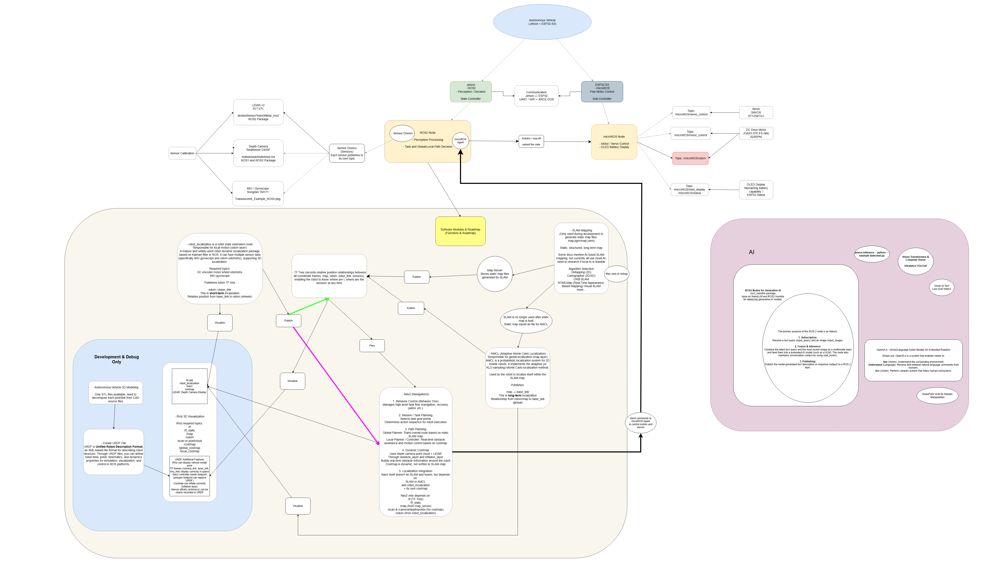
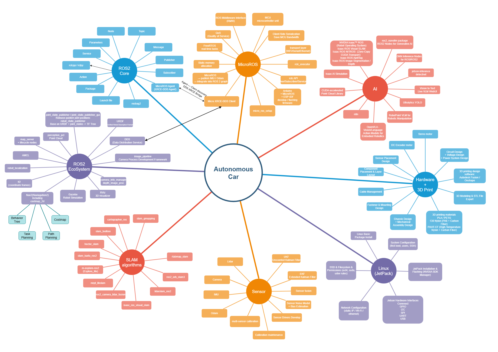

# Software and Control Architecture

## Summary

The robot did not begin with the final dedicated planner. Development first used the standard ROS 2 ecosystem: Ubuntu, ROS 2, sensor drivers, Gazebo, `robot_localization`, SLAM Toolbox, RTAB-Map, and Nav2 ran on the Jetson; the ESP32-S3 acted through micro-ROS as the real-time endpoint for motor, steering, encoder, display, and audio functions. After repeated simulator and physical-vehicle evaluation, the team retained ROS 2 for messages, drivers, visualisation, and build tools, but replaced SLAM/Nav2 as the competition-time navigation method with a dedicated state machine built around the known field, LiDAR, IMU, encoder odometry, and team-developed mapping and path-planning logic.

This was not a departure from ROS 2. ROS 2 remains the communication and driver foundation; the final control workspace is built with `colcon build` and launched with `ros2 launch`.

## Initial architecture and technical direction

The first software architecture deliberately centred on the ROS 2 ecosystem: sensor topics would feed perception, localisation, SLAM, Nav2, and actuator control, while the Jetson would command the ESP32 through the network.

The early brainstorming map records the same intent: reuse common ROS libraries and begin with SLAM, Nav2, sensor fusion, and simulator tools rather than writing a dedicated navigator at the outset.

The benefit was reusable interfaces for drivers, transforms, recording, visualisation, and navigation. The corresponding risk was that general-purpose navigation components still had to remain stable on this small field, around short-range obstacles, and with this vehicle's sensor noise. The later iterations were driven by that risk.

## Platform, operating system, and ROS 2 baseline

The team selected JetPack 6.1 / Ubuntu 22.04 for the Jetson Orin Nano Super Developer Kit and ROS 2 Humble, which matches Ubuntu 22.04. Humble is a long-term-support release; for this project, stability, available driver support, and compatibility with the Jetson system took priority over a newer ROS release.

The initial system setup, ROS 2 installation, base dependencies, and USB-device detection are retained as reproducible records:

| Work | Record |
|---|---|
| Flash JetPack, first boot, and system update | [001 — Jetson system](12-installation-record/001-jetson.md) |
| Install ROS 2 Humble and check talker/listener | [002 — ROS 2](12-installation-record/002-ros2.md) |
| Build and device dependencies; Python check | [003 — Base dependencies](12-installation-record/003-base-dependency.md) |
| ESP32-S3 USB detection, serial device, and user-group permissions | [004 — ESP32-S3 USB detection](12-installation-record/004-esp32s3-usb-detect.md) |

These steps initially used an HDMI monitor, keyboard, and mouse. The team subsequently configured [VNC remote access](12-installation-record/010-VNC.md), allowing development and debugging without continuously attaching HDMI.

## ESP32 and micro-ROS: a clear toolchain iteration

The ESP32-S3 does not make high-level path decisions. It serves as the single-board microcontroller (SBM) for the low-level motor, steering, encoder, display, and audio functions. From the beginning, the team planned to use micro-ROS so ROS 2 nodes on the Jetson could exchange topics and commands with the ESP32.

### Not adopted: `micro_ros_espidf_component`

The first implementation attempted `micro_ros_espidf_component`. It was not adopted for two reasons:

1. The purchased ESP32 carrier-board code used ESP-IDF 5.4, whereas the attempted micro-ROS component environment depended on ESP-IDF 4.0. The version and dependency conflicts were extensive; downgrading would disrupt the existing carrier-board firmware environment.
2. The team then tried to establish a separate ESP-IDF 4.0 environment, but the available toolchain target at that time was `amd64`; the development MacBook and Jetson are ARM systems and could not directly run or build that environment. Maintaining two incompatible ESP-IDF environments was not suitable for competition development.

The team stopped this route after about one day of investigation.

### Final choice: `micro_ros_arduino`

The team changed to `micro_ros_arduino`. The first alternative implementation successfully flashed the ESP32-S3 and exchanged ROS 2 messages. The Arduino IDE, ESP32 board package, micro-ROS library, and flashing process are recorded in [005 — Arduino and micro-ROS on Jetson](12-installation-record/005-Arduino-Jetson.md). The physical ESP32 firmware is maintained in [src/esp32](https://github.com/AGitUser0001/WRO-FE-2026/tree/main/src/esp32).

The Jetson then ran a micro-ROS Agent, validating the Jetson-to-ESP32 command path and status topics; the build and UDP-Agent sequence is recorded in [006 — Jetson micro-ROS Agent](12-installation-record/006-microROSAgent-Jetson.md). W5500 provides wired Ethernet between the ESP32 and Jetson; the module, addressing, and user-group configuration are documented in [008 — W5500 network configuration](12-installation-record/008-add-module-config-eth-user-group.md).

## Sensors, frames, and runtime data foundation

The following devices entered ROS 2 as topics for both the generic SLAM/Nav2 experiments and the later dedicated control code:

| Module | Runtime role | Installation or configuration record |
|---|---|---|
| Front/rear STL-27L LiDARs and dual-LiDAR merge | Walls, openings, obstacles, and local scans | [009 — LiDAR and dual-LiDAR merge](12-installation-record/009-LiDAR.md) |
| RealSense D435f | Depth/colour images and obstacle-colour information | [011 — RealSense SDK and ROS 2](12-installation-record/011-Camera-SDKs.md) |
| TM171 IMU | Heading and angular velocity; interpreted with wheel odometry | [014 — TM171 IMU](12-installation-record/014-imu.md) |
| GA25-370 encoder | Pulse counts and wheel-odometry basis | [Chapter 5: sensor, cable, and interface record](05-power-and-sensor-architecture.md#sensor-cable-and-interface-record) |

The team also tried software LiDAR–camera extrinsic calibration. Available ROS 2 projects targeted 3D LiDAR, or supported ROS 1 only; an unsuccessful automatic calibration was not presented as the final result. The final extrinsics were established by caliper measurements, URDF/Xacro, and Gazebo comparison against the CAD/STL layout; the detailed method is in [Chapter 5, “Sensor Calibration and Extrinsic-Frame Construction”](05-power-and-sensor-architecture.md#sensor-calibration-and-extrinsic-frame-construction). The manual transforms were accepted when the component-inclusive URDF model overlaid the complete CAD/STL component layout in Gazebo. This work took approximately one month.

## Gazebo, SLAM, and Nav2 evaluation

The team built a Gazebo field world and first tested the vehicle in simulation. The following files are configuration snapshots actually used in that evaluation and now copied into this documentation directory:

| Component | Documentation copy | Purpose |
|---|---|---|
| Gazebo world | [wro-fe-obstacle-textures.world](../media/software-artifacts/ros2-stack-evaluation/wro-fe-obstacle-textures.world) | Field textures, walls, and obstacle scene |
| `robot_localization` EKF | [ekf-odom-imu.yaml](../media/software-artifacts/ros2-stack-evaluation/ekf-odom-imu.yaml) | Trial state estimation from wheel odometry and IMU |
| SLAM Toolbox | [slam-toolbox-online-async.yaml](../media/software-artifacts/ros2-stack-evaluation/slam-toolbox-online-async.yaml) | Online 2D SLAM parameters |
| Nav2 | [nav2-parameters.yaml](../media/software-artifacts/ros2-stack-evaluation/nav2-parameters.yaml) | Costmap, planning, and recovery parameters |

The RTAB-Map 3D-SLAM attempt repeatedly reported that it could not close the loop. SLAM Toolbox did not issue the same loop-closure error, so the team continued mapping experiments with it. SLAM mapping could remain stable during manual driving; however, the map still jumped when Nav2 changed pose. The team repeatedly inspected `robot_localization`: it changed the combinations of IMU and odometry state permitted into the EKF, and even tried IMU alone, but the estimated state remained too noisy and unstable. The final vehicle therefore does not use the EKF output and instead uses team-developed encoder odometry.

The work also encountered these physical issues and limits:

| Problem | Investigation and iteration | Outcome |
|---|---|---|
| ESP32 reset during longer runs | Communication/control timeout increased from about 2 s toward 15 s and a watchdog was added; the values were adjusted several times | Resets became much less frequent, allowing continued vehicle tests. |
| ESP32 crash after extended odometry calculation | The ESP32 no longer completed all odometry calculation; a separate UDP port received encoder pulses and the Jetson calculated odometry | Offloading the computation improved odometry runtime. |
| Nav2 simulator avoidance quickly became infeasible | Costmap, inflation, and avoidance behaviour were checked at the approximately 25 cm scale; the team suspected a mismatch between generic parameter scale and vehicle clearance | No stable obstacle-avoidance behaviour suitable for competition was obtained. |
| SLAM map jump when Nav2 changed pose | SLAM Toolbox, EKF, IMU/odom combinations, and Nav2 were repeatedly adjusted | No closed-loop baseline stable enough for competition was produced. |

After roughly one month of SLAM and Nav2 adjustment without an acceptable competition baseline, the team stopped using the generic SLAM/Nav2 stack as the final autonomous navigator. This was an engineering decision for this field and vehicle, not a claim that the packages are unsuitable in every environment.

## From generic navigation to a dedicated state machine

### Open Challenge: first successful map-free baseline

The team first wrote a dedicated Python controller for the Open Challenge. It obtains the merged LiDAR scan; because the installed scanners have a slight angular offset, the program combines wall-line evidence from the scan with the straight-track assumption and drives along the corridor centre line. Centring is not map optimisation: it is a track-specific hard-coded rule. When LiDAR identifies a wall line on one side, the control target is an offset of approximately `0.4 m` from that wall toward the inside of the course, which approximates the corridor centre. Encoder odometry records travel distance; on the approximately 3 m track, at about 0.55 m before the target area, the program enters a corner state and uses an IMU heading change of approximately `+90°` to complete the turn.

This version had no SLAM or global map. It relied on current wall lines, travelled distance, and predefined corner transitions. Although simple, the first Open Challenge baseline worked quickly, demonstrating that a dedicated state machine could be more reliable than the unstabilised generic navigation chain on the known obstacle-free field.

### Obstacle Challenge: why the Open state machine could not simply be reused

Applying the Open logic directly to the Obstacle Challenge failed because corner and obstacle logic competed for control priority. If corner logic wins, the vehicle can collide with an obstacle; if obstacle logic wins, it can miss a corner, making lap counting and later position decisions incorrect.

Instead of adding temporary priority rules, the team implemented its own map, localisation, and planner for the Obstacle Challenge. Local scans form a local grid, while time-consistent observations update a global grid. Encoder odometry and IMU provide the continuous localisation basis, with finite correction from LiDAR wall/opening features. The planner considers known obstacles, walls, vehicle clearance, corners, and recovery motions within one path-selection chain, allowing obstacle passing, corner handling, safe backup, and replanning to coexist.

The final competition software is maintained in [WRO-FE-2026 `src/robot`](https://github.com/AGitUser0001/WRO-FE-2026/tree/main/src/robot). After cloning, build the workspace with `colcon build`, then run the `ros2 launch` command specified by the selected challenge configuration. Before deployment, complete the Jetson, Agent, network, and sensor checks in [Chapter 12, System Installation and Initialisation](12-build-and-operation-guide.md#system-installation-and-initialisation).

## Final-architecture boundary

The final code still uses ROS 2 for sensor drivers, topic transport, logging, visualisation, building, and launch. micro-ROS remains the real-time control connection between Jetson and ESP32. What was removed from competition-time decision-making was the direct global-localisation or navigation role of RTAB-Map, SLAM Toolbox, `robot_localization` EKF, and Nav2. The retained simulator world and configuration snapshots make the attempts reproducible; the final state machine is designed for the real field's dimensions, repeated geometry, three-lap logic, and safe recovery.

## Evidence and reproduction entry points

- [Initial autonomous-car architecture diagram](../../diagrams/autonomous_car_diagram_en.png)
- [Early development mind map](../../mindmaps/autonomous_car_mindmap_en.png)
- [Complete installation-record directory](12-installation-record/README.md)
- [Gazebo, EKF, SLAM Toolbox, and Nav2 configuration copies](../media/software-artifacts/ros2-stack-evaluation/)
- [ESP32 micro-ROS firmware](https://github.com/AGitUser0001/WRO-FE-2026/tree/main/src/esp32)
- [Final Jetson robot-control code](https://github.com/AGitUser0001/WRO-FE-2026/tree/main/src/robot)
