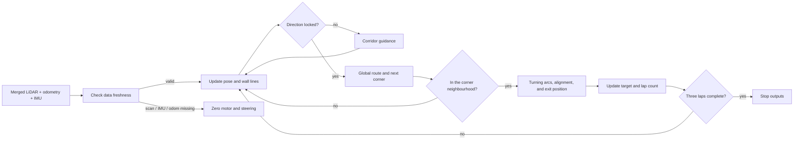
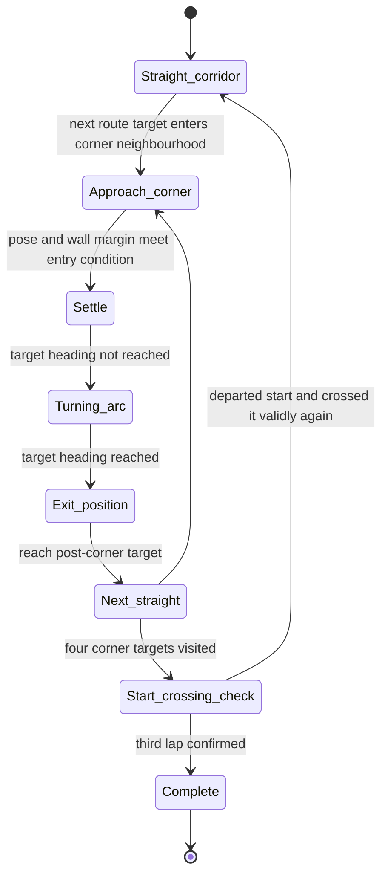

# Open Challenge Strategy

## An obstacle-free course: turn the route into a repeatable driving rhythm

The Open Challenge has no colour pillars or required passing manoeuvres, but it is not “drive forward on a fixed timetable.” After start, the vehicle must identify the course direction, remain in the corridor, pass four corners, maintain continuous motion from odometry and IMU, and stop only after three completed laps. The public demonstration is available on [YouTube](https://youtu.be/FDlq30FkXkA?si=35xpGzAMFtRC2q4T).

[](https://www.youtube.com/watch?v=FDlq30FkXkA)

*Click the preview to play the public Open Challenge video on YouTube.*

The final system shares the same `Driver`, `GridPlanner`, LiDAR grids, odometry, IMU, and corner state machine as the Obstacle Challenge. There is no separate final navigator written only for Open Challenge. The difference comes from the environment: with no tracked obstacle or colour observation, the obstacle program produces no plan, so the chain naturally proceeds through direction identification → route → corner → lap confirmation. The obstacle-free run is therefore evidence of the same vehicle loop with fewer branches, not a different control architecture. [Planner arbitration entry point](https://github.com/AGitUser0001/WRO-FE-2026/blob/main/src/robot/planner/planner.py#L163-L254)



## 1. The same vehicle software, with fewer task branches

| Always active | Does not produce a plan in Open Challenge | Consequence for the run |
| --- | --- | --- |
| LiDAR scans, local/global grids, encoder odometry, IMU heading, direction lock, weighted route, corner state machine, and three-lap counting. | Colour-pillar association, red/green passing, and U-turn programs: in the obstacle-free environment there is no active obstacle anchor, so these branches return no plan. | The route remains sensor-closed-loop; three laps are not produced by time or prerecorded servo angles. |

For every scan, the Driver first selects nearby odometry and IMU data. If the scan is older than about `0.30 s`, odometry is unavailable, or the IMU is stale, it publishes zero motor and steering commands. Open Challenge has fewer navigation tasks, but retains this input-integrity gate. [Driver input checks and safe stop](https://github.com/AGitUser0001/WRO-FE-2026/blob/main/src/robot/planner/driver.py#L337-L433)

## 2. Read the opening before committing to a direction

Inside the direction-decision section, LiDAR wall lines are compared with left and right course hypotheses. When the hypotheses score similarly, the system remains unknown; it locks only after one direction has continuing confirmation. The defaults are `3` confirmation frames and a score-difference threshold of `0.18`. Before lock, it uses a corridor plan. Only after lock does it establish the four corner targets and route goal. [Direction evidence, confirmation, and lock](https://github.com/AGitUser0001/WRO-FE-2026/blob/main/src/robot/planner/odometry_localize.py#L104-L201) [Parameter definitions](https://github.com/AGitUser0001/WRO-FE-2026/blob/main/src/robot/planner/config.py#L36-L44)

This confirm-then-commit behaviour avoids creating an entire lap in the wrong direction because one startup scan happened to show one wall more clearly. It is the key opening decision for an obstacle-free run.

## 3. Corridor centre is not timed straight driving

The first successful baseline had neither SLAM nor a global map. The team combined the slightly tilted wall lines in the merged LiDAR scan with the assumption that the course was a straight corridor: when a wall was found on one side, that wall distance plus about `0.40 m` became the correction target toward the corridor centre. Encoder odometry measured distance; on an approximately `3 m` straight, when about `0.55 m` remained to the target area, the program changed to its corner state and used an IMU heading change of about `+90°` to complete the turn.

That was an explicitly hard-coded baseline. It quickly demonstrated that a known, clear course could be completed from “wall line + travelled distance + predefined turn” without the then-unstable SLAM/Nav2 chain. Its limitation was equally clear: after colour pillars and bypasses were introduced, obstacle and corner priorities conflicted. That experience led to the final shared grid planner; the software-development sequence is recorded in [Chapter 06: Software and Control Architecture](06-software-and-control-architecture.md).

The final shared planner no longer uses `0.40 m` as its sole control formula. It writes the current LiDAR observation into a `LocalGrid`, transforms and fuses it into the `GlobalGrid` using odometry + IMU pose, then calculates a route from corridor/route goals, walls, and the vehicle footprint. In an obstacle-free course there is no active obstacle cost, but wall lines, body width, initial motion arc, and clearance checks still constrain the feasible path. [Wall lines and local observations](https://github.com/AGitUser0001/WRO-FE-2026/blob/main/src/robot/planner/sensors.py#L190-L279) [Route-target generation](https://github.com/AGitUser0001/WRO-FE-2026/blob/main/src/robot/planner/planner.py#L1969-L2041) [Clearance checks](https://github.com/AGitUser0001/WRO-FE-2026/blob/main/src/robot/planner/graph_path.py#L258-L335)

## 4. The four-part rhythm of one lap



The route is composed of four corner centres and their adjacent guide points; a turn is not compressed into one large steering command. On the first lap, the state machine uses IMU heading and odometry distance for turning arcs, checks wall margin, and, when needed, enters `corner-backup` to reverse to the corner-exit position. On later laps, it advances the target according to visited corners. This separates the geometry of turning, proof that the vehicle has actually turned, and the decision to start the next straight. [Corner states and recovery](https://github.com/AGitUser0001/WRO-FE-2026/blob/main/src/robot/planner/planner.py#L1661-L1906)

After every departure from the start, the vehicle must first move at least `0.60 m`. When a set of corners is completed, a lap is added only on a return through the start longitudinal/lateral window. At `course_laps = 3`, the planner sets `course_complete` and the Driver zeros motor and steering output. [Lap conditions and stop](https://github.com/AGitUser0001/WRO-FE-2026/blob/main/src/robot/planner/planner.py#L2096-L2153)

## 5. Steering is geometric look-ahead, not image PID

The final Open Challenge steering controller does not measure a lateral camera-image error and feed it to a PID loop. It derives a geometric steering angle from a look-ahead point on the feasible path. The Driver limits the angle to the mechanical steering limit, maps it to a servo command, and predicts the short trajectory from wheelbase, steering, command/actuation delay, and acceleration/deceleration time constants. If the prediction comes too close to a wall, motor output is blocked. [Geometric look-ahead steering](https://github.com/AGitUser0001/WRO-FE-2026/blob/main/src/robot/planner/graph_path.py#L1957-L1984) [Servo mapping and limit](https://github.com/AGitUser0001/WRO-FE-2026/blob/main/src/robot/planner/driver.py#L458-L474) [Short-horizon trajectory and collision prediction](https://github.com/AGitUser0001/WRO-FE-2026/blob/main/src/robot/planner/driver.py#L571-L751)

The same Ackermann constraints therefore govern corridor following, corner entry, and corner exit instead of applying unrelated servo timing rules to straights and turns.

## 6. Tuning: not merely increasing speed

Open Challenge tuning concerns continuity of motion. In the simulator and on the physical course, the team checks the following observations and then adjusts odometry scale, left/right steering effectiveness, IMU yaw scale, scan-noise assumptions, drive speed, and acceleration/deceleration time constants. The same parameters are exposed through `planner.launch.py`, providing a traceable configuration entry point for simulation and vehicle review. [Launch parameters](https://github.com/AGitUser0001/WRO-FE-2026/blob/main/src/robot/launch/planner.launch.py#L50-L153)

| Observation | Why it is recorded | First checks after failure |
| --- | --- | --- |
| Direction lock agrees with the course opening | A wrong direction produces wrong goals for the entire lap. | Wall-line extraction, direction-score difference, and consecutive confirmation frames. |
| Route remains continuous inside the corridor | No obstacle does not mean walls or the vehicle envelope can be ignored. | LiDAR freshness, LocalGrid/GlobalGrid, clearance, and look-ahead goal. |
| Each corner produces expected yaw and odometry change | A turn is not successful merely because a servo command was issued. | IMU, encoder, corner state, and mechanical linkage. |
| Vehicle stops after three laps | Avoid repeated counting near the start or driving past the finish. | Start-departure condition, crossing window, and `course_complete`. |
| Planning and control remain within the real-time loop | Delay can turn a correct route into an expired command. | scan/IMU/odometry freshness, planning time, and prediction blocks. |

The simulator success suite records target laps, zero collisions, direction correctness, start return, pose error, route-connected frame fraction, planning `p50/p95` time, curvature, and clearance. These are the common comparison framework for parameter changes, rather than replacing test records with one short video. [Success-suite metrics and gates](https://github.com/AGitUser0001/WRO-FE-2026/blob/main/src/robot/tests/run_success_suite.py#L86-L365)

## 7. Reproduction path

After completing the ROS 2, micro-ROS, and sensor setup in Chapter 12, run the following from the `WRO-FE-2026` ROS 2 workspace:

```bash
colcon build
source install/setup.bash
ros2 launch robot planner.launch.py
```

Before starting, confirm updates on `/scan`, `/wheel/odometry`, `/imu_data`, `/microROS/motor_control`, and `/microROS/servo_control`; autonomous output is controlled by the `auto_drive_enabled` launch argument. In a physical obstacle-free run, the shared planner still subscribes to camera topics, but without colour pillars or active obstacle anchors it does not enter an obstacle program. [Planner launch file](https://github.com/AGitUser0001/WRO-FE-2026/blob/main/src/robot/launch/planner.launch.py) [Parameter definitions](https://github.com/AGitUser0001/WRO-FE-2026/blob/main/src/robot/planner/config.py)

Mechanical dimensions, sensor positions, cables, and coordinate frames are in [Chapter 05: Power and Sensor Architecture](05-power-and-sensor-architecture.md). The shared planner's obstacle branches, reverse recovery, and detailed tests are in [Chapter 08: Obstacle Challenge Strategy](08-obstacle-challenge-strategy.md).

## Evidence and implementation links

- [Planner main logic: `planner.py`](https://github.com/AGitUser0001/WRO-FE-2026/blob/main/src/robot/planner/planner.py)
- [Driver input checks and actuator output: `driver.py`](https://github.com/AGitUser0001/WRO-FE-2026/blob/main/src/robot/planner/driver.py)
- [Direction lock and odometry/IMU localisation: `odometry_localize.py`](https://github.com/AGitUser0001/WRO-FE-2026/blob/main/src/robot/planner/odometry_localize.py)
- [Runtime parameters: `config.py`](https://github.com/AGitUser0001/WRO-FE-2026/blob/main/src/robot/planner/config.py)
