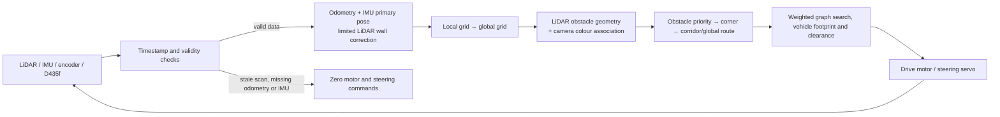
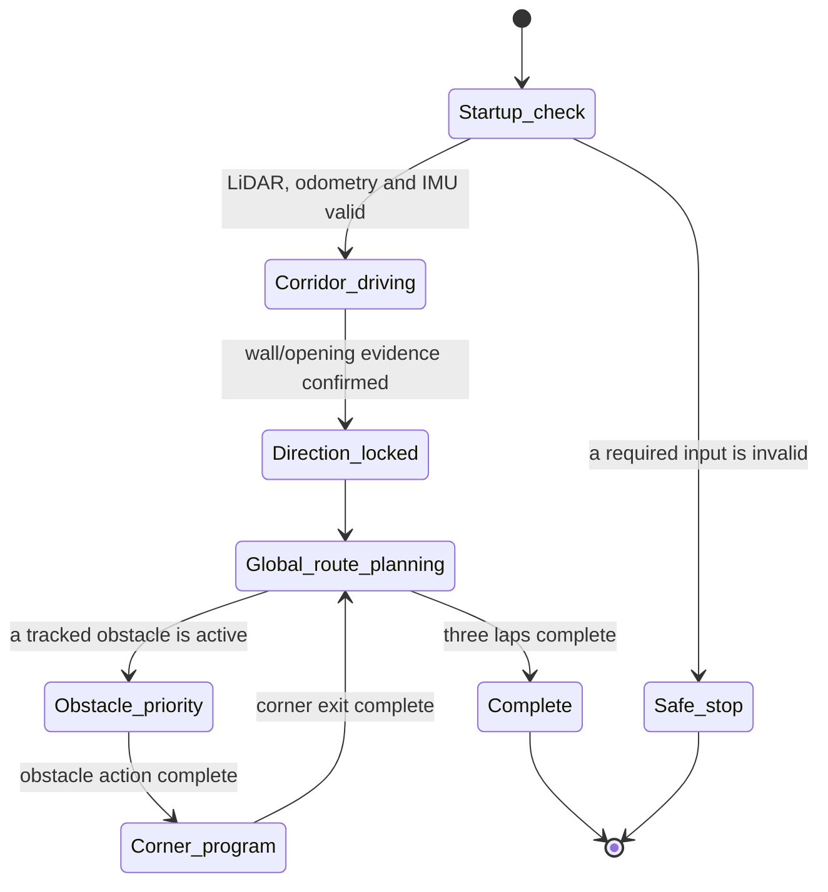
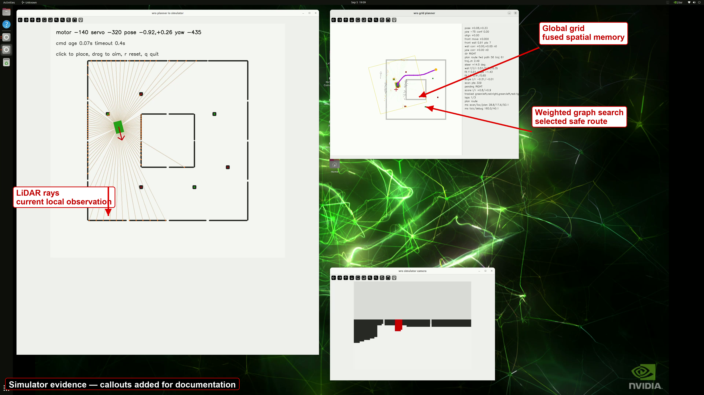
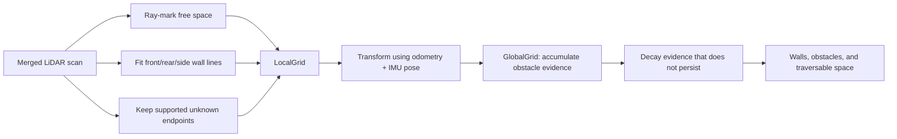
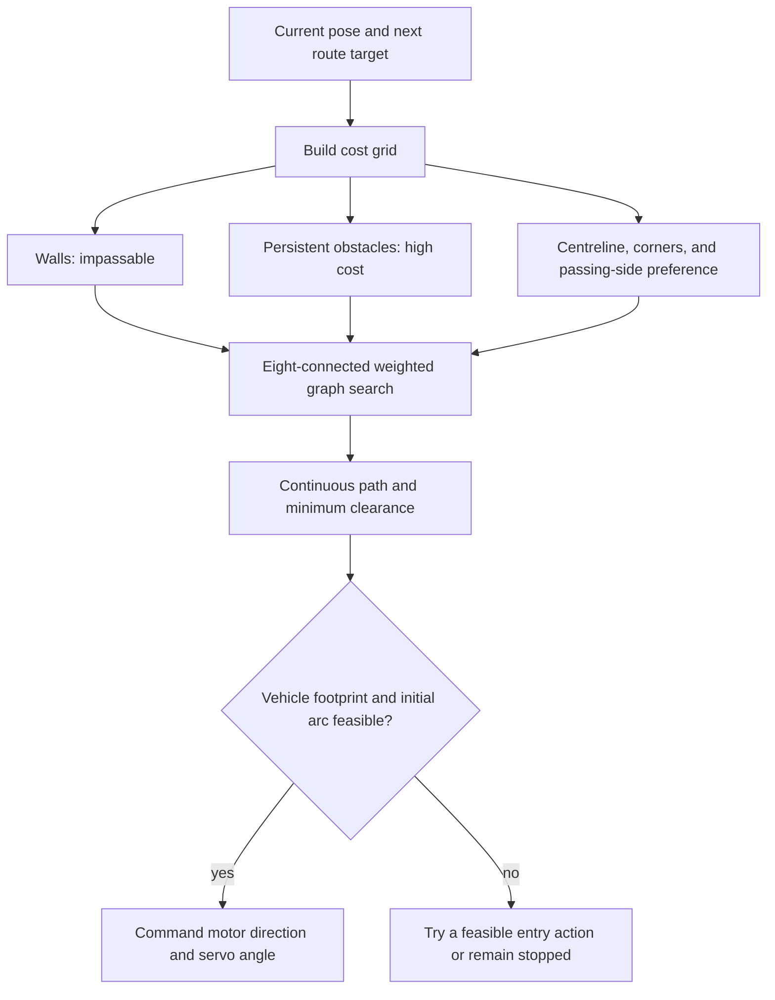
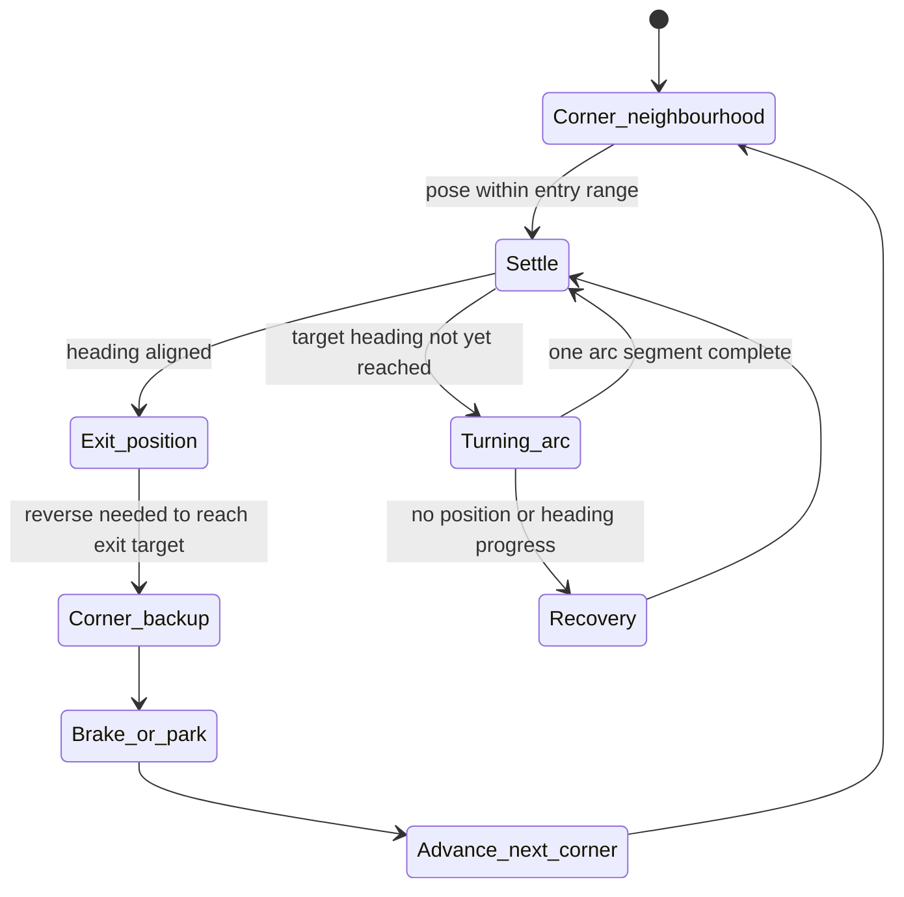
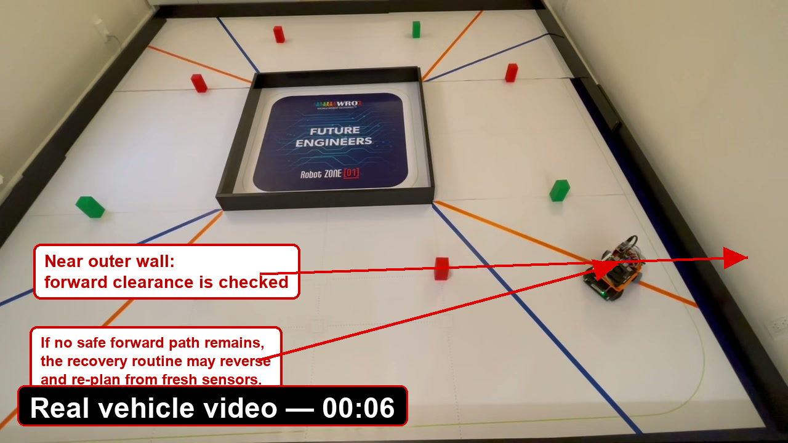
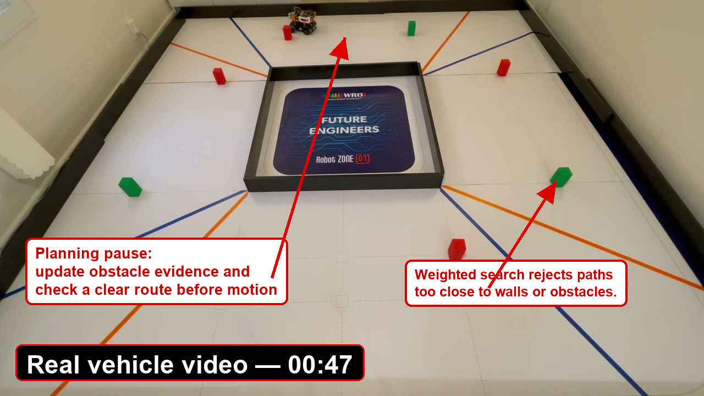

# Obstacle Challenge Strategy

## Strategy summary

The Obstacle Challenge is not a prerecorded sequence of steering actions. During a run, the vehicle continuously estimates its pose from wheel odometry and the IMU, with limited correction from LiDAR wall lines. Each scan first forms a local grid and is then persistently fused into the global grid at that pose. The D435f camera identifies red and green obstacles while LiDAR supplies their geometry. The planner arbitrates among obstacle programs, corner programs, and corridor/global-route planning before commanding the drive motor and steering servo.

This chapter records the strategy and parameter meanings implemented in the current `WRO-FE-2026` code, organised around the running data loop, planning priorities, and recovery mechanisms. The public obstacle-run demonstration is available on [YouTube](https://youtu.be/ZCeJy3AIbls?si=Dyjuz9C3nUB4ehGs).

[](https://www.youtube.com/watch?v=ZCeJy3AIbls)

*Click the preview to play the public Obstacle Challenge video on YouTube.*



## 1. Data inputs and safe stopping

The running node subscribes to the merged LiDAR scan, wheel-encoder odometry, IMU, and aligned D435f colour/depth images. The driver uses the scan timestamp to find corresponding odometry and IMU data. If a scan is older than about `0.30 s`, matching odometry is unavailable, or the IMU is stale, it publishes zero motor and steering commands instead of continuing on old data. [Driver input and safety checks](https://github.com/AGitUser0001/WRO-FE-2026/blob/main/src/robot/planner/driver.py#L337-L433)

This separates stale perception from continuing the last command: an invalid input chain produces a stationary vehicle; only a complete chain proceeds to localisation and planning.

## 2. Pose estimation and course-direction identification

### 2.1 Odometry and IMU are primary; LiDAR walls correct them

Localisation does not use scan-only or odometry-only estimation. Encoder odometry supplies continuous displacement, the IMU supplies heading, and LiDAR extracts continuous front, rear, left, and right wall lines. Consistency between those lines and the course model limits the pose correction. [Odometry pose update](https://github.com/AGitUser0001/WRO-FE-2026/blob/main/src/robot/planner/odometry_localize.py#L299-L336) [LiDAR pose correction](https://github.com/AGitUser0001/WRO-FE-2026/blob/main/src/robot/planner/localize_scan.py)

The combination addresses two practical ambiguities: scan matching may be unstable in corners as the visible wall segment changes, while similar parallel walls in the course middle can confuse scan-only localisation. LiDAR therefore constrains and corrects the pose rather than resetting the odometry-and-IMU pose every frame.

### 2.2 Identify direction before enabling the course route

At startup the planner does not know whether the vehicle is travelling in the left or right course direction. It derives a direction hint from LiDAR wall and opening geometry and locks direction only after consecutive confirming frames. While direction is unknown it uses a corridor route; once direction is locked it creates corner targets and the global route. [Direction-lock parameters](https://github.com/AGitUser0001/WRO-FE-2026/blob/main/src/robot/planner/config.py#L36-L44) [Corridor/global-route transition](https://github.com/AGitUser0001/WRO-FE-2026/blob/main/src/robot/planner/planner.py#L1620-L1653)



## 3. LiDAR: wall lines, local grid, and global grid

### 3.1 A wall is not treated as an ordinary obstacle point

`sensors.py` does not treat every LiDAR endpoint as an obstacle. It estimates continuous front, rear, left, and right wall segments from scans; free rays are marked traversable and points matching a confirmed wall line are marked as walls. Only endpoints supported by nearby points remain unknown-obstruction candidates, so an isolated return is less likely to become a permanent obstacle. [Local-grid and wall-line generation](https://github.com/AGitUser0001/WRO-FE-2026/blob/main/src/robot/planner/sensors.py#L190-L279)

### 3.2 From an instantaneous observation to a persistent map

Each scan creates an immediate `LocalGrid`. It is transformed into the `GlobalGrid` at the current pose and then fused continuously with evidence-add and evidence-erosion weights. The current defaults are an add coefficient of `0.08` and an erosion coefficient of `0.02`. [Grid parameters](https://github.com/AGitUser0001/WRO-FE-2026/blob/main/src/robot/planner/config.py#L36-L44) [Global fusion implementation](https://github.com/AGitUser0001/WRO-FE-2026/blob/main/src/robot/planner/grid.py#L217-L288)

The implementation is therefore not a binary rule that immediately adds or removes a tile whenever the current frame differs from the previous one. New evidence raises obstacle confidence progressively, while evidence that does not persist decays progressively. This helps prevent a transient echo, local occlusion, or one false detection from directly contaminating the route.

### 3.3 Simulator evidence: LocalGrid, GlobalGrid, and weighted path

The following still is taken from the Obstacle Challenge simulator. The left window shows current LiDAR rays and the vehicle; the upper-right window shows the persistently fused grid, vehicle pose, and purple route. The red arrows and captions were added for this documentation, not produced by the simulator: they identify the immediate local observation, the `GlobalGrid` spatial evidence, and the safe route selected by weighted graph search.





## 4. Obstacle recognition, colour rule, and planning arbitration

The D435f synchronous colour/depth frames identify red and green pillars; LiDAR obstacle clusters supply spatial anchors to associate camera detections. The current obstacle-rule configuration passes red on the right and green on the left. It also retains a yellow sequence of left pass, U-turn, then left pass. [Colour passing rules](https://github.com/AGitUser0001/WRO-FE-2026/blob/main/src/robot/config/obstacle_navigation.json) [Colour-observation association](https://github.com/AGitUser0001/WRO-FE-2026/blob/main/src/robot/planner/planner.py#L163-L254)

Each planning cycle first updates local-obstacle support, merges colour observations, and maintains known obstacles. It then arbitrates in this order rather than allowing ordinary cruise routing to pre-empt avoidance or turning:

1. If an obstacle program is active, process the obstacle pass or U-turn stage first.
2. If no obstacle program is active, check the dedicated corner program for the current corner.
3. If neither produces a plan, use corridor planning when direction is unknown, otherwise global-grid planning.
4. If camera colour is still within its waiting period, keep the vehicle stopped instead of guessing a passing side.

This ordering is the planner's direct `plan()` call chain. [Planning priority](https://github.com/AGitUser0001/WRO-FE-2026/blob/main/src/robot/planner/planner.py#L163-L254)

## 5. Weighted path search and vehicle clearance

After direction is locked, the planner searches the global grid around the next corner and route-guide points. Traversable cells are not all equivalent: course/map walls are prohibitive cost, persistent obstacles have high cost, and route-centreline, corner-region, and local-obstacle costs are added as well. [Cost grid](https://github.com/AGitUser0001/WRO-FE-2026/blob/main/src/robot/planner/graph_path.py#L1089-L1145)

The search uses an eight-connected grid graph and Dijkstra minimum-cost routing. After search, it checks the vehicle footprint, front/rear uncertainty margins, initial motion arc, and clearance; it does not simply avoid a LiDAR point with the vehicle centre. [Grid graph and Dijkstra search](https://github.com/AGitUser0001/WRO-FE-2026/blob/main/src/robot/planner/graph_path.py#L72-L147) [Path, clearance, and feasible-entry checks](https://github.com/AGitUser0001/WRO-FE-2026/blob/main/src/robot/planner/graph_path.py#L258-L335)



This prevents a narrow-course failure of simple target-point steering: even if a straight line is geometrically shortest, it is not considered feasible if the vehicle envelope, outer-wheel sweep, or initial turn would come too close to a wall or obstacle.

## 6. Corners, three-lap progress, and reversing recovery

### 6.1 A corner is not a one-step steering command

On the first lap, after reaching a corner neighbourhood, the planner enters a dedicated sequence: settle briefly, perform one or more turning arcs from IMU heading and odometry distance, check wall clearance, and, after reaching the target heading, reverse toward an exit position before braking or recovery as necessary. If a turning phase does not produce sufficient odometry movement or heading change in time, it attempts recovery; if neither forward nor reverse wall margin is sufficient, it abandons that corner plan and returns control to later planning. [Corner states and recovery](https://github.com/AGitUser0001/WRO-FE-2026/blob/main/src/robot/planner/planner.py#L1661-L1906)

The code does contain `corner-backup`: after heading alignment, the vehicle reverses with a small steering angle toward the corner exit position. This chapter does not describe “0.8 m from the wall” as a fixed rule because the current implementation does not encode a fixed `0.8 m` constant; corner distances and wall margins are jointly state-dependent.

### 6.2 Three-lap completion

After completing a set of corner targets, the planner records that return to the start is pending. It must first depart the start by at least `0.60 m`; a lap is then added only when it satisfies the longitudinal/lateral start-crossing condition. `course_complete` becomes true at configured `course_laps = 3`. [Lap parameters](https://github.com/AGitUser0001/WRO-FE-2026/blob/main/src/robot/planner/config.py#L31-L44) [Lap update and completion](https://github.com/AGitUser0001/WRO-FE-2026/blob/main/src/robot/planner/planner.py#L2096-L2153)



### 6.3 Safe reverse for an uncoloured nearby obstacle

If LiDAR finds an obstacle close to the route but the camera has not yet reliably assigned a colour, the system first waits about `0.20 s` for a colour result. If no colour association arrives, it evaluates rearward candidate positions at `0.10`, `0.20`, `0.30`, and `0.40 m`, in order, against map walls, current obstacles, and an expanded vehicle footprint. It selects the continuous safe reverse segment; after total reverse travel reaches `0.35 m`, it waits and observes again. [Uncoloured-obstacle wait, reverse candidates, and footprint check](https://github.com/AGitUser0001/WRO-FE-2026/blob/main/src/robot/planner/graph_path.py#L980-L1086)

If no reverse candidate is safe, the vehicle holds. General route-search failure also does not cause unconditional reverse; the program first retains/waits on local-obstacle state or tries a feasible entry action. Reverse is therefore a recovery action constrained by the vehicle footprint and walls, not a response to every obstacle.

### 6.4 Real-vehicle video evidence: near-wall and re-planning pause

These two stills come from the original real-vehicle Obstacle Challenge recording. At `00:06`, the vehicle is near the outer wall: forward clearance, vehicle footprint, and recovery candidates must be checked together; only when forward motion is unsafe can the recovery procedure select a safe reverse candidate and re-observe. At `00:47`, the source recording contains a longer pause: with no safe output, the planner holds, updates obstacle evidence, and checks a feasible path again instead of reusing an old steering command. The red lines and captions are post-capture documentation annotations.





## 7. Algorithm rationale, edge cases, tuning, and metrics

### 7.1 Why use a state machine and weighted paths instead of one following rule

The Obstacle Challenge simultaneously requires corner/lap completion, colour-specified passing sides, wall clearance, and possible holds or reverses. These goals can conflict. The program therefore divides the long-running task into states: use a corridor while direction is unknown; use the global route after it is locked; give an active obstacle program priority over ordinary routing; and run corners and recovery as dedicated states. The state machine resolves the priority conflict that occurs when an obstacle and a corner are present at the same time. Weighted graph search then selects the safer-clearance route within each state rather than simply steering toward one geometric target.

The final controller does not use a classic image-error PID loop. It computes a geometric steering angle from a look-ahead point on a feasible path and clamps that angle to the physical steering limit. The driver maps it to the servo command and predicts a short trajectory from wheelbase, steering, actuation delay, and acceleration/deceleration time constants before allowing it to enter walls or obstacles. [Geometric look-ahead steering](https://github.com/AGitUser0001/WRO-FE-2026/blob/main/src/robot/planner/graph_path.py#L1957-L1984) [Servo limiting and command mapping](https://github.com/AGitUser0001/WRO-FE-2026/blob/main/src/robot/planner/driver.py#L458-L474) [Motion prediction and collision checks](https://github.com/AGitUser0001/WRO-FE-2026/blob/main/src/robot/planner/driver.py#L571-L751) This keeps the commanded motion consistent with the Ackermann vehicle's turning radius and physical footprint.

### 7.2 Computer-vision method and LiDAR association

The D435f colour image is first channel-mean white-balanced and converted to HSV. The program produces red, green, and yellow masks from HSV intervals; ignores the top 30% of the image; removes small noise through a `3 × 3` morphological opening; and requires minimum contour area and pixel width/height. For every accepted colour contour, the depth image is split into surfaces at depth discontinuities and median depth estimates range. It is then associated with a LiDAR obstacle anchor using range and lateral position. Colour therefore selects the passing rule, while LiDAR/grid processing remains responsible for obstacle geometry and vehicle clearance. [Colour and depth detection](https://github.com/AGitUser0001/WRO-FE-2026/blob/main/src/robot/planner/camera_color.py#L37-L126) [Colour–LiDAR anchor association](https://github.com/AGitUser0001/WRO-FE-2026/blob/main/src/robot/planner/planner.py#L163-L254)

### 7.3 Edge cases and mitigations

| Edge case | Program response | Design reason |
| --- | --- | --- |
| Scan, odometry, or IMU is missing/stale | Zero motor and steering commands. | Do not drive using an expired state. |
| Scan matching is unstable at a corner; walls look alike in the course middle | Keep a continuous odometry + IMU pose; use LiDAR for limited wall correction. | Avoid a one-frame scan pose reset or scan-only wall ambiguity. |
| A one-frame echo, local occlusion, or one-frame colour error | Require continuous wall support; fuse local grids through evidence add/erosion; associate colour with a spatial anchor. | Avoid a transient observation permanently changing the route. |
| LiDAR sees a nearby obstacle but camera colour is not yet known | Briefly wait; then reverse only if the expanded footprint and walls allow it, otherwise hold. | Do not guess a passing side or reverse blindly. |
| Graph search or its entry arc has no safe solution | Hold/wait on local-obstacle state or try an entry action that passes the clearance test. | Prevent a route that is clear for the vehicle centre but not its body or outer-wheel sweep. |
| A corner stage makes no expected distance or yaw progress | Enter recovery; abandon that corner plan if neither forward nor rear wall margin is sufficient. | Prevent a stuck turn or continued output from an invalid state. |

### 7.4 Tuning process and performance metrics

Tuning follows a loop of simulator replay/multi-seed tests, debug-view inspection, and physical-course reproduction. The debug view displays the grid, planned route, vehicle pose, colour obstacles, and status text. Code tests cover one-frame noise that must not change the route, colour anchors that must not jump between obstacles, corner-arc clearance, reverse candidates, safe stopping on sensor loss, and three-lap counting. [Debug view](https://github.com/AGitUser0001/WRO-FE-2026/blob/main/src/robot/planner/debug.py) [Obstacle-program tests](https://github.com/AGitUser0001/WRO-FE-2026/blob/main/src/robot/tests/test_obstacle_program.py) [Path and recovery tests](https://github.com/AGitUser0001/WRO-FE-2026/blob/main/src/robot/tests/test_graph_path.py) [Driver-safety tests](https://github.com/AGitUser0001/WRO-FE-2026/blob/main/src/robot/tests/test_driver_prediction.py)

The simulator success suite extracts the following metrics from run logs and uses them as pass conditions. They also provide the same framework for reviewing physical-run videos and logs.

| Metric | Recorded value / threshold |
| --- | --- |
| Completion and safety | Target laps complete, zero collisions, and start return within `0.15 m` longitudinal and `0.50 m` lateral tolerance. |
| Perception consistency | Locked direction matches the expected direction; tracked obstacle count matches the scenario manifest; zero colour-association errors. |
| Localisation and planning continuity | Pose error `p95 ≤ 0.15 m`, route-connected frame fraction at least `0.90`, and target dwell no more than `180` frames. |
| Route quality and runtime | Record planning `p50/p95` time, path-curvature `p95` and violation fraction, path-clearance `p05`, and forward/reverse route-motion switches. |

The result object and pass conditions are defined in [run_success_suite.py](https://github.com/AGitUser0001/WRO-FE-2026/blob/main/src/robot/tests/run_success_suite.py#L86-L365). It stores the `seed`, log path, and every metric, so parameter changes can be compared with the same measurements rather than judged only by one visual run.

## 8. Running and reproduction

After installing the current ROS 2 package, build and source the workspace:

```bash
colcon build
source install/setup.bash
ros2 launch robot planner.launch.py
```

`planner.launch.py` starts the prerequisite processes and then `wro_planner`; simulation, micro-ROS, autonomous driving, and debug-view behaviour are controlled by launch arguments. [Planner launch file](https://github.com/AGitUser0001/WRO-FE-2026/blob/main/src/robot/launch/planner.launch.py) [Runtime parameter definitions](https://github.com/AGitUser0001/WRO-FE-2026/blob/main/src/robot/planner/config.py)

For reproduction, first verify updates on `/scan`, `/wheel/odometry`, `/imu_data`, the D435f colour/depth images, `/microROS/motor_control`, and `/microROS/servo_control`. Sensor installation, cables, coordinate frames, and power interfaces are in [Chapter 05: sensor, cable, and interface record](05-power-and-sensor-architecture.md#sensor-cable-and-interface-record); ROS 2, micro-ROS, LiDAR, camera, and IMU setup steps are in [Chapter 12: Build and Operation Guide](12-build-and-operation-guide.md).

## Evidence and implementation links

- [Planner arbitration: `planner.py`](https://github.com/AGitUser0001/WRO-FE-2026/blob/main/src/robot/planner/planner.py)
- [Driver node and safe stop: `driver.py`](https://github.com/AGitUser0001/WRO-FE-2026/blob/main/src/robot/planner/driver.py)
- [Local sensor processing: `sensors.py`](https://github.com/AGitUser0001/WRO-FE-2026/blob/main/src/robot/planner/sensors.py)
- [Global-grid fusion: `grid.py`](https://github.com/AGitUser0001/WRO-FE-2026/blob/main/src/robot/planner/grid.py)
- [Weighted path, clearance, and reverse recovery: `graph_path.py`](https://github.com/AGitUser0001/WRO-FE-2026/blob/main/src/robot/planner/graph_path.py)
- [Colour and depth obstacle detection: `camera_color.py`](https://github.com/AGitUser0001/WRO-FE-2026/blob/main/src/robot/planner/camera_color.py)
- [Simulator success suite and metrics: `run_success_suite.py`](https://github.com/AGitUser0001/WRO-FE-2026/blob/main/src/robot/tests/run_success_suite.py)
- [Obstacle-colour rules: `obstacle_navigation.json`](https://github.com/AGitUser0001/WRO-FE-2026/blob/main/src/robot/config/obstacle_navigation.json)
- [Obstacle Challenge public video](https://youtu.be/ZCeJy3AIbls?si=Dyjuz9C3nUB4ehGs)
