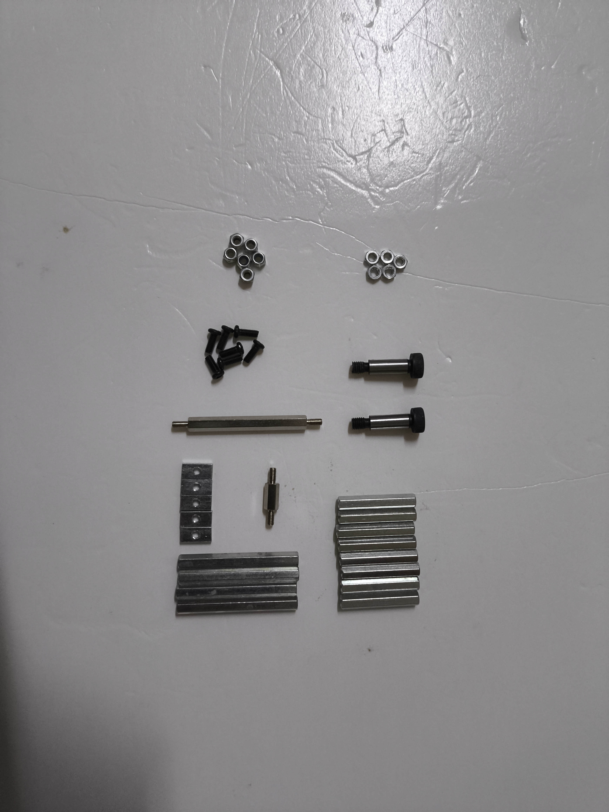
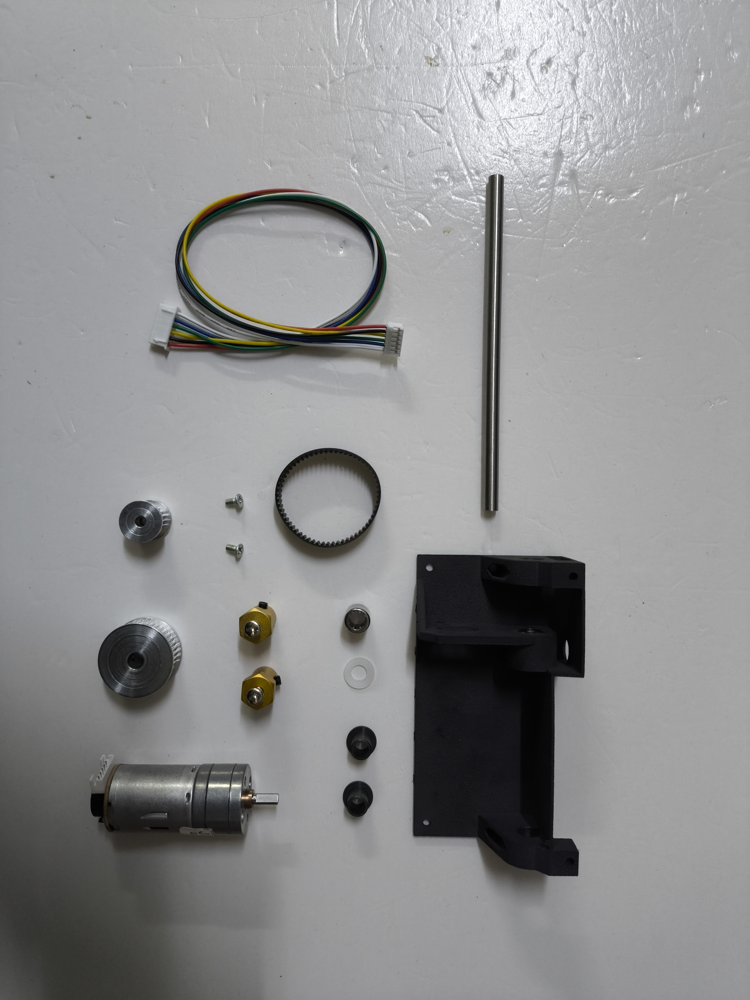
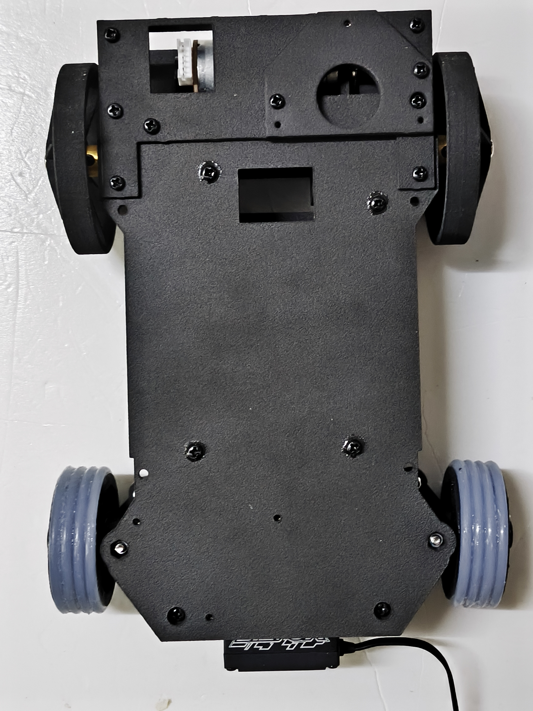
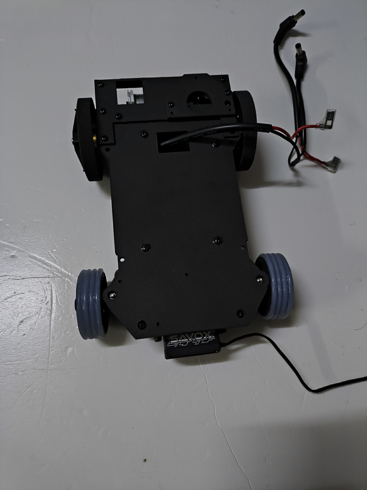
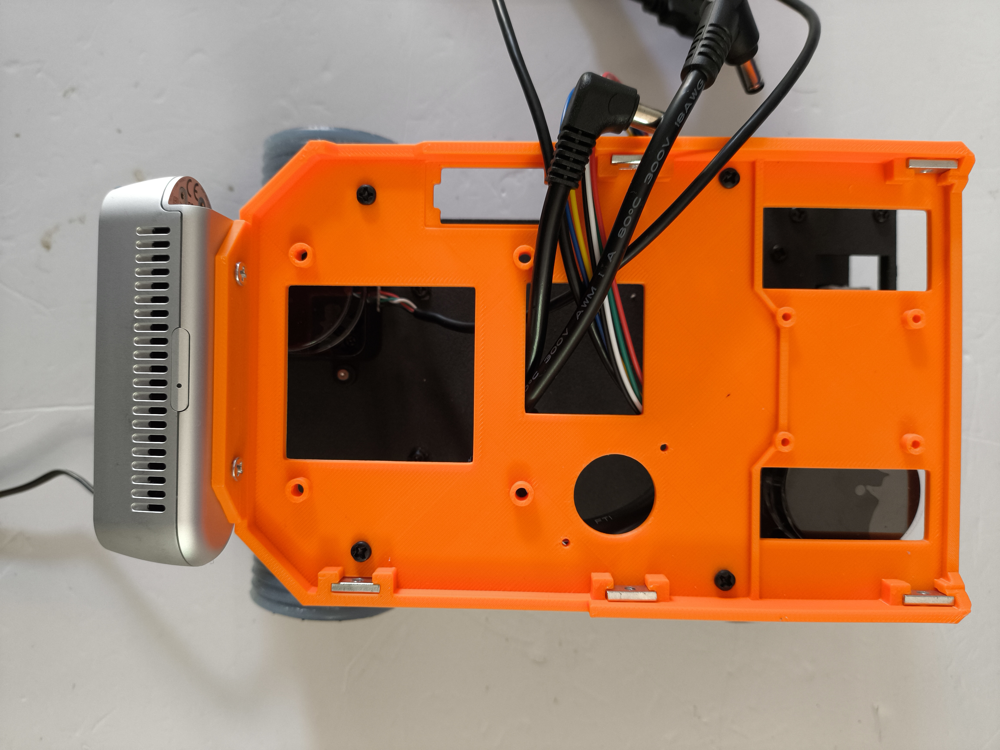
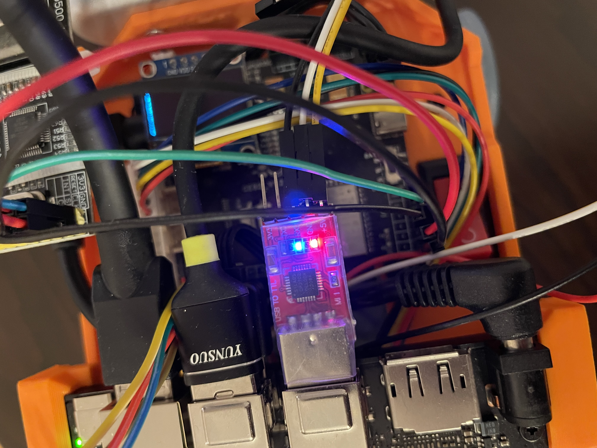
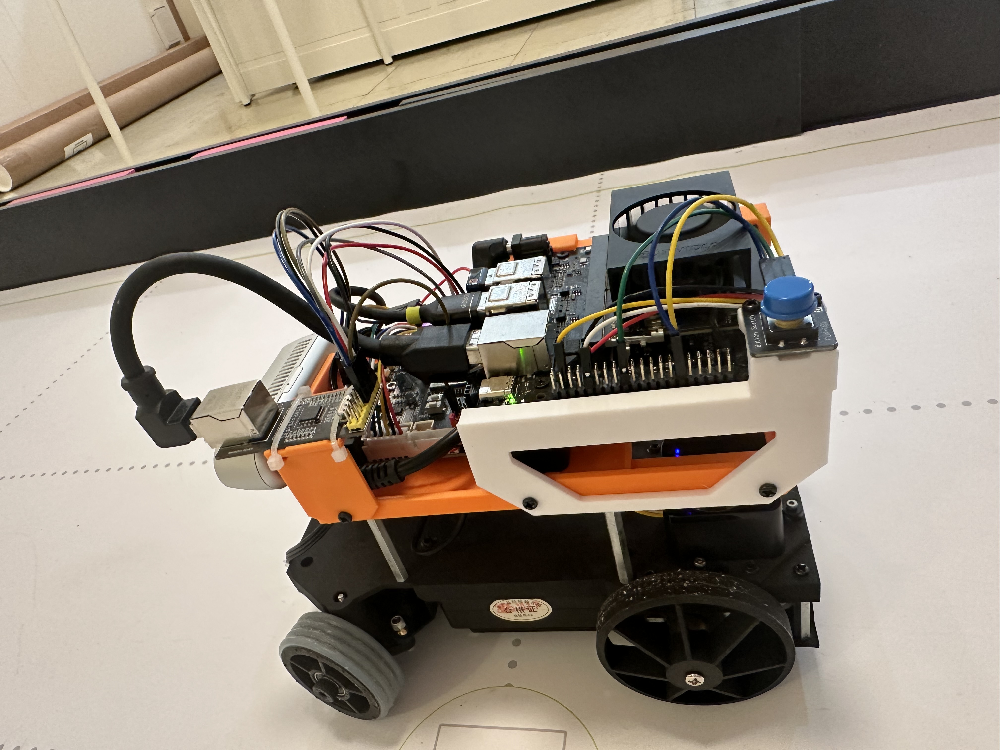
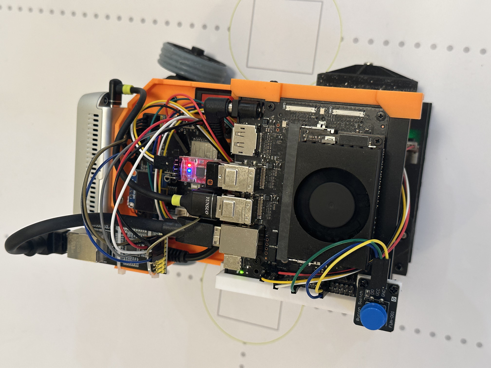

# Build and Operation Guide

## Purpose

Record the physical reconstruction sequence of the final vehicle. Mechanical design decisions remain in [Chapter 4](04-mobility-and-mechanical-design.md); power, interface, and sensor-cable assignments remain in [Chapter 5](05-power-and-sensor-architecture.md).

## Summary

The final vehicle is rebuilt from the lower chassis upward: prepare the wiring harnesses, assemble the steering and rear drive, install the battery compartment and LiDAR carrier, then add the upper-layer camera, controllers, network interface, and program-start button. The complete visual record is a continuous English-named archive of 108 photographs; the numbered steps below group those photographs into reconstructable operations rather than repeating every view as a separate instruction.

The [detailed installation record](12-installation-record/README.md) preserves the full setup notes, screenshots, command history, alternative host procedures, and troubleshooting records. Use this chapter as the current reconstruction and operating route; update the linked subdocuments when retaining or extending the detailed procedure.

## Mechanical Reconstruction

### Photo archive and assembly convention

The [photo manifest](../media/assembly-steps/complete-sequence/assembly-step-manifest.csv) is the machine-readable version of the complete photo record: it maps each English sequential filename (`assembly-step-001` to `assembly-step-108`) to an English description of the photographed assembly state. The complete human-readable 108-photo index is embedded below, while the [complete assembly-photo archive](../media/assembly-steps/complete-sequence/) remains the authoritative image record. Ranges in the reconstruction steps refer to the same photo numbers.

### Complete 108-photo index

Every entry below links directly to its photograph. The descriptions exactly match the English `description` field in the downloadable manifest, so the complete record can be read without opening the CSV.

| Photo | Assembly state |
|---|---|
| [001](../media/assembly-steps/complete-sequence/assembly-step-001.jpg) | All 3D-printed components before installation |
| [002](../media/assembly-steps/complete-sequence/assembly-step-002.jpg) | Fasteners, standoffs, bearings, and small joining hardware |
| [003](../media/assembly-steps/complete-sequence/assembly-step-003.jpg) | Power leads prepared for soldering |
| [004](../media/assembly-steps/complete-sequence/assembly-step-004.jpg) | Completed soldered power harness |
| [005](../media/assembly-steps/complete-sequence/assembly-step-005.jpg) | Main-power rocker switch |
| [006](../media/assembly-steps/complete-sequence/assembly-step-006.jpg) | Power harness, rocker switch, and flag terminals connected |
| [007](../media/assembly-steps/complete-sequence/assembly-step-007.jpg) | 10 cm downward-angle USB-C to straight USB-A male cable for the depth camera |
| [008](../media/assembly-steps/complete-sequence/assembly-step-008.jpg) | Superseded 30 cm ZH1.5-4P to USB-A male LiDAR cable |
| [009](../media/assembly-steps/complete-sequence/assembly-step-009.jpeg) | Final 20 cm ZH1.5 to 2.54 mm female-Dupont 1P 4-wire LiDAR harness |
| [010](../media/assembly-steps/complete-sequence/assembly-step-010.jpg) | 10 cm USB-C to USB-A male cable for the IMU |
| [011](../media/assembly-steps/complete-sequence/assembly-step-011.jpg) | 30 cm motor cable |
| [012](../media/assembly-steps/complete-sequence/assembly-step-012.jpg) | 20 cm servo cable |
| [013](../media/assembly-steps/complete-sequence/assembly-step-013.jpg) | Steering servo |
| [014](../media/assembly-steps/complete-sequence/assembly-step-014.jpg) | Drive motor |
| [015](../media/assembly-steps/complete-sequence/assembly-step-015.jpg) | Front and rear LiDAR units |
| [016](../media/assembly-steps/complete-sequence/assembly-step-016.jpg) | IMU gyroscope |
| [017](../media/assembly-steps/complete-sequence/assembly-step-017.jpg) | D435f depth camera |
| [018](../media/assembly-steps/complete-sequence/assembly-step-018.jpg) | ESP32 module and carrier board with OLED installed |
| [019](../media/assembly-steps/complete-sequence/assembly-step-019.jpg) | Jetson Orin Nano Super Developer Kit |
| [020](../media/assembly-steps/complete-sequence/assembly-step-020.jpg) | Large-capacity and small-capacity battery options |
| [021](../media/assembly-steps/complete-sequence/assembly-step-021.jpg) | 3D-printed chassis with silicone front wheels and smooth rear wheels |
| [022](../media/assembly-steps/complete-sequence/assembly-step-022.jpeg) | Front axle, servo, and Ackermann steering assembly, view 1 |
| [023](../media/assembly-steps/complete-sequence/assembly-step-023.jpeg) | Front axle, servo, and Ackermann steering assembly, view 2 |
| [024](../media/assembly-steps/complete-sequence/assembly-step-024.jpg) | Ackermann front-wheel steering knuckle |
| [025](../media/assembly-steps/complete-sequence/assembly-step-025.jpg) | Top-front oblique view of the Ackermann front axle |
| [026](../media/assembly-steps/complete-sequence/assembly-step-026.jpg) | Front view of the Ackermann front axle |
| [027](../media/assembly-steps/complete-sequence/assembly-step-027.jpg) | Rear view of the assembled Ackermann front axle |
| [028](../media/assembly-steps/complete-sequence/assembly-step-028.jpg) | Second rear view of the assembled Ackermann front axle |
| [029](../media/assembly-steps/complete-sequence/assembly-step-029.jpg) | Front view of the assembled Ackermann front axle |
| [030](../media/assembly-steps/complete-sequence/assembly-step-030.jpg) | Ackermann front axle connected to the servo, showing steering deflection |
| [031](../media/assembly-steps/complete-sequence/assembly-step-031.jpg) | Rear-axle assembly |
| [032](../media/assembly-steps/complete-sequence/assembly-step-032.jpg) | Rear-axle pulleys and shared axle |
| [033](../media/assembly-steps/complete-sequence/assembly-step-033.jpg) | Rear axle with the motor installed |
| [034](../media/assembly-steps/complete-sequence/assembly-step-034.jpg) | Rear motor and pulley detail, view 1 |
| [035](../media/assembly-steps/complete-sequence/assembly-step-035.jpg) | Rear motor and pulley detail, view 2 |
| [036](../media/assembly-steps/complete-sequence/assembly-step-036.jpg) | Custom 65 mm smooth rear wheels to reduce tyre scrub |
| [037](../media/assembly-steps/complete-sequence/assembly-step-037.jpg) | Large rear-wheel retaining nut |
| [038](../media/assembly-steps/complete-sequence/assembly-step-038.jpg) | Rear-wheel bearing |
| [039](../media/assembly-steps/complete-sequence/assembly-step-039.jpg) | Hollow metal rear-axle tube detail |
| [040](../media/assembly-steps/complete-sequence/assembly-step-040.jpg) | Top view of the open central chassis cavity before the first cover plate, view 1 |
| [041](../media/assembly-steps/complete-sequence/assembly-step-041.jpg) | Top view of the open central chassis cavity before the first cover plate, view 2 |
| [042](../media/assembly-steps/complete-sequence/assembly-step-042.jpg) | Top view of the rear chassis with battery and retaining plate, view 1 |
| [043](../media/assembly-steps/complete-sequence/assembly-step-043.jpg) | Top view of the rear chassis with battery and retaining plate, view 2 |
| [044](../media/assembly-steps/complete-sequence/assembly-step-044.jpg) | Top view after the second-layer cover plate is installed, view 1 |
| [045](../media/assembly-steps/complete-sequence/assembly-step-045.jpg) | Top view after the second-layer cover plate is installed, view 2 |
| [046](../media/assembly-steps/complete-sequence/assembly-step-046.jpg) | Second-layer front-LiDAR mounting holes |
| [047](../media/assembly-steps/complete-sequence/assembly-step-047.jpg) | Second-layer dual-LiDAR mounting: screw holes, trays, and offset mounting detail |
| [048](../media/assembly-steps/complete-sequence/assembly-step-048.jpg) | Second-layer rear-LiDAR mounting holes |
| [049](../media/assembly-steps/complete-sequence/assembly-step-049.jpg) | Top overview after LiDAR installation |
| [050](../media/assembly-steps/complete-sequence/assembly-step-050.jpg) | Front overview after LiDAR installation |
| [051](../media/assembly-steps/complete-sequence/assembly-step-051.jpg) | Rear overview after LiDAR installation |
| [052](../media/assembly-steps/complete-sequence/assembly-step-052.jpg) | Left-side overview after LiDAR installation |
| [053](../media/assembly-steps/complete-sequence/assembly-step-053.jpg) | Right-side overview after LiDAR installation |
| [054](../media/assembly-steps/complete-sequence/assembly-step-054.jpg) | Second-layer split power lead, display lead, and servo lead routed out |
| [055](../media/assembly-steps/complete-sequence/assembly-step-055.jpg) | In-progress second layer with mounted LiDARs, legacy LiDAR leads, brass standoffs, servo lead, and display cable opening |
| [056](../media/assembly-steps/complete-sequence/assembly-step-056.jpg) | Third-layer upper plate installed with two LiDAR leads and power lead routed out |
| [057](../media/assembly-steps/complete-sequence/assembly-step-057.jpg) | Third-layer upper-plate installation detail with two LiDAR leads and power lead |
| [058](../media/assembly-steps/complete-sequence/assembly-step-058.jpg) | Third-layer upper plate with motor lead routed out and second-layer tray fixed to four brass standoffs |
| [059](../media/assembly-steps/complete-sequence/assembly-step-059.jpg) | Depth-camera mounting bracket before installation, front view |
| [060](../media/assembly-steps/complete-sequence/assembly-step-060.jpg) | Depth-camera mounting bracket before installation, rear view |
| [061](../media/assembly-steps/complete-sequence/assembly-step-061.jpg) | Installing the depth camera and tightening screws |
| [062](../media/assembly-steps/complete-sequence/assembly-step-062.jpg) | Depth camera installed on the third layer |
| [063](../media/assembly-steps/complete-sequence/assembly-step-063.jpg) | ESP32 installed on the third layer |
| [064](../media/assembly-steps/complete-sequence/assembly-step-064.jpg) | ESP32 and speaker installed on the third layer |
| [065](../media/assembly-steps/complete-sequence/assembly-step-065.jpeg) | IMU cable connection before installation on the third layer |
| [066](../media/assembly-steps/complete-sequence/assembly-step-066.jpg) | IMU installed on the third layer |
| [067](../media/assembly-steps/complete-sequence/assembly-step-067.jpg) | Jetson and its two support brackets on the rear half of the third layer |
| [068](../media/assembly-steps/complete-sequence/assembly-step-068.jpg) | Combined Jetson support bracket on the third layer |
| [069](../media/assembly-steps/complete-sequence/assembly-step-069.jpg) | Jetson support bracket fixed with screws |
| [070](../media/assembly-steps/complete-sequence/assembly-step-070.jpg) | Right-side top view of the installed Jetson on the rear half of the third layer |
| [071](../media/assembly-steps/complete-sequence/assembly-step-071.jpg) | W5500 Ethernet module, tray, and cable ties |
| [072](../media/assembly-steps/complete-sequence/assembly-step-072.jpg) | Top-front view of the installed Jetson on the rear half of the third layer |
| [073](../media/assembly-steps/complete-sequence/assembly-step-073.jpg) | W5500 Ethernet module and tray secured |
| [074](../media/assembly-steps/complete-sequence/assembly-step-074.jpg) | W5500 tray installed on the third layer |
| [075](../media/assembly-steps/complete-sequence/assembly-step-075.jpg) | Top view after W5500 installation |
| [076](../media/assembly-steps/complete-sequence/assembly-step-076.jpg) | W5500 Ethernet cable connected to Jetson |
| [077](../media/assembly-steps/complete-sequence/assembly-step-077.jpg) | Servo lead connected to ESP32 on the third layer, view 1 |
| [078](../media/assembly-steps/complete-sequence/assembly-step-078.jpg) | Servo lead connected to ESP32 on the third layer, view 2 |
| [079](../media/assembly-steps/complete-sequence/assembly-step-079.jpg) | DC motor lead connected to ESP32 on the third layer, view 1 |
| [080](../media/assembly-steps/complete-sequence/assembly-step-080.jpg) | DC motor lead connected to ESP32 on the third layer, view 2 |
| [081](../media/assembly-steps/complete-sequence/assembly-step-081.jpg) | Depth camera connected to Jetson on the third layer |
| [082](../media/assembly-steps/complete-sequence/assembly-step-082.jpg) | IMU connected to Jetson on the rear half of the third layer |
| [083](../media/assembly-steps/complete-sequence/assembly-step-083.jpg) | Legacy arrangement with two LiDAR USB plugs connected to Jetson |
| [084](../media/assembly-steps/complete-sequence/assembly-step-084.jpeg) | CP2102 USB-to-TTL adapter |
| [085](../media/assembly-steps/complete-sequence/assembly-step-085.jpeg) | Front LiDAR connected to Jetson GPIO |
| [086](../media/assembly-steps/complete-sequence/assembly-step-086.jpeg) | Final rear-LiDAR TTL-to-USB connection on the second layer |
| [087](../media/assembly-steps/complete-sequence/assembly-step-087.jpeg) | Front LiDAR ZH1.5-4P connection on the second layer |
| [088](../media/assembly-steps/complete-sequence/assembly-step-088.jpeg) | ZH1.5-4P LiDAR connector insertion detail |
| [089](../media/assembly-steps/complete-sequence/assembly-step-089.jpg) | Self-soldered DC5521 power branch connected to ESP32 |
| [090](../media/assembly-steps/complete-sequence/assembly-step-090.jpg) | Self-soldered DC5525 power branch connected to Jetson, view 1 |
| [091](../media/assembly-steps/complete-sequence/assembly-step-091.jpg) | Self-soldered DC5525 power branch connected to Jetson, view 2 |
| [092](../media/assembly-steps/complete-sequence/assembly-step-092.jpg) | DC main-power switch with identification marking |
| [093](../media/assembly-steps/complete-sequence/assembly-step-093.jpg) | Installed DC power-harness switch |
| [094](../media/assembly-steps/complete-sequence/assembly-step-094.jpg) | DC power switch and flag-terminal detail, view 1 |
| [095](../media/assembly-steps/complete-sequence/assembly-step-095.jpg) | DC power switch and flag-terminal detail, view 2 |
| [096](../media/assembly-steps/complete-sequence/assembly-step-096.jpg) | Complete vehicle, top view |
| [097](../media/assembly-steps/complete-sequence/assembly-step-097.jpg) | Complete vehicle, left-side view |
| [098](../media/assembly-steps/complete-sequence/assembly-step-098.jpg) | Complete vehicle, right-side view |
| [099](../media/assembly-steps/complete-sequence/assembly-step-099.jpg) | Complete vehicle, underside view |
| [100](../media/assembly-steps/complete-sequence/assembly-step-100.jpg) | Complete vehicle, front view |
| [101](../media/assembly-steps/complete-sequence/assembly-step-101.jpg) | Complete vehicle, rear view |
| [102](../media/assembly-steps/complete-sequence/assembly-step-102.jpg) | Newly printed program-start button and its Dupont leads |
| [103](../media/assembly-steps/complete-sequence/assembly-step-103.jpeg) | Blue program-start button on the left side |
| [104](../media/assembly-steps/complete-sequence/assembly-step-104.jpeg) | Blue program-start button detail |
| [105](../media/assembly-steps/complete-sequence/assembly-step-105.jpeg) | Final vehicle, top view |
| [106](../media/assembly-steps/complete-sequence/assembly-step-106.jpeg) | Final vehicle, right-side view |
| [107](../media/assembly-steps/complete-sequence/assembly-step-107.jpeg) | Final vehicle, left-side view |
| [108](../media/assembly-steps/complete-sequence/assembly-step-108.jpeg) | Final vehicle, rear view |

### Fasteners and structural hardware

Photo 002 records the physical fasteners, standoffs, bearings, and small joining hardware used during construction. The following inventory records the supplied parts; it does not assign quantities that were not recorded.

| Hardware | Recorded specification | Assembly use |
|---|---|---|
| Cross-head self-tapping screw | 304 stainless steel, CA large flat head, `M2 × 6` | Fixes applicable 3D-printed parts. |
| Double-ended standoff | White-zinc-plated steel, `H5 × M3 × 30` | Separates and joins printed layers. |
| Cross-head round-head screw | Black, `M3 × 8` | Fixes applicable printed brackets and plates. |
| Cross-head round-head screw | Black, `M3 × 10` | Fixes applicable printed brackets and plates. |
| Cross-head round-head screw | Black, `M3 × 12` | Fixes applicable printed brackets and plates. |
| Socket-cap screw | 304 stainless steel, DIN 912, `M2 × 10` | Used at the third layer. The mechanical drawing identifies this as item 32. |
| Long threaded fastener | `M3 × 40` | Structural joining hardware supplied with the vehicle. |
| Ultra-thin flat washer | 304 stainless steel, `M6 × 8 × 0.1` | Spacing and shimming where required by the mechanical joint. |
| Deep-groove ball bearing | `696` | Rotating-joint hardware supplied with the vehicle. |



*Figure 1. Physical fastener and joining-hardware set used for the build.*

The [mechanical drawing](../media/cad/botzill-autonomous-ackerman-car-drawing.pdf) independently calls out an `M2 × 10` screw (item 32), four `M3-45` standoffs (item 40), and `696` deep-groove bearings (item 21). The physical build inventory also contains `M3 × 40` and `H5 × M3 × 30` parts, so those fasteners must be selected by the actual mating location rather than substituted solely from the drawing. The bearing record is `696`; verify its fit to the shaft and hub before assembly.


*Dimensioned mechanical-drawing preview; open the linked PDF above for the full-size drawing and item list.*

The archive records both an obsolete LiDAR lead and the final lead. Do **not** install the `30 cm` ZH1.5-4P-to-USB-A lead shown in photo 008: directly connecting it to the LiDAR did not produce a response. Use the final `20 cm` ZHR-4-to-2.54 mm female-Dupont harness shown in photo 009. Each LiDAR uses this final harness; the rear LiDAR additionally uses the `5.5 cm` CP2102 TTL-to-USB converter.

1. **Prepare the printed parts, hardware, and harnesses.** Lay out all printed components (photo 001), fasteners and brass standoffs (002), the completed main-power harness and rocker-switch/flag-terminal assembly (003–006), device cables (007–012), the actuator and sensor modules (013–020), and the wheel sets (021). Keep the `15 cm` DC5525 and DC5521 branch leads accessible before closing any chassis layer.

2. **Assemble the positive-Ackermann front axle.** Fit the SC-1258TG+ steering servo, printed servo horn, steering linkage, front knuckles, bearings, and silicone front wheels. Confirm free steering travel before closing this structure (022–030).


*Figure 2. Front-steering parts and servo are assembled before the lower chassis is closed.*

3. **Assemble the rear drive.** Install the GA25-370 motor, `20T` drive pulley, `40T` driven pulley, timing belt, bearings, shared rear axle, and the two smooth rear wheels (031–039). Check pulley alignment and belt tension before fitting the rear drive into the lower chassis.



*Figure 3. Rear-drive parts are prepared as one belt-driven shared-axle assembly.*

4. **Build the lower chassis and battery compartment.** Attach the completed front and rear assemblies to the lower chassis, install the battery and screw-fixed battery-compartment cover, then fit the next printed plate (040–045). Leave the intended openings clear for the servo, motor, power, display, and sensor cables.

5. **Install the two LiDARs on the second layer.** Fix the front and rear STL-27L units in their printed mounting positions; use the `5 mm` printed spacer at the rear-LiDAR position. The two units are intentionally offset, and the front unit is installed at `0°` while the rear unit is inverted by `180°` for the shared scan-coordinate convention (046–053).



*Figure 4. The two LiDARs use separate printed mounting positions on the second layer.*

6. **Route lower-layer cables before the third layer is fitted.** Bring the final LiDAR harnesses, the two-controller power branches, the servo lead, and the display lead through the reserved openings; route the motor lead through the rear opening. Secure the four brass standoffs and third-layer plate only after no cable crosses the steering, wheels, or timing-belt travel (054–058).



*Figure 5. Cables are routed internally before the next layer blocks access.*

7. **Install the upper-layer sensing and control hardware.** Attach the D435f bracket and camera at the front centre (059–062); install the ESP32 carrier, OLED, speaker, and TM171 IMU (063–066). The IMU is installed rotated by `180°` so that its cable remains inside the body rather than trailing from the rear. Install the raised Jetson supports and Jetson Orin Nano Super Developer Kit (067–070), then mount the W5500 platform and secure the W5500 with cable ties (071–076).




*Figure 6. The camera is added before the controller stack; the raised supports keep clearance below the Jetson.*

8. **Make the final data and actuator connections.** Connect the steering-servo and DC-motor leads to the ESP32 carrier (077–080). Connect the D435f and IMU to Jetson USB-A (081–082). Connect the front LiDAR through the Jetson 40-pin header and its final `20 cm` harness; connect the rear LiDAR through its final `20 cm` harness, `5.5 cm` CP2102 converter, and Jetson USB-A (084–088). Connect W5500 to the ESP32 with Dupont leads and to Jetson with the selected Ethernet cable (076). Detailed pin assignments and wire colours are in the [LiDAR connection guide](../media/assembly-guide/lidar-connection/lidar-how-to-connect.md) and [W5500 connection guide](../media/assembly-guide/w5500-esp32-connection/w5500-how-to-connect-esp32.md).



*Figure 7. The rear LiDAR requires the CP2102 conversion stage because the available GPIO UART resources are insufficient for both LiDARs.*

9. **Connect the vehicle power harness.** Connect the DC5521 branch to the ESP32 carrier and the DC5525 branch to Jetson (089–091). Install the rocker switch and flag-terminal transition (092–095). The switch is plastic and cannot be soldered directly; the flag terminals connect it to the soldered main harness.


*Figure 8. The main-power switch is installed as a removable flag-terminal transition.*

10. **Install the program-start button and perform final inspection.** Fit the separate blue program-start button and its Dupont leads (102–104). Inspect the complete vehicle from top, left, right, underside, front, and rear (096–101), then check the final assembled views (105–108). Verify that all wiring remains inside the vehicle and that no cable can contact an obstacle, the rear wheels, the timing belt, or the front steering mechanism.





*Figure 9. The external start button is separate from the main power switch and is accessible after the vehicle has been assembled.*

## System Installation and Initialisation

> [!IMPORTANT]
> **Step-by-step installation records, screenshots, and troubleshooting:** [open the detailed installation record](12-installation-record/README.md). It links directly to the procedures for [Jetson initial setup](12-installation-record/001-jetson.md), [ROS 2 installation](12-installation-record/002-ros2.md), [LiDAR](12-installation-record/009-LiDAR.md), [camera SDKs](12-installation-record/011-Camera-SDKs.md), [TM171 IMU](12-installation-record/014-imu.md), and the [micro-ROS Agent](12-installation-record/006-microROSAgent-Jetson.md).

All commands in this section are deliberately user-neutral: use `$HOME`, `$USER`, detected device names, and the local network values for the deployment. Do not embed a personal username, hostname, password, or absolute home-directory path in the vehicle image, firmware, launch files, or documentation.

### 1. Prepare the Jetson system

1. Flash the NVIDIA JetPack 6 image for the Jetson Orin Nano Developer Kit to the microSD card with Balena Etcher, then boot the assembled vehicle with a display, keyboard, and mouse connected for the first setup.
2. Complete the Ubuntu initial setup, create a team-controlled account and device hostname, connect to the required network, then update and reboot:

   ```bash
   sudo apt update
   sudo apt full-upgrade -y
   sudo reboot
   ```

3. Install the build and device tools used by the ROS 2 workspaces:

   ```bash
   sudo apt install -y build-essential git wget flex bison gperf python3 python3-pip \
     python3-venv cmake ninja-build ccache libffi-dev libssl-dev dfu-util \
     libusb-1.0-0 python3-rosdep python3-colcon-common-extensions python3-vcstool
   ```

4. The NVMe SSD is used as the data volume and Docker storage. It is not the boot device. Configure it only after the system is stable on the microSD card.

### 2. Install and verify ROS 2 Humble

Install ROS 2 Humble using the Ubuntu package procedure, then source it in every shell that builds or runs ROS packages:

```bash
sudo apt install -y software-properties-common curl locales
sudo add-apt-repository universe
sudo apt update
sudo apt install -y ros-humble-desktop
source /opt/ros/humble/setup.bash
```

Verify the installation with the standard listener and talker in separate terminals:

```bash
ros2 run demo_nodes_py listener
ros2 run demo_nodes_cpp talker
```

### 3. Enable serial and Ethernet access

The rear LiDAR uses a CP2102 serial-to-USB adapter and the IMU exposes a USB serial interface. Ensure their kernel modules are loaded at boot and grant serial access to the operating user:

```bash
printf 'cp210x\ncdc_acm\n' | sudo tee -a /etc/modules
sudo usermod -a -G dialout "$USER"
```

Log out and back in after the group change. Detect device names rather than assuming a fixed port:

```bash
lsusb
dmesg | grep -E 'tty(USB|ACM)'
ls -l /dev/serial/by-id
```

Configure the Ethernet interface connected to W5500 with a static address in the same subnet as the ESP32 transport. Replace both placeholders with the detected interface and deployment address:

```bash
sudo nmcli con add type ethernet ifname <ETHERNET_DEVICE> con-name w5500-static \
  ipv4.method manual ipv4.addresses <AGENT_IP>/24
sudo nmcli con up w5500-static
```

### 4. Install sensor workspaces and validate each device

| Device | Installation and configuration | Validation |
|---|---|---|
| D435f depth camera | Install `librealsense2-utils`, `librealsense2-dev`, and `ros-humble-realsense2-*`. | Run `realsense-viewer`, then launch `realsense2_camera`. |
| Front and rear STL-27L LiDARs | Build the ROS 2 LiDAR driver workspace with submodules initialised; source ROS 2 and the workspace before launch. | Launch `viewer_lidar1.launch.py` and `viewer_lidar2.launch.py` separately; verify `/lidar1/scan` and `/lidar2/scan` in RViz2. |
| TM171 IMU | Build the project-maintained `tm_imu` package. Set `imu_port` to the detected IMU serial device, `imu_baudrate` to `115200`, `parent_frame_id` to `imu_link`, and `timer_period` to `30`. | Launch `imu.launch.py`; check `/imu_data`, `/imu_data_rpy`, `/imu_data_mag`, and `/tf`. |

Example camera installation:

```bash
sudo apt install -y librealsense2-utils librealsense2-dev 'ros-humble-realsense2-*'
ros2 launch realsense2_camera rs_launch.py
```

For each colcon workspace, use the same build pattern:

```bash
source /opt/ros/humble/setup.bash
cd "$HOME/<workspace>"
colcon build
source install/setup.bash
```

### 5. Install the ESP32 firmware toolchain and micro-ROS Agent

On the computer used to flash the controller, install Arduino IDE, the `esp32 by Espressif Systems` board package (`3.3.4`), `micro_ros_arduino` `v2.0.8-humble`, U8g2 (`2.35.30`), and the Arduino audio-driver library. Select the ESP32-S3 board and the detected serial port. Choose a sufficiently large application partition, such as **Minimal SPIFFS (1.9 MB APP)** or **Huge APP (3 MB No OTA)**, before compiling and flashing the project firmware.

Set the firmware transport to the deployed network and micro-ROS Agent address without storing credentials in this document. After flashing, press the ESP32 reset button if required to start the new firmware.

Create and build the Agent workspace on Jetson:

```bash
mkdir -p "$HOME/microros_ws/src"
cd "$HOME/microros_ws"
git clone -b humble https://github.com/micro-ROS/micro_ros_setup.git src/micro_ros_setup
sudo rosdep init
rosdep update
rosdep install --from-paths src --ignore-src -y
colcon build
source install/local_setup.bash
ros2 run micro_ros_setup create_agent_ws.sh
ros2 run micro_ros_setup build_agent.sh
source install/local_setup.bash
```

If the build reports `AttributeError: module 'em' has no attribute 'BUFFERED_OPT'`, use the recorded compatible version before rebuilding:

```bash
python3 -m pip install 'empy==3.3.4'
```

Start the Agent on the W5500 network path:

```bash
export ROS_DOMAIN_ID=30
export XRCE_DOMAIN_ID_OVERRIDE=30
source /opt/ros/humble/setup.bash
source "$HOME/microros_ws/install/local_setup.bash"
ros2 run micro_ros_agent micro_ros_agent udp4 --port 8888
```

### 6. Initialisation and pre-run checks

After the main power switch is on, start the micro-ROS Agent and confirm that the ESP32 topics appear before beginning the autonomous stack. Check the following in order:

```bash
ros2 topic list
ros2 topic echo /microROS/status
```

- Confirm `/microROS/motor_control`, `/microROS/servo_control`, `/microROS/encoder_data`, `/microROS/oled_display`, `/microROS/audio_play`, and `/microROS/status` are available.
- Check camera, both LiDARs, and IMU independently before launching their fusion or navigation processes.
- Verify the OLED status stream reports the battery value; its low-battery alert is part of the vehicle safety check.
- Confirm the motor is stopped and the steering linkage is unobstructed before pressing the separate program-start button.

## Evidence links

- [Complete English-named assembly-photo manifest](../media/assembly-steps/complete-sequence/assembly-step-manifest.csv)
- [Mechanical design, CAD, and STL evidence](04-mobility-and-mechanical-design.md#evidence-links)
- [Power-harness, interface, and sensor wiring evidence](05-power-and-sensor-architecture.md)
- [Curated assembly-guide index](../media/assembly-guide/README.md)
