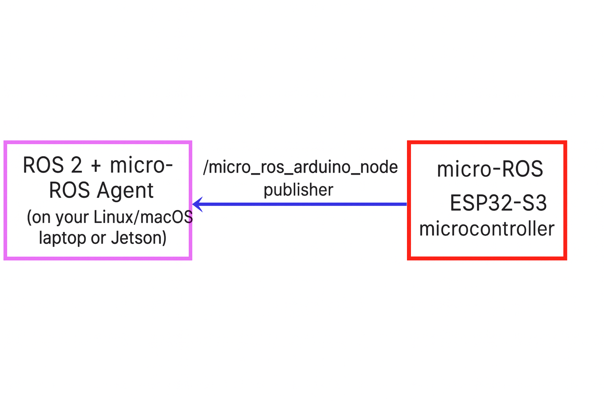

# Arduino IDE  / ESP32

**Arduino IDE we will using version 2.3.6**

## Architecture diagram

## Table of Content
1. How to install Arduino IDE in Linux(Jetson) / Macbook/ Windows from scratch.
2. How to install an ESP32 board in Arduino IDE.
3. How to install micro-ROS for Arduino library.
4. How to install  Arduino other library.
5. How to flash our project arduino code.

[005-Arduino-Jetson](./005-Arduino-Jetson.md)

[005-Arduino-MacBook](./005-Arduino-MacBook.md)

[005-Arduino-Windows](./005-Arduino-Windows.md)
