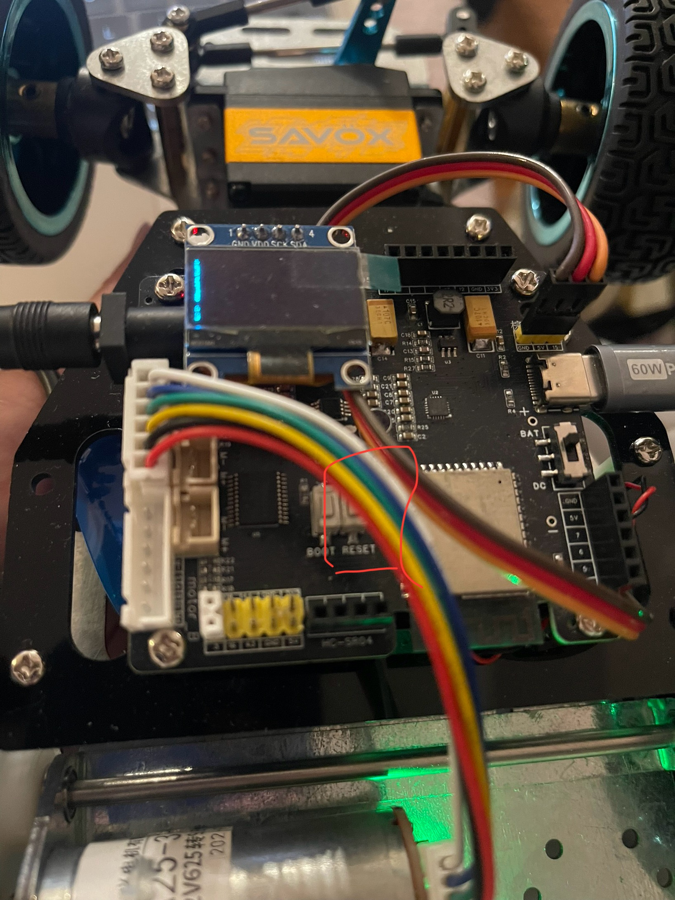
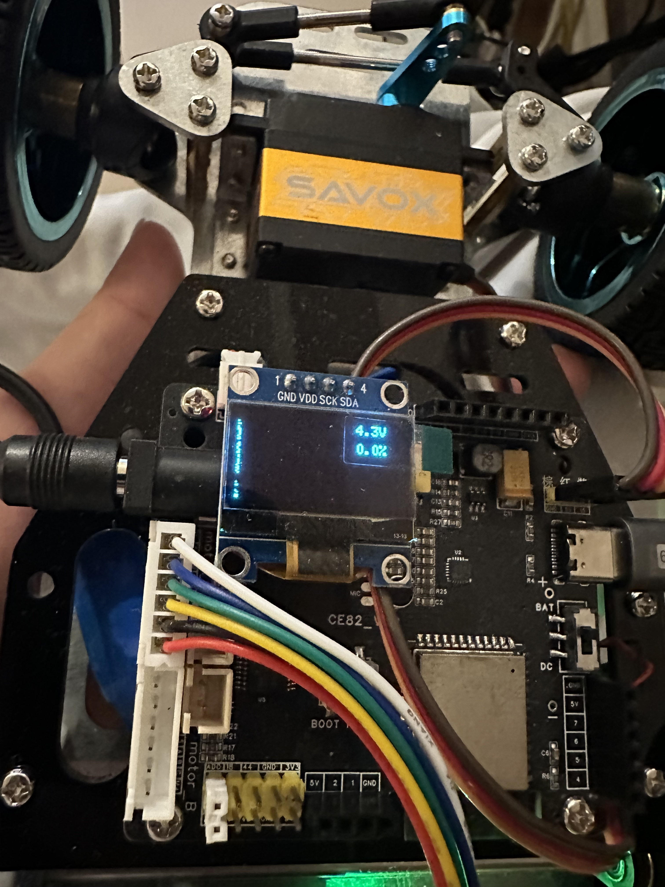

# How to run a micro-ROS agent in ROS 2 Humble that will display the messages sent from an esp32s3 on the computer screen.

## Jetson / linux run MicroROSAgent
https://micro.ros.org/docs/tutorials/core/first_application_linux/

Source the ROS 2 installation
```
/opt/ros/humble/setup.bash
```

### Create a workspace and download the micro-ROS tools
#### mkdir at your home folder so it is ~/microros_ws
```
mkdir ~/microros_ws
cd ~/microros_ws
git clone -b $ROS_DISTRO https://github.com/micro-ROS/micro_ros_setup.git src/micro_ros_setup
```

### Update jetson dependencies using apt
#### run as user <team-github-account>
```
sudo apt update
sudo apt install -y python3-rosdep
```

### Update dependencies using rosdep
```
sudo rosdep init
sudo rosdep update
rosdep update
rosdep install --from-paths src --ignore-src -y
```

### test colcon
```
sudo apt install python3-colcon-common-extensions
colcon --help
```

### Install pip
```
sudo apt-get install python3-pip
```

### Build micro-ROS tools and source them
```
colcon build
source install/local_setup.bash

sudo chown -R <team-github-account>:<team-github-account> ~/microros_ws
```

### error:
`AttributeError: module 'em' has no attribute 'BUFFERED_OPT'`

make sure empy version is 3.3.4

```
<team-user>@<jetson-host>:~/microros_ws/src/micro_ros_setup$ which -a pip3
$HOME/.espressif/python_env/idf5.4_py3.10_env/bin/pip3

pip3 install empy==3.3.4

pip3 install catkin_pkg empy lark-parser colcon-common-extensions
```

### sourcing the ROS 2 and micro-ROS environment

```
cd ~/microros_ws/
/opt/ros/humble/setup.bash
source install/local_setup.bash
```

### Download micro-ROS-Agent packages
```
sudo apt install python3-vcstool
ros2 run micro_ros_setup create_agent_ws.sh
```

### Build step
```
ros2 run micro_ros_setup build_agent.sh
source install/local_setup.bash

Building micro-ROS Agent
Starting >>> micro_ros_msgs
Finished <<< micro_ros_msgs [9.35s]
Starting >>> micro_ros_agent
[Processing: micro_ros_agent]
[Processing: micro_ros_agent]
--- stderr: micro_ros_agent
Cloning into 'xrceagent'...
HEAD is now at 57d0862 Release v2.4.2
CMake Warning (dev) at /usr/share/cmake-3.22/Modules/FindPackageHandleStandardArgs.cmake:438 (message):
  The package name passed to `find_package_handle_standard_args` (tinyxml2)
  does not match the name of the calling package (TinyXML2).  This can lead
  to problems in calling code that expects `find_package` result variables
  (e.g., `_FOUND`) to follow a certain pattern.
Call Stack (most recent call first):
  cmake/modules/FindTinyXML2.cmake:40 (find_package_handle_standard_args)
  /opt/ros/humble/share/fastrtps/cmake/fastrtps-config.cmake:51 (find_package)
  CMakeLists.txt:153 (find_package)
This warning is for project developers.  Use -Wno-dev to suppress it.

---
Finished <<< micro_ros_agent [1min 28s]

Summary: 2 packages finished [1min 38s]
  1 package had stderr output: micro_ros_agent
```

#### Add micro-ROS environment to bashrc (optional):

You can add the ROS 2 and micro-ROS workspace setup files to your .bashrc so the files do not have to be sourced every time a new command line is opened.

```
echo source /opt/ros/$ROS_DISTRO/setup.bash >> ~/.bashrc
echo source ~/microros_ws/install/local_setup.bash >> ~/.bashrc
```

###  Launch MicroROSAgent and check that a message is received
Before you do ros2 run micro_ros_agent, please make sure the `008-add-module-config-eth-user-group.md` you already setup. Because we use eth to connect jetson to esp32.

Also please make sure the Dupont wires are connected correctly and firmly. If the Dupont connections are loose, the signal may not be transmitted properly, which can prevent the Jetson micro_ros_agent from receiving a response from the ESP32, and you will not see any ROS2 /microROS topics.**

```
cd ~/microros_ws
export ROS_DOMAIN_ID=30
export XRCE_DOMAIN_ID_OVERRIDE=30
source /opt/ros/humble/setup.bash
source install/local_setup.bash
ros2 run micro_ros_agent micro_ros_agent udp4 --port 8888
```

```
<team-user>@<jetson-host>:~/microros_ws$ ros2 run micro_ros_agent micro_ros_agent udp4 --port 8888
[1763168192.371777] info     | UDPv4AgentLinux.cpp | init                     | running...             | port: 8888
[1763168192.374619] info     | Root.cpp           | set_verbose_level        | logger setup           | verbose_level: 4
```

at the end of 005, we see upload code (flash) last output: Hard resetting via RTS pin...
so we need to reset esp32s3



Press the reset button on the esp32s3.

`cd ~/microros_ws/`

### Source the ROS 2 installation
`source /opt/ros/humble/setup.bash`

### Source the MicroROS installation
`source install/local_setup.bash`

### Check the current ROS2 topic
Run `ros2 topic list`

```
ros2 topic list


Below is the ROS2 Topics for esp32s3 microROS:
/microROS/audio_play
/microROS/encoder_data
/microROS/motor_control
/microROS/oled_display
/microROS/servo_control
/microROS/status
/odometry/filtered
```

### Test DC Motor move
Source ROS 2 first:
```bash
source /opt/ros/humble/setup.bash
```

Publish motor commands continuously. This is required for firmware versions with the motor command watchdog.

Eg.
```bash
To go forward:
ros2 topic pub -r 10 /microROS/motor_control std_msgs/msg/Int32 "{data: 100}"
To stop:
ros2 topic pub --once /microROS/motor_control std_msgs/msg/Int32 "{data: 0}"
To reverse:
ros2 topic pub -r 10 /microROS/motor_control std_msgs/msg/Int32 "{data: -100}"
```

### Test Servo Motor
Source ROS 2 first:
```bash
source /opt/ros/humble/setup.bash
```

To control the servo, publish one command. Negative is left, positive is right.

Eg.
```bash
ros2 topic pub --once /microROS/servo_control std_msgs/msg/Int32 "{data: -200}"
ros2 topic pub --once /microROS/servo_control std_msgs/msg/Int32 "{data: 200}"
ros2 topic pub --once /microROS/servo_control std_msgs/msg/Int32 "{data: 0}"
ros2 topic pub --once /microROS/servo_control std_msgs/msg/Int32 "{data: 500}"
ros2 topic pub --once /microROS/servo_control std_msgs/msg/Int32 "{data: 0}"
```

### Test OLED Display:
To control the display:

Prints text to the screen:

`ros2 topic pub -1 /microROS/oled_display std_msgs/msg/String 'data: "print <x> <y> <text>"'`

Clears the screen:

`ros2 topic pub -1 /microROS/oled_display std_msgs/msg/String 'data: "clear"'`

Clears an area of the screen:

`ros2 topic pub -1 /microROS/oled_display std_msgs/msg/String 'data: "clear <x> <y> <w> <h>"'`

Updates the screen with all the changes applied by the previous command:

`ros2 topic pub -1 /microROS/oled_display std_msgs/msg/String 'data: "update"'`

You can combine commands with "\n" (The newline character):

`ros2 topic pub -1 /microROS/oled_display std_msgs/msg/String 'data: "clear \n print 20 20 hello world \n update"'`

### Test ESP32S3 Status (Display the current voltage and remaining battery capacity):
To display the status stream:

`ros2 topic echo /microROS/status`



### Test Speaker:

### Default beep tone

`ros2 topic pub -1 /microROS/audio_play std_msgs/msg/Int32MultiArray "{data: [660, 500]}"`

output
```
publisher: beginning loop
publishing #1: std_msgs.msg.Int32MultiArray(layout=std_msgs.msg.MultiArrayLayout(dim=[], data_offset=0), data=[660, 500])
```
