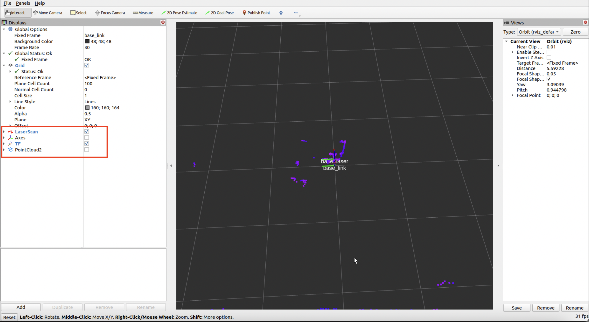
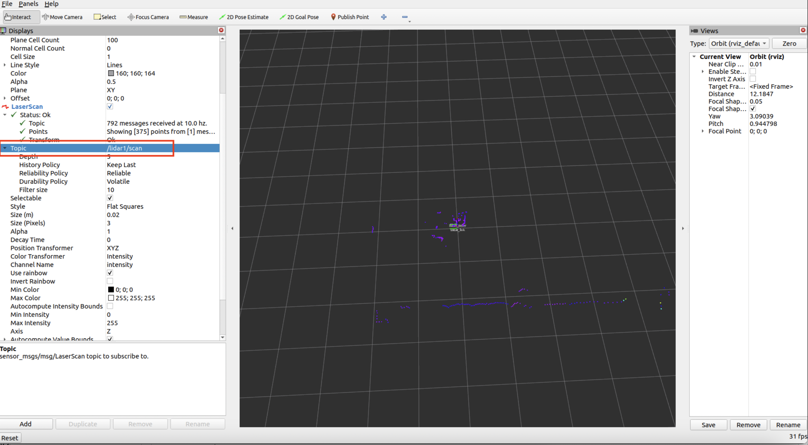
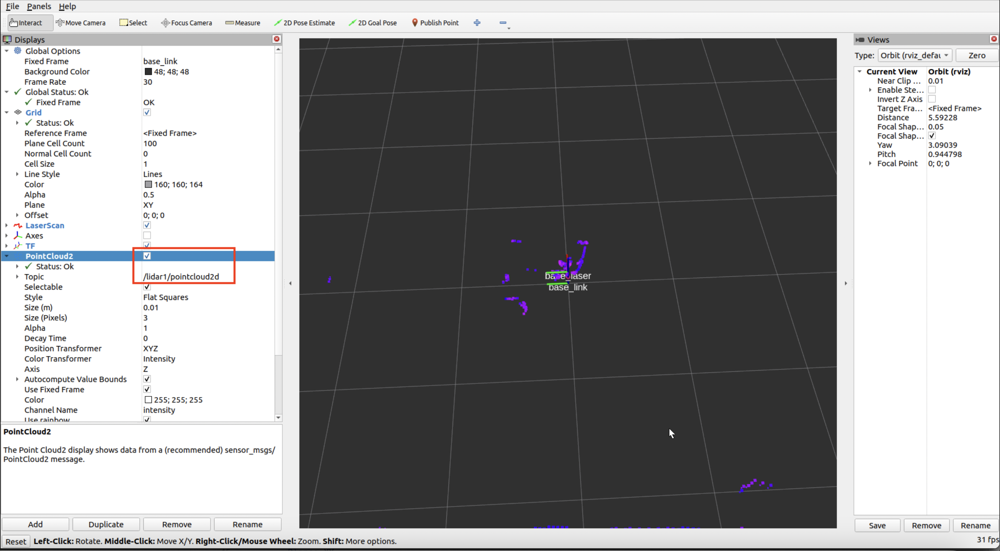
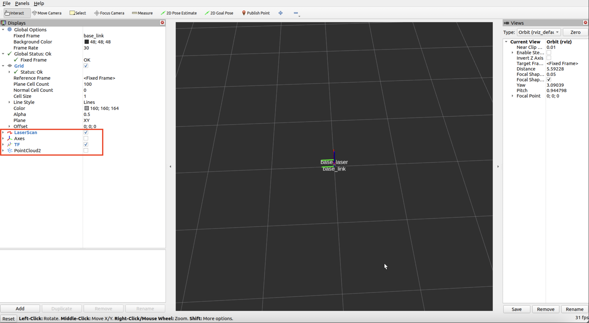
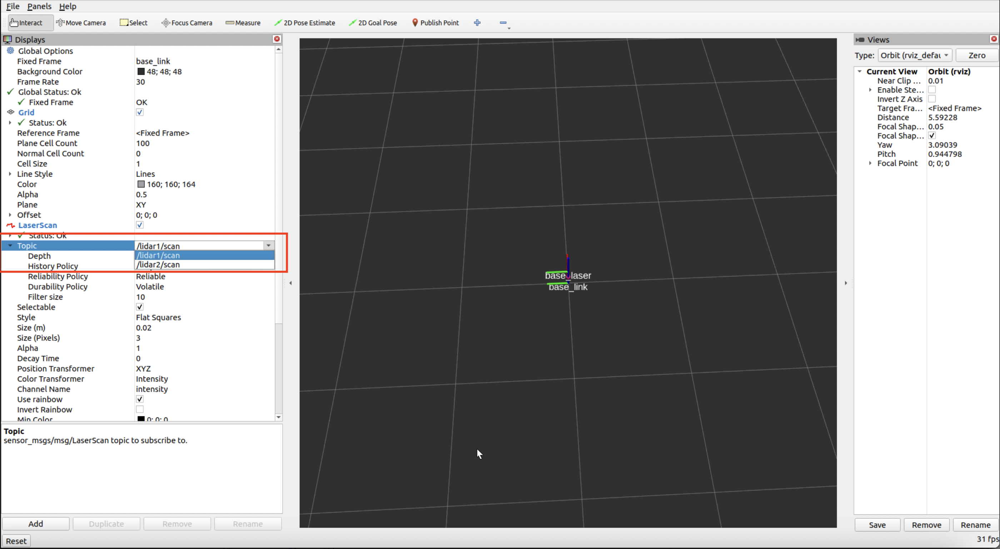
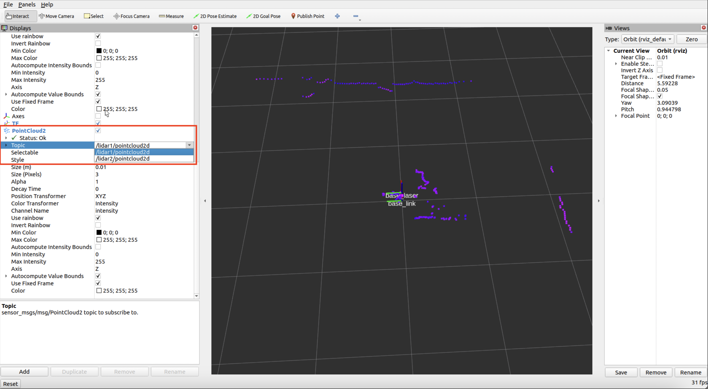
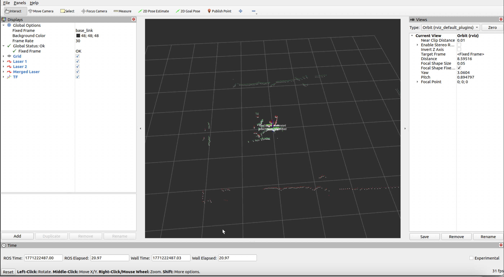

# LiDAR

**<span style="color:red">Make sure you finished the step 008-misc.md first</span>**

**When wiring the lidar,**

Connect LiDAR TX to *RX*.

Connect LiDAR GND to GND.

Connect LiDAR 5V to 5V.

Reference: <https://github.com/ldrobotSensorTeam/ldlidar_ros2/>

We cloned this repository and adapted it for our project:
https://github.com/AGitUser0001/ldlidar_ros2

**GitHub repository invites have already been sent to all team members.**

## Prepare

```sh
cd ~
mkdir -p ldlidar_ros2_ws/src
cd ldlidar_ros2_ws/src
git clone git@github.com:AGitUser0001/ldlidar_ros2.git
cd ldlidar_ros2
git submodule update --init --recursive
```

```sh
cd ~/ldlidar_ros2_ws/src/ldlidar_ros2
ls launch/*lidar1* launch/*lidar2*
```

make sure you see below 4 files

```
launch/lidar1.launch.py
launch/lidar2.launch.py
launch/viewer_lidar1.launch.py
launch/viewer_lidar2.launch.py
```

### Build:
```sh
cd ~/ldlidar_ros2_ws
source /opt/ros/humble/setup.bash
colcon build
```

#### Some build error and how to resolve:

Below issue is because you forgot to **source ros2**

Error:

```
<team-user>@<jetson-host>:~/ldlidar_ros2_ws$ colcon build
Starting >>> ldlidar_ros2
--- stderr: ldlidar_ros2
CMake Error at CMakeLists.txt:19 (find_package):
  By not providing "Findament_cmake.cmake" in CMAKE_MODULE_PATH this project
  has asked CMake to find a package configuration file provided by
  "ament_cmake", but CMake did not find one.

  Could not find a package configuration file provided by "ament_cmake" with
  any of the following names:

    ament_cmakeConfig.cmake
    ament_cmake-config.cmake

  Add the installation prefix of "ament_cmake" to CMAKE_PREFIX_PATH or set
  "ament_cmake_DIR" to a directory containing one of the above files.  If
  "ament_cmake" provides a separate development package or SDK, be sure it
  has been installed.


---
Failed   <<< ldlidar_ros2 [1.77s, exited with code 1]

Summary: 0 packages finished [2.25s]
  1 package failed: ldlidar_ros2
  1 package had stderr output: ldlidar_ros2
```

Solution:

```sh
source /opt/ros/humble/setup.bash
```

Below issue is because you forgot to **git submodule update --init --recursive**

Error:

```
<team-user>@<jetson-host>:~/ldlidar_ros2_ws$ colcon build
Starting >>> ldlidar_ros2
--- stderr: ldlidar_ros2
CMake Error at CMakeLists.txt:41 (add_subdirectory):
  The source directory

    $HOME/ldlidar_ros2_ws/src/ldlidar_ros2/sdk

  does not contain a CMakeLists.txt file.


---
Failed   <<< ldlidar_ros2 [2.23s, exited with code 1]

Summary: 0 packages finished [2.91s]
  1 package failed: ldlidar_ros2
  1 package had stderr output: ldlidar_ros2
```

Solution:

```sh
cd ldlidar_ros2_ws/src/ldlidar_ros2
git submodule update --init --recursive
```

#### Succ Build output: (warning is acceptable)
```
<team-user>@<jetson-host>:~/ldlidar_ros2_ws$ colcon build
Starting >>> ldlidar_ros2
--- stderr: ldlidar_ros2
In file included from $HOME/ldlidar_ros2_ws/src/ldlidar_ros2/src/demo.cpp:24:
/opt/ros/humble/include/sensor_msgs/sensor_msgs/point_cloud_conversion.hpp:47:6: warning: #warning POINT_CLOUD_DEPRECATION_MESSAGE [-Wcpp]
   47 | #    warning POINT_CLOUD_DEPRECATION_MESSAGE
      |      ^~~~~~~
$HOME/ldlidar_ros2_ws/src/ldlidar_ros2/src/demo.cpp: In function ‘void ToSensorPointCloudMessagePublish(ldlidar::Points2D&, LaserScanSetting&, rclcpp::Node::SharedPtr&, rclcpp::Publisher<sensor_msgs::msg::PointCloud2_<std::allocator<void> > >::SharedPtr&)’:
$HOME/ldlidar_ros2_ws/src/ldlidar_ros2/src/demo.cpp:370:16: warning: ‘bool sensor_msgs::convertPointCloudToPointCloud2(const PointCloud&, sensor_msgs::msg::PointCloud2&)’ is deprecated: PointCloud is deprecated as of Foxy in favor of sensor_msgs/PointCloud2. [-Wdeprecated-declarations]
  370 |   sensor_msgs::convertPointCloudToPointCloud2(output, output_cloud);
      |                ^~~~~~~~~~~~~~~~~~~~~~~~~~~~~~
In file included from $HOME/ldlidar_ros2_ws/src/ldlidar_ros2/src/demo.cpp:24:
/opt/ros/humble/include/sensor_msgs/sensor_msgs/point_cloud_conversion.hpp:81:20: note: declared here
   81 | static inline bool convertPointCloudToPointCloud2(
      |                    ^~~~~~~~~~~~~~~~~~~~~~~~~~~~~~
$HOME/ldlidar_ros2_ws/src/ldlidar_ros2/src/demo.cpp:370:46: warning: ‘bool sensor_msgs::convertPointCloudToPointCloud2(const PointCloud&, sensor_msgs::msg::PointCloud2&)’ is deprecated: PointCloud is deprecated as of Foxy in favor of sensor_msgs/PointCloud2. [-Wdeprecated-declarations]
  370 |   sensor_msgs::convertPointCloudToPointCloud2(output, output_cloud);
      |   ~~~~~~~~~~~~~~~~~~~~~~~~~~~~~~~~~~~~~~~~~~~^~~~~~~~~~~~~~~~~~~~~~
In file included from $HOME/ldlidar_ros2_ws/src/ldlidar_ros2/src/demo.cpp:24:
/opt/ros/humble/include/sensor_msgs/sensor_msgs/point_cloud_conversion.hpp:81:20: note: declared here
   81 | static inline bool convertPointCloudToPointCloud2(
      |                    ^~~~~~~~~~~~~~~~~~~~~~~~~~~~~~
---
Finished <<< ldlidar_ros2 [19.2s]
```

## Run Front Lidar

### Test Launch Front Lidar with Rviz2

Open terminal at GUI

```sh
cd ~/ldlidar_ros2_ws
source /opt/ros/humble/setup.bash
source install/setup.bash
ros2 launch ldlidar_ros2 viewer_lidar1.launch.py
```

The above command will automaticlly launch rviz2 GUI as below:



#### LaserScan View:

Please expand the LaserScan display in the Displays panel on the left side.

Make sure the **Topic** select **/lidar1/scan**



You should see purple dots in the RViz2 GUI. When you or nearby objects move, these dots will move accordingly. The LaserScan points appear larger in size.

#### PointCloud2 View:

Unslect the checkbox next to LaserScan to disable LaserScan Topic

Check the checkbox next to PointCloud2 to enable it.

Please expand the PointCloud2 display in the Displays panel on the left side.

Make sure the **Topic** select **/lidar1/pointcloud2d**



You should see purple dots in the RViz2 GUI. When you or nearby objects move, these dots will move accordingly. The PointCloud2 points appear smaller in size.

#### Exit Test
Close the rviz2 GUI, then control + C

## Run Rear Lidar

### Test Launch Rear Lidar with Rviz2

Open terminal at GUI

```sh
cd ~/ldlidar_ros2_ws
source /opt/ros/humble/setup.bash
source install/setup.bash
ros2 launch ldlidar_ros2 viewer_lidar2.launch.py
```

The above command will automaticlly launch rviz2 GUI as below:



#### LaserScan View:

Please expand the LaserScan display in the Displays panel on the left side.

Make sure the **Topic** select **/lidar2/scan**



You should see purple dots in the RViz2 GUI. When you or nearby objects move, these dots will move accordingly. The PointCloud2 points appear smaller in size.

#### PointCloud2 View:

Unslect the checkbox next to LaserScan to disable LaserScan Topic

Check the checkbox next to PointCloud2 to enable it.

Please expand the PointCloud2 display in the Displays panel on the left side.

Make sure the **Topic** select **/lidar2/pointcloud2d**



You should see purple dots in the RViz2 GUI. When you or nearby objects move, these dots will move accordingly. The PointCloud2 points appear smaller in size.

#### Exit Test
Close the rviz2 GUI, then control + C


# Laser Merger

## keep 2 Lidar launched

### Launch Front Lidar and Rear Lidar at same terminal

```sh
cd ~/ldlidar_ros2_ws
source /opt/ros/humble/setup.bash
source install/setup.bash
ros2 launch ldlidar_ros2 lidars.launch.py
```

## Prepare Merge
Reference: <https://github.com/pradyum/dual_laser_merger>

```sh
cd ~
mkdir laser_merger_ws/src -p
cd laser_merger_ws/src
git clone -b humble https://github.com/pradyum/dual_laser_merger.git
cd ..
rosdep install --from-paths src --ignore-src -r -y
```

```sh
cd ~/laser_merger_ws/src/dual_laser_merger
```

### Add a file under launch/ called laser_merger_plus_rviz2.launch.py:

```sh
vi launch/laser_merger_plus_rviz2.launch.py
```

#### Paste below content

# real robot merge lidar launch file with rviz2
```py
# Copyright 2024 pradyum
#
# Licensed under the Apache License, Version 2.0 (the "License");
# you may not use this file except in compliance with the License.
# You may obtain a copy of the License at
#
#     http://www.apache.org/licenses/LICENSE-2.0
#
# Unless required by applicable law or agreed to in writing, software
# distributed under the License is distributed on an "AS IS" BASIS,
# WITHOUT WARRANTIES OR CONDITIONS OF ANY KIND, either express or implied.
# See the License for the specific language governing permissions and
# limitations under the License.

from ament_index_python.packages import get_package_share_directory
from launch import LaunchDescription
from launch.actions import ExecuteProcess
from launch_ros.actions import ComposableNodeContainer, Node
from launch_ros.descriptions import ComposableNode


def generate_launch_description():

    ld = LaunchDescription()

    dual_laser_merger_node = ComposableNodeContainer(
        name='demo_container',
        namespace='',
        package='rclcpp_components',
        executable='component_container',
        composable_node_descriptions=[
            ComposableNode(
                package='dual_laser_merger',
                plugin='merger_node::MergerNode',
                name='dual_laser_merger',
                parameters=[
                    {'laser_1_topic': '/lidar1/scan'},
                    {'laser_2_topic': '/lidar2/scan'},
                    {'merged_scan_topic': '/scan'},
                    {'target_frame': 'laser_frame'},
                    {'laser_1_x_offset': 0.0},
                    {'laser_1_y_offset': 0.0},
                    {'laser_1_yaw_offset': 0.0},
                    {'laser_2_x_offset': 0.0},
                    {'laser_2_y_offset': 0.0},
                    {'laser_2_yaw_offset': 0.0},
                    # Raw lidar TF can lag scan stamps by ~0.1s on the real Jetson.
                    {'tolerance': 0.05},
                    {'queue_size': 5},
                    {'angle_increment': 0.001},
                    {'scan_time': 0.067},
                    # Filter out robot body / shell / merge artifacts that appear as 1-5 cm points.
                    {'range_min': 0.05},
                    {'range_max': 25.0},
                    {'min_height': -1.0},
                    {'max_height': 1.0},
                    {'angle_min': -3.141592654},
                    {'angle_max': 3.141592654},
                    {'inf_epsilon': 1.0},
                    {'use_inf': True},
                    {'allowed_radius': 0.45},
                    {'enable_shadow_filter': False},
                    {'enable_average_filter': False},
                    ],
            )
        ],
        output='screen',
    )

    ld.add_action(dual_laser_merger_node)

    rviz_node = Node(
        package='rviz2',
        executable='rviz2',
        output='both',
        arguments=[
            '-d',
            f"{get_package_share_directory('dual_laser_merger')}/config/rviz_config.rviz",
        ],
    )

    ld.add_action(rviz_node)

    return ld
```

### Add a file under launch/ called laser_merger.launch.py:

```sh
vi launch/laser_merger.launch.py
```

#### Paste below content

# real robot merge lidar launch file without rviz2
```py
# Copyright 2024 pradyum
#
# Licensed under the Apache License, Version 2.0 (the "License");
# you may not use this file except in compliance with the License.
# You may obtain a copy of the License at
#
#     http://www.apache.org/licenses/LICENSE-2.0
#
# Unless required by applicable law or agreed to in writing, software
# distributed under the License is distributed on an "AS IS" BASIS,
# WITHOUT WARRANTIES OR CONDITIONS OF ANY KIND, either express or implied.
# See the License for the specific language governing permissions and
# limitations under the License.

from ament_index_python.packages import get_package_share_directory
from launch import LaunchDescription
from launch.actions import ExecuteProcess
from launch_ros.actions import ComposableNodeContainer, Node
from launch_ros.descriptions import ComposableNode


def generate_launch_description():

    ld = LaunchDescription()

    dual_laser_merger_node = ComposableNodeContainer(
        name='demo_container',
        namespace='',
        package='rclcpp_components',
        executable='component_container',
        composable_node_descriptions=[
            ComposableNode(
                package='dual_laser_merger',
                plugin='merger_node::MergerNode',
                name='dual_laser_merger',
                parameters=[
                    {'laser_1_topic': '/lidar1/scan'},
                    {'laser_2_topic': '/lidar2/scan'},
                    {'merged_scan_topic': '/scan'},
                    {'target_frame': 'laser_frame'},
                    {'laser_1_x_offset': 0.0},
                    {'laser_1_y_offset': 0.0},
                    {'laser_1_yaw_offset': 0.0},
                    {'laser_2_x_offset': 0.0},
                    {'laser_2_y_offset': 0.0},
                    {'laser_2_yaw_offset': 0.0},
                    # Raw lidar TF can lag scan stamps by ~0.1s on the real Jetson.
                    {'tolerance': 0.05},
                    {'queue_size': 5},
                    {'angle_increment': 0.001},
                    {'scan_time': 0.067},
                    # Filter out robot body / shell / merge artifacts that appear as 1-5 cm points.
                    {'range_min': 0.05},
                    {'range_max': 25.0},
                    {'min_height': -1.0},
                    {'max_height': 1.0},
                    {'angle_min': -3.141592654},
                    {'angle_max': 3.141592654},
                    {'inf_epsilon': 1.0},
                    {'use_inf': True},
                    {'allowed_radius': 0.45},
                    {'enable_shadow_filter': False},
                    {'enable_average_filter': False},
                    ],
            )
        ],
        output='screen',
    )

    ld.add_action(dual_laser_merger_node)

    return ld
```

### Add a file under launch/ called sim_laser_merger.launch.py:

```sh
vi launch/sim_laser_merger.launch.py
```

# sim merge lidar launch file without rviz
```
from ament_index_python.packages import get_package_share_directory
from launch import LaunchDescription
from launch.actions import DeclareLaunchArgument
from launch.substitutions import LaunchConfiguration
from launch_ros.actions import ComposableNodeContainer, Node
from launch_ros.descriptions import ComposableNode

def generate_launch_description():
    use_sim_time = LaunchConfiguration('use_sim_time', default='false')

    ld = LaunchDescription()
    ld.add_action(DeclareLaunchArgument('use_sim_time', default_value='false'))

    dual_laser_merger_node = ComposableNodeContainer(
        name='demo_container',
        namespace='',
        package='rclcpp_components',
        executable='component_container',
        composable_node_descriptions=[
            ComposableNode(
                package='dual_laser_merger',
                plugin='merger_node::MergerNode',
                name='dual_laser_merger',
                parameters=[
                    {'use_sim_time': use_sim_time},  # Add this line
                    {'laser_1_topic': '/lidar1/scan'},
                    {'laser_2_topic': '/lidar2/scan'},
                    {'merged_scan_topic': '/scan'},
                    {'target_frame': 'laser_frame'},
                    {'laser_1_x_offset': 0.0},
                    {'laser_1_y_offset': 0.0},
                    {'laser_1_yaw_offset': 0.0},
                    {'laser_2_x_offset': 0.0},
                    {'laser_2_y_offset': 0.0},
                    {'laser_2_yaw_offset': 0.0},
                    {'tolerance': 0.05},
                    {'queue_size': 5},
                    {'angle_increment': 0.001},
                    {'scan_time': 0.067},
                    {'range_min': 0.05},
                    {'range_max': 25.0},
                    {'min_height': -1.0},
                    {'max_height': 1.0},
                    {'angle_min': -3.141592654},
                    {'angle_max': 3.141592654},
                    {'inf_epsilon': 1.0},
                    {'use_inf': True},
                    {'allowed_radius': 0.45},
                    {'enable_shadow_filter': False},
                    {'enable_average_filter': False},
                ],
            )
        ],
        output='screen',
    )
    ld.add_action(dual_laser_merger_node)

    return ld
```

### Add a file under launch/ called sim_laser_merger_plus_rviz2.launch.py:

```sh
vi launch/sim_laser_merger_plus_rviz2.launch.py
```

# sim merge lidar launch file with rviz
```
from ament_index_python.packages import get_package_share_directory
from launch import LaunchDescription
from launch.actions import DeclareLaunchArgument
from launch.substitutions import LaunchConfiguration
from launch_ros.actions import ComposableNodeContainer, Node
from launch_ros.descriptions import ComposableNode

def generate_launch_description():
    use_sim_time = LaunchConfiguration('use_sim_time', default='false')

    ld = LaunchDescription()
    ld.add_action(DeclareLaunchArgument('use_sim_time', default_value='false'))

    dual_laser_merger_node = ComposableNodeContainer(
        name='demo_container',
        namespace='',
        package='rclcpp_components',
        executable='component_container',
        composable_node_descriptions=[
            ComposableNode(
                package='dual_laser_merger',
                plugin='merger_node::MergerNode',
                name='dual_laser_merger',
                parameters=[
                    {'use_sim_time': use_sim_time},  # Add this line
                    {'laser_1_topic': '/lidar1/scan'},
                    {'laser_2_topic': '/lidar2/scan'},
                    {'merged_scan_topic': '/scan'},
                    {'target_frame': 'laser_frame'},
                    {'laser_1_x_offset': 0.0},
                    {'laser_1_y_offset': 0.0},
                    {'laser_1_yaw_offset': 0.0},
                    {'laser_2_x_offset': 0.0},
                    {'laser_2_y_offset': 0.0},
                    {'laser_2_yaw_offset': 0.0},
                    {'tolerance': 0.05},
                    {'queue_size': 5},
                    {'angle_increment': 0.001},
                    {'scan_time': 0.067},
                    {'range_min': 0.05},
                    {'range_max': 25.0},
                    {'min_height': -1.0},
                    {'max_height': 1.0},
                    {'angle_min': -3.141592654},
                    {'angle_max': 3.141592654},
                    {'inf_epsilon': 1.0},
                    {'use_inf': True},
                    {'allowed_radius': 0.45},
                    {'enable_shadow_filter': False},
                    {'enable_average_filter': False},
                ],
            )
        ],
        output='screen',
    )
    ld.add_action(dual_laser_merger_node)

    rviz_node = Node(
        package='rviz2',
        executable='rviz2',
        output='both',
        parameters=[{'use_sim_time': use_sim_time}],  # Add this line
        arguments=[
            '-d',
            f"{get_package_share_directory('dual_laser_merger')}/config/rviz_config.rviz",
        ],
    )
    ld.add_action(rviz_node)

    return ld
```

### Modify rviz_config:

#### Backup and truncate the original rviz_config.rviz file

```sh
cp -pa ~/laser_merger_ws/src/dual_laser_merger/config/rviz_config.rviz /tmp/rviz_config.rviz

> ~/laser_merger_ws/src/dual_laser_merger/config/rviz_config.rviz
```

```sh
vi ~/laser_merger_ws/src/dual_laser_merger/config/rviz_config.rviz
```

#### Paste below content
```yaml
Panels:
  - Class: rviz_common/Displays
    Help Height: 138
    Name: Displays
    Property Tree Widget:
      Expanded:
        - /Global Options1
        - /Status1
        - /Merged Laser1/Topic1
      Splitter Ratio: 0.5461847186088562
    Tree Height: 615
  - Class: rviz_common/Selection
    Name: Selection
  - Class: rviz_common/Tool Properties
    Expanded:
      - /2D Goal Pose1
      - /Publish Point1
    Name: Tool Properties
    Splitter Ratio: 0.5886790156364441
  - Class: rviz_common/Views
    Expanded:
      - /Current View1
    Name: Views
    Splitter Ratio: 0.5
  - Class: rviz_common/Time
    Experimental: false
    Name: Time
    SyncMode: 0
    SyncSource: Laser 1
Visualization Manager:
  Class: ""
  Displays:
    - Alpha: 0.5
      Cell Size: 1
      Class: rviz_default_plugins/Grid
      Color: 160; 160; 164
      Enabled: true
      Line Style:
        Line Width: 0.029999999329447746
        Value: Lines
      Name: Grid
      Normal Cell Count: 0
      Offset:
        X: 0
        Y: 0
        Z: 0
      Plane: XY
      Plane Cell Count: 10
      Reference Frame: <Fixed Frame>
      Value: true
    - Alpha: 1
      Autocompute Intensity Bounds: true
      Autocompute Value Bounds:
        Max Value: 10
        Min Value: -10
        Value: true
      Axis: Z
      Channel Name: intensity
      Class: rviz_default_plugins/LaserScan
      Color: 248; 228; 92
      Color Transformer: FlatColor
      Decay Time: 0
      Enabled: true
      Invert Rainbow: false
      Max Color: 255; 255; 255
      Max Intensity: 4898
      Min Color: 0; 0; 0
      Min Intensity: 300
      Name: Laser 1
      Position Transformer: XYZ
      Selectable: true
      Size (Pixels): 3
      Size (m): 0.03
      Style: Flat Squares
      Topic:
        Depth: 5
        Durability Policy: Volatile
        Filter size: 10
        History Policy: Keep Last
        Reliability Policy: Reliable
        Value: /lidar1/scan
      Use Fixed Frame: true
      Use rainbow: true
      Value: true
    - Alpha: 1
      Autocompute Intensity Bounds: true
      Autocompute Value Bounds:
        Max Value: 10
        Min Value: -10
        Value: true
      Axis: Z
      Channel Name: intensity
      Class: rviz_default_plugins/LaserScan
      Color: 87; 227; 137
      Color Transformer: FlatColor
      Decay Time: 0
      Enabled: true
      Invert Rainbow: false
      Max Color: 255; 255; 255
      Max Intensity: 64653
      Min Color: 0; 0; 0
      Min Intensity: 457
      Name: Laser 2
      Position Transformer: XYZ
      Selectable: true
      Size (Pixels): 3
      Size (m): 0.03
      Style: Flat Squares
      Topic:
        Depth: 5
        Durability Policy: Volatile
        Filter size: 10
        History Policy: Keep Last
        Reliability Policy: Reliable
        Value: /lidar2/scan
      Use Fixed Frame: true
      Use rainbow: true
      Value: true
    - Alpha: 1
      Autocompute Intensity Bounds: true
      Autocompute Value Bounds:
        Max Value: 10
        Min Value: -10
        Value: true
      Axis: Z
      Channel Name: intensity
      Class: rviz_default_plugins/LaserScan
      Color: 255; 255; 255
      Color Transformer: FlatColor
      Decay Time: 0
      Enabled: true
      Invert Rainbow: false
      Max Color: 255; 255; 255
      Max Intensity: 4096
      Min Color: 0; 0; 0
      Min Intensity: 0
      Name: Merged Laser
      Position Transformer: XYZ
      Selectable: true
      Size (Pixels): 3
      Size (m): 0.03
      Style: Flat Squares
      Topic:
        Depth: 5
        Durability Policy: Volatile
        Filter size: 10
        History Policy: Keep Last
        Reliability Policy: Best Effort
        Value: /scan
      Use Fixed Frame: true
      Use rainbow: true
      Value: true
    - Class: rviz_default_plugins/TF
      Enabled: true
      Filter (blacklist): ""
      Filter (whitelist): ""
      Frame Timeout: 15
      Frames:
        All Enabled: true
        lidar1_laser:
          Value: true
        lidar2_laser:
          Value: true
        base_link:
          Value: true
      Marker Scale: 1
      Name: TF
      Show Arrows: true
      Show Axes: true
      Show Names: true
      Tree:
        base_link:
          lidar1_laser:
            {}
          lidar2_laser:
            {}
      Update Interval: 0
      Value: true
  Enabled: true
  Global Options:
    Background Color: 48; 48; 48
    Fixed Frame: base_link
    Frame Rate: 30
  Name: root
  Tools:
    - Class: rviz_default_plugins/Interact
      Hide Inactive Objects: true
    - Class: rviz_default_plugins/MoveCamera
    - Class: rviz_default_plugins/Select
    - Class: rviz_default_plugins/FocusCamera
    - Class: rviz_default_plugins/Measure
      Line color: 128; 128; 0
    - Class: rviz_default_plugins/SetInitialPose
      Covariance x: 0.25
      Covariance y: 0.25
      Covariance yaw: 0.06853891909122467
      Topic:
        Depth: 5
        Durability Policy: Volatile
        History Policy: Keep Last
        Reliability Policy: Reliable
        Value: /initialpose
    - Class: rviz_default_plugins/SetGoal
      Topic:
        Depth: 5
        Durability Policy: Volatile
        History Policy: Keep Last
        Reliability Policy: Reliable
        Value: /goal_pose
    - Class: rviz_default_plugins/PublishPoint
      Single click: true
      Topic:
        Depth: 5
        Durability Policy: Volatile
        History Policy: Keep Last
        Reliability Policy: Reliable
        Value: /clicked_point
  Transformation:
    Current:
      Class: rviz_default_plugins/TF
  Value: true
  Views:
    Current:
      Class: rviz_default_plugins/Orbit
      Distance: 8.595158576965332
      Enable Stereo Rendering:
        Stereo Eye Separation: 0.05999999865889549
        Stereo Focal Distance: 1
        Swap Stereo Eyes: false
        Value: false
      Focal Point:
        X: 0
        Y: 0
        Z: 0
      Focal Shape Fixed Size: true
      Focal Shape Size: 0.05000000074505806
      Invert Z Axis: false
      Name: Current View
      Near Clip Distance: 0.009999999776482582
      Pitch: 0.8947969675064087
      Target Frame: <Fixed Frame>
      Value: Orbit (rviz)
      Yaw: 3.060399055480957
    Saved: ~
Window Geometry:
  Displays:
    collapsed: false
  Height: 1011
  Hide Left Dock: false
  Hide Right Dock: false
  QMainWindow State: 000000ff00000000fd0000000400000000000001f400000331fc0200000008fb0000001200530065006c0065006300740069006f006e00000001e10000009b0000005d00fffffffb0000001e0054006f006f006c002000500072006f007000650072007400690065007302000001ed000001df00000185000000a3fb000000120056006900650077007300200054006f006f02000001df000002110000018500000122fb000000200054006f006f006c002000500072006f0070006500720074006900650073003203000002880000011d000002210000017afb000000100044006900730070006c006100790073010000003f00000331000000cc00fffffffb0000002000730065006c0065006300740069006f006e00200062007500660066006500720200000138000000aa0000023a00000294fb00000014005700690064006500530074006500720065006f02000000e6000000d2000003ee0000030bfb0000000c004b0069006e0065006300740200000186000001060000030c00000261000000010000015d00000331fc0200000003fb0000001e0054006f006f006c002000500072006f00700065007200740069006500730100000041000000780000000000000000fb0000000a00560069006500770073010000003f00000331000000a900fffffffb0000001200530065006c0065006300740069006f006e010000025a000000b200000000000000000000000200000490000000a9fc0100000001fb0000000a00560069006500770073030000004e00000080000002e100000197000000030000073e0000005efc0100000002fb0000000800540069006d006501000000000000073e0000026f00fffffffb0000000800540069006d00650100000000000004500000000000000000000003e10000033100000004000000040000000800000008fc0000000100000002000000010000000a0054006f006f006c00730100000000ffffffff0000000000000000
  Selection:
    collapsed: false
  Time:
    collapsed: false
  Tool Properties:
    collapsed: false
  Views:
    collapsed: false
  Width: 1854
  X: 66
  Y: 32
```

## Build:
```sh
cd ~/laser_merger_ws
source /opt/ros/humble/setup.bash
colcon build --symlink-install
```

## Run Real Robot Merged Lidar with rviz2
```sh
cd ~/laser_merger_ws
source /opt/ros/humble/setup.bash
source install/setup.bash
ros2 launch dual_laser_merger laser_merger_plus_rviz2.launch.py
```

## Run Real Robot Merged Lidar without rviz2
```sh
cd ~/laser_merger_ws
source /opt/ros/humble/setup.bash
source install/setup.bash
ros2 launch dual_laser_merger laser_merger.launch.py
```

## Run Sim Robt Merged Lidar without rviz2
```sh
cd ~/laser_merger_ws
source /opt/ros/humble/setup.bash
source install/setup.bash
ros2 launch dual_laser_merger sim_laser_merger.launch.py
```

## Run Sim Robt Merged Lidar with rviz2
```sh
cd ~/laser_merger_ws
source /opt/ros/humble/setup.bash
source install/setup.bash
ros2 launch dual_laser_merger sim_laser_merger_plus_rviz2.launch.py
```


