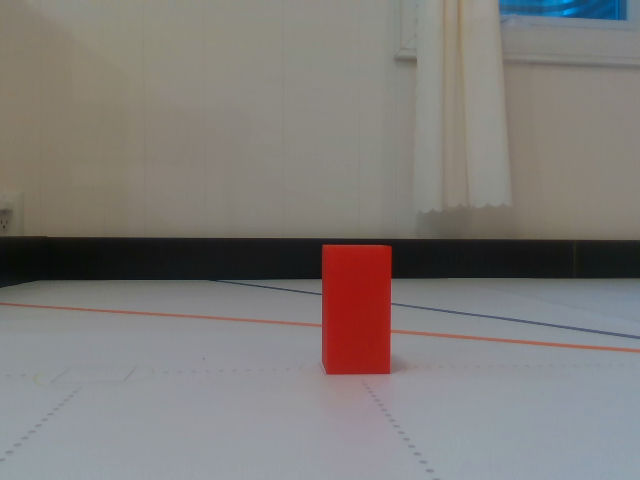
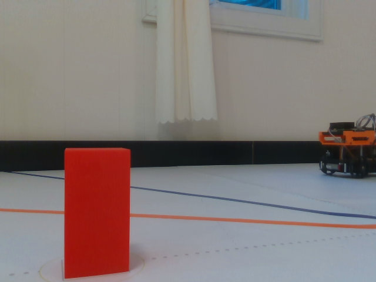
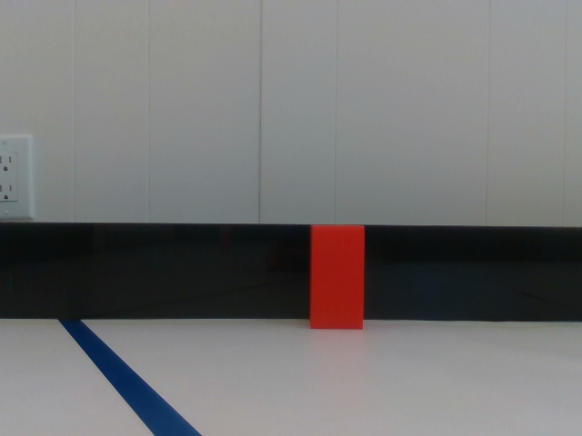
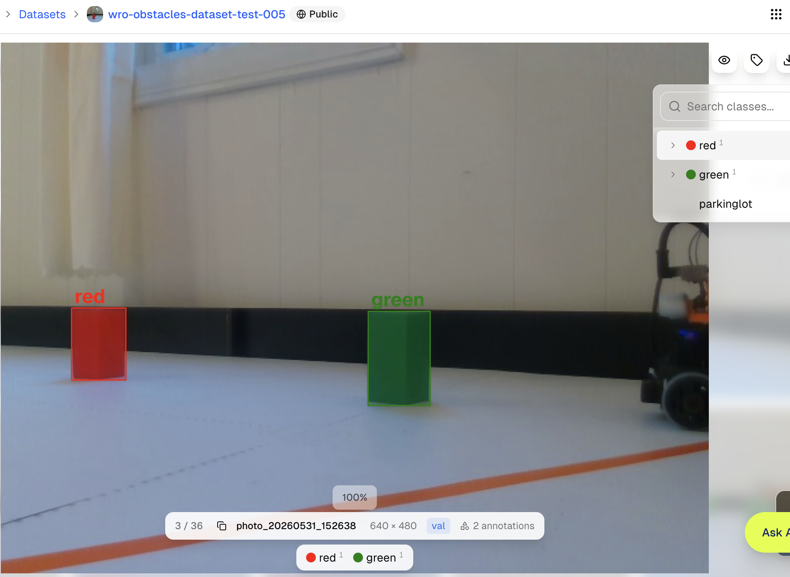

# AI Use and Authorship

This page records the team's YOLO object-detection experiment and the team's responsibility for its data, annotation, training, code integration, testing, and final decision. The experiment was part of development; it is not in the final vehicle's autonomous runtime chain.

## Team Work and the Role of AI Tools

The team independently collected the track photographs, defined the classes, checked annotations, exported the data, wrote and ran the training notebook, integrated ROS 2, observed the real vehicle, and decided whether to use the model. Ultralytics YOLO supplied a pretrained detection architecture and training/inference software; Ultralytics HUB supplied dataset hosting and the annotation interface; Google Colab supplied the training environment. These tools did not replace the team's judgement and do not by themselves prove that a model would run reliably on the vehicle.

## YOLO Object-Detection Experiment

### 1. Install the ROS 2 YOLO Package

The team installed and built `mgonzs13/yolo_ros` using the [YOLO ROS 2 installation record](12-installation-record/013-YOLO-AI.md#yolo-using-ros2). The package connects camera images and depth images to ROS 2 and publishes detections. The team's launch configuration receives the D435f colour image, aligned depth image, and camera information, then uses `yolo_bringup` to publish `/yolo/detections_3d`.

### 2. Team-Collected Dataset

The team photographed `17` `640 × 480` track scenes as the dataset source for red obstacles, green obstacles, and parking-area scenes. Every original dataset photo is retained with an English file name in [dataset-photos](../media/development/ai-yolo/dataset-photos/). Representative samples are shown below:

| Team-collected scene sample | Team-collected scene sample | Team-collected scene sample |
|---|---|---|
|  |  |  |

### 3. HUB Annotation and JSON Dataset Export

The team registered on Ultralytics HUB, created a public dataset, and manually annotated the `red`, `green`, and `parkinglot` classes. The following image preserves one annotation check: red and green obstacles in the same scene have bounding boxes and class labels.

The team then downloaded the dataset as a JSON export. The training notebook reads its NDJSON (newline-delimited JSON) content, separates the `train`, `val`, and `test` images, and converts each labelled bounding box to a YOLO text-label file. The class list and export-conversion procedure are retained in [yolo8.ipynb](12-installation-record/yolo8.ipynb).

### 4. Colab Training and Model Artifact

The team ran [yolo8.ipynb](12-installation-record/yolo8.ipynb) in Google Colab: it installs `ultralytics`, initialises from `yolov8n.pt`, trains using the converted `data.yaml` for `100` epochs, and runs the validation command. The resulting trained weights are retained as [wro-obstacle-detector-best.pt](../media/models/yolo/wro-obstacle-detector-best.pt).

### 5. ROS 2 Integration and Vehicle Observation

The team placed the model in a ROS 2 launch chain: camera images and aligned depth images enter `yolo_ros`, which publishes `/yolo/detections_3d`. Early control code subscribed to that topic, selected `red` and `green` classes, filtered by confidence threshold, and placed valid detections in obstacle memory. The relevant implementations are [wro_map_free_driver_node.py](https://github.com/clover1983/wro_ign_gazebo_sim/blob/main/hiway_map_free/nouse/wro_map_free_driver_node.py) and [wro_yolo_ros.launch.py](https://github.com/clover1983/wro_ign_gazebo_sim/blob/main/hiway_perception/launch/wro_yolo_ros.launch.py).

On the physical vehicle, YOLO sometimes recognised an object but at other times produced no stable detection at all. The same competition task could not depend on this inconsistent output, so the team chose not to include YOLO in the autonomous competition decision path. The final program instead relies on LiDAR, IMU, encoder feedback, and explicitly processed camera information; the YOLO implementation remains a development record rather than a runtime dependency.
