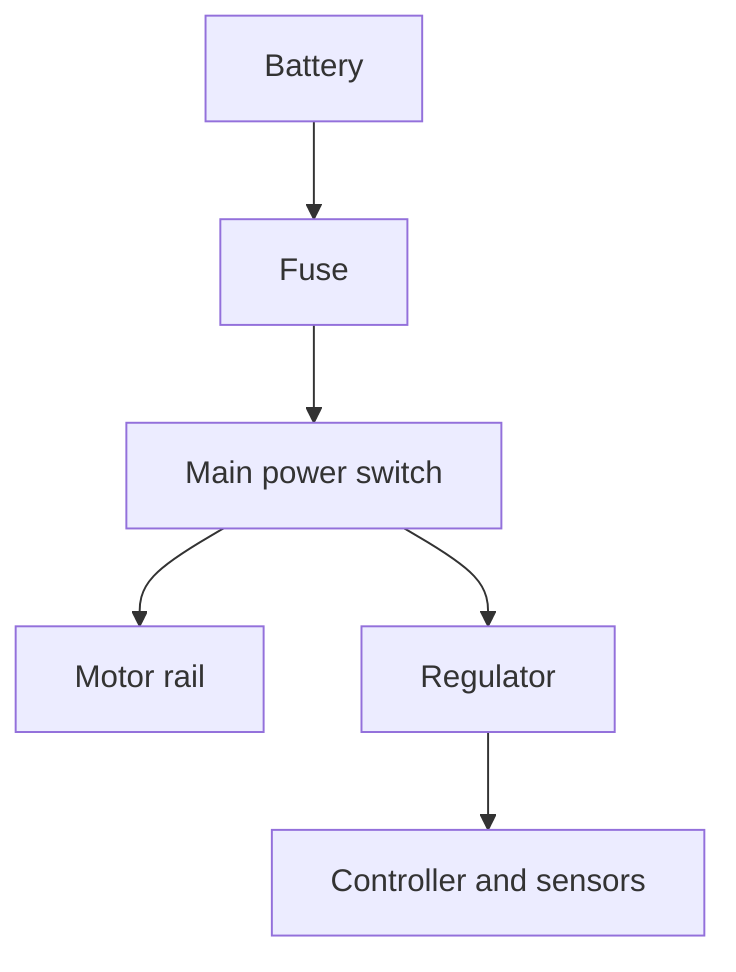

# Wiring Diagram

Replace this page with a labeled schematic and connector-level wiring diagram. Include wire gauge, voltage rails, grounds, fuses, switches, polarity, connectors, and pin references.

