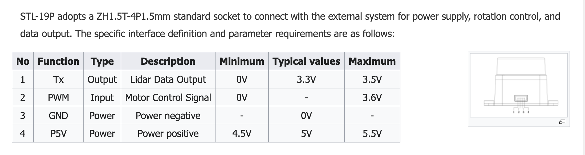
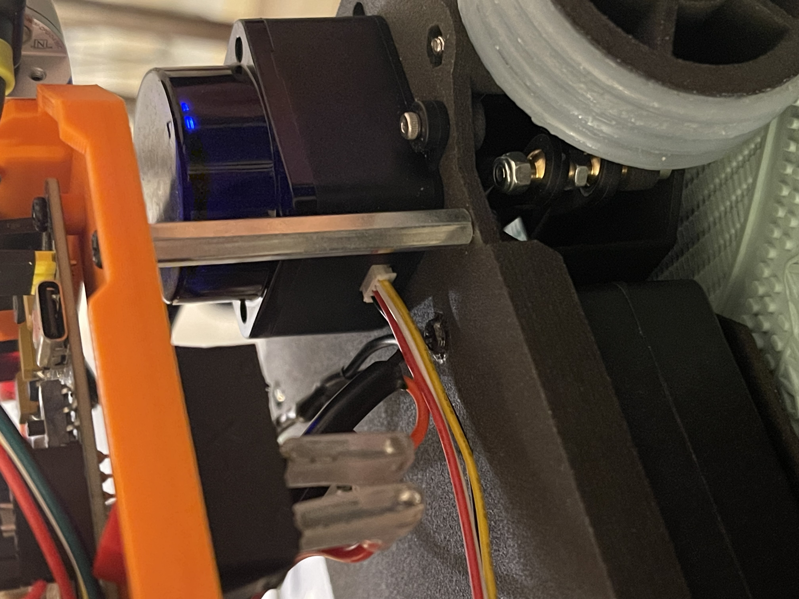
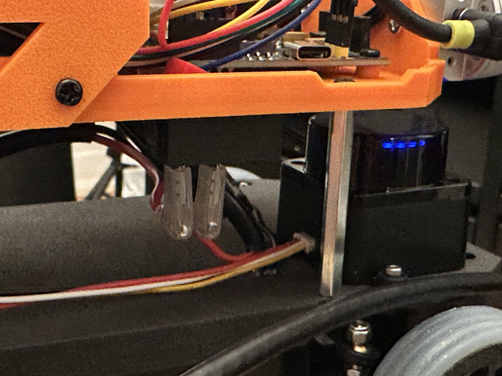
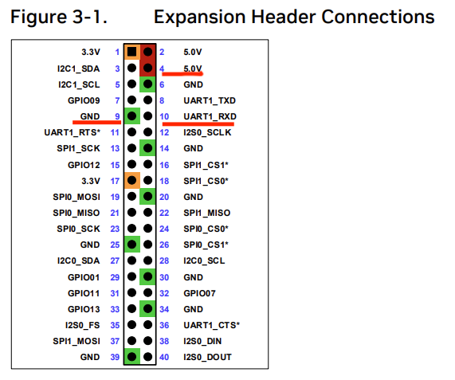
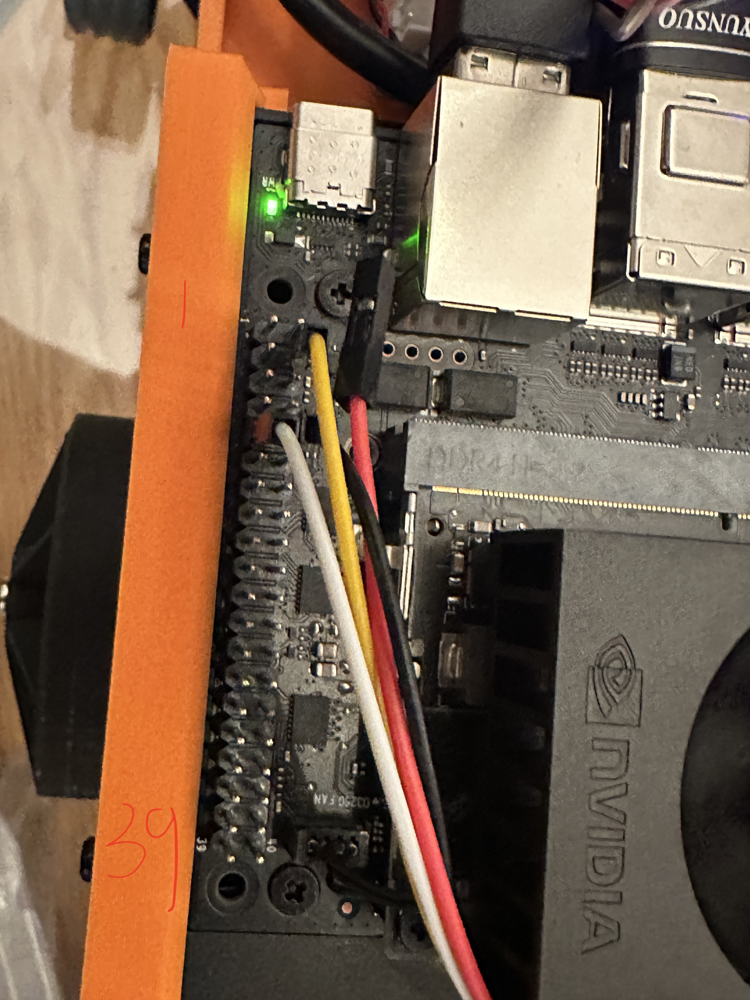
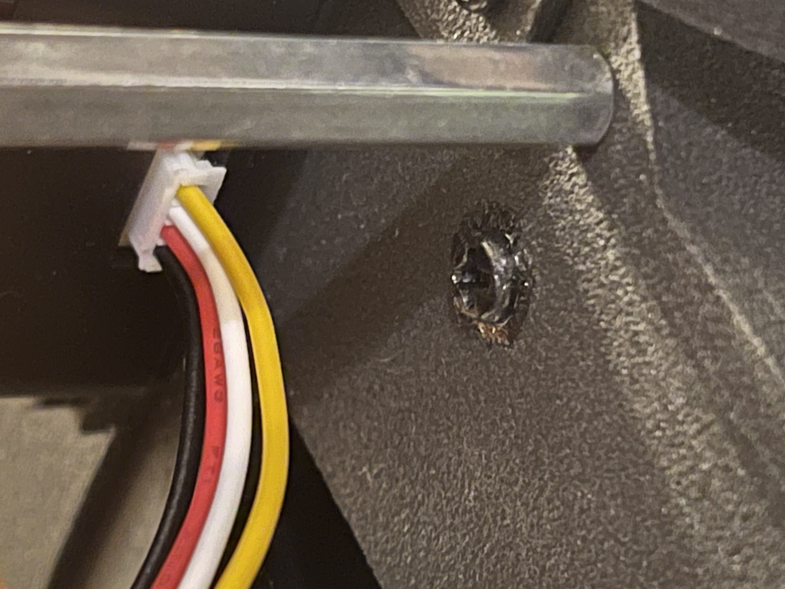
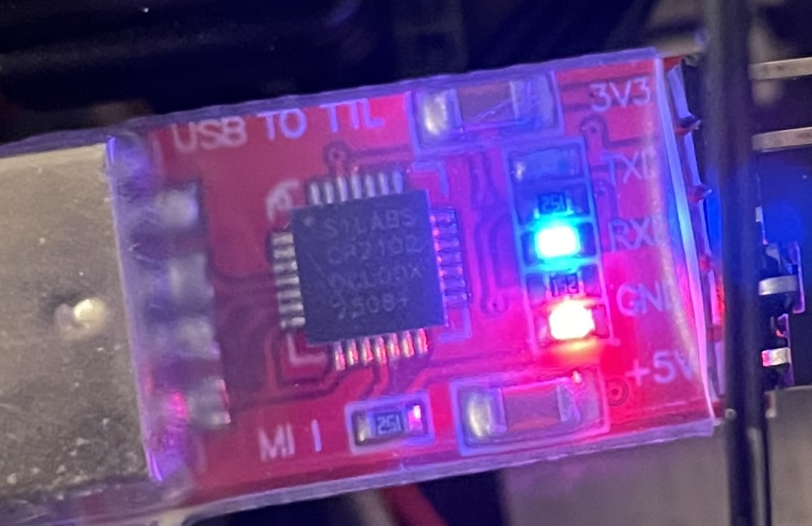
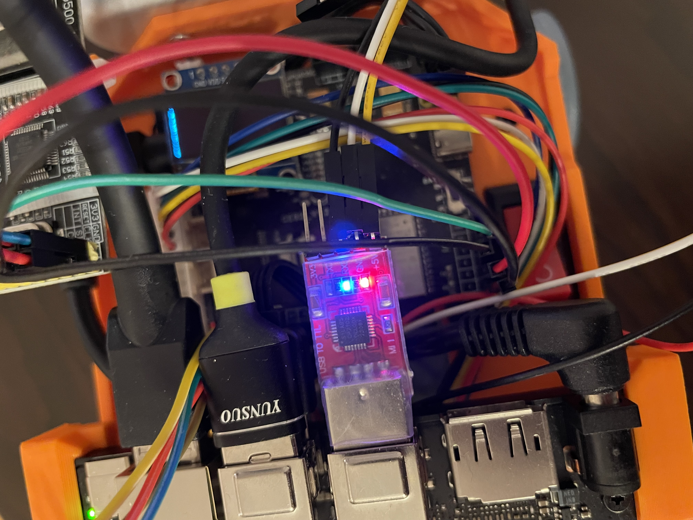

# LiDAR Hardware Connection and Setup Guide

This document describes the hardware wiring and basic setup for using **two LDROBOT STL-27L LiDARs** (front and rear) with a **Jetson Orin Nano** platform.

---

## LiDAR Model

- **Model**: LDROBOT STL-27L

---

## LiDAR Interface

The LDROBOT D500 LiDAR uses a **ZHR-4 1.5mm** connector.

---

## Front LiDAR Connection (Direct GPIO to Jetson)

For the **front LiDAR**, we connect it directly to the **Jetson GPIO 40-pin header** using Dupont wires.
Based on experience, GPIO serial communication is more stable than USB-TTL for continuous LiDAR data streaming.

### Front LiDAR Wiring Photos

The white connector on the cable is inserted into the LiDAR ZHR-4 1.5mm port, with the **four small pin holes facing upward**.

---

### Front LiDAR ZHR-4 Pin Mapping (Wire Colors)

| LiDAR Signal | Wire Color | Description |
|--------------|------------|-------------|
| TX           | Black      | Serial data output |
| PWM          | Red        | Motor speed control (not used) |
| GND          | White      | Ground |
| P5V          | Yellow     | 5V power |

---

### Jetson GPIO Header

- **Carrier Board**: Jetson Orin Nano
- **GPIO Header**: 40-pin

Pin reference documentation:
https://forums.developer.nvidia.com/t/complete-list-of-40-pin-header-options/331516

---

### Front LiDAR → Jetson GPIO Mapping

| Jetson GPIO Pin | Function | LiDAR Wire |
|-----------------|----------|------------|
| Pin 4           | 5.0V     | Yellow (P5V) |
| Pin 9           | GND      | White (GND) |
| Pin 10          | RX       | Black (TX from LiDAR) |
| —               | —        | Red (PWM) **not connected** |

---

### Connected Front LiDAR to Jetson GPIO

---

## Rear LiDAR Connection (USB via TTL Converter)

The **rear LiDAR** uses the same **ZHR-4 1.5mm to Dupont (2.54mm)** cable, but is connected through a **TTL-to-USB A converter (CP2102 module)**.

Although we previously encountered stability issues with USB-TTL converters, this specific setup has been tested and works reliably.

---

### Rear LiDAR Wiring Photo

The white connector is inserted into the LiDAR ZHR-4 1.5mm port with the **four pin holes facing upward**.

---

### Rear LiDAR ZHR-4 Pin Mapping (Wire Colors)

| LiDAR Signal | Wire Color | Description |
|--------------|------------|-------------|
| TX           | Black      | Serial data output |
| PWM          | Red        | Motor speed control (not used) |
| GND          | White      | Ground |
| P5V          | Yellow     | 5V power |

---

### TTL to USB Converter (CP2102) Pin Mapping

The Dupont wires are connected to the CP2102 module as follows:

| CP2102 Pin | Function | LiDAR Wire |
|------------|----------|------------|
| 3V3        | 3.3V     | Not used |
| TX         | TX       | Not used |
| RX         | RX       | Black (TX from LiDAR) |
| GND        | Ground   | White (GND) |
| 5V         | 5V Power | Yellow (P5V) |
| —          | —        | Red (PWM) **not connected** |

---

### Connected Rear LiDAR via USB

The CP2102 USB-A interface is plugged directly into the Jetson USB port.

---

## Software Setup

For software installation, driver configuration, and LiDAR verification, refer to:

https://github.com/clover1983/robot-wro-2026-prepare/blob/main/install-doc/009-LiDAR.md

---

## Notes

- PWM is not used in both front and rear LiDAR setups.
- Both LiDARs operate at **5V power**.
- Serial communication uses **LiDAR TX → Jetson RX** only.
- Front LiDAR uses direct GPIO UART for higher stability.
- The rear LiDAR is connected via USB (CP2102) because the Jetson GPIO header provides only one available RX interface, making it impossible to connect a second LiDAR directly via GPIO.
