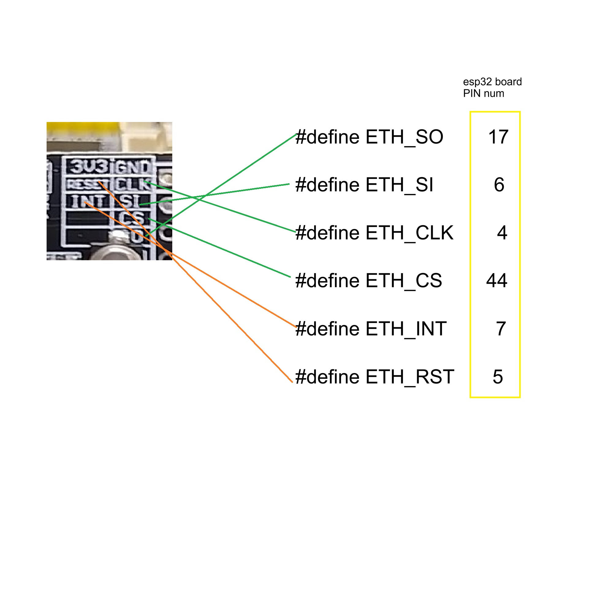
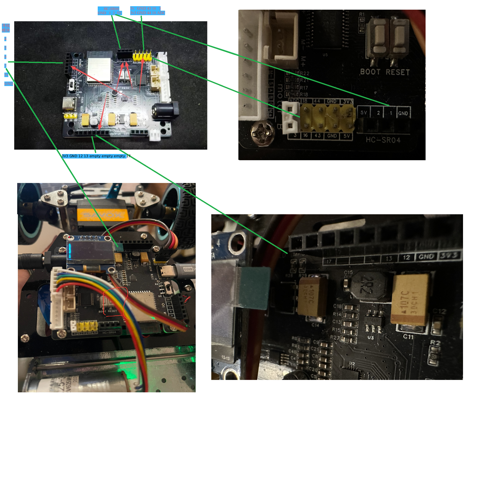
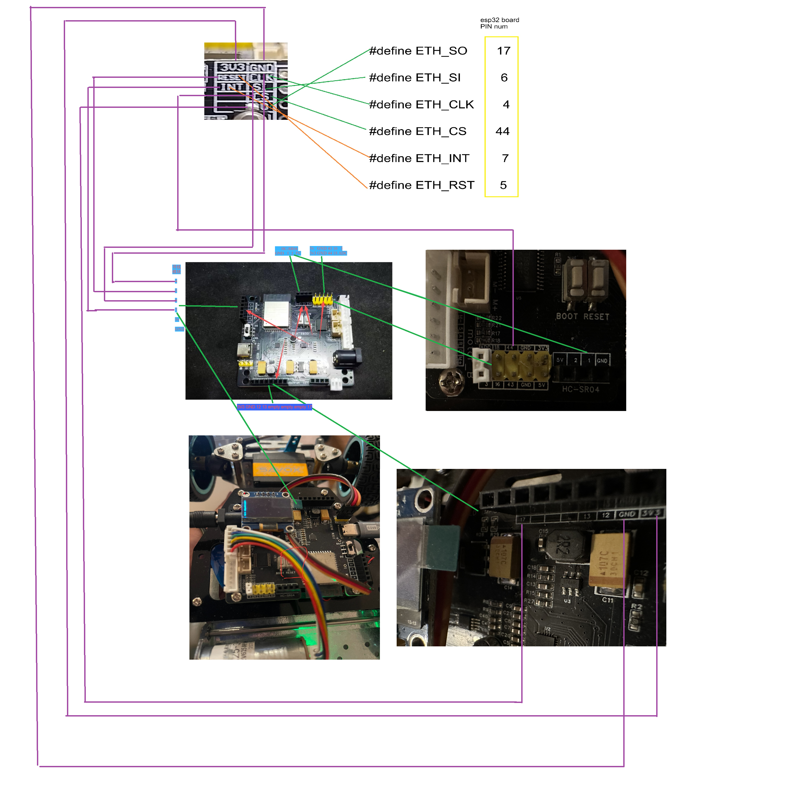

# W5500-to-ESP32 wiring guide

The W5500 connects to the ESP32 with Dupont jumper wires. Its RJ45 port connects to Jetson with the selected down-angle-to-straight Ethernet cable.

## W5500 pin reference

## ESP32 pin reference

## Wiring map

### Power and control

w5500 3v3 -- esp32 3v3 (same slot line with pin 17, at the picture side left first slot)

w5500 RESET -- esp32 pin 5

w5500 INT -- esp32 pin 7

### SPI and ground

w5500 GND -- esp32 GND (same slot line with pin 17, at the picture side left second slot)

w5500 CLK -- esp32 pin 4

w5500 SI -- esp32 pin 6

w5500 CS -- esp32 pin 44

w5500 SO -- esp32 pin 17

## See below purple line for how to connect

The W5500 and ESP32 are connected with the Dupont jumper wires shown below.
